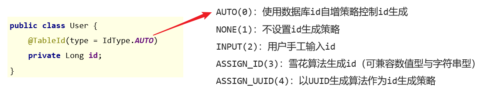
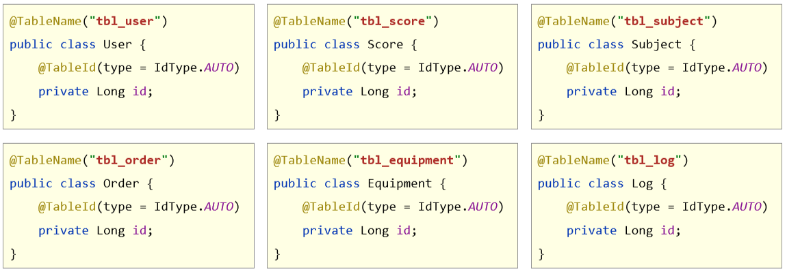

## 学习目标

1. 了解MyBatisPlus(MP)的特点
2. MyBatisPlus快速入门
3. 掌握MybatisPlus常用注解
4. 熟练使用MybatisPlus做增删改查(CRUD)
5. 学会使用MyBatisPlus代码生成工具

## 一、MyBatisPlus简介

### 1. MyBatisPlus概述

#### MyBatis介绍

- MyBatisPlus（简称MP）是基于MyBatis框架基础上开发的增强型工具
- 设计理念：简化开发、提高效率。
- 可以减少大量重复代码的编写，并且封装了很多常用方法。

#### MyBatisPlus特性

- 无侵入：只做增强不做改变，不会对现有工程产生影响
- 强大的 CRUD 操作：内置通用 Mapper，少量配置即可实现单表CRUD 操作
- 支持 Lambda：编写查询条件无需担心字段写错
- 支持主键自动生成、内置分页插件、逻辑删除、自动填充、代码生成等一系列功能
- 国人开发，官网：https://mp.baomidou.com/

### 2. 入门案例

#### SpringBoot整合MP入门程序

步骤：

1. 新建项目，选择Spring初始化，勾选mysql模块或者使用idea直接打开资料中提供的mybatis-plus-ex项目

2. 引入MyBatis-Plus的stater以及Druid的stater，在配置文件中配置数据源(DataSource)

3. 在数据库中创建表，之后在项目中创建与之对应的实体类。

4. 编写mapper,定义数据接口，继承**BaseMapper<T>**

5. 编写测试方法，测试类中注入dao接口，测试功能

#### SpringBoot整合MyBatisPlus入门程序

##### 1：新建项目，选择Spring初始化，勾选mysql模块

##### 

 

##### 2：引入MyBatis-Plus的stater以及Druid的stater，在配置文件中配置数据源(DataSource)

```xml
<dependency>
    <groupId>com.baomidou</groupId>
    <artifactId>mybatis-plus-boot-starter</artifactId>
    <version>3.4.1</version>
</dependency>
<dependency>
    <groupId>com.alibaba</groupId>
    <artifactId>druid</artifactId>
    <version>1.1.16</version>
</dependency>
```

```yaml
spring:
  datasource:
    driver-class-name: com.mysql.cj.jdbc.Driver
    type: com.alibaba.druid.pool.DruidDataSource
    url: jdbc:mysql://localhost:3306/mybatisplus_db?serverTimezone=UTC
    username: root
    password: root
```


**注意事项1：由于mp并未被收录到idea的系统内置配置，无法直接选择加入**

##### 3：制作实体类与表结构

（类名与表名对应，属性名与字段名对应）

```sql
create database if not exists mybatisplus_db character set utf8;
use mybatisplus_db;
CREATE TABLE user (
            id bigint(20) primary key auto_increment,
            name varchar(32) not null,
            password  varchar(32) not null,
            age int(3) not null ,
            tel varchar(32) not null
);
insert into user values(null,'tom','123456',12,'12345678910');
insert into user values(null,'jack','123456',8,'12345678910');
insert into user values(null,'jerry','123456',15,'12345678910');
insert into user values(null,'tom','123456',9,'12345678910');
insert into user values(null,'snake','123456',28,'12345678910');
insert into user values(null,'张益达','123456',22,'12345678910');
insert into user values(null,'张大炮','123456',16,'12345678910');
```

```java
@Data
public class User {
    private Long id;
    private String name;
    private String password;
    private Integer age;
    private String tel;
}
```

##### 4：编写mapper,定义数据接口，继承BaseMapper<User>

```java
@Mapper
public interface UserMapper extends BaseMapper<User> {
}
```

##### 5：测试类中注入dao接口，测试功能

```java
package com.itheima;

import com.itheima.dao.UserDao;
import com.itheima.domain.User;
import org.junit.jupiter.api.Test;
import org.springframework.beans.factory.annotation.Autowired;
import org.springframework.boot.test.context.SpringBootTest;

import java.util.List;

@SpringBootTest
public class Mybatisplus01QuickstartApplicationTests {

    @Autowired
    private UserMapper mapper;

    @Test
    void testGetAll() {
        List<User> userList = mapper.selectList(null);
        System.out.println(userList);
    }
}
```


## 二、标准数据层开发

### 1. MyBatisPlus的CRUD操作


```java
package com.itheima;

import com.itheima.dao.UserDao;
import com.itheima.domain.User;
import org.junit.jupiter.api.Test;
import org.springframework.beans.factory.annotation.Autowired;
import org.springframework.boot.test.context.SpringBootTest;

import java.util.List;

@SpringBootTest
class Mybatisplus01QuickstartApplicationTests {

    @Autowired
    private UserDao userDao;

    @Test
    void testSave() {
        User user = new User();
        user.setName("黑马程序员");
        user.setPassword("itheima");
        user.setAge(12);
        user.setTel("4006184000");
        userDao.insert(user);
    }

    @Test
    void testDelete() {
        userDao.deleteById(1401856123725713409L);
    }

    @Test
    void testUpdate() {
        User user = new User();
        user.setId(1L);
        user.setName("Tom888");
        user.setPassword("tom888");
        userDao.updateById(user);
    }

    @Test
    void testGetById() {
        User user = userDao.selectById(2L);
        System.out.println(user);
    }


    @Test
    void testGetAll() {
        List<User> userList = userDao.selectList(null);
        System.out.println(userList);
    }
}

```

### 2. MyBatisPlus分页功能

#### 分页功能接口


#### MyBatisPlus分页使用

**①：设置分页拦截器作为Spring管理的bean**

```java
package com.itheima.config;

import com.baomidou.mybatisplus.extension.plugins.MybatisPlusInterceptor;
import com.baomidou.mybatisplus.extension.plugins.inner.PaginationInnerInterceptor;
import org.springframework.context.annotation.Bean;
import org.springframework.context.annotation.Configuration;

@Configuration
public class MybatisPlusConfig {
    
    @Bean
    public MybatisPlusInterceptor mybatisPlusInterceptor(){
        //1 创建MybatisPlusInterceptor拦截器对象
        MybatisPlusInterceptor mpInterceptor=new MybatisPlusInterceptor();
        //2 添加分页拦截器
        mpInterceptor.addInnerInterceptor(new PaginationInnerInterceptor());
        return mpInterceptor;
    }
}
```

**②：执行分页查询**

```java
//分页查询
@Test
void testSelectPage(){
    		//1 创建IPage分页对象,设置分页参数
    		IPage<User> page=new Page<>(1,3);
        IPage<User> page = new Page<>();
        // 页码
        page.setCurrent(1);
        // 条数
        page.setSize(2);
        IPage<User> users = dao.selectPage(page, null);
        log.info("记录 ===> {}", users.getRecords());
        log.info("分页总页数 ===> {}", users.getPages());
        log.info("总行数 ===> {}", users.getTotal());
}
```

#### 开启MyBatisPlus日志

```yml
# 开启mp的日志（输出到控制台）
mybatis-plus:
  configuration:
    log-impl: org.apache.ibatis.logging.stdout.StdOutImpl
```


## 三、DQL编程控制

### 1. 条件查询方式

- MyBatisPlus将书写复杂的SQL查询条件进行了封装，使用编程的形式完成查询条件的组合


#### 条件查询

##### 方式一：按条件查询

```java
//方式一：按条件查询
QueryWrapper<User> qw=new QueryWrapper<>();
qw.lt("age", 18);
List<User> userList = userDao.selectList(qw);
log.info(userList);
```

##### 方式二：lambda格式按条件查询

```java
//方式二：lambda格式按条件查询
QueryWrapper<User> qw = new QueryWrapper<User>();
qw.lambda().lt(User::getAge, 10);
List<User> userList = userDao.selectList(qw);
log.info(userList);
```

##### 方式三：lambda格式按条件查询（推荐）

```java
//方式三：lambda格式按条件查询
LambdaQueryWrapper<User> lqw = new LambdaQueryWrapper<User>();
lqw.lt(User::getAge, 10);
List<User> userList = userDao.selectList(lqw);
log.info(userList);
```

#### 组合条件

##### 并且关系（and）

```java
//并且关系
LambdaQueryWrapper<User> lqw = new LambdaQueryWrapper<User>();
//并且关系：10到30岁之间
lqw.lt(User::getAge, 30).gt(User::getAge, 10);
List<User> userList = userDao.selectList(lqw);
log.info(userList);
```

##### 或者关系（or）

```java
//或者关系
LambdaQueryWrapper<User> lqw = new LambdaQueryWrapper<User>();
//或者关系：小于10岁或者大于30岁
lqw.lt(User::getAge, 10).or().gt(User::getAge, 30);
List<User> userList = userDao.selectList(lqw);
log.info(userList);
```


### 2. 查询投影-设置【查询字段、分组、分页】

#### 查询结果包含模型类中部分属性

```java
        LambdaQueryWrapper<User> wrapper = new LambdaQueryWrapper<>();
        // 查询投影.
        wrapper.select(User::getId, User::getName, User::getAge);
        List<User> users = dao.selectList(wrapper);
        log.info(users.toString());
```

#### 查询结果包含模型类中未定义的属性

```java
        QueryWrapper<User> wrapper = new QueryWrapper<>();
        wrapper.select("count(*) as count");
        List<Map<String, Object>> maps = dao.selectMaps(wrapper);
        log.info(maps.toString());
```

### 3. 查询条件设定

#### 问题导入

多条件查询有哪些组合？

- 范围匹配（> 、 = 、between）
- 模糊匹配（like）
- 包含性匹配（in）
- 分组（group）
- 排序（order）

#### 3.1 查询条件

- demo

```java
        LambdaQueryWrapper<User> wrapper = new LambdaQueryWrapper<>();
        // 1.大于
        //wrapper.gt(User::getAge,18);
        // 2.介于...之间
        //wrapper.between(User::getAge, 18, 28);
        // 3.模糊匹配
        //wrapper.like(User::getAge,2);
        // 4.in
        //wrapper.in(User::getAge,18,20);
        //wrapper.in(User::getAge, Arrays.asList(18,20));
        // 5.group
        //wrapper.select(User::getAge);
        //wrapper.groupBy(User::getAge);
        // 6.order
        // 升序
        //wrapper.orderBy(true, true, User::getAge);
        // 降序
        wrapper.orderBy(true, false, User::getAge);
        List<User> users = dao.selectList(wrapper);
        log.info("user ===> {}", users.toString());
```


#### 3.2 查询API

- 更多查询条件设置参看https://baomidou.com/pages/10c804/#abstractwrapper

#### 3.3 练习：MyBatisPlus练习

- 题目：基于MyBatisPlus_Ex1模块，完成Top3功能的开发

    说明：

    ①：Top3指根据年龄排序（提示：对年龄进行降序排序）
    
    ②：Top3是仅获取前3条数据（提示：使用分页功能控制数据显示数量）

### 4. 字段映射与表名映射

#### 实际开发中的常见问题

- 问题一：表字段与编码属性设计不同步

- 问题二：编码中添加了数据库中未定义的属性

- 问题三：采用默认查询开放了更多的字段查看权限

- 问题四：表名与编码开发设计不同步

#### 问题一：表字段与编码属性设计不同步

- 在模型类属性上方，使用**@TableField**属性注解，通过==**value**==属性，设置当前属性对应的数据库表中的字段关系。


#### 问题二：编码中添加了数据库中未定义的属性

- 在模型类属性上方，使用**@TableField**注解，通过**==exist==**属性，设置属性在数据库表字段中是否存在，默认为true。此属性无法与value合并使用。


#### 问题三：采用默认查询开放了更多的字段查看权限

- 在模型类属性上方，使用**@TableField**注解，通过**==select==**属性：设置该属性是否参与查询。此属性与select()映射配置不冲突。

 

#### 问题四：表名与编码开发设计不同步

- 在<u>**模型类**</u>上方，使用**@TableName**注解，通过**==value==**属性，设置当前类对应的数据库表名称。


```java
@Data
@TableName("tbl_user")
public class User {
    /*
        id为Long类型，因为数据库中id为bigint类型，
        并且mybatis有自己的一套id生成方案，生成出来的id必须是Long类型
     */
    private Long id;
    private String name;
    @TableField(value = "pwd",select = false)
    private String password;
    private Integer age;
    private String tel;
    @TableField(exist = false) //表示online字段不参与CRUD操作
    private Boolean online;
}
```


## 四、DML编程控制

### 1. id生成策略控制（Insert）

#### 问题导入

主键生成的策略有哪几种方式？

不同的表应用不同的id生成策略

- 日志：自增（1,2,3,4，……）
- 购物订单：特殊规则（FQ23948AK3843）
- 外卖单：关联地区日期等信息（10 04 20200314 34 91）
- 关系表：可省略id
- ……

#### id生成策略控制（@TableId注解）

- 名称：@TableId

- 类型：**属性注解**

- 位置：模型类中用于表示主键的属性定义上方

- 作用：设置当前类中主键属性的生成策略

- 相关属性

    ​	**type**：设置主键属性的生成策略，值参照IdType枚举值

     

雪花算法


### 2 全局策略配置

```yml
mybatis-plus:
  global-config:
    db-config:
      id-type: assign_id
      table-prefix: tbl_
```

##### id生成策略全局配置


##### 表名前缀全局配置




### 3. 多记录操作（批量Delete/Select）

#### 问题导入

MyBatisPlus是否支持批量操作？

 

#### 按照主键删除多条记录

```java
//删除指定多条数据
List<Long> list = new ArrayList<>();
list.add(1402551342481838081L);
list.add(1402553134049501186L);
list.add(1402553619611430913L);

userDao.deleteBatchIds(list);
```

#### 根据主键查询多条记录

```java
//查询指定多条数据
List<Long> list = new ArrayList<>();
list.add(1L);
list.add(3L);
list.add(4L);
userDao.selectBatchIds(list);
```

### 4. 逻辑删除（Delete/Update）

#### 问题导入

在实际环境中，如果想删除一条数据，是否会真的从数据库中删除该条数据？

- 删除操作业务问题：业务数据从数据库中丢弃

- 逻辑删除：为数据设置是否可用状态字段，删除时设置状态字段为不可用状态，数据保留在数据库中

 

#### 逻辑删除案例

##### ①：数据库表中添加逻辑删除标记字段

 

##### ②：实体类中添加对应字段，并设定当前字段为逻辑删除标记字段

```java
package com.itheima.domain;

import com.baomidou.mybatisplus.annotation.*;

import lombok.Data;

@Data
public class User {

    private Long id;
    
    //逻辑删除字段，标记当前记录是否被删除
    @TableLogic
    private Integer deleted;
    
}
```

##### ③：配置逻辑删除字面值

```yml
mybatis-plus:
  global-config:
    db-config:
      table-prefix: tbl_
      # 逻辑删除字段名
      logic-delete-field: deleted
      # 逻辑删除字面值：未删除为0
      logic-not-delete-value: 0
      # 逻辑删除字面值：删除为1
      logic-delete-value: 1
```

**逻辑删除本质：逻辑删除的本质其实是修改操作。如果加了逻辑删除字段，查询数据时也会自动带上逻辑删除字段。**

 

### 4. 乐观锁（Update）

#### 问题导入

乐观锁的应用场景


**拓展**：悲观锁synchronized，无论使用都锁上

#### <font color=red>面试题：什么是乐观锁悲观锁？</font>

是一种思想。可以用在很多方面。
悲观锁
		悲观锁是指**并发更新冲突**情况下会使用锁机制。悲观锁会完成以下功能：锁住读取的记录，防止其它事务读取和更新这些记录。其它事务会一直阻塞，直到这个事务结束.悲观锁是在使用了数据库的事务隔离功能的基础上，独享占用的资源，以此保证读取数据一致性，避免修改丢失。悲观锁可以使用Repeatable Read 事务，它完全满足悲观锁的要求。
乐观锁
		乐观锁不会锁住任何东西，也就是说，它不依赖数据库的事务机制，乐观锁完全是应用系统层面的东西。如果使用乐观锁，大多是基于数据版本（ Version ）记录机制实现。何谓数据版本？即为数据增加一个版本标识，在基于数据库表的版本解决方案中，一般是通过为数据库表增加一个“version” 字段来实现。读取出数据时，将此版本号一同读出，之后更新时，对此版本号加一。此时，将提交数据的版本数据与数据库表对应记录的当前版本信息进行比对，如果提交的数据版本号大于数据库表当前版本号，则予以更新，否则认为是过期数据。

#### 4.1 乐观锁案例

##### ①：数据库表中添加锁标记字段

 

##### ②：实体类中添加对应字段，并设定当前字段为逻辑删除标记字段

```java
package com.itheima.domain;

import com.baomidou.mybatisplus.annotation.TableField;
import com.baomidou.mybatisplus.annotation.TableLogic;
import com.baomidou.mybatisplus.annotation.Version;
import lombok.Data;

@Data
public class User {

	private Long id;
	
    @Version
    private Integer version;
}

```

##### ③：配置乐观锁拦截器实现锁机制对应的动态SQL语句拼装

```java
package com.itheima.config;

import com.baomidou.mybatisplus.extension.plugins.MybatisPlusInterceptor;
import com.baomidou.mybatisplus.extension.plugins.inner.OptimisticLockerInnerInterceptor;
import com.baomidou.mybatisplus.extension.plugins.inner.PaginationInnerInterceptor;
import org.springframework.context.annotation.Bean;
import org.springframework.context.annotation.Configuration;

@Configuration
public class MpConfig {
    @Bean
    public MybatisPlusInterceptor mpInterceptor() {
        //1.定义Mp拦截器
        MybatisPlusInterceptor mpInterceptor = new MybatisPlusInterceptor();

        //2.添加乐观锁拦截器
        mpInterceptor.addInnerInterceptor(new OptimisticLockerInnerInterceptor());
        
        return mpInterceptor;
    }
}

```

##### ④：使用乐观锁机制在修改前必须先获取到对应数据的verion方可正常进行

```java
    @Test
    void testLock() {
        // 1. 接收前端传入的数据,使用这个数据
        // 2. 在数据库中取出与之对应的数据.
        // 3. 对比前端传入的数据和db中的数据
        // 4. 校验通过的话,更新数据.

        // 前端的数据
        User query = new User();
        query.setId(1L);
        query.setName("张三李四");
        query.setVersion(0);
        // db中的数据
        User user = dao.selectById(1L);
        if (!(query.getVersion().equals(user.getVersion()))) {
            log.info("该数据已经被他人修改,请刷新后再重试");
            return;
        }
        // 更新操作
        user.setName(query.getName());
        dao.updateById(user);
    } 
```


## 五、快速开发-代码生成器

### Service封装

- Mybatis-Plus 为了开发更加快捷，对业务层也进行了封装，直接提供了相关的接口和实现类。我们在进行业务层开发时，可以继承它提供的接口和实现类，使得编码更加高效

1.定义Service接口,并继承Iservice<T>

2.定义实现类,并继承ServiceImpl<<T>Mapper，<T>>之后，再实现定义的接口

> 注意：此处使用的泛型即是我们的Entity实体类。


### 1. MyBatisPlus提供模板

- Mapper接口模板


- 实体对象类模板


### 2. 工程搭建和基本代码编写

- 第一步：创建SpringBoot工程，添加代码生成器相关依赖，其他依赖自行添加

```xml
<!--代码生成器-->
<dependency>
    <groupId>com.baomidou</groupId>
    <artifactId>mybatis-plus-generator</artifactId>
    <version>3.4.1</version>
</dependency>

<!--velocity模板引擎-->
<dependency>
    <groupId>org.apache.velocity</groupId>
    <artifactId>velocity-engine-core</artifactId>
    <version>2.3</version>
</dependency>
```

- 第二步：编写代码生成器类

```java
package com.itheima;

import com.baomidou.mybatisplus.generator.AutoGenerator;
import com.baomidou.mybatisplus.generator.config.DataSourceConfig;

public class Generator {
    public static void main(String[] args) {
        //1. 创建代码生成器对象，执行生成代码操作
        AutoGenerator autoGenerator = new AutoGenerator();

        //2. 数据源相关配置：读取数据库中的信息，根据数据库表结构生成代码
        DataSourceConfig dataSource = new DataSourceConfig();
        dataSource.setDriverName("com.mysql.cj.jdbc.Driver");
        dataSource.setUrl("jdbc:mysql://localhost:3306/mybatisplus_db?serverTimezone=UTC");
        dataSource.setUsername("root");
        dataSource.setPassword("root");
        autoGenerator.setDataSource(dataSource);

         //3. 执行生成操作
        autoGenerator.execute();
    }
}

```

### 3. 开发者自定义配置

- 设置全局配置

```java
//设置全局配置
GlobalConfig globalConfig = new GlobalConfig();
globalConfig.setOutputDir(System.getProperty("user.dir")+"/mybatisplus_04_generator/src/main/java");    //设置代码生成位置
globalConfig.setOpen(false);    //设置生成完毕后是否打开生成代码所在的目录
globalConfig.setAuthor("黑马程序员");    //设置作者
globalConfig.setFileOverride(true);     //设置是否覆盖原始生成的文件
globalConfig.setMapperName("%sDao");    //设置数据层接口名，%s为占位符，指代模块名称
globalConfig.setIdType(IdType.ASSIGN_ID);   //设置Id生成策略
autoGenerator.setGlobalConfig(globalConfig);
```

- 设置包名相关配置

```java
//设置包名相关配置
PackageConfig packageInfo = new PackageConfig();
packageInfo.setParent("com.aaa");   //设置生成的包名，与代码所在位置不冲突，二者叠加组成完整路径
packageInfo.setEntity("domain");    //设置实体类包名
packageInfo.setMapper("dao");   //设置数据层包名
autoGenerator.setPackageInfo(packageInfo);
```

- 策略设置

```java
//策略设置
StrategyConfig strategyConfig = new StrategyConfig();
strategyConfig.setInclude("tbl_user");  //设置当前参与生成的表名，参数为可变参数
strategyConfig.setTablePrefix("tbl_");  //设置数据库表的前缀名称，模块名 = 数据库表名 - 前缀名  例如： User = tbl_user - tbl_
strategyConfig.setRestControllerStyle(true);    //设置是否启用Rest风格
strategyConfig.setVersionFieldName("version");  //设置乐观锁字段名
strategyConfig.setLogicDeleteFieldName("deleted");  //设置逻辑删除字段名
strategyConfig.setEntityLombokModel(true);  //设置是否启用lombok
autoGenerator.setStrategy(strategyConfig);
```

> 说明：在资料中也提供了CodeGenerator代码生成器类，根据实际情况修改后可以直接使用。

### 代码生成器

```java

import com.baomidou.mybatisplus.core.toolkit.StringPool;
import com.baomidou.mybatisplus.generator.AutoGenerator;
import com.baomidou.mybatisplus.generator.InjectionConfig;
import com.baomidou.mybatisplus.generator.config.*;
import com.baomidou.mybatisplus.generator.config.po.TableInfo;
import com.baomidou.mybatisplus.generator.config.rules.NamingStrategy;

import java.util.ArrayList;
import java.util.List;

/**
 * MybatisPlus生成器
 *
 * @author t3rik
 * @create 2021-06-18 16:55
 */
public class GeneratorUtils {
    
    private final static String TABLE = "tb_user";
    private final static String DB_URL = "jdbc:mysql://47.93.15.190:3306/mybatisplus_db?serverTimezone=UTC";
    private final static String USER_NAME = "root";
    private final static String PASSWORD = "123QWEasd-=";
    private final static String AUTHOR = "t3rik";
    private final static String DRIVE = "com.mysql.cj.jdbc.Driver";


    public static void main(String[] args) {
        // 代码生成器
        AutoGenerator mpg = new AutoGenerator();
        // 全局配置
        GlobalConfig gc = new GlobalConfig();
        // 取当前项目的路径
        String projectPath = System.getProperty("user.dir");
        // 输出路径
        gc.setOutputDir(projectPath + "/src/main/java/test");
        // 作者
        gc.setAuthor(AUTHOR);
        // 生成之后是否要打开生成的文件夹
        gc.setOpen(false);
        // controller名称
        gc.setControllerName("%sController");
        // service生成名称
        gc.setServiceName("I%sService");
        // 实现类
        gc.setServiceImplName("%sServiceImpl");
        // mapper名称
        gc.setMapperName("%sMapper");
        // 加入到全局配置中
        mpg.setGlobalConfig(gc);

        // 数据源配置
        DataSourceConfig dsc = new DataSourceConfig();
        // dsc.setSchemaName("public");
        // 数据库连接地址
        dsc.setUrl(DB_URL);
        // 驱动
        dsc.setDriverName(DRIVE);
        // 用户名
        dsc.setUsername(USER_NAME);
        // 密码
        dsc.setPassword(PASSWORD);
        // 加入到全局配置中
        mpg.setDataSource(dsc);

        // 包配置
        PackageConfig pc = new PackageConfig();
        // 父级包名
        pc.setParent("com.shizian");
        // entity包名
        pc.setEntity("entity");
        // mapper包名
        pc.setMapper("mapper");
        // 控制器名称
        pc.setController("controller");
        // service名称
        pc.setService("service");
        // 加入到全局配置中
        mpg.setPackageInfo(pc);

        // 自定义配置
        InjectionConfig cfg = new InjectionConfig() {
            @Override
            public void initMap() {
                // to do nothing
            }
        };

        // 如果模板引擎是 velocity
        String templatePath = "/templates/mapper.xml.vm";

        // 自定义输出配置
        List<FileOutConfig> focList = new ArrayList<>();
        // 自定义配置会被优先输出
        focList.add(new FileOutConfig(templatePath) {
            @Override
            public String outputFile(TableInfo tableInfo) {
                // 自定义输出文件名 ， 如果你 Entity 设置了前后缀、此处注意 xml 的名称会跟着发生变化！！
                return projectPath + "/src/main/resources/mapper/" + pc.getModuleName()
                        + "/" + tableInfo.getEntityName() + "Mapper" + StringPool.DOT_XML;
            }
        });

        cfg.setFileOutConfigList(focList);

        mpg.setCfg(cfg);

        // 配置模板
        TemplateConfig templateConfig = new TemplateConfig();
        templateConfig.setXml(null);
        mpg.setTemplate(templateConfig);

        // 策略配置
        StrategyConfig strategy = new StrategyConfig();
        // 数据库表命名
        strategy.setNaming(NamingStrategy.underline_to_camel);
        // 字段命名
        strategy.setColumnNaming(NamingStrategy.underline_to_camel);
        // 要生成的表 可以写多个
        // strategy.setInclude("tbl_user","tbl_user","tbl_user","tbl_user","tbl_user","tbl_user");
        strategy.setInclude(TABLE);
        // 表前缀
        // strategy.setTablePrefix("tbl_");
        // 是否生成lombok风格
        strategy.setEntityLombokModel(true);
        // 是否使用restController
        strategy.setRestControllerStyle(true);
        // 指定逻辑删除字段
        strategy.setLogicDeleteFieldName("deleted");
        // 指定乐观锁字段
        strategy.setVersionFieldName("version");
        // mappering风格
        strategy.setControllerMappingHyphenStyle(true);
        // 表前缀
        strategy.setTablePrefix(pc.getModuleName() + "_");
        // 加入配置
        mpg.setStrategy(strategy);
        // 执行生成代码
        mpg.execute();
    }
}
```
