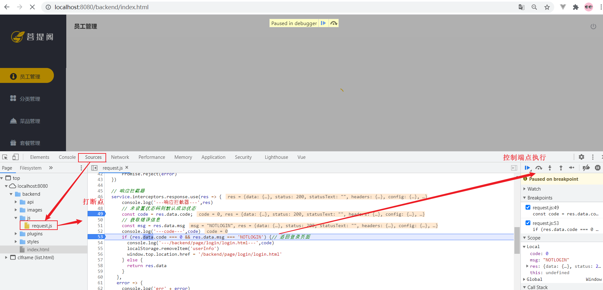
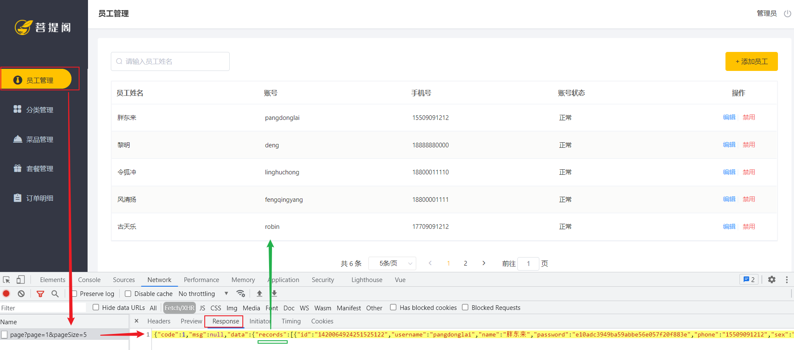
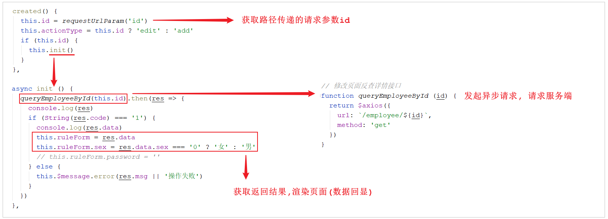

# 瑞吉外卖-Day02

## 课程内容

- 完善登录功能

- 新增员工
- 员工信息分页查询
- 启用/禁用员工账号
- 编辑员工信息


## 1. 完善登录功能

### 1.1 问题分析

前面我们已经完成了后台系统的员工登录功能开发，但是目前还存在一个问题，接下来我们来说明一个这个问题， 以及如何处理。


**1). 目前现状**

用户如果不登录，直接访问系统首页面，照样可以正常访问。 

 


**2). 理想效果**

上述这种设计并不合理，我们希望看到的效果应该 是，只有登录成功后才可以访问系统中的页面，如果没有登录, 访问系统中的任何界面都直接跳转到登录页面。

 


**那么，具体应该怎么实现呢？**

可以使用我们之前讲解过的 过滤器、拦截器来实现，在过滤器、拦截器中拦截前端发起的请求，判断用户是否已经完成登录，如果没有登录则返回提示信息，跳转到登录页面。


### 1.2 思路分析

 

**过滤器具体的处理逻辑如下：**

A. 获取本次请求的URI

B. 判断本次请求是否需要校验用户登录状态

C. 如果不需要，则直接放行

D. 判断登录状态，如果已登录，则直接放行

E. 如果未登录, 则返回未登录结果


如果未登录,我们需要给前端返回什么样的结果呢? 这个时候, 我们可以去看看前端是如何处理的 ?

 


### /**/过滤器拦截器区别面试题


### 1.3 代码实现

**1). 定义登录校验过滤器**

自定义一个过滤器 LoginCheckFilter 并实现 Filter 接口, 在doFilter方法中完成校验的逻辑。 那么接下来, 我们就根据上述分析的步骤, 来完成具体的功能代码实现: 


所属包: com.itheima.reggie.filter

```java
import com.alibaba.fastjson.JSON;
import com.itheima.reggie.common.R;
import lombok.extern.slf4j.Slf4j;
import org.springframework.util.AntPathMatcher;

import javax.servlet.*;
import javax.servlet.annotation.WebFilter;
import javax.servlet.http.HttpServletRequest;
import javax.servlet.http.HttpServletResponse;
import java.io.IOException;

/**
 * 检查用户是否已经完成登录
 */
    @WebFilter(filterName = "loginCheckFilter",urlPatterns = "/*")
@Slf4j
public class LoginCheckFilter implements Filter{
    //路径匹配器，支持通配符
    public static final AntPathMatcher PATH_MATCHER = new AntPathMatcher();

    @Override
    public void doFilter(ServletRequest servletRequest, ServletResponse servletResponse, FilterChain filterChain) throws IOException, ServletException {
        HttpServletRequest request = (HttpServletRequest) servletRequest;
        HttpServletResponse response = (HttpServletResponse) servletResponse;

        //1、获取本次请求的URI
        String requestURI = request.getRequestURI();// /backend/index.html

        log.info("拦截到请求：{}",requestURI);

        //定义不需要处理的请求路径
        String[] urls = new String[]{
                "/employee/login",
                "/employee/logout",
                "/backend/**",
                "/front/**"
        };
		
        //2、判断本次请求是否需要处理
        boolean check = check(urls, requestURI);

        //3、如果不需要处理，则直接放行
        if(check){
            log.info("本次请求{}不需要处理",requestURI);
            filterChain.doFilter(request,response);
            return;
        }
		
        //4、判断登录状态，如果已登录，则直接放行
        if(request.getSession().getAttribute("employee") != null){
            log.info("用户已登录，用户id为：{}",request.getSession().getAttribute("employee"));
            filterChain.doFilter(request,response);
            return;
        }

        log.info("用户未登录");
        //5、如果未登录则返回未登录结果，通过输出流方式向客户端页面响应数据
        response.getWriter().write(JSON.toJSONString(R.error("NOTLOGIN")));
        return;

    }

    /**
     * 路径匹配，检查本次请求是否需要放行
     * @param urls
     * @param requestURI
     * @return
     */
    public boolean check(String[] urls,String requestURI){
        for (String url : urls) {
            boolean match = PATH_MATCHER.match(url, requestURI);
            if(match){
                return true;
            }
        }
        return false;
    }
}
```


> <font color='red'><b>AntPathMatcher 拓展:</b></font>
>
> **介绍:** Spring中提供的路径匹配器 ;
>
> **通配符规则:** 		
>
> | 符号 | 含义                   |
> | ---- | ---------------------- |
> | ?    | 匹配一个字符           |
> | *    | 匹配0个或多个字符      |
> | **   | 匹配0个或多个目录/字符 |
>


**2). 开启组件扫描**

需要在引导类上, 加上Servlet组件扫描的注解, 来扫描过滤器配置的@WebFilter注解， 扫描上之后， 过滤器在运行时就生效了。

```java
@Slf4j
@SpringBootApplication
@ServletComponentScan
public class ReggieApplication {
    public static void main(String[] args) {
        SpringApplication.run(ReggieApplication.class,args);
        log.info("项目启动成功...");
    }
}
```


> <font color='red'><b>@ServletComponentScan 的作用: </b></font>
>
> ​	在SpringBoot项目中, 在引导类/配置类上加了该注解后, 会自动扫描项目中(当前包及其子包下)的@WebServlet , @WebFilter , @WebListener 注解, 自动注册Servlet的相关组件 ;


### 1.4 功能测试

代码编写完毕之后，我们需要将工程重启一下，然后在浏览器地址栏直接输入系统管理后台首页，然后看看是否可以跳转到登录页面即可。我们也可以通过debug的形式来跟踪一下代码执行的过程。

 


对于前端的代码, 也可以进行debug调试。

F12打开浏览器的调试工具, 找到我们前面提到的request.js, 在request.js的响应拦截器位置打上断点。

 


## 2. 新增员工

### 2.1 需求分析

后台系统中可以管理员工信息，通过新增员工来添加后台系统用户。点击[添加员工]按钮跳转到新增页面，如下：

 

当填写完表单信息, 点击"保存"按钮后, 会提交该表单的数据到服务端, 在服务端中需要接受数据, 然后将数据保存至数据库中。


### 2.2 数据模型

新增员工，其实就是将我们新增页面录入的员工数据插入到employee表。employee表中的status字段已经设置了默认值1，表示状态正常。

 


需要注意，employee表中对username字段加入了唯一约束，因为username是员工的登录账号，必须是唯一的。

 


### 2.3 程序执行流程

在开发代码之前，我们需要结合着前端页面发起的请求， 梳理一下整个程序的执行过程：

 


A. 点击"保存"按钮, 页面发送ajax请求，将新增员工页面中输入的数据以json的形式提交到服务端, 请求方式POST, 请求路径 /employee

B. 服务端Controller接收页面提交的数据并调用Service将数据进行保存

C. Service调用Mapper操作数据库，保存数据


### 2.4 代码实现

在EmployeeController中增加save方法, 用于保存用户员工信息。

A. 在新增员工时， 按钮页面原型中的需求描述， 需要给员工设置初始默认密码 123456， 并对密码进行MD5加密。

B. 在组装员工信息时, 还需要封装创建时间、修改时间，创建人、修改人信息(从session中获取当前登录用户)。

``` java
/**
 * 新增员工
 * @param employee
 * @return
 */
@PostMapping
public R<String> save(HttpServletRequest request,@RequestBody Employee employee){
    log.info("新增员工，员工信息：{}",employee.toString());

    //设置初始密码123456，需要进行md5加密处理
    employee.setPassword(DigestUtils.md5DigestAsHex("123456".getBytes()));
	
    employee.setCreateTime(LocalDateTime.now());
    employee.setUpdateTime(LocalDateTime.now());
	
    //获得当前登录用户的id
    Long empId = (Long) request.getSession().getAttribute("employee");

    employee.setCreateUser(empId);
    employee.setUpdateUser(empId);

    employeeService.save(employee);
    return R.success("新增员工成功");
}
```


### 2.5 功能测试

代码编写完毕之后，我们需要将工程重启, 完毕之后直接访问管理系统首页, 点击 "员工管理" 页面中的 "添加员工" 按钮, 输入员工基本信息, 然后点击 "保存" 进行数据保存, 保存完毕后, 检查数据库中是否录入员工数据。


当我们在测试中，添加用户时， 输入了一个已存在的用户名时，前端界面出现错误提示信息： 

 

而此时，服务端已经报错了， 报错信息如下： 

 

出现上述的错误， 主要就是因为在 employee 表结构中，我们针对于username字段，建立了唯一索引，添加重复的username数据时，违背该约束，就会报错。但是此时前端提示的信息并不具体，用户并不知道是因为什么原因造成的该异常，我们需要给用户提示详细的错误信息 。


### 2.6 全局异常处理

#### 2.6.1 思路分析

要想解决上述测试中存在的问题，我们需要对程序中可能出现的异常进行捕获，通常有两种处理方式：

**A. 在Controller方法中加入 try...catch 进行异常捕获**

形式如下： 

 

如果采用这种方式，虽然可以解决，但是存在弊端，需要我们在保存其他业务数据时，也需要在Controller方法中加上try...catch进行处理，代码冗余，不通用。


**B. 使用异常处理器进行全局异常捕获**

采用这种方式来实现，我们只需要在项目中定义一个通用的全局异常处理器，就可以解决本项目的所有异常。


#### 2.6.2 全局异常处理器

在项目中自定义一个全局异常处理器，在异常处理器上加上注解 @ControllerAdvice,可以通过属性annotations指定拦截哪一类的Controller方法。 并在异常处理器的方法上加上注解 @ExceptionHandler 来指定拦截的是那一类型的异常。

> 异常处理方法逻辑: 
>
> - 指定捕获的异常类型为 SQLIntegrityConstraintViolationException
> - 解析异常的提示信息, 获取出是那个值违背了唯一约束 
> - 组装错误信息并返回

 


所属包: com.itheima.reggie.common

```java
import lombok.extern.slf4j.Slf4j;
import org.springframework.stereotype.Controller;
import org.springframework.web.bind.annotation.ControllerAdvice;
import org.springframework.web.bind.annotation.ExceptionHandler;
import org.springframework.web.bind.annotation.ResponseBody;
import org.springframework.web.bind.annotation.RestController;
import java.sql.SQLIntegrityConstraintViolationException;

/**
 * 全局异常处理
 */
@ControllerAdvice(annotations = {RestController.class, Controller.class})
@ResponseBody
@Slf4j
public class  GlobalExceptionHandler {

    /**
     * 异常处理方法
     * @return
     */
    @ExceptionHandler(SQLIntegrityConstraintViolationException.class)
    public R<String> exceptionHandler(SQLIntegrityConstraintViolationException ex){
        log.error(ex.getMessage());
        if(ex.getMessage().contains("Duplicate entry")){
            String[] split = ex.getMessage().split(" ");
            String msg = split[2] + "已存在";
            return R.error(msg);
        }
        return R.error("未知错误");
    }
}
```


> <font color='red'><b>注解说明:</b></font>
>
> ​	上述的全局异常处理器上使用了的两个注解 @ControllerAdvice , @ResponseBody , 他们的作用分别为: 
>
> ​	@ControllerAdvice : 指定拦截那些类型的控制器;
>
> ​	@ResponseBody: 将方法的返回值 R 对象转换为json格式的数据, 响应给页面;
>
> ​	
>
> ​	上述使用的两个注解, 也可以合并成为一个注解 @RestControllerAdvice 
>
> ​	 


#### 2.6.3 测试

全局异常处理器编写完毕之后，我们需要将项目重启, 完毕之后直接访问管理系统首页, 点击 "员工管理" 页面中的 "添加员工" 按钮。当我们在测试中，添加用户时， 输入了一个已存在的用户名时，前端界面出现如下错误提示信息：

 


## 3. 员工分页查询

### 3.1 需求分析

系统中的员工很多的时候，如果在一个页面中全部展示出来会显得比较乱，不便于查看，所以一般的系统中都会以分页的方式来展示列表数据。而在我们的分页查询页面中, 除了分页条件以外，还有一个查询条件 "员工姓名"。

 

- 请求参数

  - 搜索条件： 员工姓名(模糊查询)

  - 分页条件： 每页展示条数 ， 页码

- 响应数据

  - 总记录数

  - 结果列表


### 3.2 程序执行流程

#### 3.2.1 页面流程分析

在开发代码之前，需要梳理一下整个程序的执行过程。

A. 点击菜单，打开员工管理页面时，执行查询： 

 


B. 搜索栏输入员工姓名,回车,执行查询:

 


1). 页面发送ajax请求，将分页查询参数(page、pageSize、name)提交到服务端

2). 服务端Controller接收页面提交的数据, 并组装条件调用Service查询数据

3). Service调用Mapper操作数据库，查询分页数据

4). Controller将查询到的分页数据, 响应给前端页面

5). 页面接收到分页数据, 并通过ElementUI的Table组件展示到页面上


#### 3.2.2 前端代码介绍

1). 访问员工列表页面/member/list.html时, 会触发Vuejs中的钩子方法, 在页面初始化时调用created方法

 

从上述的前端代码中我们可以看到, 执行完分页查询, 我们需要给前端返回的信息中需要包含两项 : records 中封装结果列表, total中封装总记录数 。


而在组装请求参数时 , page、pageSize 都是前端分页插件渲染时的参数；

 


2). 在getMemberList方法中, 通过axios发起异步请求

 

axios发起的异步请求会被声明在 request.js 中的request拦截器拦截, 在其中对get请求进行进一步的封装处理

 


**最终发送给服务端的请求为 :** GET请求 , 请求链接 /employee/page?page=1&pageSize=10&name=xxx


### 3.3 代码实现

#### 3.3.1 分页插件配置

当前我们要实现的分页查询功能，而在MybatisPlus要实现分页功能，就需要用到MybatisPlus中提供的分页插件，要使用分页插件，就要在配置类中声明分页插件的bean对象。

所属包: com.itheima.reggie.config

```java
import com.baomidou.mybatisplus.extension.plugins.MybatisPlusInterceptor;
import com.baomidou.mybatisplus.extension.plugins.inner.PaginationInnerInterceptor;
import org.springframework.context.annotation.Bean;
import org.springframework.context.annotation.Configuration;

/**
 * 配置MP的分页插件
 */
@Configuration
public class MybatisPlusConfig {

    @Bean
    public MybatisPlusInterceptor mybatisPlusInterceptor(){
        MybatisPlusInterceptor mybatisPlusInterceptor = new MybatisPlusInterceptor();
        mybatisPlusInterceptor.addInnerInterceptor(new PaginationInnerInterceptor());
        return mybatisPlusInterceptor;
    }
}
```


#### 3.3.2 分页查询实现

在上面我们已经分析了，页面在进行分页查询时， 具体的请求信息如下:

| 请求     | 说明                   |
| -------- | ---------------------- |
| 请求方式 | GET                    |
| 请求路径 | /employee/page         |
| 请求参数 | page , pageSize , name |


那么查询完毕后我们需要给前端返回什么样的结果呢? 

在上述我们也分析了, 查询返回的结果数据data中应该封装两项信息, 分别为: records 封装分页列表数据, total 中封装符合条件的总记录数。 那么这个时候, 在定义controller方法的返回值类型R时, 我们可以直接将 MybatisPlus 分页查询的结果 Page 直接封装返回, 因为Page中的属性如下: 

 


那么接下来就依据于这些已知的需求和条件完成分页查询的代码实现。 具体的逻辑如下: 

A. 构造分页条件

B. 构建搜索条件 - name进行模糊匹配

C. 构建排序条件 - 更新时间倒序排序

D. 执行查询

E. 组装结果并返回


具体的代码实现如下: 

```java
/**
 * 员工信息分页查询
 * @param page 当前查询页码
 * @param pageSize 每页展示记录数
 * @param name 员工姓名 - 可选参数
 * @return
 */
@GetMapping("/page")
public R<Page> page(int page,int pageSize,String name){
    log.info("page = {},pageSize = {},name = {}" ,page,pageSize,name);
    //构造分页构造器
    Page pageInfo = new Page(page,pageSize);

    //构造条件构造器
    LambdaQueryWrapper<Employee> queryWrapper = new LambdaQueryWrapper();
    //添加过滤条件
    queryWrapper.like(StringUtils.isNotEmpty(name),Employee::getName,name);
    //添加排序条件
    queryWrapper.orderByDesc(Employee::getUpdateTime);

    //执行查询
    employeeService.page(pageInfo,queryWrapper);
    return R.success(pageInfo);
}
```


### 3.4 功能测试

代码编写完毕之后，我们需要将工程重启, 完毕之后直接访问管理系统首页, 默认就会打开员工管理的列表页面, 我们可以查看列表数据是否可以正常展示, 也可以通过分页插件来测试分页功能, 及员工姓名的模糊查询功能。

在进行测试时，可以使用浏览器的监控工具查看页面和服务端的数据交互细节。 并借助于debug的形式， 根据服务端参数接收及逻辑执行情况。

 


测试过程中可以发现，对于员工状态字段（status）服务端返回的是状态码（1或者0），但是页面上显示的则是“正常”或者“已禁用”，这是因为页面中在展示数据时进行了处理。

 


## 4. 启用/禁用员工账号

### 4.1 需求分析

在员工管理列表页面，可以对某个员工账号进行<font color='gree'>启用</font>或者<font color='red'>禁用</font>操作。账号禁用的员工不能登录系统，启用后的员工可以正常登录。如果某个员工账号状态为正常，则按钮显示为 "禁用"，如果员工账号状态为已禁用，则按钮显示为"启用"。

==需要注意，只有管理员（admin用户）可以对其他普通用户进行启用、禁用操作，所以普通用户登录系统后启用、禁用按钮不显示。==

**A. admin 管理员登录**

 


**B. 普通用户登录**

 


### 4.2 程序执行流程

#### 4.2.1 页面按钮动态展示

在上述的需求中,我们提到需要实现的效果是 : **只有管理员（admin用户）可以对其他普通用户进行启用、禁用操作，所以普通用户登录系统后启用、禁用按钮不显示** , 页面中是怎么做到只有管理员admin能够看到启用、禁用按钮的？

1). 在列表页面(list.html)加载时, 触发钩子函数created, 在钩子函数中, 会从localStorage中获取到用户登录信息, 然后获取到用户名

 


2). 在页面中, 通过Vue指令v-if进行判断,如果登录用户为admin将展示 启用/禁用 按钮, 否则不展示

 


#### 4.2.2 执行流程分析

1). 当管理员admin点击 "启用" 或 "禁用" 按钮时, 调用方法statusHandle

 

> scope.row : 获取到的是这一行的数据信息 ;


2). statusHandle方法中进行二次确认, 然后发起ajax请求, 传递id、status参数

 

 

最终发起异步请求, 请求服务端, 请求信息如下： 

| 请求     | 说明                    |
| -------- | ----------------------- |
| 请求方式 | PUT                     |
| 请求路径 | /employee               |
| 请求参数 | {"id":xxx,"status":xxx} |

> **{...params}** : 三点是ES6中出现的扩展运算符。作用是遍历当前使用的对象能够访问到的所有属性，并将属性放入当前对象中。


### 4.3 代码实现

在开发代码之前，需要梳理一下整个程序的执行过程：

1). 页面发送ajax请求，将参数(id、status)提交到服务端

2). 服务端Controller接收页面提交的数据并调用Service更新数据

3). Service调用Mapper操作数据库


启用、禁用员工账号，本质上就是一个更新操作，也就是对status状态字段进行操作。在Controller中创建update方法，此方法是一个通用的修改员工信息的方法。

```java
/**
 * 根据id修改员工信息
 * @param employee
 * @return
 */
@PutMapping
public R<String> update(HttpServletRequest request,@RequestBody Employee employee){
    log.info(employee.toString());

    Long empId = (Long)request.getSession().getAttribute("employee");

    employee.setUpdateTime(LocalDateTime.now());
    employee.setUpdateUser(empId);
    employeeService.updateById(employee);

    return R.success("员工信息修改成功");
}
```


### 4.4 功能测试

代码编写完毕之后，我们需要将工程重启。 然后访问前端页面， 进行 "启用" 或 "禁用" 的测试。

 

测试过程中没有报错，但是功能并没有实现，查看数据库中的数据也没有变化。但是从控制台输出的日志， 可以看出确实没有更新成功。

 


而在我们的数据库表结构中， 并不存在该ID， 数据库中 风清扬 对应的ID为 1420038345634918401

 


### 4.5 代码修复

#### 4.5.1 原因分析

 

通过观察控制台输出的SQL发现页面传递过来的员工id的值和数据库中的id值不一致，这是怎么回事呢？


在分页查询时，服务端会将返回的R对象进行json序列化，转换为json格式的数据，而员工的ID是一个Long类型的数据，而且是一个长度为 19 位的长整型数据， 该数据返回给前端是没有问题的。（16位以后丢失精度，四舍五入）

 


**那么具体的问题出现在哪儿呢？**

问题实际上， 就出现在前端JS中， js在对长度较长的长整型数据进行处理时， 会损失精度， 从而导致提交的id和数据库中的id不一致。 这里，我们也可以做一个简单的测试，代码如下： 

```html
<!DOCTYPE html>
<html lang="en">
<head>
    <meta charset="UTF-8">
    <title>Title</title>
    <script>
        alert(1420038345634918401);
    </script>
</head>
<body>
</body>
</html>
```


#### 4.5.2 解决方案

要想解决这个问题，也很简单，我们只需要让js处理的ID数据类型为字符串类型即可, 这样就不会损失精度了。同样， 大家也可以做一个测试： 

```html
<!DOCTYPE html>
<html lang="en">
<head>
    <meta charset="UTF-8">
    <title>Title</title>
    <script>
        alert("1420038345634918401");
    </script>
</head>
<body>
</body>
</html>
```


那么在我们的业务中, 我们只需要让分页查询返回的json格式数据库中, long类型的属性, 不直接转换为数字类型, 转换为字符串类型就可以解决这个问题了 , 最终返回的结果为 : 

 


#### 4.5.3 代码修复

由于在SpringMVC中, 将Controller方法返回值转换为json对象, 是通过jackson来实现的, 涉及到SpringMVC中的一个消息转换器MappingJackson2HttpMessageConverter, 所以我们要解决这个问题, 就需要对该消息转换器的功能进行拓展。


**具体实现步骤：**

1). 提供对象转换器JacksonObjectMapper，基于Jackson进行Java对象到json数据的转换（资料中已经提供，直接复制到项目中使用）

2). 在WebMvcConfig配置类中扩展Spring mvc的消息转换器，在此消息转换器中使用提供的对象转换器进行Java对象到json数据的转换


**1). 引入JacksonObjectMapper**

```java
import com.fasterxml.jackson.databind.DeserializationFeature;
import com.fasterxml.jackson.databind.ObjectMapper;
import com.fasterxml.jackson.databind.module.SimpleModule;
import com.fasterxml.jackson.databind.ser.std.ToStringSerializer;
import com.fasterxml.jackson.datatype.jsr310.deser.LocalDateDeserializer;
import com.fasterxml.jackson.datatype.jsr310.deser.LocalDateTimeDeserializer;
import com.fasterxml.jackson.datatype.jsr310.deser.LocalTimeDeserializer;
import com.fasterxml.jackson.datatype.jsr310.ser.LocalDateSerializer;
import com.fasterxml.jackson.datatype.jsr310.ser.LocalDateTimeSerializer;
import com.fasterxml.jackson.datatype.jsr310.ser.LocalTimeSerializer;
import java.math.BigInteger;
import java.time.LocalDate;
import java.time.LocalDateTime;
import java.time.LocalTime;
import java.time.format.DateTimeFormatter;
import static com.fasterxml.jackson.databind.DeserializationFeature.FAIL_ON_UNKNOWN_PROPERTIES;

/**
 * 对象映射器:基于jackson将Java对象转为json，或者将json转为Java对象
 * 将JSON解析为Java对象的过程称为 [从JSON反序列化Java对象]
 * 从Java对象生成JSON的过程称为 [序列化Java对象到JSON]
 */
public class JacksonObjectMapper extends ObjectMapper {
    public static final String DEFAULT_DATE_FORMAT = "yyyy-MM-dd";
    public static final String DEFAULT_DATE_TIME_FORMAT = "yyyy-MM-dd HH:mm:ss";
    public static final String DEFAULT_TIME_FORMAT = "HH:mm:ss";
    public JacksonObjectMapper() {
        super();
        //收到未知属性时不报异常
        this.configure(FAIL_ON_UNKNOWN_PROPERTIES, false);
        //反序列化时，属性不存在的兼容处理
        this.getDeserializationConfig().withoutFeatures(DeserializationFeature.FAIL_ON_UNKNOWN_PROPERTIES);

        SimpleModule simpleModule = new SimpleModule()
                .addDeserializer(LocalDateTime.class, new LocalDateTimeDeserializer(DateTimeFormatter.ofPattern(DEFAULT_DATE_TIME_FORMAT)))
                .addDeserializer(LocalDate.class, new LocalDateDeserializer(DateTimeFormatter.ofPattern(DEFAULT_DATE_FORMAT)))
                .addDeserializer(LocalTime.class, new LocalTimeDeserializer(DateTimeFormatter.ofPattern(DEFAULT_TIME_FORMAT)))

                .addSerializer(BigInteger.class, ToStringSerializer.instance)
                .addSerializer(Long.class, ToStringSerializer.instance)

                .addSerializer(LocalDateTime.class, new LocalDateTimeSerializer(DateTimeFormatter.ofPattern(DEFAULT_DATE_TIME_FORMAT)))
                .addSerializer(LocalDate.class, new LocalDateSerializer(DateTimeFormatter.ofPattern(DEFAULT_DATE_FORMAT)))
                .addSerializer(LocalTime.class, new LocalTimeSerializer(DateTimeFormatter.ofPattern(DEFAULT_TIME_FORMAT)));
        //注册功能模块 例如，可以添加自定义序列化器和反序列化器
        this.registerModule(simpleModule);
    }
}
```

该自定义的对象转换器, 主要指定了, 在进行json数据序列化及反序列化时, LocalDateTime、LocalDate、LocalTime的处理方式, 以及BigInteger及Long类型数据，直接转换为字符串。


**2). 在WebMvcConfig中重写方法extendMessageConverters**

```java
/**
 * 扩展mvc框架的消息转换器
 * @param converters
 */
@Override
protected void extendMessageConverters(List<HttpMessageConverter<?>> converters) {
    log.info("扩展消息转换器...");
    //创建消息转换器对象
    MappingJackson2HttpMessageConverter messageConverter = new MappingJackson2HttpMessageConverter();
    //设置对象转换器，底层使用Jackson将Java对象转为json
    messageConverter.setObjectMapper(new JacksonObjectMapper());
    //将上面的消息转换器对象追加到mvc框架的转换器集合中
    converters.add(0,messageConverter);
}
```


## 5. 编辑员工信息

### 5.1 需求分析

在员工管理列表页面点击 "编辑" 按钮，跳转到编辑页面，在编辑页面回显员工信息并进行修改，最后点击 "保存" 按钮完成编辑操作。

 

那么从上述的分析中，我们可以看出当前实现的编辑功能,我们需要实现两个方法:

A. 根据ID查询, 用于页面数据回显

B. 保存修改


### 5.2 程序执行流程

在开发代码之前需要梳理一下操作过程和对应的程序的执行流程：

1). 点击编辑按钮时，页面跳转到add.html，并在url中携带参数[员工id]

 


2). 在add.html页面获取url中的参数[员工id]

3). 发送ajax请求，请求服务端，同时提交员工id参数

4). 服务端接收请求，根据员工id查询员工信息，将员工信息以json形式响应给页面

 


5). 页面接收服务端响应的json数据，通过VUE的数据绑定进行员工信息回显

6). 点击保存按钮，发送ajax请求，将页面中的员工信息以json方式提交给服务端

7). 服务端接收员工信息，并进行处理，完成后给页面响应

8). 页面接收到服务端响应信息后进行相应处理

 


> 注意：add.html页面为公共页面，新增员工和编辑员工都是在此页面操作
>


### 5.3 代码实现

#### 5.3.1 根据ID查询

经过上述的分析,我们看到,在根据ID查询员工信息时,请求信息如下: 

| 请求     | 说明           |
| -------- | -------------- |
| 请求方式 | GET            |
| 请求路径 | /employee/{id} |


**代码实现:** 

在EmployeeController中增加方法, 根据ID查询员工信息。

```java
/**
 * 根据id查询员工信息
 * @param id
 * @return
 */
@GetMapping("/{id}")
public R<Employee> getById(@PathVariable Long id){
    log.info("根据id查询员工信息...");
    Employee employee = employeeService.getById(id);
    if(employee != null){
        return R.success(employee);
    }
    return R.error("没有查询到对应员工信息");
}
```


#### 5.3.2 修改员工

经过上述的分析,我们看到,在修改员工信息时,请求信息如下: 

| 请求     | 说明                   |
| -------- | ---------------------- |
| 请求方式 | PUT                    |
| 请求路径 | /employee              |
| 请求参数 | {.......} json格式数据 |


**代码实现:** 

在EmployeeController中增加方法, 根据ID更新员工信息。

```java
/**
 * 根据id修改员工信息
 * @param employee
 * @return
 */
@PutMapping
public R<String> update(HttpServletRequest request,@RequestBody Employee employee){
    log.info(employee.toString());

    Long empId = (Long)request.getSession().getAttribute("employee");

    employee.setUpdateTime(LocalDateTime.now());
    employee.setUpdateUser(empId);
    employeeService.updateById(employee);

    return R.success("员工信息修改成功");
}
```


### 5.4 功能测试

代码编写完毕之后，我们需要将工程重启。 然后访问前端页面， 按照前面分析的操作流程进行测试，查看数据是否正常修改即可。


