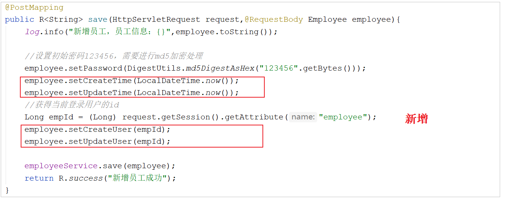
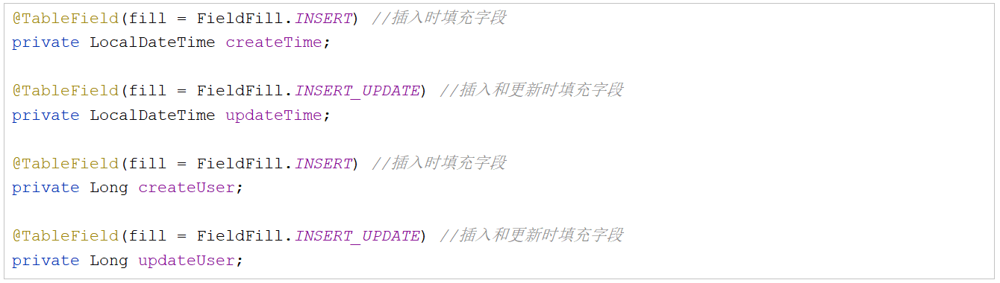
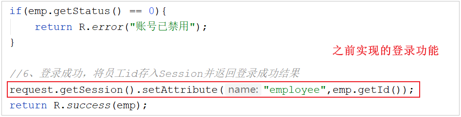
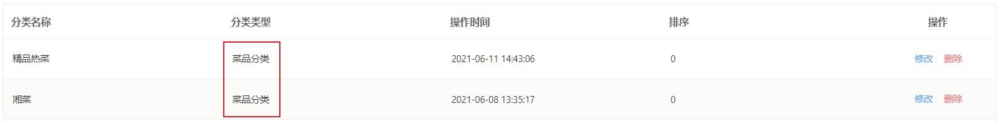

[TOC]


# shizian外卖-Day03

## 课程内容

- 公共字段自动填充
- 新增分类
- 分类信息分页查询
- 删除分类
- 修改分类


## 1. 公共字段自动填充

### 1.1 问题分析

前面我们已经完成了后台系统的员工管理功能的开发，在新增员工时需要设置创建时间、创建人、修改时间、修改人等字段，在编辑员工时需要设置修改时间、修改人等字段。这些字段属于公共字段，也就是也就是在我们的系统中很多表中都会有这些字段，如下：

 

而针对于这些字段，我们的赋值方式为： 

A. 在新增数据时, 将createTime、updateTime 设置为当前时间, createUser、updateUser设置为当前登录用户ID。

B. 在更新数据时, 将updateTime 设置为当前时间, updateUser设置为当前登录用户ID。


目前,在我们的项目中处理这些字段都是在每一个业务方法中进行赋值操作,如下:

 

 


如果都按照上述的操作方式来处理这些公共字段, 需要在每一个业务方法中进行操作, 编码相对冗余、繁琐，那能不能对于这些公共字段在某个地方统一处理，来简化开发呢？

**答案是可以的，我们使用Mybatis Plus提供的公共字段自动填充功能。**


### 1.2 基本功能实现

#### 1.2.1 思路分析

Mybatis Plus公共字段自动填充，也就是在插入或者更新的时候为指定字段赋予指定的值，使用它的好处就是可以统一对这些字段进行处理，避免了重复代码。在上述的问题分析中，我们提到有四个公共字段，需要在新增/更新中进行赋值操作, 具体情况如下: 

| 字段名     | 赋值时机                    | 说明           |
| ---------- | --------------------------- | -------------- |
| createTime | 插入(INSERT)                | 当前时间       |
| updateTime | 插入(INSERT) , 更新(UPDATE) | 当前时间       |
| createUser | 插入(INSERT)                | 当前登录用户ID |
| updateUser | 插入(INSERT) , 更新(UPDATE) | 当前登录用户ID |


实现步骤：

1、在实体类的属性上加入@TableField注解，指定自动填充的策略。

2、按照框架要求编写元数据对象处理器，在此类中统一为公共字段赋值，此类需要实现MetaObjectHandler接口。


#### 1.2.2 代码实现

**1). 实体类的属性上加入@TableField注解，指定自动填充的策略。**

在员工Employee实体类的公共字段属性上, 加上注解, 指定填充策略。(<font color='red'>ps.在资料中提供的实体类,已经添加了该注解,并指定了填充策略</font>)

 

> FieldFill.INSERT: 插入时填充该属性值
>
> FieldFill.INSERT_UPDATE: 插入/更新时填充该属性值


**2). 按照框架要求编写元数据对象处理器，在此类中统一为公共字段赋值，此类需要实现MetaObjectHandler接口。**

所属包: com.itheima.reggie.common

```java
import com.baomidou.mybatisplus.core.handlers.MetaObjectHandler;
import lombok.extern.slf4j.Slf4j;
import org.apache.ibatis.reflection.MetaObject;
import org.springframework.stereotype.Component;
import java.time.LocalDateTime;

/**
 * 自定义元数据对象处理器
 */
@Component
@Slf4j
public class MyMetaObjecthandler implements MetaObjectHandler {
    /**
     * 插入操作，自动填充
     * @param metaObject
     */
    @Override
    public void insertFill(MetaObject metaObject) {
        log.info("公共字段自动填充[insert]...");
        log.info(metaObject.toString());
        
        metaObject.setValue("createTime", LocalDateTime.now());
        metaObject.setValue("updateTime",LocalDateTime.now());
        metaObject.setValue("createUser",new Long(1));
        metaObject.setValue("updateUser",new Long(1));
    }

    /**
     * 更新操作，自动填充
     * @param metaObject
     */
    @Override
    public void updateFill(MetaObject metaObject) {
        log.info("公共字段自动填充[update]...");
        log.info(metaObject.toString());

        metaObject.setValue("updateTime",LocalDateTime.now());
        metaObject.setValue("updateUser",new Long(1));
    }
}
```


#### 1.2.3 功能测试

编写完了元数据对象处理器之后，我们就可以将之前在新增和修改方法中手动赋值的代码删除或注释掉。

  

 


然后，我们启动项目，在员工管理模块中，测试增加/更新员工信息功能，然后通过debug 或者 直接查询数据库数据变更的形式，看看我们在新增/修改数据时，这些公共字段数据是否能够完成自动填充。


### 1.3 功能完善

#### 1.3.1 思路分析

前面我们已经完成了公共字段自动填充功能的代码开发，但是还有一个问题没有解决，就是我们在自动填充createUser和updateUser时设置的用户id是固定值，现在我们需要完善，改造成动态获取当前登录用户的id。

 


那么我先搞清楚一点,当我们在修改员工信息时, 我们业务的执行流程是什么样子的,如下图:

  

客户端发送的每次http请求，对应的在服务端都会分配一个新的线程来处理，在处理过程中涉及到下面类中的方法都属于相同的一个线程：

1). LoginCheckFilter的doFilter方法

2). EmployeeController的update方法

3). MyMetaObjectHandler的updateFill方法

我们可以在上述类的方法中加入如下代码(获取当前线程ID,并输出):

```java
long id = Thread.currentThread().getId();
log.info("线程id为：{}",id);
```

执行编辑员工功能进行验证，通过观察控制台输出可以发现，一次请求对应的线程id是相同的：

  


经过上述的分析之后,发现我们可以使用JDK提供的一个类, 来解决此问题,它是JDK中提供的 ThreadLocal。


#### 1.3.2 ThreadLocal

ThreadLocal并不是一个Thread，而是Thread的局部变量。当使用ThreadLocal维护变量时，ThreadLocal为每个使用该变量的线程提供独立的变量副本，所以每一个线程都可以独立地改变自己的副本，而不会影响其它线程所对应的副本。

ThreadLocal为每个线程提供单独一份存储空间，具有线程隔离的效果，只有在线程内才能获取到对应的值，线程外则不能访问当前线程对应的值。

#### ==<font color=black>★★★★面试ThreadLocal原理及内存泄露问题</font>==

- ThreadLocal线程变量，一般用于解决并发线程安全访问共享资源的问题，属于Thread的变量，原理其实就是在每一个线程内独立开辟出一个空间，用来存放共享变量的副本，每个线程访问操作自己的共享变量即可，从而避免多线程竞争同一个共享资源，

- 每个线程都有一个成员变量ThreadLocalMap，当线程访问ThreadLocal修饰的共享变量时，线程就会在自己的成员变量ThreadLoaclMap的Entry中存放一份数据副本，key指向ThreadLocal这样的引用，（ 并且是个弱引用关系），value保存的是共享数据的副本；因为每个线程都持有一个份数据的副本，所以线程之间就不存在对共享数据的并发操作，所以解决线程安全的问题。

- 其中弱引用这块存在内存泄露的问题：弱引用本质就是。不管是否存在直引用的关系下，当成员变量ThreadLocal没有被其他强引用的情况下，对象会被GC垃圾回收，从而key为null，造成这块内存永远无法被访问，出现内存泄露。

- 解决办法：

1，扩大成员变量threadLocal的作用域，避免回收，（存在问题后续线程不访问，会导致内存一直占有，不被释放 最后也会造成内存溢出问题）
2，每次使用完threadLocal就调用remove方法，去移除对应数据，最好。

##### 那么为什么 key 要用弱引用

​     事实上，在 ThreadLocalMap 中的set/getEntry 方法中，会对 key 为 null（也即是 ThreadLocal 为 null ）进行判断，如果为 null 的话，那么会把 value 置为 null 的．这就意味着使用threadLocal , CurrentThread 依然运行的前提下．就算忘记调用 remove 方法，弱引用比强引用可以多一层保障：弱引用的 ThreadLocal 会被回收．对应value在下一次 ThreadLocaI 调用 get()/set()/remove() 中的任一方法的时候会被清除，从而避免内存泄漏．

##### 为什么不是强引用

如果是强引用，线程复用场景下面有可能会出现ThreadLocal对象无法被GC回收


引用关系图


实际应用中采用线程池复用，还是会存在内存泄露，除此之外threadlocal在数据进行读写的时候默认会去尝试做一些清理的动作找到并清理entry里的key为null的数据，不会完全避免内存泄露

jmm线程之间隔离/**/

线程安全、不同方法之间不用参数方式传值，


**ThreadLocal常用方法：**

A. public void set(T value) : 设置当前线程的线程局部变量的值

B. public T get() : 返回当前线程所对应的线程局部变量的值

C. public void remove() : 删除当前线程所对应的线程局部变量的值 


我们可以在LoginCheckFilter的doFilter方法中获取当前登录用户id，并调用ThreadLocal的set方法来设置当前线程的线程局部变量的值（用户id），然后在MyMetaObjectHandler的updateFill方法中调用ThreadLocal的get方法来获得当前线程所对应的线程局部变量的值（用户id）。 如果在后续的操作中, 我们需要在Controller / Service中要使用当前登录用户的ID, 可以直接从ThreadLocal直接获取。


##### ==<font color=red>面试题：ThreadLocal内存泄露</font>==

/**/

ThreadLocal 内存泄露的原因


 Entry将ThreadLocal作为Key，值作为value保存，它继承自WeakReference，注意构造函数里的第一行代码super(k)，这意味着ThreadLocal对象是一个「弱引用」。可以看图1.

    static class Entry extends WeakReference<ThreadLocal<?>> {
        /** The value associated with this ThreadLocal. */
        Object value;
        Entry(ThreadLocal<?> k, Object v) {
            super(k);
            value = v;
        }
    }

主要两个原因
1 . 没有手动删除这个 Entry
2 . CurrentThread 当前线程依然运行

        第一点很好理解，只要在使用完下 ThreadLocal ，调用其 remove 方法删除对应的 Entry ，就能避免内存泄漏。
        第二点稍微复杂一点，由于ThreadLocalMap 是 Thread 的一个属性，被当前线程所引用，所以ThreadLocalMap的生命周期跟 Thread 一样长。如果threadlocal变量被回收，那么当前线程的threadlocal 变量副本指向的就是key=null, 也即entry(null,value),那这个entry对应的value永远无法访问到。实际私用ThreadLocal场景都是采用线程池，而线程池中的线程都是复用的，这样就可能导致非常多的entry(null,value)出现，从而导致内存泄露。
综上， ThreadLocal 内存泄漏的根源是：
    由于ThreadLocalMap 的生命周期跟 Thread 一样长，对于重复利用的线程来说，如果没有手动删除（remove()方法）对应 key 就会导致entry(null，value)的对象越来越多，从而导致内存泄漏．
————————————————
版权声明：本文为CSDN博主「倔强的不服」的原创文章，遵循CC 4.0 BY-SA版权协议，转载请附上原文出处链接及本声明。
原文链接：https://blog.csdn.net/u010445301/article/details/124935802


#### 1.3.3 操作步骤

实现步骤：

1). 编写BaseContext工具类，基于ThreadLocal封装的工具类

2). 在LoginCheckFilter的doFilter方法中调用BaseContext来设置当前登录用户的id

3). 在MyMetaObjectHandler的方法中调用BaseContext获取登录用户的id


#### 1.3.4 代码实现

**1). BaseContext工具类**

所属包: com.itheima.reggie.common

```java
/**
 * 基于ThreadLocal封装工具类，用户保存和获取当前登录用户id
 */
public class BaseContext {
    private static final ThreadLocal<Long> THREAD_LOCAL_USER_ID = new ThreadLocal<>();

    /**
     * 获取当前登录用户ID
     */
    public static Long getCurrentUserId() {
        return THREAD_LOCAL_USER_ID.get();
    }

    /**
     * 设置当前登录用户ID
     */
    public static void setCurrentUserId(Long userId) {
        THREAD_LOCAL_USER_ID.set(userId);
    }
}
```


**2).LoginCheckFilter中存放当前登录用户到ThreadLocal**

在doFilter方法中, 判定用户是否登录, 如果用户登录, 在放行之前, 获取HttpSession中的登录用户信息, 调用BaseContext的setCurrentId方法将当前登录用户ID存入ThreadLocal。

```java
Long currentUserId = (Long) request.getSession().getAttribute("employee");
if (currentUserId != null) {
    BaseContext.setCurrentUserId(currentUserId);
    filterChain.doFilter(request, response);
    return;
}
```

 


**3). MyMetaObjectHandler中从ThreadLocal中获取**

将之前在代码中固定的当前登录用户1， 修改为动态调用BaseContext中的getCurrentId方法获取当前登录用户ID

 

 


#### 1.3.5 功能测试

完善了元数据对象处理器之后，我们就可以重新启动项目，完成登录操作后, 在员工管理模块中，测试增加/更新员工信息功能, 直接查询数据库数据变更，看看我们在新增/修改数据时，这些公共字段数据是否能够完成自动填充, 并且看看填充的create_user 及 update_user字段值是不是本地登录用户的ID。


## 2. 新增分类

### 2.1 需求分析

后台系统中可以管理分类信息，分类包括两种类型，分别是 **菜品分类** 和 **套餐分类** 。当我们在后台系统中添加菜品时需要选择一个菜品分类，当我们在后台系统中添加一个套餐时需要选择一个套餐分类，在移动端也会按照菜品分类和套餐分类来展示对应的菜品和套餐。

 


在分类管理中,我们新增分类时, 可以选择新增菜品分类(川菜、湘菜、粤菜...), 也可以选择新增套餐分类(营养早餐、超值午餐...)。 在添加套餐的时候, 输入的排序字段, 控制的是移动端套餐列表的展示顺序。

 


### 2.2 数据模型

新增分类，其实就是将我们新增窗口录入的分类数据,插入到category表，具体表结构如下：

 

我们添加的套餐名称，是唯一的，不能够重复的，所以在设计表结构时，已经针对于name字段建立了唯一索引，如下：

 


### 2.3 前端页面分析

在开发代码之前，需要梳理一下整个程序的执行过程：

1). 在页面(backend/page/category/list.html)的新增分类表单中填写数据，点击 "确定" 发送ajax请求，将新增分类窗口输入的数据以json形式提交到服务端

2). 服务端Controller接收页面提交的数据并调用Service将数据进行保存

3). Service调用Mapper操作数据库，保存数据


可以看到新增菜品分类和新增套餐分类请求的服务端地址和提交的json数据结构相同，所以服务端只需要提供一个方法统一处理即可：

 

具体请求信息整理如下: 

| 请求     | 说明                                           |
| -------- | ---------------------------------------------- |
| 请求方式 | POST                                           |
| 请求路径 | /category                                      |
| 请求参数 | json格式 - {"name":"川菜","type":"1","sort":2} |


### 2.4 代码实现

代码实现的具体步骤如下: 

- 实体类Category（直接从课程资料中导入即可）

- Mapper接口CategoryMapper

- 业务层接口CategoryService

- 业务层实现类CategoryServiceImpl

- 控制层CategoryController


**1). 实体类Category**

所属包: com.itheima.reggie.entity

```java
import com.baomidou.mybatisplus.annotation.FieldFill;
import com.baomidou.mybatisplus.annotation.TableField;
import lombok.Data;
import java.io.Serializable;
import java.time.LocalDateTime;

/**
 * 分类
 */
@Data
public class Category implements Serializable {

    private static final long serialVersionUID = 1L;

    private Long id;

    //类型 1 菜品分类 2 套餐分类
    private Integer type;

    //分类名称
    private String name;

    //顺序
    private Integer sort;

    //创建时间
    @TableField(fill = FieldFill.INSERT)
    private LocalDateTime createTime;

    //更新时间
    @TableField(fill = FieldFill.INSERT_UPDATE)
    private LocalDateTime updateTime;
    
    //创建人
    @TableField(fill = FieldFill.INSERT)
    private Long createUser;
    
    //修改人
    @TableField(fill = FieldFill.INSERT_UPDATE)
    private Long updateUser;
}
```


**2). Mapper接口CategoryMapper**

所属包: com.itheima.reggie.mapper

```java
import com.baomidou.mybatisplus.core.mapper.BaseMapper;
import com.itheima.reggie.entity.Category;
import org.apache.ibatis.annotations.Mapper;

@Mapper
public interface CategoryMapper extends BaseMapper<Category> {
}
```


**3). 业务层接口CategoryService**

所属包: com.itheima.reggie.service

```java
import com.baomidou.mybatisplus.extension.service.IService;
import com.itheima.reggie.entity.Category;

public interface CategoryService extends IService<Category> {
}
```


**4). 业务层实现类CategoryServiceImpl**

所属包: com.itheima.reggie.service.impl

```java
import com.baomidou.mybatisplus.extension.service.impl.ServiceImpl;
import com.itheima.reggie.entity.Category;
import com.itheima.reggie.mapper.CategoryMapper;
import com.itheima.reggie.service.CategoryService;
import org.springframework.stereotype.Service;

@Service
public class CategoryServiceImpl extends ServiceImpl<CategoryMapper,Category> implements CategoryService{
}
```


**5). 控制层CategoryController**

```java
import com.itheima.reggie.common.R;
import com.itheima.reggie.entity.Category;
import com.itheima.reggie.service.CategoryService;
import lombok.extern.slf4j.Slf4j;
import org.springframework.beans.factory.annotation.Autowired;
import org.springframework.web.bind.annotation.*;

/**
 * 分类管理
 */
@RestController
@RequestMapping("/category")
@Slf4j
public class CategoryController {
    @Autowired
    private CategoryService categoryService;
	
    /**
     * 新增分类
     * @param category
     * @return
     */
    @PostMapping
    public R<String> save(@RequestBody Category category){
        log.info("category:{}",category);
        categoryService.save(category);
        return R.success("新增分类成功");
    }
}    
```


### 2.5 功能测试

新增分类的代码编写完毕之后, 我们需要重新启动项目，进入管理系统访问分类管理, 然后进行新增分类测试，需要将所有情况都覆盖全，例如：

1). 输入的分类名称不存在

2). 输入已存在的分类名称

3). 新增菜品分类

4). 新增套餐分类


## 3. 分类信息分页查询

### 3.1 需求分析

系统中的分类很多的时候，如果在一个页面中全部展示出来会显得比较乱，不便于查看，所以一般的系统中都会以分页的方式来展示列表数据。

 


### 3.2 前端页面分析

在开发代码之前，需要梳理一下整个程序的执行过程：

1). 页面发送ajax请求，将分页查询参数(page、pageSize)提交到服务端

2). 服务端Controller接收页面提交的数据并调用Service查询数据

3). Service调用Mapper操作数据库，查询分页数据

4). Controller将查询到的分页数据响应给页面

5). 页面接收到分页数据并通过ElementUI的Table组件展示到页面上


页面加载时,就会触发Vue声明周期的钩子方法,然后执行分页查询,发送异步请求到服务端,前端代码如下: 

  

页面中使用的是ElementUI提供的分页组件进行分页条的展示:

  


我们通过浏览器,也可以抓取到分页查询的请求信息, 如下: 

 


具体的请求信息整理如下: 

| 请求     | 说明                |
| -------- | ------------------- |
| 请求方式 | GET                 |
| 请求路径 | /category/page      |
| 请求参数 | ?page=1&pageSize=10 |


### 3.3 代码实现

在CategoryController中增加分页查询的方法，在方法中传递分页条件进行查询，并且需要对查询到的结果，安排设置的套餐顺序字段sort进行排序。

```java
/**
 * 分页查询
 * @param page
 * @param pageSize
 * @return
 */
@GetMapping("/page")
public R<Page> page(int page,int pageSize){
    //分页构造器
    Page<Category> pageInfo = new Page<>(page,pageSize);
    //条件构造器
    LambdaQueryWrapper<Category> queryWrapper = new LambdaQueryWrapper<>();
    //添加排序条件，根据sort进行排序
    queryWrapper.orderByAsc(Category::getSort);

    //分页查询
    categoryService.page(pageInfo,queryWrapper);
    return R.success(pageInfo);
}
```


### 3.4 功能测试

分页查询的代码编写完毕之后, 我们需要重新启动项目，然后登陆系统后台，点击分类管理，查询分类列表是否可以正常展示。测试过程中可以使用浏览器的监控工具查看页面和服务端的数据交互细节。

测试完毕后，大家会发现，我们查询数据库返回的类型为 1 或者 2， 但是实际展示到页面上的却是 "菜品分类" 或 "套餐分类"，这一块是在前端页面中进行处理的，处理代码如下： 

 

 


## 4. 删除分类

### 4.1 需求分析

在分类管理列表页面，可以对某个分类进行删除操作。需要注意的是当分类关联了菜品或者套餐时，此分类不允许删除。

 


### 4.2 前端页面分析

在前端页面中，点击 "删除" 按钮，就会触发定义的方法，然后往服务端发送异步请求，并传递参数id，执行删除分类操作。

   

删除操作的具体执行流程如下： 

1). 点击删除，页面发送ajax请求，将参数(id)提交到服务端

2). 服务端Controller接收页面提交的数据并调用Service删除数据

3). Service调用Mapper操作数据库

 


从上述的分析中，我们可以得到请求的信息如下：

| 请求     | 说明                    |
| -------- | ----------------------- |
| 请求方式 | DELETE                  |
| 请求路径 | /category               |
| 请求参数 | ?id=1395291114922618881 |


### 4.3 代码实现

在CategoryController中增加根据ID删除的方法，在方法中接收页面传递参数id，然后执行删除操作。

```java
/**
 * 根据id删除分类
 * @param id
 * @return
 */
@DeleteMapping
public R<String> delete(Long id){
    log.info("删除分类，id为：{}",id);
    categoryService.removeById(id);
    return R.success("分类信息删除成功");
}
```


### 4.4 功能测试

基本的删除操作代码实现完毕后，重启项目，进行测试。可以通过debug断点调试进行测试，同时结合浏览器监控工具查看请求和响应的具体数据。


### 4.5 功能完善

#### 4.5.1 思路分析

在上述的测试中，我们看到分类数据是可以正常删除的。但是并没有检查删除的分类是否关联了菜品或者套餐，所以我们需要进行功能完善。完善后的逻辑为：

- 根据当前分类的ID，查询分类信息，取到当前分类的类型
- 根据当前分类类型判断是菜品分类还是套餐分类
  - 菜品分类
    - 查询菜品表下是否有当前分类的数据，如果有，不允许删除

  - 套餐分类
    - 查询套餐分类表下是否有当前分类的数据，如果有，不允许删除

- 执行正常的删除分类操作


那么在这里又涉及到我们后面要用到的两张表结构 dish(菜品表) 和 setmeal(套餐表)。具体的表结构，我们目前先了解一下： 

 

 


#### 4.5.2 准备工作

**1). 准备菜品(Dish)及套餐(Setmeal)实体类(课程资料中直接拷贝)**

所属包: com.itheima.reggie.entity

```java
import com.baomidou.mybatisplus.annotation.FieldFill;
import com.baomidou.mybatisplus.annotation.TableField;
import lombok.Data;
import java.io.Serializable;
import java.math.BigDecimal;
import java.time.LocalDateTime;

/**
 菜品
 */
@Data
public class Dish implements Serializable {
    private static final long serialVersionUID = 1L;

    private Long id;

    //菜品名称
    private String name;

    //菜品分类id
    private Long categoryId;

    //菜品价格
    private BigDecimal price;

    //商品码
    private String code;

    //图片
    private String image;

    //描述信息
    private String description;

    //0 停售 1 起售
    private Integer status;

    //顺序
    private Integer sort;

    @TableField(fill = FieldFill.INSERT)
    private LocalDateTime createTime;

    @TableField(fill = FieldFill.INSERT_UPDATE)
    private LocalDateTime updateTime;

    @TableField(fill = FieldFill.INSERT)
    private Long createUser;

    @TableField(fill = FieldFill.INSERT_UPDATE)
    private Long updateUser;
}
```

```java
import com.baomidou.mybatisplus.annotation.FieldFill;
import com.baomidou.mybatisplus.annotation.TableField;
import lombok.Data;
import java.io.Serializable;
import java.math.BigDecimal;
import java.time.LocalDateTime;

/**
 * 套餐
 */
@Data
public class Setmeal implements Serializable {
    private static final long serialVersionUID = 1L;

    private Long id;

    //分类id
    private Long categoryId;

    //套餐名称
    private String name;

    //套餐价格
    private BigDecimal price;

    //状态 0:停用 1:启用
    private Integer status;

    //编码
    private String code;

    //描述信息
    private String description;

    //图片
    private String image;

    @TableField(fill = FieldFill.INSERT)
    private LocalDateTime createTime;

    @TableField(fill = FieldFill.INSERT_UPDATE)
    private LocalDateTime updateTime;

    @TableField(fill = FieldFill.INSERT)
    private Long createUser;

    @TableField(fill = FieldFill.INSERT_UPDATE)
    private Long updateUser;
}
```


**2). Mapper接口DishMapper和SetmealMapper**

所属包: com.itheima.reggie.mapper

```java
import com.baomidou.mybatisplus.core.mapper.BaseMapper;
import com.itheima.reggie.entity.Dish;
import org.apache.ibatis.annotations.Mapper;

@Mapper
public interface DishMapper extends BaseMapper<Dish> {
}
```

```java
import com.baomidou.mybatisplus.core.mapper.BaseMapper;
import com.itheima.reggie.entity.Setmeal;
import org.apache.ibatis.annotations.Mapper;

@Mapper
public interface SetmealMapper extends BaseMapper<Setmeal> {
}
```


**3). Service接口DishService和SetmealService**

所属包: com.itheima.reggie.service

```java
import com.baomidou.mybatisplus.extension.service.IService;
import com.itheima.reggie.entity.Dish;

public interface DishService extends IService<Dish> {
}
```

```java
import com.baomidou.mybatisplus.extension.service.IService;
import com.itheima.reggie.entity.Setmeal;

public interface SetmealService extends IService<Setmeal> {
}
```


**4). Service实现类DishServiceImpl和SetmealServiceImpl**

```java
import com.baomidou.mybatisplus.extension.service.impl.ServiceImpl;
import com.itheima.reggie.entity.Dish;
import com.itheima.reggie.mapper.DishMapper;
import com.itheima.reggie.service.DishService;
import lombok.extern.slf4j.Slf4j;
import org.springframework.stereotype.Service;

@Service
@Slf4j
public class DishServiceImpl extends ServiceImpl<DishMapper,Dish> implements DishService {
}
```

```java
import com.baomidou.mybatisplus.extension.service.impl.ServiceImpl;
import com.itheima.reggie.entity.Setmeal;
import com.itheima.reggie.mapper.SetmealMapper;
import com.itheima.reggie.service.SetmealService;
import lombok.extern.slf4j.Slf4j;
import org.springframework.stereotype.Service;

@Service
@Slf4j
public class SetmealServiceImpl extends ServiceImpl<SetmealMapper,Setmeal> implements SetmealService {
}
```


#### 4.5.3 代码实现

##### **1). 创建自定义异常**

在业务逻辑操作过程中,如果遇到一些业务参数、操作异常的情况下，我们直接抛出此异常。

所在包: com.itheima.reggie.common

```java
/**
 * 自定义业务异常类
 */
public class CustomException extends RuntimeException {
    public CustomException(String message){
        super(message);
    }
}
```


**2). 在CategoryService中扩展remove方法**

```java
public interface CategoryService extends IService<Category> {
	//根据ID删除分类
    public void remove(Long id);
}
```


**3). 在CategoryServiceImpl中实现remove方法**

```java
@Autowired
private DishService dishService;
@Autowired
private SetmealService setmealService;

/**
 * 根据id删除分类，删除之前需要进行判断
 * @param id
 */
@Override
public void remove(Long id) {
   // 调用父类service中的根据id获取分类的方法
        Category category = super.getById(id);
        if (null == category) {
            // 如果根据id没有查询到对应的分类数据,那后面的代码都不需要执行了.抛出异常.
            throw new CustomException("没有查询到对应的分类数据,请联系管理员.");
        }
        // 根据类型判断,这个分类是菜品,还是套餐.
        switch (category.getType()) {
            // 菜品分类
            case 1:
                LambdaQueryWrapper<Dish> dishLambdaQueryWrapper = new LambdaQueryWrapper<>();
                // where category_id = category.getId()
                dishLambdaQueryWrapper.eq(Dish::getCategoryId, category.getId());
                // 返回菜品数量
                int countDish = this.dishService.count(dishLambdaQueryWrapper);
                // 分类下存在菜品,抛出业务异常,不允许删除
                if (countDish > 0) {
                    throw new CustomException("菜品分类下还存在数据,不允许删除");
                }
                break;
            // 套餐分类
            case 2:
                LambdaQueryWrapper<Setmeal> setmealLambdaQueryWrapper = new LambdaQueryWrapper<>();
                // where category_id = category.getId()
                setmealLambdaQueryWrapper.eq(Setmeal::getCategoryId, category.getId());
                // 返回菜品数量
                int countSetmeal = this.setmealService.count(setmealLambdaQueryWrapper);
                // 分类下存在套菜,抛出业务异常,不允许删除
                if (countSetmeal > 0) {
                    throw new CustomException("套餐分类下还存在数据,不允许删除");
                }
                break;
        }
        // 如果没有抛出异常,就代表菜品或者套餐下没有菜品数据,就可以删除.
        super.removeById(id);
}

```


那么在上述的业务逻辑中，当分类下关联的有菜品或者套餐时，我们在业务代码中抛出了自定义异常，并且在异常中封装了错误提示信息，那这个错误提示信息如何提示给页面呢？

异常抛出之后，会被异常处理器捕获，我们只需要在异常处理器中捕获这一类的异常，然后给页面返回对应的提示信息即可。


**4). 在GlobalExceptionHandler中处理自定义异常**

在全局异常处理器中增加方法，用于捕获我们自定义的异常 CustomException

```java
/**
 * 异常处理方法
 * @return
 */
@ExceptionHandler(CustomException.class)
public R<String> exceptionHandler(CustomException ex){
    log.error(ex.getMessage());
    return R.error(ex.getMessage());
}
```


**5). 改造CategoryController的delete方法**

注释掉原有的代码，在delete方法中直接调用categoryService中我们自定义的remove方法。

```java
/**
* 根据id删除分类
* @param id
* @return
*/
@DeleteMapping
public R<String> delete(Long id){
    log.info("删除分类，id为：{}",id);

    //categoryService.removeById(id);
    categoryService.remove(id);

    return R.success("分类信息删除成功");
}
```


#### 4.5.4 功能测试

功能完善的代码编写完毕之后, 我们需要重新启动项目，进入管理系统访问分类管理, 然后进行删除分类的测试，需要将所有情况都覆盖全，例如：

1). 新增一个分类，然后再直接删除，检查是否可以正常删除成功。(新增的分类时没有关联菜品和套餐的)

2). 在数据库表(dish/setmeal)中，找到一个与菜品或套餐关联的分类，然后在页面中执行删除操作，检查是否可以正常的提示出对应的错误信息。

 


## 5. 修改分类

### 5.1 需求分析

在分类管理列表页面点击修改按钮，弹出修改窗口，在修改窗口回显分类信息并进行修改，最后点击确定按钮完成修改操作。

 


### 5.2 前端页面分析

这里面大家会发现，修改功能我们还没有实现，但是当点击 "修改" 按钮的时候，我们并没有开发根据ID查询数据，进行页面回显的功能，但是页面的分类数据确实回显回来了。这是怎么做到的呢，我们来解析一下前端的代码实现(前端代码已经实现)：

 

那么回显这一步的操作前端已经实现，我们就只需要开发一个方法，修改操作的方法即可。我们可以通过浏览器来抓取一下修改操作的请求信息，如图：

 


具体的请求信息，整理如下：

| 请求     | 说明                                                   |
| -------- | ------------------------------------------------------ |
| 请求方式 | PUT                                                    |
| 请求路径 | /category                                              |
| 请求参数 | {id: "1399923597874081794", name: "超值午餐", sort: 0} |


### 5.3 代码实现

html页面中相关的代码都已经提供好了，我们已经分析了请求的信息，接下来就可以来创建服务端的CategoryController方法update方法。

```java
/**
 * 根据id修改分类信息
 * @param category
 * @return
 */
@PutMapping
public R<String> update(@RequestBody Category category){
    log.info("修改分类信息：{}",category);
    categoryService.updateById(category);
    return R.success("修改分类信息成功");
}
```


### 5.4 功能测试

按照前面分析的操作流程进行测试，查看数据是否正常修改即可。


 