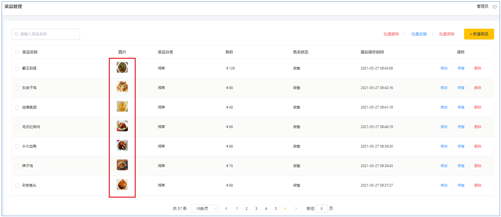
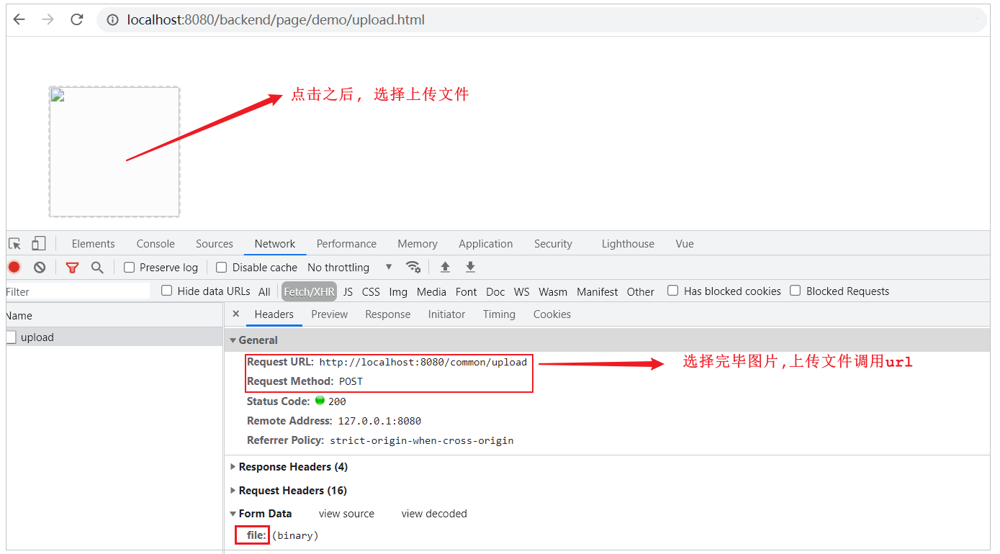
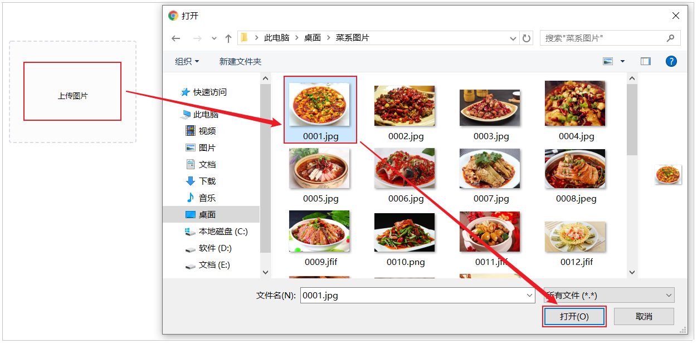
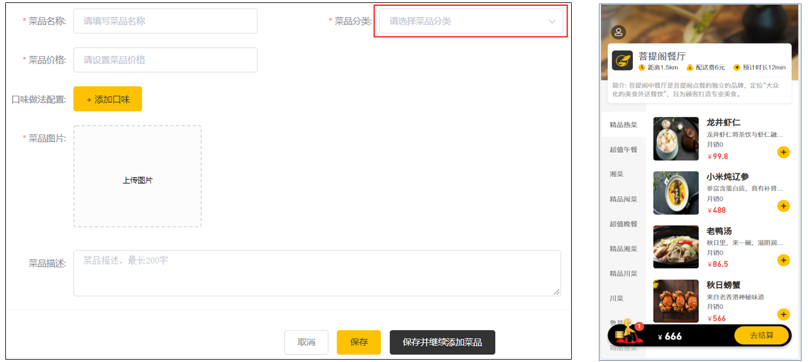
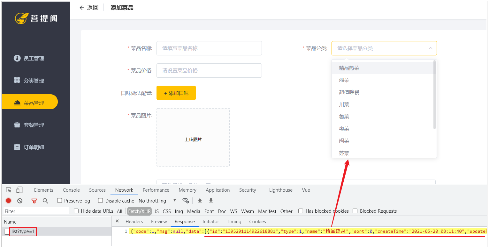

# 施子安外卖-Day04

## 课程内容

- 文件上传下载
- 菜品新增
- 菜品分页查询
- 菜品修改 

## 1. 文件上传下载

### 1.1 上传介绍

#### 1.1.1 概述

文件上传，也称为upload，是指将本地图片、视频、音频等文件上传到服务器上，可以供其他用户浏览或下载的过程。文件上传在项目中应用非常广泛，我们经常发微博、发微信朋友圈都用到了文件上传功能。

 


文件上传时，对页面的form表单有如下要求：

| 表单属性 | 取值                | 说明                      |
| -------- | ------------------- | ------------------------- |
| method   | post                | 必须选择post方式提交      |
| enctype  | multipart/form-data | 采用multipart格式上传文件 |
| type     | file                | 使用input的file控件上传   |


#### 1.1.2 前端介绍

**1). 简单html页面表单**

```html
<form method="post" action="/common/upload" enctype="multipart/form-data">
    <input name="myFile" type="file"  />
    <input type="submit" value="提交" /> 
</form>
```


**2). ElementUI中提供的upload上传组件**

目前一些前端组件库也提供了相应的上传组件，但是底层原理还是基于form表单的文件上传。

 


#### 1.1.3 服务端介绍

服务端要接收客户端页面上传的文件，通常都会使用Apache的两个组件：

- commons-fileupload

- commons-io


而Spring框架在spring-web包中对文件上传进行了封装，大大简化了服务端代码，我们只需要在Controller的方法中声明一个MultipartFile类型的参数即可接收上传的文件，例如：

```java
/**
 * 文件上传
 * @param file
 * @return
 */
@PostMapping("/upload")
public R<String> upload(MultipartFile file){
    System.out.println(file);
    return R.success(fileName);
}
```


### 1.2 下载介绍

文件下载，也称为download，是指将文件从服务器传输到本地计算机的过程。通过浏览器进行文件下载，通常有两种表现形式：

**1). 以附件形式下载，弹出保存对话框，将文件保存到指定磁盘目录**

 


**2). 直接在浏览器中打开**

而我们在今天所需要实现的菜品展示，表现形式为在浏览器中直接打开。

  

通过浏览器进行文件下载，本质上就是服务端将文件以流的形式写回浏览器的过程。


### 1.3 上传代码实现

#### 1.3.1 前端代码

文件上传，我们作为服务端工程师，主要关注服务端代码实现。对于前端页面，可以使用ElementUI提供的上传组件。可以直接使用资料中提供的上传页面upload.html，拷贝到项目的目录(resources/backend/page/demo\)下，启动项目，访问上传页面。

http://localhost:8080/backend/page/demo/upload.html

 


在上述的浏览器抓取的网络请求中，上传文件的调用url，在哪里配置的呢，这个时候，我们需要去看一下前端上传组件。

 

虽然上述是ElementUI封装的代码，但是实际上最终还通过file域上传文件，如果未指定上传文件的参数名，默认为file。

 


#### 1.3.2 服务端实现

**1). application.yml**

需要在application.yml中定义文件存储路径

```yml
reggie:
  path: D:\upload\img
```


**2). CommonController**

编写文件上传的方法, 通过MultipartFile类型的参数即可接收上传的文件, 方法形参的名称需要与页面的file域的name属性一致。

所在包: com.itheima.reggie.controller

上传逻辑: 

1). 获取文件的原始文件名, 通过原始文件名获取文件后缀

2). 通过UUID重新声明文件名, 文件名称重复造成文件覆盖

3). 创建文件存放目录

4). 将上传的临时文件转存到指定位置

代码实现:

```java
@RestController
@RequestMapping("/common")
@Slf4j
public class CommonController {
	@Value("${reggie.path}")
	private String basePath;
    
	@PostMapping("/upload")
	public R<String> upload(MultipartFile file) {
        log.info("已经调用到后端上传接口");
        if (file == null || StringUtils.isBlank(file.getOriginalFilename())) {
            throw new CustomException("不能上传空文件");
        }
        // 获取文件名和后缀名
        // 获取文件名
        String oldFileName = file.getOriginalFilename();
        // 在这个文件名中拿到后缀
        // 123.txt
        // 拿到的是文件名的后缀
        String suffix = oldFileName.substring(oldFileName.indexOf("."));
        // 使用UUID重新生成图片文件名.
        String uuid = UUID.randomUUID().toString();
        // 新生成的文件名
        String newFileName = uuid + suffix;
        // 图片保存的基本目录
        File dir = new File(basePath);
        if (!dir.exists()) {
            boolean mkdir = dir.mkdir();
            if (!mkdir) {
                throw new CustomException("创建文件目录失败");
            }
        }
        try {
            // 创建文件对象
            File newFile = new File(basePath, newFileName);
            // 转移文件.
            file.transferTo(newFile);
        } catch (IOException e) {
            e.printStackTrace();
        }
        return R.success(newFileName);
    }
}

```

#### 1.3.3 测试

代码编写完成之后，我们重新启动项目，访问上传页面 http://localhost:8080/backend/page/demo/upload.html，然后点击上传图片，选择图片上传时，会发现图片并不能正常的上传，而且在浏览器中可以抓取到响应的数据，从图中我们可以判断出需要登录才可以操作。

 

而这样的话，就要求我们在测试时，每一次都需要先登录，登录完成后在进行图片上传的测试，为了简化我们的测试，我们可以在 LoginCheckFilter 的doFilter方法中，在不需要处理的请求路径的数组中再加入请求路径 /common/** , 如下: 

 

然后，我们在测试文件的上传功能时，就不需要登录就可以操作了。 


我们在测试文件上传时，可以通过debug的形式来跟踪上传的整个过程，验证一下临时文件是否存在，以及上传完成之后，临时文件是否会自动删除。

 

Postman测试文件上传：


### 1.4 下载代码实现

#### 1.4.1 前端代码

文件下载，前端页面可以使用标签展示下载的图片。

```html
</img>
```


那么，通过标签如何展示图片数据呢，接下来我们来解析一下具体的流程：

 

在文件上传成功后，在 handleAvatarSuccess 方法中获取文件上传成功之后返回的数据(文件名)，然后调用 /common/download?name=xxx 进行文件的下载。在这里，我们想让上传的照片能够在页面展示出来，所以我们就需要在服务端将文件以流的形式写回浏览器。


#### 1.4.2 服务端代码

在 CommonController 中定义方法download，并接收页面传递的参数name，然后读取图片文件的数据，然后以流的形式写回浏览器。

具体逻辑如下： 

1). 定义输入流，通过输入流读取文件内容

2). 通过response对象，获取到输出流

3). 通过response对象设置响应数据格式(image/jpeg)

4). 通过输入流读取文件数据，然后通过上述的输出流写回浏览器

5). 关闭资源


代码实现:

```java
/**
 * 文件下载
 * @param name
 * @param response
 */
@GetMapping("/download")
public void download(@RequestParam String name, HttpServletResponse response) {
        // 测试前后端是否能联通
        log.info("name ====> {}", name);
        // 1). 定义输入流，通过输入流读取文件内容
        try {
            FileInputStream fileInputStream = new FileInputStream(new File(basePath, name));
            // 2). 通过response对象设置响应数据格式(image/jpeg)
            response.setContentType("image/jpeg");
            // 3). 通过response对象，获取到输出流
            ServletOutputStream outputStream = response.getOutputStream();
            // 4). 通过输入流读取文件数据，然后通过输出流写回浏览器
            int len = 0;
            // 1024=1kb
            byte[] bytes = new byte[1024];
            while ((len = (fileInputStream.read(bytes))) != -1) {
                // 写回到浏览器中
                outputStream.write(bytes, 0, len);
                outputStream.flush();
            }
            // 5). 关闭资源(仅关闭本地文件流即可)
            fileInputStream.close();
        } catch (IOException e) {
            e.printStackTrace();
        }
    }
```


#### 1.4.3 测试

访问页面 http://localhost:8080/backend/page/demo/upload.html , 点击上传图片 , 选择图片进行上传, 上传完毕之后, 查看图片是否可以展示出来。

 

通过F12查询页面发起的请求及响应的数据：

 


## 2. 菜品新增

### 2.1 需求分析

后台系统中可以管理菜品信息，通过 新增功能来添加一个新的菜品，在添加菜品时需要选择当前菜品所属的菜品分类，并且需要上传菜品图片，在移动端会按照菜品分类来展示对应的菜品信息 。

 


### 2.2 数据模型

 

新增菜品，其实就是将新增页面录入的菜品信息插入到dish表，如果添加了口味做法，还需要向dish_flavor表插入数据。所以在新增菜品时，涉及到两个表：

| 表结构      | 说明       |
| ----------- | ---------- |
| dish        | 菜品表     |
| dish_flavor | 菜品口味表 |


**1). 菜品表:dish**

 


**2). 菜品口味表:dish_flavor**

 


### 2.3 准备工作

在开发业务功能前，先将需要用到的类和接口基本结构创建好：


**1). 实体类 DishFlavor**

直接从课程资料中导入即可，Dish实体前面课程中已经导入过了

所属包: com.itheima.reggie.entity

```java
import com.baomidou.mybatisplus.annotation.FieldFill;
import com.baomidou.mybatisplus.annotation.TableField;
import lombok.Data;
import java.io.Serializable;
import java.time.LocalDateTime;
/**
菜品口味
 */
@Data
public class DishFlavor implements Serializable {

    private static final long serialVersionUID = 1L;
	
    private Long id;
    //菜品id
    private Long dishId;

    //口味名称
    private String name;

    //口味数据list
    private String value;

    @TableField(fill = FieldFill.INSERT)
    private LocalDateTime createTime;

    @TableField(fill = FieldFill.INSERT_UPDATE)
    private LocalDateTime updateTime;

    @TableField(fill = FieldFill.INSERT)
    private Long createUser;

    @TableField(fill = FieldFill.INSERT_UPDATE)
    private Long updateUser;

    //是否删除
    private Integer isDeleted;
}
```


**2). Mapper接口DishFlavorMapper**

所属包: com.itheima.reggie.mapper

```java
import com.baomidou.mybatisplus.core.mapper.BaseMapper;
import com.itheima.reggie.entity.DishFlavor;
import org.apache.ibatis.annotations.Mapper;

@Mapper
public interface DishFlavorMapper extends BaseMapper<DishFlavor> {
}
```


**3). 业务层接口 DishFlavorService**

所属包: com.itheima.reggie.service

```java
import com.baomidou.mybatisplus.extension.service.IService;
import com.itheima.reggie.entity.DishFlavor;

public interface DishFlavorService extends IService<DishFlavor> {
}
```


**4). 业务层实现类 DishFlavorServiceImpl**

所属包: com.itheima.reggie.service.impl

```java
import com.baomidou.mybatisplus.extension.service.impl.ServiceImpl;
import com.itheima.reggie.entity.DishFlavor;
import com.itheima.reggie.mapper.DishFlavorMapper;
import com.itheima.reggie.service.DishFlavorService;
import org.springframework.stereotype.Service;

@Service
public class DishFlavorServiceImpl extends ServiceImpl<DishFlavorMapper,DishFlavor> implements DishFlavorService {
}
```


**5). 控制层 DishController**

菜品及菜品口味的相关操作，我们统一使用这一个controller即可。

所属包： com.itheima.reggie.controller

```java
import com.itheima.reggie.service.DishFlavorService;
import com.itheima.reggie.service.DishService;
import lombok.extern.slf4j.Slf4j;
import org.springframework.beans.factory.annotation.Autowired;
import org.springframework.web.bind.annotation.*;
/**
 * 菜品管理
 */
@RestController
@RequestMapping("/dish")
@Slf4j
public class DishController {

}    
```


### 2.4 前端页面分析

基本的准备工作我们已经做完了，那么接下来我们就需要来实现新增菜品功能，在开发代码之前，需要梳理一下新增菜品时前端页面和服务端的交互过程。

1). 点击新建菜品按钮, 访问页面(backend/page/food/add.html), 页面加载时发送ajax请求，请求服务端获取菜品分类数据并展示到下拉框中

 


2). 页面发送请求进行图片上传，请求服务端将图片保存到服务器(上传功能已实现)

3). 页面发送请求进行图片下载，将上传的图片进行回显(下载功能已实现)

 


4). 点击保存按钮，发送ajax请求，将菜品相关数据以json形式提交到服务端

页面代码:

 

浏览器抓取请求:

 


开发新增菜品功能，其实就是在服务端编写代码去处理前端页面发送的这4次请求(上传、下载已实现)即可。经过上述的分析，我们还需要在服务端实现两块功能：

A. 菜品分类数据列表查询, 具体请求信息整理如下 : 

| 请求     | 说明           |
| -------- | -------------- |
| 请求方式 | GET            |
| 请求路径 | /category/list |
| 请求参数 | ?type=1        |


B. 保存菜品信息, 具体请求信息整理如下 : 

| 请求     | 说明     |
| -------- | -------- |
| 请求方式 | POST     |
| 请求路径 | /dish    |
| 请求参数 | json格式 |


下面呢,我们就需要根据这里分析的结果,分别来实现菜品分类列表的展示功能、保存菜品的功能 。

### 2.5 代码实现

#### 2.5.1 菜品分类查询

在CategoryController中增加方法实现菜品分类查询，根据分类进行查询，并对查询的结果按照sort排序字段进行升序排序，如果sort相同，再按照修改时间倒序排序。

```java
/**
* 根据条件查询分类数据
* @param category
* @return
*/
@GetMapping("/list")
public R<List<Category>> list(Category category){
    //条件构造器
    LambdaQueryWrapper<Category> queryWrapper = new LambdaQueryWrapper<>();
    //添加条件
    queryWrapper.eq(category.getType() != null,Category::getType,category.getType());
    //添加排序条件
    queryWrapper.orderByAsc(Category::getSort).orderByDesc(Category::getUpdateTime);

    List<Category> list = categoryService.list(queryWrapper);
    return R.success(list);
}
```


代码编写完毕之后，我们可以打开新增菜品页面，查看响应的数据，及页面下拉列表的渲染情况： 

 


#### 2.5.2 保存菜品信息

在上述的分析中，我们可以看到在保存菜品时，页面传递过来的是json格式数据，格式如下：

```json
{
    "name":"佛跳墙",
    "price":88800,
    "code":"",
    "image":"da9e1c70-fc32-4781-9510-a1c4ccd2ff59.jpg",
    "description":"佛跳墙",
    "status":1,
    "categoryId":"1397844357980663809",
    "flavors":[
        {
            "name":"辣度",
            "value":"[\"不辣\",\"微辣\",\"中辣\",\"重辣\"]",
            "showOption":false
        },
        {
            "name":"忌口",
            "value":"[\"不要葱\",\"不要蒜\",\"不要香菜\",\"不要辣\"]",
            "showOption":false
        }
    ]
}
```

在服务端我们应该如何来封装前端传递的数据呢，我们发现，如果使用菜品类Dish来封装，只能封装菜品的基本属性，flavors属性是无法封装的。那么这个时候，我们应该如何处理呢?

这个时候，我们需要自定义一个实体类，然后继承自 Dish，并对Dish的属性进行拓展，增加 flavors 集合属性(内部封装DishFlavor)。清楚了这一点之后,接下来就进行功能开发。

基本步骤：

```
1.导入 DishDto 实体类
2.DishController定义方法新增菜品
3.DishService中增加方法saveWithFlavor
4.DishServiceImpl中实现方法saveWithFlavor
5.在引导类上加注解 @EnableTransactionManagement
```

**1). 导入 DishDto 实体类**

封装页面传递的请求参数。

所属包: com.itheima.reggie.dto

```java
import com.itheima.reggie.entity.Dish;
import com.itheima.reggie.entity.DishFlavor;
import lombok.Data;
import java.util.ArrayList;
import java.util.List;

@Data
public class DishDto extends Dish {
    private List<DishFlavor> flavors = new ArrayList<>();
	
    private String categoryName;
	
    private Integer copies;
}
```


<font color='red'>拓展： 我们在做项目时，经常会涉及到各种类型的实体模型。基本包含以下几种</font> 

| 实体模型 | 描述                                                         |
| -------- | ------------------------------------------------------------ |
| DTO      | Data Transfer Object(数据传输对象)，一般用于展示层与服务层之间的数据传输。 |
| Entity   | 最常用实体类，基本和数据表一一对应，一个实体类对应一张表。   |
| VO       | Value Object(值对象), 主要用于封装前端页面展示的数据对象，用一个VO对象来封装整个页面展示所需要的对象数据 |
| PO       | Persistant Object(持久层对象), 是ORM(Objevt Relational Mapping)框架中Entity，PO属性和数据库中表的字段形成一一对应关系 |


**2). DishController定义方法新增菜品**

在该Controller的方法中，不仅需要保存菜品的基本信息，还需要保存菜品的口味信息，需要操作两张表，所以我们需要在DishService接口中定义接口方法，在这个方法中需要保存上述的两部分数据。

```java
    @Autowired
    private DishService dishService;
    /**
     * 新增菜品
     * @param dishDto
     * @return
     */
    @PostMapping
    public R<String> save(@RequestBody DishDto dishDto){
        log.info(dishDto.toString());
				// 调用dishService的业务方法，完成保存菜品
      	this.dishService.saveWithFlavor(dishDto);
        return R.success("新增菜品成功");
    }
```


**3). DishService中增加方法saveWithFlavor**

```java
//新增菜品，同时插入菜品对应的口味数据，需要操作两张表：dish、dish_flavor
public void saveWithFlavor(DishDto dishDto);
```


**4). DishServiceImpl中实现方法saveWithFlavor**

页面传递的菜品口味信息，仅仅包含name 和 value属性，缺少一个非常重要的属性dishId， 所以在保存完菜品的基本信息后，我们需要获取到菜品ID，然后为菜品口味对象属性dishId赋值。

基本思路：

```
1. 保存菜品基本信息
2. 批量保存菜品口味信息
```

具体逻辑如下：

①. 保存菜品基本信息 ;

②. 获取保存的菜品ID ;

③. 获取菜品口味列表，遍历列表，为菜品口味对象属性dishId赋值;

④. 批量保存菜品口味列表;

代码实现如下: 

```java
@Autowired
private DishFlavorService dishFlavorService;
/**
* 新增菜品，同时保存对应的口味数据
* @param dishDto
*/
@Transactional
public void saveWithFlavor(DishDto dishDto) {
        // 1 保存菜品基本信息
        Dish dish = new Dish();
        // 第一个参数是源数据
        // 第二个参数是目标
        // BeanUtils.copyProperties 可以做到类复制
        BeanUtils.copyProperties(dishDto, dish);
        this.save(dish);
        // 2 保存菜品口味信息
        // 获得这个菜品的id
        Long dishId = dish.getId();
        // 保存菜品口味信息
        // 保存菜品口味之前,要给菜品口味的dishId赋值.
        // 如果要是不赋值的话,那么这些口味实际上就不属于任何菜品了.那和我们保存这次菜品信息的操作
        // 也就没有关联
        if (dishDto.getFlavors().size() > 0) {
            for (DishFlavor flavor : dishDto.getFlavors()) {
                // 菜品ID
                flavor.setDishId(dishId);
            }
            // 调用保存菜品口味信息
            this.flavorService.saveBatch(dishDto.getFlavors());
        }
}
```

> 说明: 
>
> ​	由于在 saveWithFlavor 方法中，进行了两次数据库的保存操作，操作了两张表，那么为了保证数据的一致性，我们需要在方法上加上注解 @Transactional来控制事务。


**5). 在引导类上加注解 @EnableTransactionManagement**

Service层方法上加的注解@Transactional要想生效，需要在引导类上加上注解 @EnableTransactionManagement， 开启对事务的支持。

```java
@Slf4j
@SpringBootApplication
@ServletComponentScan
@EnableTransactionManagement //开启对事物管理的支持
public class ReggieApplication {
    public static void main(String[] args) {
        SpringApplication.run(ReggieApplication.class,args);
        log.info("项目启动成功...");
    }
}
```


### 2.6 功能测试

代码编写完毕之后，我们重新启动服务，访问项目，然后登陆到系统中，进行菜品的新增测试，在测试时，我们可以通过debug断点跟踪的形式，查看我们传输的数据，及数据的封装。

 

debug跟踪数据的封装情况: 

 


然后在测试完毕后, 我们可以检查一下数据库中的数据保存情况:

 

## 3. 菜品分页查询

### 3.1 需求分析

系统中的菜品数据很多的时候，如果在一个页面中全部展示出来会显得比较乱，不便于查看，所以一般的系统中都会以分页的方式来展示列表数据。

 

在菜品列表展示时，除了菜品的基本信息(名称、售价、售卖状态、更新时间)外，还有两个字段略微特殊，第一个是图片字段 ，我们从数据库查询出来的仅仅是图片的名字，图片要想在表格中回显展示出来，就需要下载这个图片。第二个是菜品分类，这里展示的是分类名称，而不是分类ID，此时我们就需要根据菜品的分类ID，去分类表中查询分类信息，然后在页面展示。

### 3.2 前端页面分析

在开发代码之前，需要梳理一下菜品分页查询时前端页面和服务端的交互过程：

1). 访问页面(backend/page/food/list.html)时，发送ajax请求，将分页查询参数(page、pageSize、name)提交到服务端，获取分页数据

2). 页面发送请求，请求服务端进行图片下载，用于页面图片展示

 

 


开发菜品信息分页查询功能，其实就是在服务端编写代码去处理前端页面发送的这2次请求即可，而前端发起的请求中， 图片文件下载回显的代码，我们已经实现了。所以，我们只需要开发分页查询的功能即可，分页查询具体的请求信息如下：

| 请求     | 说明                         |
| -------- | ---------------------------- |
| 请求方式 | GET                          |
| 请求路径 | /dish/page                   |
| 请求参数 | ?page=1&pageSize=10&name=xxx |


### 3.3 代码实现

#### 3.3.1 分析

上述我们已经分析了分页查询的请求信息，那么接下来，我们就需要在 DishController中开发方法，来完成菜品的条件分页查询，在分页查询时还需要给页面返回分类的名称，而分类的名称前端在接收的时候是通过 categoryName 属性获取的，那么对应的服务端也应该封装到 categoryName 属性中。

```html
<el-table-column prop="categoryName" label="菜品分类"></el-table-column>
```


而在我们的实体类 Dish 中，仅仅包含 categoryId， 不包含 categoryName，那么我们应该如何封装查询的数据呢？ 其实，这里我们可以返回DishDto对象，在该对象中我们可以拓展一个属性 categoryName，来封装菜品分类名称。

```java
@Data
public class DishDto extends Dish {
    private List<DishFlavor> flavors = new ArrayList<>();
    private String categoryName; //菜品分类名称
    private Integer copies;  // 份数
}
```

基本思路：

```
1.根据查询条件，按时间倒叙获取菜品分页列表
2.构建菜品Dto分页对象，把分页数据及分页列表复制给Dto分页对象
3.返回菜品Dto分页对象
```

具体逻辑为： 

1. 构造分页条件对象

2. 构建查询及排序条件

3. 执行分页条件查询

4. 构建返回结果对象，并copy查询结果到该对象中

5. 遍历分页查询列表数据

​       把Dish对象转为DishDto对象，同时赋值分类名称

6. 封装数据并返回


#### 3.3.2 实现

分析了具体的实现思路之后，接下来就来完成具体的代码实现。

```java
/**
 * 菜品信息分页查询
 * @param page
 * @param pageSize
 * @param name
 * @return
 */
	 @GetMapping("/page")
    public R<Page<DishDto>> getPage(Integer page, Integer pageSize, String name) {
        log.info("前后端连通");
        // 1. 构造分页条件对象
        Page<Dish> queryPage = new Page<>();
        // 当前页
        queryPage.setCurrent(page);
        // 当前页要显示多少行
        queryPage.setSize(pageSize);
        // 2. 构建查询及排序条件
        LambdaQueryWrapper<Dish> queryWrapper = new LambdaQueryWrapper<>();
        // name查询条件
        //where name like '%name%'
        queryWrapper.like(StringUtils.isNotBlank(name), Dish::getName, name);
        // 根据修改时间倒序
        // 用户体验方面的考虑
        queryWrapper.orderByDesc(Dish::getUpdateTime);
        // 3. 执行分页条件查询
        Page<Dish> dishPage = this.dishService.page(queryPage, queryWrapper);
        // 4. 构建返回结果对象，并copy查询结果到该对象中
        Page<DishDto> result = new Page<>();
        // dishPage -> result
        BeanUtils.copyProperties(dishPage, result, "records");
        // 5. 遍历分页查询列表数据 把Dish对象转为DishDto对象，同时赋值分类名称
        // 这里存放的是所有我们要返回的数据
        List<DishDto> records = new ArrayList<>();
        for (Dish dish : dishPage.getRecords()) {
            DishDto dishDto = new DishDto();
            // dish -> dishDto
            BeanUtils.copyProperties(dish, dishDto);
            // 查询分类
            Category category = this.categoryService.getById(dish.getCategoryId());
            if (category != null) {
                // 给分类名称赋值
                dishDto.setCategoryName(category.getName());
            }
            records.add(dishDto);
        }
        // 6. 封装数据并返回
        result.setRecords(records);
        return R.success(result);
    }
```

> 数据库查询菜品信息时，获取到的分页查询结果 Page 的泛型为 Dish，而我们最终需要给前端页面返回的类型为 DishDto，所以这个时候就要进行转换，基本属性我们可以直接通过属性拷贝的形式对Page中的属性进行复制，而对于结果列表 records属性，我们是需要进行特殊处理的(需要封装菜品分类名称);


### 3.4 功能测试

代码编写完毕之后，我们重新启动服务，访问项目，可以通过debug端点的形式跟踪，整个分页查询过程中，数据的转换和封装。 

在测试的过程中，我们发现有一些菜品图片并没有展示出来，如下： 

 

这是因为我们在导入sql脚本时，导入了一部分菜品的数据，而菜品的图片在我们的磁盘目录中并不存在，所以才会出现图片展示不出来的情况，而我们后续自己添加的菜品信息是没有问题的。

## 4. 菜品修改

### 4.1 需求分析

在菜品管理列表页面点击修改按钮，跳转到修改菜品页面，在修改页面回显菜品相关信息并进行修改，最后点击确定按钮完成修改操作。

 


### 4.2 前端页面分析

在开发代码之前，需要梳理一下修改菜品时前端页面（add.html）和服务端的交互过程：

1). 点击菜品列表的中的修改按钮，携带菜品id跳转至add.html

 


2). 进入add.html，页面发送ajax请求，请求服务端获取分类数据，用于菜品分类下拉框中数据展示(**已实现**)

3). add.html获取id, 发送ajax请求，请求服务端，根据id查询当前菜品信息，用于菜品信息回显

 


4). 页面发送请求，请求服务端进行图片下载，用于页图片回显(**已实现**)

 


5). 点击保存按钮，页面发送ajax请求，将修改后的菜品相关数据以json形式提交到服务端

 


经过上述的分析，我们发现，菜品分类下拉框的展示、图片的下载回显功能我们都已经实现了。我们只需要在这里实现两个功能即可，分别是： 

**1). 根据ID查询菜品及菜品口味信息**

具体请求信息如下： 

| 请求     | 说明       |
| -------- | ---------- |
| 请求方式 | GET        |
| 请求路径 | /dish/{id} |


**2). 修改菜品及菜品口味信息**

具体请求信息如下：

| 请求     | 说明         |
| -------- | ------------ |
| 请求方式 | PUT          |
| 请求路径 | /dish        |
| 请求参数 | json格式数据 |

具体的json格式数据，我们可以通过浏览器抓取： 

```json
{
    "id":"1422783914845487106",
    "name":"佛跳墙",
    "categoryId":"1397844357980663809",
    "price":88800,
    "code":"",
    "image":"da9e1c70-fc32-4781-9510-a1c4ccd2ff59.jpg",
    "description":"佛跳墙",
    "status":1,
    "sort":0,
    "createTime":"2021-08-04 12:58:14",
    "createUser":"1412578435737350122",
    "updateUser":"1412578435737350122",
    "flavors":[
        {
            "id":"1422783914883235842",
            "dishId":"1422783914845487106",
            "name":"辣度",
            "value":"[\"不辣\",\"微辣\",\"中辣\",\"重辣\"]",
            "createTime":"2021-08-04 12:58:14",
            "updateTime":"2021-08-04 12:58:14",
            "createUser":"1412578435737350122",
            "updateUser":"1412578435737350122",
            "isDeleted":0,
            "showOption":false
        },
        {
            "id":"1422783914895818754",
            "dishId":"1422783914845487106",
            "name":"忌口",
            "value":"[\"不要葱\",\"不要蒜\",\"不要香菜\",\"不要辣\"]",
            "createTime":"2021-08-04 12:58:14",
            "updateTime":"2021-08-04 12:58:14",
            "createUser":"1412578435737350122",
            "updateUser":"1412578435737350122",
            "isDeleted":0,
            "showOption":false
        }
    ]
}
```


### 4.3 功能实现

#### 4.3.1 根据ID查询菜品信息

##### 4.3.1.1 代码实现

页面发送ajax请求，请求服务端，根据id查询当前菜品信息和对应的口味信息，用于修改页面中菜品信息回显。


1). 在DishService接口中扩展getByIdWithFlavor方法

```java
//根据id查询菜品信息和对应的口味信息
public DishDto getByIdWithFlavor(Long id);
```

2). 在DishService实现类中实现此方法

基本思路与步骤：

```
1.查询菜品基本信息
2.构建DishDto，把Dish对象复制到DishDto对象
3.查询当前菜品对应的口味信息，赋值给DishDto对象
```

代码实现: 

```java
/**
* 根据id查询菜品信息和对应的口味信息
* @param id
* @return
*/
public DishDto getByIdWithFlavor(Long id) {
		// 查询菜品基本信息
		Dish dish = this.getById(id);
		// 构建DishDto，把Dish对象复制到DishDto对象
		DishDto dishDto = new DishDto();
		BeanUtils.copyProperties(dish,dishDto);
		// 查询当前菜品对应的口味信息，赋值给DishDto对象
		LambdaQueryWrapper<DishFlavor> queryWrapper = new LambdaQueryWrapper<>();
		queryWrapper.eq(DishFlavor::getDishId,dish.getId());
		List<DishFlavor> dishFlavors = dishFlavorService.list(queryWrapper);
		dishDto.setFlavors(dishFlavors);
		return dishDto;
}
```


3). 在DishController中创建get方法

```java
/**
* 根据id查询菜品信息和对应的口味信息
* @param id
* @return
*/
@GetMapping("/{id}")
public R<DishDto> get(@PathVariable Long id){
    DishDto dishDto = dishService.getByIdWithFlavor(id);
    return R.success(dishDto);
}

```

> @PathVariable : 该注解可以用来提取url路径中传递的请求参数。


##### 4.3.1.2 功能测试

编写完代码后，重启服务进行测试，点击列表的修改按钮，查询数据回显情况。

 


#### 4.3.2 修改菜品信息

##### 4.3.2.1 代码实现

点击保存按钮，页面发送ajax请求，将修改后的菜品相关数据以json形式提交到服务端。在修改菜品信息时需要注意，除了要更新dish菜品表，还需要更新dish_flavor菜品口味表。

1). 在DishService接口中扩展方法updateWithFlavor

```java
//更新菜品信息，同时更新对应的口味信息
public void updateWithFlavor(DishDto dishDto);
```


2). 在DishServiceImpl中实现方法updateWithFlavor

在该方法中，我们既需要更新dish菜品基本信息表，还需要更新dish_flavor菜品口味表。而页面再操作时，关于菜品的口味，有修改，有新增，也有可能删除，我们应该如何更新菜品口味信息呢，其实，无论菜品口味信息如何变化，我们只需要保持一个原则： 先删除，后添加。

```
基本步骤：
1.先更新Dish表
2.删除原来菜品的口味
3.添加新的口味
```

```java
@Override
@Transactional
public void updateWithFlavor(DishDto dishDto) {
				// 1. 先更新Dish表
        Dish dish = new Dish();
        // 在dto中取到我们更新的值
        BeanUtils.copyProperties(dto, dish);
        // 更新dish表
        updateById(dish);
        // 2.删除菜品口味
        LambdaQueryWrapper<DishFlavor> queryWrapper = new LambdaQueryWrapper<>();
        // 根据菜品id删除掉,所有与他有关的菜品口味
        queryWrapper.eq(DishFlavor::getDishId, dish.getId());
        flavorService.remove(queryWrapper);
        // 添加新的口味
        // 批量新增新的口味
        // 3.要给flavors 口味表中的dishId赋值
        dto.getFlavors().forEach(item -> item.setDishId(dish.getId()));
        // 4.新增口味
        flavorService.saveBatch(dto.getFlavors());
}
```


3). 在DishController中创建update方法

```java
/**
* 修改菜品
* @param dishDto
* @return
*/
@PutMapping
public R<String> update(@RequestBody DishDto dishDto){
    log.info(dishDto.toString());
    dishService.updateWithFlavor(dishDto);
    return R.success("修改菜品成功");
}
```


##### 4.3.2.2 功能测试

代码编写完成之后，重启服务，然后按照前面分析的操作流程进行测试，查看数据是否正常修改即可。


