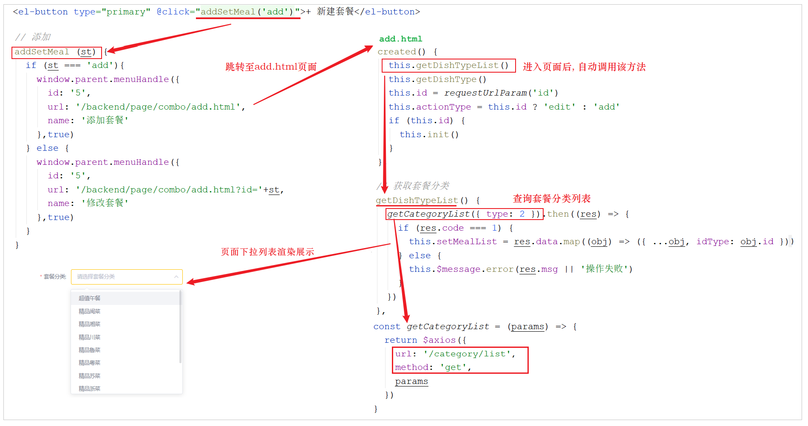
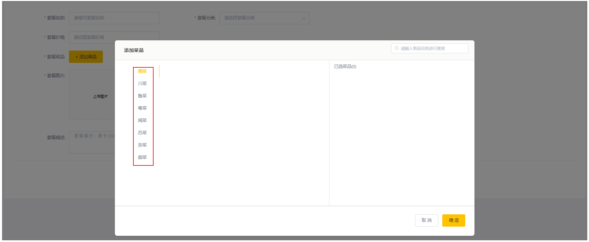
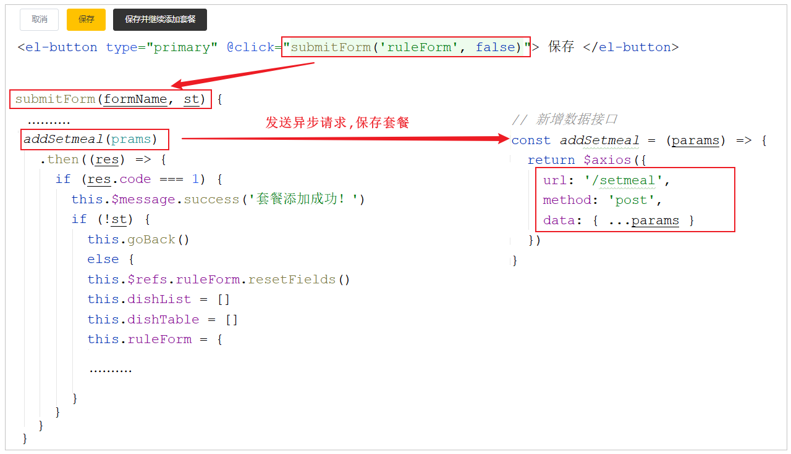
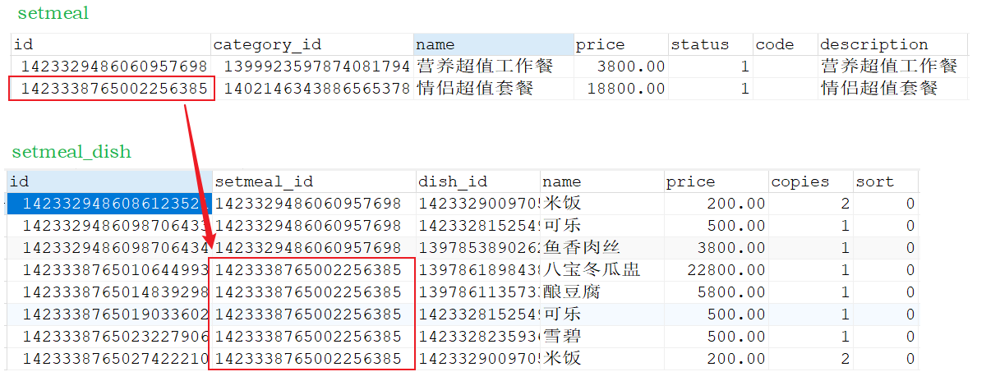
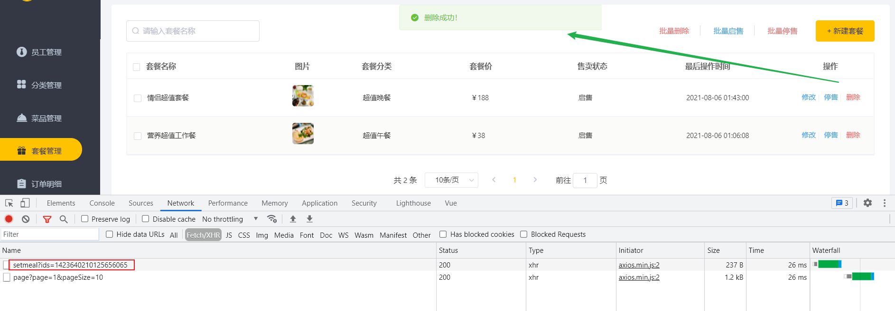
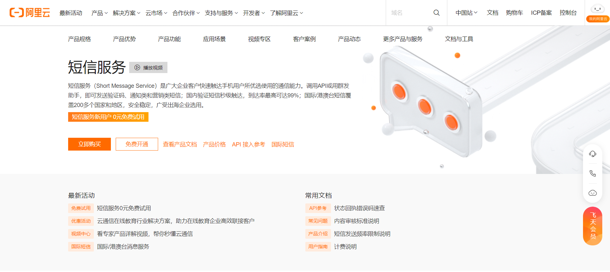
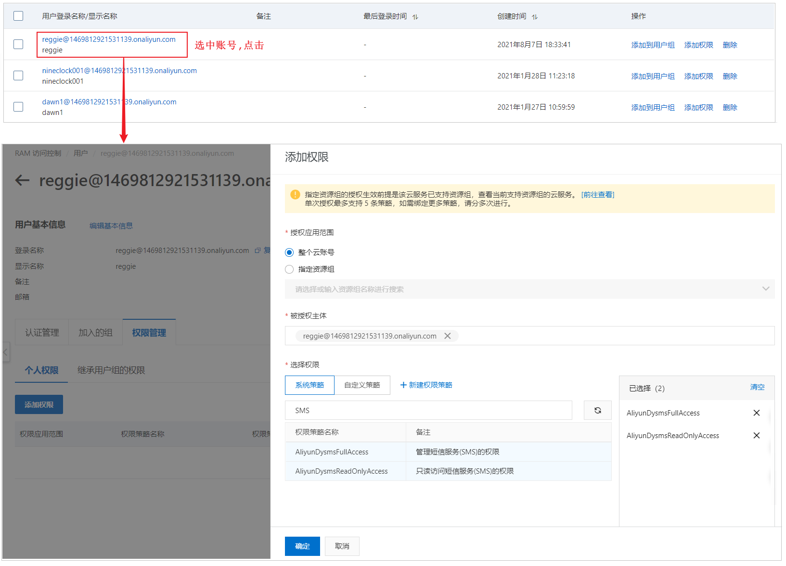
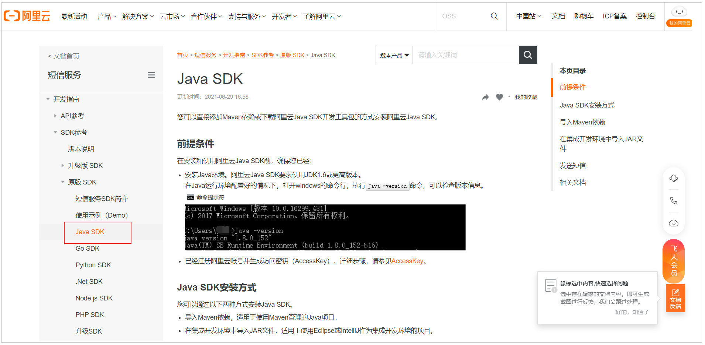

# 瑞吉外卖-第五天

## 课程内容

- 新增套餐
- 套餐分页查询
- 删除套餐


## 1. 新增套餐

### 1.1 需求分析

套餐就是菜品的集合。

后台系统中可以管理套餐信息，通过新增套餐功能来添加一个新的套餐，在添加套餐时需要选择当前套餐所属的套餐分类和包含的菜品，并且需要上传套餐对应的图片，在移动端会按照套餐分类来展示对应的套餐。

 


### 1.2 数据模型

新增套餐，其实就是将新增页面录入的套餐信息插入到setmeal表，还需要向setmeal_dish表插入套餐和菜品关联数据。所以在新增套餐时，涉及到两个表：

| 表           | 说明           | 备注                                               |
| ------------ | -------------- | -------------------------------------------------- |
| setmeal      | 套餐表         | 存储套餐的基本信息                                 |
| setmeal_dish | 套餐菜品关系表 | 存储套餐关联的菜品的信息(一个套餐可以关联多个菜品) |


两张表具体的表结构如下: 

**1). 套餐表setmeal**

 

在该表中，套餐名称name字段是不允许重复的，在建表时，已经创建了唯一索引。

 


**2). 套餐菜品关系表setmeal_dish**

 

在该表中，菜品的名称name,菜品的原价price 实际上都是冗余字段,因为我们在这张表中存储了菜品的ID(dish_id),根据该ID我们就可以查询出name,price的数据信息,而这里我们又存储了name,price,这样的话,我们在后续的查询展示操作中,就不需要再去查询数据库获取菜品名称和原价了,这样可以简化我们的操作。


### 1.3 准备工作

在开发业务功能前，先将需要用到的类和接口基本结构创建好，在做这一块儿的准备工作时，我们无需准备Setmeal的相关实体类、Mapper接口、Service接口及实现，因为之前在做分类管理的时候，我们已经引入了Setmeal的相关基础代码。 接下来，我们就来完成以下的几步准备工作： 


**1). 实体类 SetmealDish**

ps.直接从课程资料中导入即可，Setmeal实体前面课程中已经导入过了。

所属包： com.itheima.reggie.entity

```java
import com.baomidou.mybatisplus.annotation.FieldFill;
import com.baomidou.mybatisplus.annotation.TableField;
import lombok.Data;
import java.io.Serializable;
import java.math.BigDecimal;
import java.time.LocalDateTime;

/**
 * 套餐菜品关系
 */
@Data
public class SetmealDish implements Serializable {
    private static final long serialVersionUID = 1L;

    private Long id;

    //套餐id
    private Long setmealId;

    //菜品id
    private Long dishId;

    //菜品名称 （冗余字段）
    private String name;
    
    //菜品原价
    private BigDecimal price;
    
    //份数
    private Integer copies;

    //排序
    private Integer sort;

    @TableField(fill = FieldFill.INSERT)
    private LocalDateTime createTime;

    @TableField(fill = FieldFill.INSERT_UPDATE)
    private LocalDateTime updateTime;

    @TableField(fill = FieldFill.INSERT)
    private Long createUser;

    @TableField(fill = FieldFill.INSERT_UPDATE)
    private Long updateUser;

    //是否删除
    private Integer isDeleted;
}
```


**2). DTO SetmealDto**

该数据传输对象DTO,主要用于封装页面在新增套餐时传递过来的json格式的数据,其中包含套餐的基本信息,还包含套餐关联的菜品集合。直接从课程资料中导入即可。

所属包： com.itheima.reggie.dto

```java
import com.itheima.reggie.entity.Setmeal;
import com.itheima.reggie.entity.SetmealDish;
import lombok.Data;
import java.util.List;

@Data
public class SetmealDto extends Setmeal {

    private List<SetmealDish> setmealDishes;//套餐关联的菜品集合
	
    private String categoryName;//分类名称
}
```


**3). Mapper接口 SetmealDishMapper**

所属包: com.itheima.reggie.mapper

```java
import com.baomidou.mybatisplus.core.mapper.BaseMapper;
import com.itheima.reggie.entity.SetmealDish;
import org.apache.ibatis.annotations.Mapper;

@Mapper
public interface SetmealDishMapper extends BaseMapper<SetmealDish> {
}
```


**4). 业务层接口 SetmealDishService**

所属包： com.itheima.reggie.service

```java
import com.baomidou.mybatisplus.extension.service.IService;
import com.itheima.reggie.entity.SetmealDish;

public interface SetmealDishService extends IService<SetmealDish> {
}
```


**5). 业务层实现类 SetmealDishServiceImpl**

所属包： com.itheima.reggie.service.impl

```java
import com.baomidou.mybatisplus.extension.service.impl.ServiceImpl;
import com.itheima.reggie.entity.SetmealDish;
import com.itheima.reggie.mapper.SetmealDishMapper;
import com.itheima.reggie.service.SetmealDishService;
import lombok.extern.slf4j.Slf4j;
import org.springframework.stereotype.Service;

@Service
@Slf4j
public class SetmealDishServiceImpl extends ServiceImpl<SetmealDishMapper,SetmealDish> implements SetmealDishService {
}
```


**6). 控制层 SetmealController**

套餐管理的相关业务，我们都统一在 SetmealController 中进行统一处理操作。

所属包: com.itheima.reggie.controller

```java
import com.itheima.reggie.service.SetmealDishService;
import com.itheima.reggie.service.SetmealService;
import lombok.extern.slf4j.Slf4j;
import org.springframework.beans.factory.annotation.Autowired;
import org.springframework.web.bind.annotation.*;

/**
 * 套餐管理
 */
@RestController
@RequestMapping("/setmeal")
@Slf4j
public class SetmealController {
    @Autowired
    private SetmealService setmealService;
    @Autowired
    private SetmealDishService setmealDishService;
}    
```


### 1.4 前端页面分析

服务端的基础准备工作我们准备完毕之后，在进行代码开发之前，需要梳理一下新增套餐时前端页面和服务端的交互过程：

1). 点击新建套餐按钮，访问页面(backend/page/combo/add.html)，页面加载发送ajax请求，请求服务端获取**套餐分类**数据并展示到下拉框中(==已实现==)

 

获取套餐分类列表的功能我们不用开发，之前已经开发完成了，之前查询时type传递的是1，查询菜品分类; 本次查询时，传递的type为2，查询套餐分类列表。


2). 访问页面(backend/page/combo/add.html)，页面加载时发送ajax请求，请求服务端获取**菜品分类**数据并展示到添加菜品窗口中(==已实现==)

 

本次查询分类列表，传递的type为1，表示需要查询的是菜品的分类。查询菜品分类的目的，是添加套餐关联的菜品时，我们需要根据菜品分类，来过滤查询菜品信息。查询菜品分类列表的代码已经实现， 具体展示效果如下： 

  


3). 当点击添加菜品窗口左侧菜单的某一个分类, 页面发送ajax请求，请求服务端，根据菜品分类查询对应的**菜品**数据并展示到添加菜品窗口中

 


4). 页面发送请求进行**图片上传**，请求服务端将图片保存到服务器(==已实现==)

5). 页面发送请求进行**图片下载**，将上传的图片进行回显(==已实现==)

 


6). 点击保存按钮，发送ajax请求，将**套餐**相关数据以json形式提交到服务端

 


经过上述的页面解析及流程分析，我们发送这里需要发送的请求有5个，分别是 ：

A. 根据传递的参数,查询套餐分类列表

B. 根据传递的参数,查询菜品分类列表

C. 图片上传

D. 图片下载展示

E. 根据菜品分类ID,查询菜品列表

F. 保存套餐信息


而对于以上的前4个功能我们都已经实现, 所以我们接下来需要开发的功能主要是最后两项, 具体的请求信息如下:

**1). 根据分类ID查询菜品列表**

| 请求     | 说明                            |
| -------- | ------------------------------- |
| 请求方式 | GET                             |
| 请求路径 | /dish/list                      |
| 请求参数 | ?categoryId=1397844263642378242 |


**2). 保存套餐信息**

| 请求     | 说明         |
| -------- | ------------ |
| 请求方式 | POST         |
| 请求路径 | /setmeal     |
| 请求参数 | json格式数据 |

传递的json格式数据如下: 

```json
{
    "name":"营养超值工作餐",
    "categoryId":"1399923597874081794",
    "price":3800,
    "code":"",
    "image":"9cd7a80a-da54-4f46-bf33-af3576514cec.jpg",
    "description":"营养超值工作餐",
    "dishList":[],
    "status":1,
    "idType":"1399923597874081794",
    "setmealDishes":[
    	{"copies":2,"dishId":"1423329009705463809","name":"米饭","price":200},
    	{"copies":1,"dishId":"1423328152549109762","name":"可乐","price":500},
    	{"copies":1,"dishId":"1397853890262118402","name":"鱼香肉丝","price":3800}
    ]
}
```


### 1.5 代码开发

上面我们已经分析了接下来我们需要实现的两个功能，接下来我们就需要根据上述的分析，来完成具体的功能实现。


#### 1.5.1 根据分类查询菜品

##### 1.5.1.1 功能实现

在当前的需求中，我们只需要根据页面传递的菜品分类的ID(categoryId)来查询菜品列表即可，我们可以直接定义一个DishController的方法，声明一个Long类型的categoryId，这样做是没问题的。但是考虑到该方法的拓展性，我们在这里定义方法时，通过Dish这个实体来接收参数。


在DishController中定义方法list，接收Dish类型的参数：

在查询时，需要根据菜品分类categoryId进行查询，并且还要限定菜品的状态为起售状态(status为1)，然后对查询的结果进行排序。

```java
/**
* 根据条件查询对应的菜品数据
* @param dish
* @return
*/
@GetMapping("/list")
public R<List<Dish>> list(Dish dish){
    //构造查询条件
    LambdaQueryWrapper<Dish> queryWrapper = new LambdaQueryWrapper<>();   
	  queryWrapper.eq(dish.getCategoryId() != null ,Dish::getCategoryId,dish.getCategoryId());
    //添加条件，查询状态为1（起售状态）的菜品
    queryWrapper.eq(Dish::getStatus,1);
	
    List<Dish> list = dishService.list(queryWrapper);
	
    return R.success(list);
}
```


##### 1.5.1.2 功能测试

代码编写完毕，我们重新启动服务器，进行测试，可以通过debug断点跟踪的形式查看页面传递的参数封装情况，及响应给页面的数据信息。

 


#### 1.5.2 保存套餐

##### 1.5.2.1 功能实现

在进行套餐信息保存时，前端提交的数据，不仅包含套餐的基本信息，还包含套餐关联的菜品列表数据 setmealDishes。所以这个时候我们使用Setmeal就不能完成参数的封装了，我们需要在Setmeal的基本属性的基础上，再扩充一个属性 setmealDishes 来接收页面传递的套餐关联的菜品列表，而我们在准备工作中，导入进来的SetmealDto能够满足这个需求。


1). SetmealController中定义方法save，新增套餐

在该Controller的方法中,我们不仅需要保存套餐的基本信息，还需要保存套餐关联的菜品数据，所以我们需要再该方法中调用业务层方法,完成两块数据的保存。

页面传递的数据是json格式，需要在方法形参前面加上@RequestBody注解, 完成参数封装。

```java
@PostMapping
public R<String> save(@RequestBody SetmealDto setmealDto){
    log.info("套餐信息：{}",setmealDto);

    setmealService.saveWithDish(setmealDto);

    return R.success("新增套餐成功");
}
```


2). SetmealService中定义方法saveWithDish

```java
/**
 * 新增套餐，同时需要保存套餐和菜品的关联关系
 * @param setmealDto
 */
public void saveWithDish(SetmealDto setmealDto);
```


3). SetmealServiceImpl实现方法saveWithDish

具体逻辑: 

A. 保存套餐基本信息

B. 获取套餐关联的菜品集合，并为集合中的每一个元素赋值套餐ID(setmealId)

C. 批量保存套餐关联的菜品集合

代码实现: 

```java
/**
 * 新增套餐，同时需要保存套餐和菜品的关联关系
 * @param setmealDto
 */
@Transactional
public void saveWithDish(SetmealDto setmealDto) {
        // 1. 保存套餐表
        Setmeal setmeal = new Setmeal();
        // setmealDto -> setmeal
        BeanUtils.copyProperties(setmealDto, setmeal);
        this.save(setmeal);
        // 2. 保存套餐和菜品关系
        if (setmealDto.getSetmealDishes() != null
                && setmealDto.getSetmealDishes().size() > 0) {
            for (SetmealDish item : setmealDto.getSetmealDishes()) {
                item.setSetmealId(setmeal.getId());
            }
            // 保存套餐和菜品的关系
            this.setmealDishService.saveBatch(setmealDto.getSetmealDishes());
        }
}
```


##### 1.5.2.2 功能测试

代码编写完毕，我们重新启动服务器，进行测试，可以通过debug断点跟踪的形式查看页面传递的参数封装情况，及套餐相关数据的保存情况。

录入表单数据: 

 

debug跟踪数据封装:

 

跟踪数据库保存的数据:

 


## 2. 套餐分页查询

### 2.1 需求分析

系统中的套餐数据很多的时候，如果在一个页面中全部展示出来会显得比较乱，不便于查看，所以一般的系统中都会以分页的方式来展示列表数据。

 

在进行套餐数据的分页查询时，除了传递分页参数以外，还可以传递一个可选的条件(套餐名称)。查询返回的字段中，包含套餐的基本信息之外，还有一个套餐的分类名称，在查询时，需要关联查询这个字段。


### 2.2 前端页面分析

在开发代码之前，需要梳理一下套餐分页查询时前端页面和服务端的交互过程：

1). 访问页面(backend/page/combo/list.html)，页面加载时，会自动发送ajax请求，将分页查询参数(page、pageSize、name)提交到服务端，获取分页数据

 


2). 在列表渲染展示时，页面发送请求，请求服务端进行图片下载，用于页面图片展示(**已实现**)

 


而对于以上的流程中涉及到2个功能,文件下载功能我们已经实现,本小节我们主要实现列表分页查询功能, 具体的请求信息如下:

| 请求     | 说明                         |
| -------- | ---------------------------- |
| 请求方式 | GET                          |
| 请求路径 | /setmeal/page                |
| 请求参数 | ?page=1&pageSize=10&name=xxx |


### 2.3 代码开发

#### 2.3.1 分页信息查询

上述我们已经分析列表分页查询功能的请求信息，接下来我们就在SetmealController中创建套餐分页查询方法。

该方法的逻辑如下： 

1). 构造分页条件对象

2). 构建查询条件

3). 执行分页查询

4). 构建返回结果对象，并copy查询结果到该对象中

5). 遍历分页查询列表数据，把Setmeal对象转为SetmealDto对象，同时赋值分类名称

6). 封装数据并返回

> 需要注意，我们的列表中还包含分类数据，所以本次查询中也需要查询分类数据

代码实现 : 

```java
 		@GetMapping("/page")
    public R<Page<SetmealDto>> getPage(Integer page, Integer pageSize, String name) {
        // 1.构造分页条件对象
        Page<Setmeal> queryPage = new Page<>();
        queryPage.setCurrent(page);
        queryPage.setSize(pageSize);
        // 2.构建查询条件
        LambdaQueryWrapper<Setmeal> queryWrapper = new LambdaQueryWrapper<>();
        queryWrapper.like(StringUtils.isNotBlank(name), Setmeal::getName, name);
        // 3.执行分页条件查询
        Page<Setmeal> setmealPage = this.service.page(queryPage, queryWrapper);
        // 4.构建返回结果对象，并copy查询结果到该对象中
        Page<SetmealDto> result = new Page<>();
        BeanUtils.copyProperties(setmealPage, result);
        // 5.遍历分页查询列表数据,把Setmeal对象转为SetmealDto对象,同时赋值分类名称
        List<SetmealDto> setmealDtoList = new ArrayList<>();
        for (Setmeal item : setmealPage.getRecords()) {
            SetmealDto dto = new SetmealDto();
            BeanUtils.copyProperties(item, dto);
            Category category = categoryService.getById(item.getCategoryId());
            if (category != null) {
                dto.setCategoryName(category.getName());
            }
            setmealDtoList.add(dto);
        }
        // 6.封装数据并返回
        result.setRecords(setmealDtoList);
        return R.success(result);
    }
```


### 2.4 功能测试

代码完善后，重启服务，测试列表查询，我们发现, 抓取浏览器的请求响应数据，我们可以获取到套餐分类名称categoryName，也可以在列表页面展示出来 。

 


## 3. 删除套餐

### 3.1 需求分析

在套餐管理列表页面,点击删除按钮，可以删除对应的套餐信息。也可以通过复选框选择多个套餐，点击批量删除按钮一次删除多个套餐。注意，对于状态为售卖中的套餐不能删除，需要先停售，然后才能删除。

 


### 3.2 前端页面分析

在开发代码之前，需要梳理一下删除套餐时前端页面和服务端的交互过程：

1). 点击删除, 删除单个套餐时，页面发送ajax请求，根据套餐id删除对应套餐

 


2). 删除多个套餐时，页面发送ajax请求，根据提交的多个套餐id删除对应套餐

 


开发删除套餐功能，其实就是在服务端编写代码去处理前端页面发送的这2次请求即可，一次请求为根据ID删除，一次请求为根据ID批量删除。

观察删除单个套餐和批量删除套餐的请求信息可以发现，两种请求的**地址**和**请求方式**都是相同的，不同的则是传递的id个数，所以在服务端可以提供一个方法来统一处理。

具体的请求信息如下： 

| 请求     | 说明                                         |
| -------- | -------------------------------------------- |
| 请求方式 | DELETE                                       |
| 请求路径 | /setmeal                                     |
| 请求参数 | ?ids=1423640210125656065,1423338765002256385 |


### 3.3 代码开发

删除套餐的流程及请求信息，我们分析完毕之后，就来完成服务端的逻辑开发。在服务端的逻辑中, 删除套餐时, 我们不仅要删除套餐, 还要删除套餐与菜品的关联关系。


**1). 在SetmealController中创建delete方法**

我们可以先测试在delete方法中接收页面提交的参数，具体逻辑后续再完善：

```java
/**
 * 删除套餐
 * @param ids
 * @return
 */
@DeleteMapping
public R<String> delete(@RequestParam List<Long> ids){
    log.info("ids:{}",ids);
    return R.success("套餐数据删除成功");
}
```

编写完代码，我们重启服务之后，访问套餐列表页面，勾选复选框，然后点击"批量删除",我们可以看到服务端可以接收到集合参数ids，并且在控制台也可以输出对应的数据 。

 


**2). SetmealService接口定义方法removeWithDish**

```java
/**
 * 删除套餐，同时需要删除套餐和菜品的关联数据
 * @param ids
 */
public void removeWithDish(List<Long> ids);
```


**3). SetmealServiceImpl中实现方法removeWithDish**

该业务层方法具体的逻辑为: 

A. 查询该批次套餐中是否存在售卖中的套餐, 如果存在, 不允许删除

B. 删除套餐数据

C. 删除套餐关联的菜品数据

代码实现为:

```java
/**
* 删除套餐，同时需要删除套餐和菜品的关联数据
* @param ids
*/
@Transactional
public void removeWithDish(List<Long> ids) {
    //select count(*) from setmeal where id in (1,2,3) and status = 1
    //查询套餐状态，确定是否可用删除
    LambdaQueryWrapper<Setmeal> queryWrapper = new LambdaQueryWrapper();
    queryWrapper.in(Setmeal::getId,ids);
    queryWrapper.eq(Setmeal::getStatus,1);

    int count = this.count(queryWrapper);
    if(count > 0){
   	 	//如果不能删除，抛出一个业务异常
    	throw new CustomException("套餐正在售卖中，不能删除");
    }

    //如果可以删除，先删除套餐表中的数据---setmeal
    this.removeByIds(ids);

    //delete from setmeal_dish where setmeal_id in (1,2,3)
    LambdaQueryWrapper<SetmealDish> lambdaQueryWrapper = new LambdaQueryWrapper<>();
    lambdaQueryWrapper.in(SetmealDish::getSetmealId,ids);
    //删除关系表中的数据----setmeal_dish
    setmealDishService.remove(lambdaQueryWrapper);
}
```


由于当前的业务方法中存在多次数据库操作，为了保证事务的完整性，需要在方法上加注解 @Transactional 来控制事务。


**4). 完善SetmealController代码**

```java
/**
 * 删除套餐
 * @param ids
 * @return
 */
@DeleteMapping
public R<String> delete(@RequestParam List<Long> ids){
    log.info("ids:{}",ids);
    setmealService.removeWithDish(ids);
    return R.success("套餐数据删除成功");
}
```


### 3.4 功能测试

代码完善后，重启服务，测试套餐的删除功能，主要测试以下几种情况。

1). 删除正在启用的套餐

 


2). 执行批量操作, 删除两条记录, 一个启售的, 一个停售的

由于当前我们并未实现启售/停售功能，所以我们需要手动修改数据库表结构的status状态，将其中的一条记录status修改为0。

 


3). 删除已经停售的套餐信息，执行删除之后， 检查数据库表结构 setmeal ， setmeal_dish表中的数据

 


# 瑞吉外卖-短信业务

## 课程内容

- 短信发送
- 手机验证码登录

## 短信发送

 

在我们接下来要实现的移动端的业务开发中，第一块儿我们需要开发的功能就是移动端的登录功能，而移动端的登录功能，比较流行的方式就是基于短信验证码进行登录，那么这里涉及到了短信发送的知识，所以本章节，我们就来讲解，在项目开发中，我们如何发送短信。


### 1 短信服务介绍

在项目中，如果我们要实现短信发送功能，我们无需自己实现，也无需和运营商直接对接，只需要调用第三方提供的短信服务即可。目前市面上有很多第三方提供的短信服务，这些第三方短信服务会和各个运营商（移动、联通、电信）对接，我们只需要注册成为会员，并且按照提供的开发文档进行调用就可以发送短信。需要说明的是，这些短信服务一般都是收费服务。

常用短信服务：

- 阿里云

- 华为云

- 腾讯云

- 京东

- 梦网

- 乐信

本项目在选择短信服务的第三方服务提供商时，选择的是阿里云短信服务。


### 2 阿里云短信服务介绍

阿里云短信服务（Short Message Service）是广大企业客户快速触达手机用户所优选使用的通信能力。调用API或用群发助手，即可发送验证码、通知类和营销类短信；国内验证短信秒级触达，到达率最高可达99%；国际/港澳台短信覆盖200多个国家和地区，安全稳定，广受出海企业选用。

应用场景： 

| 场景     | 案例                                                         |
| -------- | ------------------------------------------------------------ |
| 验证码   | APP、网站注册账号，向手机下发验证码； 登录账户、异地登录时的安全提醒； 找回密码时的安全验证； 支付认证、身份校验、手机绑定等。 |
| 短信通知 | 向注册用户下发系统相关信息，包括： 升级或维护、服务开通、价格调整、 订单确认、物流动态、消费确认、 支付通知等普通通知短信。 |
| 推广短信 | 向注册用户和潜在客户发送通知和推广信息，包括促销活动通知、业务推广等商品与活动的推广信息。增加企业产品曝光率、提高产品的知名度。 |

 

 

阿里云短信服务官方网站： https://www.aliyun.com/product/sms?spm=5176.19720258.J_8058803260.52.5c432c4a11Dcwf

可以访问官网，熟悉一下短信服务： 

  


### 3 阿里云短信服务准备

####   1 注册账号

阿里云官网：https://www.aliyun.com/

 

点击官网首页注册按钮，跳转到如下注册页面：

 


当我们把账号注册完毕之后，我们就可以登录到阿里云系统控制台。


####   2 开通短信服务

注册成功后，点击登录按钮进行登录。登录后进入控制台, 在左上角的菜单栏中搜索短信服务。第一次使用，需要点击，并开通短信服务。

 

 


####   3 设置短信签名

开通短信服务之后，进入短信服务管理页面，选择国内消息菜单，我们需要在这里添加短信签名。

 


**那么什么是短信签名呢?**

短信签名是短信发送者的署名，表示发送方的身份。我们要调用阿里云短信服务发送短信，签名是比不可少的部分。

 


那么接下来，我们就需要来添加短信签名。

 

> <font color='red'>注意：</font> 
>
> ​	<font color='red'>目前，阿里云短信服务申请签名主要针对企业开发，个人申请时有一定难度的，在审核时，会审核资质，需要上传营业执照 ；</font> 
>
> ​	<font color='red'>所以，我们课程中，主要是演示一下短信验证码如何发送，大家只需要学习这块儿的开发流程、实现方式即可，无需真正的发送短信。如果以后在企业中做项目，需要发送短信，我们会以公司的资质去申请对应的签名。</font> 

####   4 设置短信模板

切换到【模板管理】标签页：

 


**那么什么是模板呢?**

短信模板包含短信发送内容、场景、变量信息。模板的详情如下:

 

最终我们，给用户发送的短信中，具体的短信内容，就是上面配置的这个模板内容，将${code}占位符替换成对应的验证码数据即可。如下:

```
【xxxxx】您好,您的验证码为173822,5分钟之内有效,不要泄露给他人!
```

我们可以点击右上角的按钮,添加模板,然后填写模板的基本信息及设置的模板内容:

 

<font color='red'>添加的短信模板，也是需要进行审核的只有审核通过，才可以正常使用。</font>


####   5 设置AccessKey

AccessKey 是访问阿里云 API 的密钥，具有账户的完全权限，我们要想在后面通过API调用阿里云短信服务的接口发送短信，那么就必须要设置AccessKey。

我们点击右上角的用户头像，选择"AccessKey管理"，这时就可以进入到AccessKey的管理界面。


进入到AccessKey的管理界面之后，提示两个选项 "继续使用AccessKey" 和 "开始使用子用户AccessKey"，两个区别如下:

**1). 继续使用AccessKey**

如果选择的是该选项，我们创建的是阿里云账号的AccessKey，是具有账户的完全权限，有了这个AccessKey以后，我们就可以通过API调用阿里云的服务，不仅是短信服务，其他服务(OSS，语音服务，内容安全服务，视频点播服务...等)也可以调用。 相对来说，并不安全，当前的AccessKey泄露，会影响到我当前账户的其他云服务。

 

**2). 开始使用子用户AccessKey**

可以创建一个子用户,这个子用户我们可以分配比较低的权限,比如仅分配短信发送的权限，不具备操作其他的服务的权限，即使这个AccessKey泄漏了,也不会影响其他的云服务, 相对安全。


接下来就来演示一下，如何创建子用户AccessKey。

 


####   6 配置权限

上述我们已经创建了子用户, 但是这个子用户,目前没有任何权限,接下来,我们需要为创建的这个用户来分配权限。

 

<font color='red'>经过上述的权限配置之后，那么新创建的这个 reggie 用户，仅有短信服务操作的权限，不具备别的权限，即使当前的AccessKey泄漏了，也只会影响短信服务，其他服务是不受影响的。</font>


####   7 禁用/删除AccessKey

如果在使用的过程中 AccessKey 不小心泄漏了,我们可以在阿里云控制台中, 禁用或者删除该AccessKey。

 

然后再创建一个新的AccessKey, 保存好AccessKeyId和AccessKeySecret。

 

注意： 创建好了AccessKey后，请及时保存AccessKeyId 和 AccessKeySecret ，弹窗关闭后将无法再次获取该信息，但您可以随时创建新的 AccessKey。

#### 8 代码开发

使用阿里云短信服务发送短信，可以参照官方提供的文档即可。

官方文档: https://help.aliyun.com/product/44282.html?spm=5176.12212571.help.dexternal.57a91cbewHHjKq

 

我们根据官方文档的提示，引入对应的依赖，然后再引入对应的java代码，就可以发送消息了。

 

> SDK : SDK 就是 Software Development Kit 的缩写，翻译过来——软件开发工具包，辅助开发某一类软件的相关文档、范例和工具的集合都可以叫做SDK。在我们与第三方接口相互时， 一般都会提供对应的SDK，来简化我们的开发。


**具体实现：**

1). pom.xml

```xml
<dependency>
    <groupId>com.aliyun</groupId>
    <artifactId>aliyun-java-sdk-core</artifactId>
    <version>4.5.16</version>
</dependency>
<dependency>
    <groupId>com.aliyun</groupId>
    <artifactId>aliyun-java-sdk-dysmsapi</artifactId>
    <version>2.1.0</version>
</dependency>
```


2). 将官方提供的main方法封装为一个工具类 （utils包中）

```java
import com.aliyuncs.DefaultAcsClient;
import com.aliyuncs.IAcsClient;
import com.aliyuncs.dysmsapi.model.v20170525.SendSmsRequest;
import com.aliyuncs.dysmsapi.model.v20170525.SendSmsResponse;
import com.aliyuncs.exceptions.ClientException;
import com.aliyuncs.profile.DefaultProfile;

/**
 * 短信发送工具类
 */
public class SMSUtils {
	public static void sendMessage(String signName,
								   String templateCode,String phoneNumbers,String param){
		DefaultProfile profile = DefaultProfile
			.getProfile("cn-hangzhou",
				"",
				"");
		IAcsClient client = new DefaultAcsClient(profile);

		SendSmsRequest request = new SendSmsRequest();
		request.setSysRegionId("cn-hangzhou");
		request.setPhoneNumbers(phoneNumbers);
		request.setSignName(signName);
		request.setTemplateCode(templateCode);
		request.setTemplateParam("{\"code\":\""+param+"\"}");
		try {
			SendSmsResponse response = client.getAcsResponse(request);
			System.out.println(response.getMessage());
			if(response.getMessage().contains("OK")){
				System.out.println("短信发送成功");
			}
		}catch (ClientException e) {
			e.printStackTrace();
		}
	}
}
```

> 备注 : 由于我们个人目前无法申请阿里云短信服务，所以这里我们只需要把流程跑通，具体的短信发送可以实现。

##  手机验证码登录

### 1 需求分析

为了方便用户登录，移动端通常都会提供通过手机验证码登录的功能。手机验证码登录有如下优点：

1). 方便快捷，无需注册，直接登录

2). 使用短信验证码作为登录凭证，无需记忆密码

3). 安全

  


**登录流程：**

输入手机号 > 获取验证码 > 输入验证码 > 点击登录 > 登录成功

> 注意：通过手机验证码登录，手机号是区分不同用户的标识。


### 2 数据模型

通过手机验证码登录时，涉及的表为user表，即用户表。结构如下:

 


### 3 前端页面分析

在开发代码之前，需要梳理一下登录时前端页面和服务端的交互过程：

1). 在登录页面(front/page/login.html)输入手机号，点击【获取验证码】按钮，页面发送ajax请求，在服务端调用短信服务API给指定手机号发送验证码短信。

 


2). 在登录页面输入验证码，点击【登录】按钮，发送ajax请求，在服务端处理登录请求。

 

如果服务端返回的登录成功，页面将会把当前登录用户的手机号存储在sessionStorage中，并跳转到移动的首页页面。


开发手机验证码登录功能，其实就是在服务端编写代码去处理前端页面发送的这2次请求即可，分别是获取短信验证码 和 登录请求，具体的请求信息如下： 

1). 获取短信验证码

| 请求     | 说明                    |
| -------- | ----------------------- |
| 请求方式 | POST                    |
| 请求路径 | /user/sendMsg           |
| 请求参数 | {"phone":"13100001111"} |


2). 登录

| 请求     | 说明                                   |
| -------- | -------------------------------------- |
| 请求方式 | POST                                   |
| 请求路径 | /user/login                            |
| 请求参数 | {"phone":"13100001111", "code":"1111"} |

### 4 代码开发

####   1 准备工作

在开发业务功能前，先将需要用到的类和接口基本结构创建好：

1). 实体类 User（直接从课程资料中导入即可）

所属包: com.itheima.reggie.entity

```java
import lombok.Data;
import java.io.Serializable;
/**
 * 用户信息
 */
@Data
public class User implements Serializable {
    private static final long serialVersionUID = 1L;

    private Long id;

    //姓名
    private String name;

    //手机号
    private String phone;

    //性别 0 女 1 男
    private String sex;

    //身份证号
    private String idNumber;

    //头像
    private String avatar;

    //状态 0:禁用，1:正常
    private Integer status;
}
```


2). Mapper接口 UserMapper

所属包: com.itheima.reggie.mapper

```java
import com.baomidou.mybatisplus.core.mapper.BaseMapper;
import com.itheima.reggie.entity.User;
import org.apache.ibatis.annotations.Mapper;

@Mapper
public interface UserMapper extends BaseMapper<User>{
}
```


3). 业务层接口 UserService

所属包: com.itheima.reggie.service

```java
import com.baomidou.mybatisplus.extension.service.IService;
import com.itheima.reggie.entity.User;

public interface UserService extends IService<User> {
}
```


4). 业务层实现类 UserServiceImpl

所属包: com.itheima.reggie.service.impl

```java
import com.baomidou.mybatisplus.extension.service.impl.ServiceImpl;
import com.itheima.reggie.entity.User;
import com.itheima.reggie.mapper.UserMapper;
import com.itheima.reggie.service.UserService;
import org.springframework.stereotype.Service;

@Service
public class UserServiceImpl extends ServiceImpl<UserMapper,User> implements UserService{
}
```


5). 控制层 UserController

所属包: com.itheima.reggie.controller

```java
import com.itheima.reggie.service.UserService;
import lombok.extern.slf4j.Slf4j;
import org.springframework.beans.factory.annotation.Autowired;
import org.springframework.web.bind.annotation.RequestMapping;
import org.springframework.web.bind.annotation.RestController;

@RestController
@RequestMapping("/user")
@Slf4j
public class UserController {
    @Autowired
    private UserService userService;
}
```


6). 工具类SMSUtils、ValidateCodeUtils（直接从课程资料中导入即可）

所属包: com.itheima.reggie.utils

 

SMSUtils : 是我们上面改造的阿里云短信发送的工具类 ;

ValidateCodeUtils : 是验证码生成的工具类 ;


####   2 功能实现

基本步骤：

1.修改LoginCheckFilter

​    放行登录页面及把登录后的用户ID放入ThreadLocal

2.发送短信验证码

3.验证码登录

```
1). 获取前端传递的手机号和验证码
2). 从Session中获取到手机号对应的正确的验证码
3). 进行验证码的比对 , 如果比对失败, 直接返回错误信息
4). 如果比对成功, 需要根据手机号查询当前用户,
    如果用户不存在, 则自动注册一个新用户
5). 将登录用户的ID存储Session中
```


#####   2.1 修改LoginCheckFilter

前面我们已经完成了LoginCheckFilter过滤器的开发，此过滤器用于检查用户的登录状态。我们在进行手机验证码登录时，发送的两个请求(获取验证码和登录)需要在此过滤器处理时直接放行。

 


对于移动的端的页面，也是用户登录之后，才可以访问的，那么这个时候就需要在 LoginCheckFilter 中进行判定，如果移动端用户已登录，我们获取到用户登录信息，存入ThreadLocal中(在后续的业务处理中，如果需要获取当前登录用户ID，直接从ThreadLocal中获取)，然后放行。

如下逻辑: 

```java
//4-2、判断登录状态，如果已登录，则直接放行
if(request.getSession().getAttribute("user") != null){
    log.info("用户已登录，用户id为：{}",request.getSession().getAttribute("user"));

    Long userId = (Long) request.getSession().getAttribute("user");
    BaseContext.setCurrentId(userId);

    filterChain.doFilter(request,response);
    return;
}
```


#####   2.2 发送短信验证码

在UserController中创建方法，处理登录页面的请求，为指定手机号发送短信验证码，同时需要将手机号对应的验证码保存到Session，方便后续登录时进行比对。

```java
/**
 * 发送手机短信验证码
 * @param user
 * @return
 */
@PostMapping("/sendMsg")
public R<String> sendMsg(@RequestBody User user, HttpSession session){
    //获取手机号
    String phone = user.getPhone();
    if(StringUtils.isNotEmpty(phone)){
        //生成随机的4位验证码
        String code = ValidateCodeUtils.generateValidateCode(4).toString();
        log.info("code={}",code);
			
        //调用阿里云提供的短信服务API完成发送短信
        //SMSUtils.sendMessage("瑞吉外卖","",phone,code);
		
        //需要将生成的验证码保存到Session
        session.setAttribute(phone,code);
        return R.success("手机验证码短信发送成功");
    }
    return R.error("短信发送失败");
}
```

> <font color='red'>备注: </font>
>
> ​	<font color='red'>这里发送短信我们只需要调用封装的工具类中的方法即可，我们这个功能流程跑通，在测试中我们不用真正的发送短信，只需要将验证码信息，通过日志输出，登录时，我们直接从控制台就可以看到生成的验证码(实际上也就是发送到我们手机上的验证码)</font>


#####   2.3 验证码登录

在UserController中增加登录的方法 login，该方法的具体逻辑为： 

1). 获取前端传递的手机号和验证码

2). 从Session中获取到手机号对应的正确的验证码

3). 进行验证码的比对 , 如果比对失败, 直接返回错误信息

4). 如果比对成功, 需要根据手机号查询当前用户, 如果用户不存在, 则自动注册一个新用户

5). 将登录用户的ID存储Session中


具体代码实现: 

```java
/**
 * 移动端用户登录
 * @param map
 * @param session
 * @return
 */
@PostMapping("/login")
public R<User> login(@RequestBody Map map, HttpSession session){
    log.info(map.toString());
    //获取手机号
    String phone = map.get("phone").toString();
    //获取验证码
    String code = map.get("code").toString();
    //从Session中获取保存的验证码
    Object codeInSession = session.getAttribute(phone);

    //进行验证码的比对（页面提交的验证码和Session中保存的验证码比对）
    if(codeInSession != null && codeInSession.equals(code)){
        //如果能够比对成功，说明登录成功

        LambdaQueryWrapper<User> queryWrapper = new LambdaQueryWrapper<>();
        queryWrapper.eq(User::getPhone,phone);

        User user = userService.getOne(queryWrapper);
        if(user == null){
            //判断当前手机号对应的用户是否为新用户，如果是新用户就自动完成注册
            user = new User();
            user.setPhone(phone);
            user.setStatus(1);
            userService.save(user);
        }
        session.setAttribute("user",user.getId());
        return R.success(user);
    }
    return R.error("登录失败");
}
```

### ==***★★对象赋值要在不为null或是一个新对象为前提下才能修改值★★***==

对象是空的;你看着这个对象是有的,但是它在内存中系统没有给它分配对象;就比如你有一个杯子,然后你想往里面倒水;但是现在这个杯子都不存在;那你怎么倒水？,所以就为null了;这也是为什么要new一个对象的原因

### 5 功能测试

代码完成后，重启服务，测试短信验证码的发送及登录功能。

1). 测试错误验证码的情况

 


2). 测试正确验证码的情况

 

检查user表，用户的数据也插入进来了： 

 


