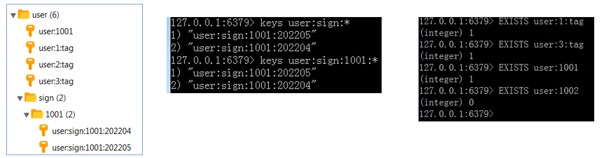

# Redis基础

## 课程内容

- Redis入门
- Redis数据类型
- Redis常用命令
- 在Java中操作Redis


## 1. 前言

NoSQL产品

NoSQL(NoSQL = Not Only SQL)，意即“不仅仅是SQL”，是一项全新的数据库理念，泛指非关系型的数据库。NoSql数据库并不是要取代关系型数据库，而是关系型数据库的补充。


​                     


### 1.1 什么是Redis

​     Redis是一个基于**内存**的key-value结构数据库。

​     官网：[https://redis.io](https://redis.io/)

​    The open source, in-memory data store used by millions of developers as a database, cache, streaming engine, and message broker. 翻译为：开源内存数据存储，被数百万开发人员用作数据库、缓存、流媒体引擎和消息代理。Redis 是互联网技术领域使用最为广泛的存储中间件，它是「**Re**mote **Di**ctionary **S**ervice」的首字母缩写，也就是「远程字典服务」。

Redis是用C语言开发的一个开源的高性能键值对(key-value)数据库，官方提供测试数据，50个并发执行100000+QPS(每秒内查询次数),读的速度是110000次/s,写的速度是81000次/s 。它存储的value类型比较丰富，也被称为结构化的NoSql数据库。


### 2.2 Redis下载与

- [ ] 基于内存存储，读写性能高


- [ ] 企业应用广泛


### 1.2 使用Redis能做什么

- 缓存（热门数据、短连接、新闻首页、商品首页等等）
- 应用排行榜(武力排行榜,输出排行榜DPS)
- 任务队列。（秒杀、抢购、12306等等）
- 聊天室的在线好友列表
- 网站访问统计
- 数据过期处理（可以精确到毫秒）
- 分布式集群架构中的session分离
- 分布式锁
- 分布式计数器


Redis在秒杀场景：https://blog.csdn.net/ggh0314/article/details/118405957


其他场景：：https://baijiahao.baidu.com/s?id=1710209756473607320&wfr=spider&for=pc


### ==面试1.3 Redis快的原因==

**1.基于内存实现**

​     Redis 是基于内存的数据库，那不可避免的就要与磁盘数据库做对比。对于磁盘数据库来说，是需要将数据读取到内存里的，这个过程会受到磁盘 I/O 的限制。

​     而对于内存数据库来说，本身数据就存在于内存里，也就没有了这方面的开销。


**2.高效的数据结构**

​    redis 中有多种数据类型，每种数据类型的底层都由一种或多种数据结构来支持。正是因为有了这些数据结构，Redis 在存储与读取上的速度才不受阻碍。


string key value都是 利用自增 存放商品ID 品牌ID
hash key是string value是map 存储购物车
list 双向链表 插入顺序排序可重复 商品评论
set 不重复无序 共同好友
zset 不重复 有序，集合给每个元素设置分数，此为排序依据 排行榜（根据分数）

3.**单线程，网络采用I/O多路复用模型**

​    Redis 是单线程的，Redis 中使用了 Reactor 单线程模型。单线程在执行过程中不需要进行上下文切换，减少了耗时。生产环境中的使用，通常是多个客户端连接 Redis，然后各自发送命令至 Redis 服务器，最后服务端处理这些请求返回结果。应对大量的请求，Redis 中使用 I/O 多路复用程序同时监听多个套接字，并将这些事件推送到一个队列里，然后逐个被执行。最终将结果返回给客户端。


redis采用的是单线程+IO多路用技术。这里单线程指的是redis中读写操作和网络IO使用的是由一个线程来完成，但是其他操作是有其他线程完成，例如持久化操作。单线程既可以简化数据结构和算法的实现，同时也消除了线程切换和锁竞争所带来的消耗。redis中采用的IO多路复用技术实现了单线程下同时处理多个IO请求。

redis为什么这么快：

1.单线程进行读写操作，避免线程切换和锁竞争带来的消耗。

2：redis操作是在内存中进行的。

3.最重要的就是：采用了IO多路复用技术，实现了在网络IO中能够处理大量并发请求，实现高吞吐率。

## 2. Redis安装

### 2.1 Redis下载

Redis安装包分为windows版和Linux版：

- Windows版下载地址：https://github.com/microsoftarchive/redis/releases
- Linux版下载地址： https://download.redis.io/releases/ 

下载后得到下面安装包：

  

zip:windows安装文件

tar.gz:linux安装文件

### 2.2 Windows中Redis安装与启动

#### **1. 安装Redis**

Redis的Windows版属于绿色软件，直接解压即可使用，解压后目录结构如下：


备注：redis.bat官方不带这个文件，是自己编写的启动文件。

#### 2. Redis服务启动、停止与连接

以下是windows平台。

1.直接启动：双击redis-server.exe即可启动Redis服务，redis服务默认端口号为6379

但这种启动方式看不到启动的日志，一般找到安装目录，进入cmd，执行如下：

```
redis-server redis.windows.conf
```

2.快速启动：双击redis.bat文件（这个文件存储了以上执行命令，为了启动方便）


3.关闭服务器

​    关闭黑色的日志窗口即可停止服务器。

4.客户端连接服务器

双击redis-cli.exe即可启动Redis客户端，默认连接的是本地的Redis服务，而且不需要认证即可连接成功。


如果服务器设置了密码登录，需要cmd通过命令参数进入：

```
redis-cli.exe –h ip –p 端口 –a 密码 （如果没有设置密码登录，此处需要忽略参数或随便输入密码）
```


退出连接：在命令行输入exit或者quit命令后直接回车即可。


#### 3. Redis配置文件

前面我们已经启动了Redis服务，默认情况下Redis启动后是在前台运行，而且客户端不需要密码就可以连接到Redis服务。如果我们希望Redis服务启动后是在后台运行，同时希望客户端认证通过后才能连接到Redis服务，应该如果做呢？

Redis的配置文件：redis.windows.conf

**通过修改Redis配置文件可以进行如下配置：**

**1）**设置Redis服务后台运行

​	将配置文件中的==daemonize==配置项改为yes，默认值为no。

​	注意：Windows版的Redis不支持后台运行。

**2）**设置Redis服务密码

​	将配置文件中的 ==# requirepass foobared== 配置项取消注释，默认为注释状态。

​    foobared为密码，可以根据情况自己指定，一般远程连接时需要设置密码

**3）**设置允许客户端远程连接Redis服务

​	Redis服务默认只能客户端本地连接，不允许客户端远程连接。

​     将配置文件中的 ==bind 127.0.0.1== 配置项注释掉。

**解释说明：**

> Redis配置文件中 ==#== 表示注释
>
> Redis配置文件中的配置项前面不能有空格，需要顶格写
>
> daemonize：用来指定redis是否要用守护线程的方式启动，设置成yes时，代表开启守护进程模式。在该模式下，redis会在后台运行
>
> requirepass：设置Redis的连接密码
>
> bind：如果指定了bind，则说明只允许来自指定网卡的Redis请求。如果没有指定，就说明可以接受来自任意一个网卡的Redis请求。

### 2.3 Linux安装Redis

在Linux系统安装Redis步骤【项目部署时安装】：

1. 将Redis安装包上传到Linux

2. 解压安装包

   命令：tar -xvf redis-3.2.9.tar.gz -C /usr/local

3. 安装Redis的依赖环境gcc【已安装，可跳过】

   命令：yum install gcc-c++

4. 进入解压后的redis目录下的src目录（/usr/local/redis-3.2.9），进行编译

   命令：make

5. 进入redis的src目录进行安装

   命令：make install 

   如果无效，可按如下操作

   ```shell
   cd /usr/local/redis-3.2.9
   mkdir bin 
   cp ./src/redis-server ./bin
   cp ./src/redis-cli ./bin
   cp ./redis.conf ./bin
   ```

6. 启动服务

   ```shell
   # 进入bin目录
   cd bin
   # 启动
   ./redis-server
   ```

7. 其他指令与配置

   ```shell
   #1. 后台运行 指令后面带 & 代表后台运行
   ./redis-server &  
   #2.使用vi编辑，打开redis.conf文件 （以下是在配置文件中修改）
   =========================================
   # 运行远程访问 
   # 注释如下这行，目前仅运行127.0.0.1访问
   bind 127.0.0.1
   #  开启密码访问模式
   requirepass pass
   =======================================
   #3. 指定配置文件，启动redis    
   ./redis-server redis.conf & 
   
   #4. 启动redis客户端和关闭服务器
   ./redis-cli
   ./redis-cli shutdown
   ```

8. 开放端口

   ```shell
   #开放端口
   firewall-cmd --zone=public --add-port=6379/tcp --permanent
   #重新加载配置
   firewall-cmd --reload
   #查看是否有nginx的线程是否存在
   ps -ef | grep nginx
   netstat -an -t -u | grep 6379
   ```

## 3. Redis数据类型

### 3.1 介绍

redis是一种高级的key-value的存储系统，其中key是字符串类型，value有5种常用的数据类型：

- 字符串（String）<String,String>
- 哈希（hash）      <String,<String,String>>   <String,Map>  
- 字符串列表（list）<String,List<String>>
- 字符串集合（set）<String,Set<String>>
- 有序字符串集合（sorted set）<String,SortedSet<String>>

关于key的定义，注意如下几点：

- key不要太长，最好不要操作1024个字节，这不仅会消耗内存还会降低查找效率

  categorys  products  aa_bb_cc    

- key不要太短，如果太短会降低key的可读性 

- 在项目中，key最好有一个统一的命名规范，一般看业务场景，根据团队要求。


**解释说明：**

> 字符串(string)：普通字符串，常用
>
> 哈希(hash)：适合存储对象
>
> 列表(list)：按照插入顺序排序，可以有重复元素
>
> 集合(set)：无序集合，没有重复元素
>
> 有序集合(sorted set / zset)：集合中每个元素关联一个分数（score），根据分数升序排序，没有重复元素

## 4. Redis常用命令

### 4.1 字符串string操作命令

字符串类型是Redis中最为基础的数据存储类型，它在Redis中是二进制安全的，这便意味着该类型存入和获取的数据相同。在Redis中字符串类型的Value最多可以容纳的数据长度是==***512M***==。

Redis 中字符串类型常用命令：

- **SET** key value 					         设置指定key的值

- **GET** key                                        获取指定key的值

- **SETEX** key seconds value         设置指定key的值，并将 key 的过期时间设为 seconds 秒

- **SETNX** key value 只有在 key    不存在时设置 key 的值

  

-  incr命令   自增
-  decr命令   自减
-   incrby key step  自增步数
-   decrby key step  自减步数


  

- **SETBIT** key offset value  设置Key，对应的Value第N个二进制位，标记0或1
- **GETBIT** key offset  获取Key，对应的Value第N个二进制位的状态
- **BITCOUNT** key [start end]   统计Key，对应的Value对应的第N个字节的二进制数量，1为有效

以下是关于员工1001在4月、5月份的签到记录。0代表是第1天，1代表


 

更多命令可以参考Redis中文网：https://www.redis.net.cn

### ==面试题，节省空间==

采用二进制位，签到

### 4.2 哈希hash操作命令

​    Redis中的Hash类型可以看成具有String Key和String Value的map容器，hash特别适合用于存储对象数据。所以该类型非常适合于存储值对象的信息。如Username、Password和Age等。如果Hash中包含很少的字段，那么该类型的数据也将仅占用很少的磁盘空间。每一个Hash可以存储4294967295（2^32-1, 40多亿）个键值对。

常用命令：

- **HSET** key field value             将哈希表 key 中的字段 field 的值设为 value
- **HGET** key field                       获取存储在哈希表中指定字段的值
- **HDEL** key field                       删除存储在哈希表中的指定字段
- **HKEYS** key                              获取哈希表中所有字段
- **HVALS** key                              获取哈希表中所有值
- **HGETALL** key                         获取在哈希表中指定 key 的所有字段和值


### 4.3 列表list操作命令

​    在Redis中，List类型是按照插入顺序排序的字符串链表。和数据结构中的普通链表一样，我们可以在其头部(left)和尾部(right)添加新的元素。在插入时，如果该键并不存在，Redis将为该键创建一个新的链表。与此相反，如果链表中所有的元素均被移除，那么该键也将会被从数据库中删除。List中可以包含的最大元素数量是：4294967295（2^32-1, 40多亿）

Redis 列表是简单的字符串列表，按照插入顺序排序，常用命令：

- **LPUSH** key value1 [value2]         将一个或多个值插入到列表头部

- **LPOP** key                                       移除并获取列表第一个元素

- **RPUSH** key value1 [value2]         将一个或多个值插入到列表尾部

- **RPOP** key                                       移除并获取列表最后一个元素

- **LRANGE** key start stop                获取列表指定范围内的元素

- **LLEN** key                                        获取列表长度

  

   

​    lrange命令可以分页查看队列中的数据。可将每隔一段时间计算一次的排行榜存储在list类型中，如京东每日的手机销量排行、学校每次月考学生的成绩排名、斗鱼年终盛典主播排名等，酷狗音乐“K歌擂台赛”的昨日打擂金曲排行榜，每日计算一次，存储在list类型中，接口访问时，通过page和size分页获取打擂金曲。


​      并不是所有的排行榜都能用list类型实现，只有定时计算的排行榜才适合使用list类型存储，与定时计算的排行榜相对应的是实时计算的排行榜，list类型不能支持实时计算的排行榜，之后在介绍有序集合sorted set的应用场景时会介绍实时计算的排行榜的实现。


### 4.4 集合set操作命令

​      在Redis中，我们可以将Set类型看作为没有排序的字符集合，和List类型一样，我们也可以在该类型的数据值上执行添加、删除或判断某一元素是否存在等操作。需要说明的是，这些操作的时间复杂度为O(1)，即常量时间内完成次操作。Set可包含的最大元素数量是4294967295（2^32-1），和List类型不同的是，Set集合中不允许出现重复的元素。

常用命令：

- **SADD** key member1 [member2]            向集合添加一个或多个成员
- **SMEMBERS** key                                         返回集合中的所有成员
- **SCARD** key                                                  获取集合的成员数
- **SINTER** key1 [key2]                                   返回给定所有集合的交集
- **SUNION** key1 [key2]                                 返回所有给定集合的并集
- **SDIFF** key1 [key2]                                      返回给定所有集合的差集
- **SREM** key member1 [member2]            移除集合中一个或多个成员
- **SISMEMBER** key member   判断集合中是否有某个成员
- **SRANDMEMBER** key [count]    返回集合中任意一个或多成员


### 4.5 有序集合sorted set操作命令

​	Redis 有序集合和集合一样也是 string 类型元素的集合,且不允许重复的成员。不同的是每个元素都会关联一个 double 类型的分数。redis 正是通过分数来为集合中的成员进行从小到大的排序。有序集合的成员是唯一的,但分数(score)却可以重复。集合是通过哈希表实现的，所以添加，删除，查找的复杂度都是 O(1)。 集合中最大的成员数为4294967295（2^32-1）。

常用命令：

- **ZADD** key score1 member1 [score2 member2]      向集合添加一个或多个成员或者更新已存在成员的 分数
- **ZRANGE** key start stop [WITHSCORES]                     通过索引区间返回有序集合中指定区间内的成员
- **ZREVRANGE key start stop [WITHSCORES]**          通过索引区间反向返回有序集合中指定区间内的成员
- **ZINCRBY** key increment member                              有序集合中对指定成员的分数加上增量 increment
- **ZREM** key member [member ...]                                移除有序集合中的一个或多个成员


**Sorted Set的场景分析 -排行榜**

- 实效性 ：从排行榜的实效性上划分，主要分为：

  - 实时榜：基于当前一段时间内数据的实时更新，进行排行。

    例如：当前一小时内游戏热度实时榜，当前一小时内明星送花实时榜等

  -  历史榜：基于历史一段周期内的数据，进行排行。

    例如：日榜（今天看昨天的），周榜（上一周的），月榜（上个月的），年榜（上一年的)

- 业务类型 ： 从需要排行的数据类型上划分，主要分为：

  - 单类型数据排行榜： 是指需要排行的主体不需要区分类型

    例如，所有用户积分排行，所有公贡献值排行，所有游戏热度排行等

  - 多类型（复合类型）数据排行榜：是指需要排行的主体在排行中要求有类型上的区分

    例如：竞技类游戏热度排行、体育类游戏热度排行、MOBA类游戏操作性排行、角色/回合/卡牌三类游戏热度排行等

- 展示数据量，从需要展示的数据量上划分，主要分为：

  - topN数据：只要求展示topN条排行纪录，   例如：最火MOBA游戏top20
  - 全量数据：要求展示所有数据的排行，         例如：所有用户的积分排行

### 4.6 通用命令

Redis中的通用命令，主要是针对key进行操作的相关命令：

- **KEYS** pattern  查找所有符合给定模式( pattern)的 key 
- **EXISTS** key  检查给定 key 是否存在
- **TYPE** key  返回 key 所储存的值的类型
- **TTL** key  返回给定 key 的剩余生存时间(TTL, time to live)，以秒为单位
- **DEL** key  该命令用于在 key 存在是删除 key



## 5. 在Java中操作Redis

### 5.1 介绍

前面我们讲解了Redis的常用命令，这些命令是我们操作Redis的基础，那么我们在java程序中应该如何操作Redis呢？这就需要使用Redis的Java客户端，就如同我们使用JDBC操作MySQL数据库一样。

Redis 的 Java 客户端很多，官方推荐：

- Jedis 

  Jedis 是 [Redis](http://www.oschina.net/p/redis) 官方首选的 Java 客户端开发包，jedis就是集成了redis的一些命令操作，提供了连接池管理。

- Redisson （分布式场景）

  Redisson适用于分布式执行服务和分布式调度任务服务里的远程任务。常用于基于Redis实现一个分布式锁的场景。Redisson底层采用的是Netty 框架。

在Spring Boot项目中提供了对应的Starter，即 spring-boot-starter-data-redis。Spring-data-redis是spring大家族的一部分，提供了在spring应用中通过简单的配置访问redis服务，对redis底层开发包(Jedis,JRedis, and RJC)进行了高度封装。

### 5.2 Jedis

Jedis 是 Redis 的 Java 版本的客户端实现。

**适用非SpringBoot类型的项目**

maven坐标：

~~~xml
<dependency>
	<groupId>redis.clients</groupId>
	<artifactId>jedis</artifactId>
	<version>2.8.0</version>
</dependency>
~~~

使用 Jedis 操作 Redis 的步骤：

1. 获取连接
2. 执行操作
3. 关闭连接

示例代码：

~~~java
package com.itheima.test;

import org.junit.Test;
import redis.clients.jedis.Jedis;
import java.util.Set;

/**
 * 使用Jedis操作Redis
 */
public class JedisTest {

    @Test
    public void testRedis(){
        //1 获取连接
        Jedis jedis = new Jedis("localhost",6379);
        
        //2 执行具体的操作
        jedis.set("username","xiaoming");

        String value = jedis.get("username");
        System.out.println(value);

        //jedis.del("username");

        jedis.hset("myhash","addr","bj");
        String hValue = jedis.hget("myhash", "addr");
        System.out.println(hValue);

        Set<String> keys = jedis.keys("*");
        for (String key : keys) {
            System.out.println(key);
        }

        //3 关闭连接
        jedis.close();
    }
}
~~~

### 5.3 Spring Data Redis

#### 5.3.1 介绍

Spring Data Redis 是 Spring 的一部分，提供了在 Spring 应用中通过简单的配置就可以访问 Redis 服务，对 Redis 底层开发包进行了高度封装。在 Spring 项目中，可以使用Spring Data Redis来简化 Redis 操作。

**适用SpringBoot类型的项目**

网址：https://spring.io/projects/spring-data-redis


maven坐标：

~~~xml
<dependency>
	<groupId>org.springframework.data</groupId>
	<artifactId>spring-data-redis</artifactId>
	<version>2.4.8</version>
</dependency>
~~~

Spring Boot提供了对应的Starter，maven坐标：

~~~xml
<dependency>
	<groupId>org.springframework.boot</groupId>
	<artifactId>spring-boot-starter-data-redis</artifactId>
</dependency>
~~~

Spring Data Redis中提供了一个高度封装的类：**RedisTemplate**，针对 Jedis 客户端中大量api进行了归类封装,将同一类型操作封装为operation接口，具体分类如下：

- ValueOperations：简单K-V操作
- SetOperations：set类型数据操作
- ZSetOperations：zset类型数据操作
- HashOperations：针对hash类型的数据操作
- ListOperations：针对list类型的数据操作

#### 5.3.2 使用方式

##### 5.3.2.1 环境搭建

第一步：创建maven项目springdataredis_demo，配置pom.xml文件

~~~xml
<?xml version="1.0" encoding="UTF-8"?>
<project xmlns="http://maven.apache.org/POM/4.0.0"
         xmlns:xsi="http://www.w3.org/2001/XMLSchema-instance"
         xsi:schemaLocation="http://maven.apache.org/POM/4.0.0 http://maven.apache.org/xsd/maven-4.0.0.xsd">
    <modelVersion>4.0.0</modelVersion>
    <parent>
        <groupId>org.springframework.boot</groupId>
        <artifactId>spring-boot-starter-parent</artifactId>
        <version>2.4.5</version>
        <relativePath/>
    </parent>
    <groupId>com.itheima</groupId>
    <artifactId>springdataredis_demo</artifactId>
    <version>1.0-SNAPSHOT</version>
    <properties>
        <java.version>1.8</java.version>
    </properties>
    <dependencies>
        <dependency>
            <groupId>org.springframework.boot</groupId>
            <artifactId>spring-boot-starter-test</artifactId>
            <scope>test</scope>
        </dependency>
        <dependency>
            <groupId>junit</groupId>
            <artifactId>junit</artifactId>
        </dependency>
        <dependency>
            <groupId>org.springframework.boot</groupId>
            <artifactId>spring-boot-starter-data-redis</artifactId>
        </dependency>
    </dependencies>
    <build>
        <plugins>
            <plugin>
                <groupId>org.springframework.boot</groupId>
                <artifactId>spring-boot-maven-plugin</artifactId>
                <version>2.4.5</version>
            </plugin>
        </plugins>
    </build>
</project>
~~~

第二步：编写启动类

~~~java
package com.itheima;

import org.springframework.boot.SpringApplication;
import org.springframework.boot.autoconfigure.SpringBootApplication;

@SpringBootApplication
public class App {

    public static void main(String[] args) {
        SpringApplication.run(App.class,args);
    }

}
~~~

第三步：配置application.yml

~~~yaml
spring:
  application:
    name: springdataredis_demo
  #Redis相关配置
  redis:
    host: localhost
    port: 6379
    #password: 123456
    database: 0 #操作的是0号数据库
    jedis:
      #Redis连接池配置
      pool:
        max-active: 8 #最大连接数
        max-wait: 1ms #连接池最大阻塞等待时间
        max-idle: 4 #连接池中的最大空闲连接
        min-idle: 0 #连接池中的最小空闲连接
~~~

解释说明：

> spring.redis.database：指定使用Redis的哪个数据库，Redis服务启动后默认有16个数据库，编号分别是从0到15。
>
> 可以通过修改Redis配置文件来指定数据库的数量。

第四步：提供配置类

~~~java
package com.itheima.config;

import org.springframework.cache.annotation.CachingConfigurerSupport;
import org.springframework.context.annotation.Bean;
import org.springframework.context.annotation.Configuration;
import org.springframework.data.redis.connection.RedisConnectionFactory;
import org.springframework.data.redis.core.RedisTemplate;
import org.springframework.data.redis.serializer.StringRedisSerializer;

/**
 * Redis配置类
 */
@Configuration
public class RedisConfig extends CachingConfigurerSupport {

    @Bean
    public RedisTemplate<Object, Object> redisTemplate(RedisConnectionFactory connectionFactory) {

        RedisTemplate<Object, Object> redisTemplate = new RedisTemplate<>();

        //默认的Key序列化器为：JdkSerializationRedisSerializer
        redisTemplate.setKeySerializer(new StringRedisSerializer());
        // 值不要随便字符串格式，否则存入的都是字符串格式的,除非非常确定是字符串
        redisTemplate.setValueSerializer(new StringRedisSerializer());
        redisTemplate.setHashKeySerializer(new StringRedisSerializer());

        redisTemplate.setConnectionFactory(connectionFactory);

        return redisTemplate;
    }

}
~~~

解释说明：

> 当前配置类不是必须的，因为 Spring Boot 框架会自动装配 RedisTemplate 对象，但是默认的key序列化器为JdkSerializationRedisSerializer，导致我们存到Redis中后的数据和原始数据有差别

第五步：提供测试类

~~~java
package com.itheima.test;

import org.junit.runner.RunWith;
import org.springframework.beans.factory.annotation.Autowired;
import org.springframework.boot.test.context.SpringBootTest;
import org.springframework.test.context.junit4.SpringRunner;

@SpringBootTest
@RunWith(SpringRunner.class)
public class SpringDataRedisTest {

    @Autowired
    private RedisTemplate redisTemplate;
    
}
~~~

##### 5.3.2.2 操作字符串类型数据

~~~java
/**
 * 操作String类型数据
*/
 @Test
    public void testString(){
        redisTemplate.opsForValue().set("user:1004","yangs");

        String value = (String) redisTemplate.opsForValue().get("user:1004");
        System.out.println(value);

        //redisTemplate.opsForValue().set("sms:13312341234","4532",1, TimeUnit.MINUTES);

        // key 存在，设置才生效,返回true；
        // key 不存在，不设置,返回false
        Boolean aBoolean = redisTemplate.opsForValue().setIfPresent("sms:13312345678", "6666");
        System.out.println(aBoolean);
        // =========================
        // key 存在，设置不生效；
        // key不存在，才生效，返回true
        aBoolean = redisTemplate.opsForValue().setIfAbsent("sms:13312345678", "6666");
        System.out.println(aBoolean);
    }
~~~


##### 5.3.2.3 操作哈希类型数据

~~~java
/**
 * 操作Hash类型数据
*/
@Test
public void testHash(){
        HashOperations hashOperations = redisTemplate.opsForHash();

        //存值
        hashOperations.put("student:1003","name","xiaoming");
        hashOperations.put("student:1003","age","20");
        hashOperations.put("student:1003","address","bj");

        //取值
        String age = (String) hashOperations.get("student:1003", "age");
        System.out.println(age);

        //获得hash结构中的所有字段
        Set keys = hashOperations.keys("student:1003");
        for (Object key : keys) {
            System.out.println(key);
        }

        //获得hash结构中的所有值
        List values = hashOperations.values("student:1003");
        for (Object value : values) {
            System.out.println(value);
        }
}
~~~


##### 5.3.2.4 操作列表类型数据

~~~java
/**
 * 操作List类型的数据
*/
@Test
public void testList(){
    ListOperations listOperations = redisTemplate.opsForList();

    //存值
    listOperations.leftPush("mylist","a");
    listOperations.leftPushAll("mylist","b","c","d");

    //取值
    List<String> mylist = listOperations.range("mylist", 0, -1);
    for (String value : mylist) {
        System.out.println(value);
    }

    //获得列表长度 llen
    Long size = listOperations.size("mylist");
    System.out.println("size:"+size);
}
~~~


##### 5.3.2.5 操作集合类型数据

~~~java
/**
 * 操作Set类型的数据
*/
@Test
public void testSet(){
    SetOperations setOperations = redisTemplate.opsForSet();

    //存值
    setOperations.add("user:5:tag","a","b","c","a");

    //取值
    Set<String> myset = setOperations.members("user:5:tag");
    for (String o : myset) {
        System.out.println(o);
    }

}
~~~


##### 5.3.2.6 操作有序集合类型数据

~~~java
/**
 * 操作ZSet类型的数据
*/
@Test
public void testZset(){
    ZSetOperations zSetOperations = redisTemplate.opsForZSet();

    //存值
    zSetOperations.add("app:download:month","a",10.0);
    zSetOperations.add("app:download:month","b",11.0);
    zSetOperations.add("app:download:month","c",12.0);
    zSetOperations.add("app:download:month","d",13.0);

    //取值
    Set<String> myZset = zSetOperations.range("app:download:month", 0, -1);
    for (String s : myZset) {
        System.out.println(s);
    }
    System.out.println("修改分数之后.......");
    //修改分数
    zSetOperations.incrementScore("app:download:month","b",20.0);

    //取值
    myZset = zSetOperations.range("app:download:month", 0, -1);
    for (String s : myZset) {
        System.out.println(s);
    }
}
~~~


##### 5.3.2.7 通用操作

~~~java
/**
 * 通用操作，针对不同的数据类型都可以操作
*/
@Test
public void testCommon(){
    //获取Redis中所有的key
    Set<String> keys = redisTemplate.keys("app:download:*");
    for (String key : keys) {
        System.out.println(key);
    }

    //判断某个key是否存在
    Boolean itcast = redisTemplate.hasKey("sms:13312341234");
    System.out.println(itcast);

    //删除指定key
    redisTemplate.delete("sms:13312345678");

}
~~~

