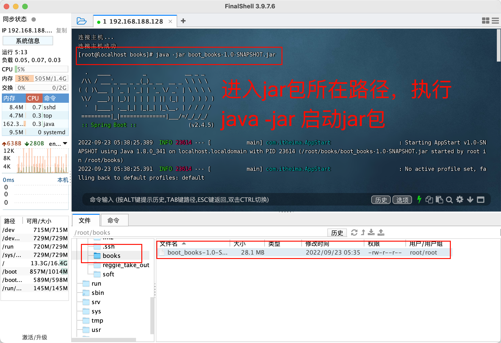
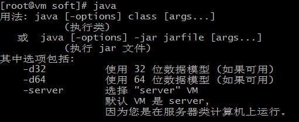

# Linux部署

教学目标

1. 能够完成Linux系统中jdk的安装
2. 能够完成linux系统中tomcat的安装
3. 能够完成linux系统中mysql的安装
4. 能够完成Linux系统中Nginx的安装
5. 部署Web项目
6. 部署Nginx反向代理

## 一、Linux软件安装

### 源码安装

​      linux软件都是用C/C++程序开发，所谓源码安装，是直接提供程序源代码，需要自行编译，然后生成目标可执行程序。类似提供的.java文件，需要自己编译.class,然后打包为jar，然后运行。源代码形式的特点：操作复杂、编译时间长、极易出现问题、依赖关系复杂，比较适合于专门做linux系统开发的人员。

1. 绝大多数开源软件都是直接以原码形式发布的
2. 源代码一般会被打成.tar.gz的归档压缩文件
3. 源代码需要编译成为二进制形式之后才能够运行使用
4. 源代码基本编译流程：

​    1）.configure 检查编译环境；

​    2）make对源代码进行编译；

​     3）make insall 将生成的可执行文件安装到当前计算机中

### RPM安装

​    RPM 是 LINUX 下的一种软件的可执行程序，你只要安装它就可以了。这种软件安装包通常是一个RPM包（Redhat Linux Packet Manager，就是Redhat的包管理器），后缀是.rpm。RPM是Red Hat公司随Redhat Linux推出了一个软件包管理器，通过它能够更加轻松容易地实现软件的安装。

1. 安装软件：执行rpm -ivh rpm包名，如：rpm -ivh apache-1.3.6.i386.rpm 
2. 升级软件： 执行rpm -Uvh rpm包名。
3. 卸载安装： 执行rpm -e rpm包名。
4. 查询软件包的详细信息：执行rpm -qpi rpm包名
5. 查询某个文件是属于那个rpm包的：执行rpm -qf rpm包名
6. 查该软件包会向系统里面写入哪些文件：执行 rpm -qpl rpm包名

一般使用步骤如下：

```shell
rpm –i software.rpm(安装)；
rpm -e software.rpm(卸载)；
rpm –U software.rpm(升级形式安装)；
rpm –ivh http://www.linuxcast.net/software.rpm(支持通过http\ftp协议形式安装)
```

rpm软件包形式的管理虽然方便，但是需要手工解决软件包的依赖关系。很多时候安装一个软件安装一个软件需要安装1个或者多个其他软件，手动解决时，很复杂，yum可以轻松解决这些问题。

### YUM安装

   yum（全称为 Yellow dog Updater, Modified）是一个在Fedora和RedHat以及CentOS中的软件包管理器，简单理解Yum是rpm的前端程序。它能够从指定的服务器自动下载RPM包并且安装，可以自动处理依赖性关系，并且一次安装所有依赖的软件包，无须繁琐地一次次下载、安装。

​	yum仓库用来存放所有的现有的.rpm包，当使用yum安装一个rpm包时，需要依赖关系，会自动在仓库中查找依赖软件并安装。仓库可以是本地的，也可以是HTTP、FTP、nfs形式使用的集中地、统一的网络仓库。

其特点总结如下：

1) 自动解决依赖关系

2) 可以对rpm进行分组，基于组进行安装操作

3) 引入仓库概念，支持多个仓库

4) 配置简单

常规使用如下：

```shell
# yum install 安装；
# yum remove卸载；
# yum update 升级制定软件
```

### 本地安装

​	把需要的软件下载到linux主机，在主机上直接本地安装

## 二、软件安装与配置  

**软件上传**

1.**创建软件目录**

```shell
#进入用户目录
cd ~
#创建soft目录
mkdir soft
```

2.**安装软件介绍**

| 服务/软件     | 端口 | 备注                 |
| ------------- | ---- | -------------------- |
| jdk8          | -    | JAVA的编译和运行环境 |
| mysql/mariadb | 3306 | 持久化关系型数据库   |
| tomcat        | 8080 | 服务器               |
| nginx         | 80   | 反向代理服务器       |

scp 命令上传 (命令是在Windows机器或mac机器上执行)

```shell
#scp 源码文件路径  目标文件路径
# 把本地文件上传到服务器 (当前Windows系统目录)
scp ./*.* root@192.168.200.138:~/soft
# 把远程服务器用户目录/soft下所有文件，下载到本地
scp root@192.168.200.138:~/soft/*.* ./
```

### 1、安装jdk【rpm安装】

​	rpm安装，能自动配置环境变量。

​	1）安装jdk

```shell
 cd ~/soft
 rpm -ivh jdk-8u181-linux-x64.rpm
```

​	2）java -version测试是否成功    

~~~shell
  java -version
~~~

展示以下内容代表OK

```
  java version "1.8.0_181"
  Java(TM) SE Runtime Environment (build 1.8.0_181-b13)
  Java HotSpot(TM) 64-Bit Server VM (build 25.181-b13, mixed mode)
```

### 2、安装mysql（mariadb）【yum】

MariaDB数据库管理系统是MySQL的一个分支，主要由开源社区在维护，采用GPL授权许可 MariaDB的目的是完全兼容MySQL，包括API和命令行，使之能轻松成为MySQL的代替品。在存储引擎方面，使用XtraDB（英语：XtraDB）来代替MySQL的InnoDB

​	1）yum安装

```shell
yum -y install mariadb-server
```

​	2）启动mysql

```shell
systemctl start mariadb
```

   3）设置root密码

​	**注:这只是设置root用户在本机(linux)登录时的密码**  

  ~~~shell
mysqladmin -u root password 'root'	
  ~~~

​	4）进入mysql

```
mysql -u root -p
```

 备注：输入密码:root

进入到数据库的执行命令行里面了。

  7)	进入mysql，并执行下面sql

**保证密码和本地一致**  

下面的话在**mysql数据库里面**里面执行

```mysql
  -- 查看当前的数据库
show databases;
  -- 打开mysql
use mysql ;
  -- 查看所有表
show tables;
  -- 我们不用ipv6的地址，直接把host改为%，表示所有客户端都可以连接；同时设置密码为root
update user set host='%' ,password=password("root") where user='root' and host = '::1';
  -- 刷新后才能生效
flush privileges;
```

**退出数据库命令操作**

~~~shell
exit;
~~~

8) 开放端口号

```shell
# 开放端口命令
firewall-cmd --zone=public --add-port=3306/tcp --permanent
#重新加载配置
firewall-cmd --reload
```

9) 测试远程连接

使用数据库客户端，输入VMIP地址，输入Mysql的用户名和密码，如图

1.使用IDEA数据库客户端插件


2.输入数据库连接信息


### 3、配置tomcat【解压缩】

项目部署需要tomcat ， 配置端口号。

1. 下面需要使用uzip命令（根据当前系统情况而定，不是必须），先安装  

```shell
#获取安装列表
yum list | grep zip/unzip

#提示输入时，请输入y
yum install zip

#提示输入时，请输入y
yum install unzip 
```

解压tomcat压缩包到 `/app` 目录下

```shell
cd ~/soft
#解压缩到当前
unzip apache-tomcat-8.5.47.zip
#移动到 /usr/local下
mv apache-tomcat-8.5.47 /usr/local/
```

启动apache-tomcat-8.5.47

```shell
 #确保启动文件有可执行权限，先修改权限
chmod 755 /usr/local/apache-tomcat-8.5.47/bin/*.sh
 #启动
/usr/local/apache-tomcat-8.5.47/bin/startup.sh
```

开放8080端口

```shell
# 开端口命令
firewall-cmd --zone=public --add-port=8080/tcp --permanent
#重新加载配置
firewall-cmd --reload
```

测试tomcat

在浏览器输入：http://192.168.188.128:8080/


启动两以上个tomcat，需要配置端口

### 4、安装Git及Maven

#### 1.安装git【源码安装】

```shell
cd ~/soft
# 安装依赖环境
yum -y install zlib-devel curl-devel openssl-devel perl cpio expat-devel gettext-devel openssl zlib autoconf tk perl-ExtUtils-MakeMaker
# 安装gcc编译环境
yum -y install gcc gcc-c++ autoconf automake make
# 解压缩到当前
tar -zxvf git_v2.4.0.tar.gz 
# 进入目录
cd git-2.4.0
# 配置并编译
autoconf
# 检验相关依赖，设置安装路径
./configure --prefix=/usr/local/git
make && make install
```


  默认安装在 /usr/local/bin，把/usr/local/bin放在系统环境变量或当前用户环境变量，操作如下：

路径：/usr/local/git/bin:

```shell
vim ~/.bash_profile  #加入系统环境变量
source ~/.bash_profile #加载配置文件
git --version #查看版本
```


​     备注：这个路径一定写在系统路径的前面，可以覆盖系统默认的git。


#### 2.安装maven【解压缩即可】

```bash
# 解压缩到/usr/local下
unzip -d /usr/local apache-maven-3.6.3-bin.zip
# 编辑配置文件，把 /usr/local/apache-maven-3.6.3,添加到系统环境变量
vim ~/.bash_profile  #加入系统环境变量
source ~/.bash_profile #加载配置文件
# 查看maven版本
mvn -v
```

路径：/usr/local/apache-maven-3.6.3


```
MAVEN=/usr/local/apache-maven-3.6.3
PATH=/uer/local/git/bin:$MAVEN/bin:$PATH:$HOME/bin

```


###  5、安装Nginx 【源码安装】

​     Nginx* (engine x) 是一个高性能的[HTTP](https://baike.baidu.com/item/HTTP)和[反向代理](https://baike.baidu.com/item/反向代理/7793488)web服务器，同时也提供了IMAP/POP3/SMTP服务。Nginx是由伊戈尔·赛索耶夫为[俄罗斯](https://baike.baidu.com/item/俄罗斯/125568)访问量第二的Rambler.ru站点（俄文：Рамблер）开发的，第一个公开版本0.1.0发布于2004年10月4日，2011年6月1日，nginx 1.0.4发布。

​    Nginx是一款[轻量级](https://baike.baidu.com/item/轻量级/10002835)的[Web](https://baike.baidu.com/item/Web/150564) 服务器/[反向代理](https://baike.baidu.com/item/反向代理/7793488)服务器及[电子邮件](https://baike.baidu.com/item/电子邮件/111106)（IMAP/POP3）代理服务器，在BSD-like 协议下发行。其特点是占有内存少，[并发](https://baike.baidu.com/item/并发/11024806)能力强，事实上nginx的并发能力在同类型的网页服务器中表现较好，中国大陆使用nginx网站用户有：百度、[京东](https://baike.baidu.com/item/京东/210931)、[新浪](https://baike.baidu.com/item/新浪/125692)、[网易](https://baike.baidu.com/item/网易/185754)、[腾讯](https://baike.baidu.com/item/腾讯/112204)、[淘宝](https://baike.baidu.com/item/淘宝/145661)等。

- 安装前准备


```shell
#安装Nginx依赖环境，-y表示所有提示默认选择y
#nginx的http模块使用pcre来解析正则表达式，所以需要在linux上安装pcre库：
yum -y install pcre pcre-devel  
#nginx使用zlib对http包的内容进行gzip，所以需要在linux上安装zlib库：
yum -y install zlib zlib-devel  
#nginx不仅支持http协议，还支持https，所以需要在linux安装openssl库：
yum -y install openssl openssl-devel
# 安装gcc编译环境
yum -y install gcc gcc-c++ autoconf automake make
```

 - 源码安装
   
   ```shell
   #解压缩nginx
   tar -xvf nginx-1.14.2.tar.gz 
   #进入nginx目录
   cd nginx-1.14.2
   #安装配置 
   ./configure  
   #编译
   make     
   # 安装就是把可执行文件复制到/usr/local/nginx下
   make install   
   ```
```shell
   
> 安装成功之后,就会在/usr/local下多出了一个nginx目录.
   
- 使用Nginx

 #进入nginx的sbin目录
   cd /usr/local/nginx/sbin
#在sbin目录下启动
   ./nginx
    #在sbin目录下停止----需要再用
  ./nginx -s stop
  #在sbin目录下重写加载--需要再用
  ./nginx -s reload
  
  #修改端口(默认端口80)---需要再用
  vim /usr/local/nginx/conf/nginx.conf 配置文件
```

+ 开端口命令

```shell
#开放端口
firewall-cmd --zone=public --add-port=80/tcp --permanent
#重新加载配置
firewall-cmd --reload
#查看是否有nginx的线程是否存在
ps -ef | grep nginx
netstat -an -t -u | grep 80
```

   在浏览器输入：http://192.168.188.128/


​     

### 6.安装redis数据库 【源码安装】

- 解压缩redis

  - tar -xvf redis-3.2.9.tar.gz -C /usr/local

- make命令编译redis的C语言源码

  - 进入解压后的redis目录下的src目录

  - ```shell
    cd /usr/local/redis-3.2.9/src
    ```

  - 输入make命令即可

  - ```shell
    make
    ```

    

    ./redis-server  服务器
    
    ./redis-cli       客户端

  注意：可以把编译后的可执行程序可移动到自定义目录

  - 在redis 目录下创建bin目录，把编译后的服务器、客户端、配置文件copy到此目录下
    - cd /usr/local/redis-3.2.9
    - mkdir bin 
    - cp ./src/redis-server ./bin
    - cp ./src/redis-cli ./bin
    - cp ./redis.conf ./bin

- 启动redis服务器

  ```shell
  # 进入bin目录
  cd bin
  # 启动
  ./redis-server
  ```

  

- 其它指令和配置

  ```shell
  #1. 运行远程访问 & 后台运行
  #   使用vi编辑，打开redis.conf文件 （以下是在配置文件中修改）
  #==============
  # 注释如下这行，目前仅运行127.0.0.1访问
  bind 127.0.0.1
  #  开启密码访问模式
  requirepass 123qwe
  # 开启守护进程，允许redis可以后台启动
  daemonize yes
  # 是否开启保护模式，no允许redis在没有密码的状态下可以被其他地址连接
  protected-mode yes
  #===============
  #2. 指定配置文件，启动redis    
  ./redis-server redis.conf 
  
  #3. 启动redis客户端和关闭服务器
  ./redis
  ./redis-cli shutdown
  #4.开放端口
  firewall-cmd --zone=public --add-port=6379/tcp --permanent
  #重新加载配置
  firewall-cmd --reload
  #查看是否有redis正在运行
  ps -ef | grep redis
  netstat -an -t -u | grep 6379
  ```


## 三、部署SpringBoot项目 

部署资料中的SpringBoot项目，部署前先把数据库安装好，然后再把项目的jar包上传到服务器中，然后运行jar包即可。

1. 确认当前数据库状态

```
systemctl status mariadb
```


​		启动数据库

```
systemctl start mariadb
```

​		启动后再次通过`systemctl status mariadb`命令查看，确保数据库已经启动


2. 确保数据库已启动后，通过Idea连接此数据库。

> 注意，此处的连接地址，是虚拟机中CentOS的IP地址


3. 执行资料中提供的sql文件，创建此项目需要的schema


执行后查看连接中的schema，确保执行成功


4. 修改项目中配置文件的数据库和连接地址，修改为虚拟机中数据库的地址


5. 修改后运行项目，确保访问页面可以正常访问数据,访问地址：http://localhost:8080/pages/books.html


6. 执行打包命令，生成jar包


7. 把jar包上传到虚拟机中


8. 进入jar包所在路径，执行java -jar命令

> 此处java -jar 是前台启动，如果退出窗口的话会关闭java程序
>
> 如果需要后台启动需要执行后台启动命令

后台启动命令

```
nohup java -jar boot_books-1.0-SNAPSHOT.jar &
```

后台启动并输出日志命令

```
nohup java -jar boot_books-1.0-SNAPSHOT.jar &> books.log &
```



9. 输入访问地址，测试程序是否部署成功，访问地址为虚拟机IP地址+端口号+地址


```
# 查看防火墙开放端口
firewall-cmd --list-ports
# 关闭防火墙端口
firewall-cmd --zone=public --remove-port=80/tcp --permanent
```


## 四、Nginx反向代理

### 正向代理 

正向代理类似一个中转站，代理内部访问外部资源。

举个例子：

　　我是一个用户，我访问不了某网站，但是我能访问一个代理服务器，这个代理服务器呢,它能访问那个我不能访问的网站，于是我先连上代理服务器,告诉他我需要那个无法访问网站的内容，代理服务器去取回来,然后返回给我。从那个网站的角度来看，只在代理服务器来取内容的时候有一次记录，有时候并不知道是用户的请求，也隐藏了用户的资料，这取决于代理告不告诉网站。

**注意：客户端必须设置正向代理服务器，当然前提是要知道正向代理服务器的IP地址，还有代理程序的端口。**

总结来说：正向代理 是一个位于客户端和原始服务器(origin server)之间的服务器，为了从原始服务器取得内容，客户端向代理发送一个请求并指定目标(原始服务器)，然后代理向原始服务器转交请求并将获得的内容返回给客户端。客户端必须要进行一些特别的设置才能使用正向代理。

🥱🥱🥱🥱🥱🥱🥱🥱🥱🥱🥱🥱🥱🥱🥱🥱🥱🥱🥱🥱🥱🥱🥱🥱🥱🥱🥱🥱🥱🥱🥱🥱🥱🥱🥱🥱🥱🥱🥱🥱🥱🥱

正向代理--》代理服务器-->目标接口服务器

反向代理 -->代理服务器 （统一用户请求隔离请求数据）---转发--目标服务器

**正向代理的用途：**

```
 　　1. 访问原来无法访问的资源，如google
 　　2. 可以做缓存，加速访问资源
 　　3. 对客户端访问授权，上网进行认证
 　　4. 代理可以记录用户访问记录（上网行为管理），对外隐藏用户信息
```


### 反向代理 

反向代理（Reverse Proxy）方式是指以代理服务器来接受internet上的连接请求，然后将请求转发给内部网络上的服务器，并将从服务器上得到的结果返回给internet上请求连接的客户端，此时代理服务器对外就表现为一个服务器。反向代理的作用

1. 保证内网的安全，可以使用反向代理提供防火墙（WAF）功能，阻止web攻击。大型网站，通常将反向代理作为公网访问地址，Web服务器是内网。
2. 负载均衡，通过反向代理服务器来优化网站的负载。当大量客户端请求代理服务器时，反向代理可以集中分发不同用户请求给不同的weab服务器进行处理请求。（本阶段不实现，负载均衡技术项目阶段讲解）


##### 总结

nginx是一种高效http和web服务器，可以解决高并发等问题其中项目中常用的概念为负载均衡、反向代理、动静分离
反向代理其实就是，客户端发出很多请求，由一个中间层来控制消息发送到那个服务器，客户端不关心发送到哪个服务器，像百度网址
负载均衡：很多消息发送到中间层，由nginx统一请求发送到服务端，根据服务端处理权重来判断接收处理信息的多少，避免过度用一个服务器
动静分离，其实就是像html、css这些静态不需要处理的资源单独存放在一个服务器上，业务请求分配到专门处理接口的服务器

而动态资源就是需要进行处理的资源单独放在一个服务器上，当请求发送到nginx中时，由其分配

### 反向代理配置

1. 修改配置文件

```bash
vim /usr/local/nginx/conf/nginx.conf
```

以下是被修订过的nginx.conf，将所有访问到nginx80端口的路径是/开头的请求，都转发到webcase代表的反向代理机群，默认是请求其中一台。

```nginx
http{
    upstream bookssm{
        server 127.0.0.1:8080;
        #server 192.168.200.129:8080;
    }
    server {
        listen       80;
        server_name  localhost;
        location / {
             root html;
             #proxy_pass http://192.168.200.138:8080
             proxy_pass http://bookssm;
             index index.html index.htm;
        }
	}  
}
```

- http块 一个http处理模块，可进行http的相关参数配置，内可以包含多个server块；

- upstream块 配置反向代理及负载均衡，可以写多个upstream块，是定义在server块前面。

  - server localhost:8080;  localhost可以指向网络任何一台主机。

- server块 包含在http{}内部，每一个server{}都是一个虚拟主机（站点）监听

  - listen 监听端口
  - server_name  用于与http请求header头部的Host匹配
  - location 路径配置，符合某个路径执行块内规则
    - /  代表根下资源
      - root html 是根下的资源，可以从html目录获取。
      - index 默认页面（不输入网页时，默认访问页）
      - proxy_pass  反向代理，请求转发给 webcase所代表的主机群


2. 重启服务器

```shell
/usr/local/nginx/sbin/nginx -s reload
```

3. 测试访问

   
   
   检查是否有错误，配置文件

```nginx
./nginx -s reload 重载
./nginx -t 检查配置文件  测试运行
```


## 五、部署springboot项目过程

- 将项目打包jar，linux中创建文件目录存放当前.jar

  ```xml
  <!--打包插件-->
      <build>
          <finalName>books</finalName>
          <plugins>
              <plugin>
                  <groupId>org.springframework.boot</groupId>
                  <artifactId>spring-boot-maven-plugin</artifactId>
                  <version>2.4.5</version>
              </plugin>
          </plugins>
      </build>
  ```

- linux中安装好所需环境

- 通过nginx做反向代理，修改配置文件，如上所示；关闭项目端口，只开放80端口，重新加载nginx（指令如上），运行测试

- 运行jar

- 浏览器访问项目地址


## 附录 

### 安装iptables服务 【yum安装】

​    iptables是linux 系统自带的优秀且完全免费的基于包过滤的防火墙工具、它的功能十分强大、使用非常灵活、可以对流入、流出及流经服务器的数据包进行精细的控制。特别是它可以在一台非常低配置下跑的非常好。 centos系统，默认仅仅开放了22端口，其他端口需要使用iptables进行管理（开放、删除、保存规则等）

- 安装iptables

```shell
yum install iptables-services
```

- 

- 添加规则 （比如开放8080端口）

  ```shell
  /sbin/iptables -I INPUT -p tcp --dport 8080 -j ACCEPT  
  ```

- 

- 保存规则

```shell
service iptables save
```

- 

- 配置开机启动

  把启动防火墙服务的命令，加入到开机启动的配置文件中即可。

  ```shell
  vim  /etc/profile
  ```

- 

- 查看与删除iptables中放行的规则

  ```shell
  #查看iptables列表，显示列表编号
  iptables -L -n --line-number
  Chain INPUT (policy ACCEPT)
  num  target     prot opt source               destination         
  1    ACCEPT     tcp  --  0.0.0.0/0            0.0.0.0/0           tcp dpt:8080 
  2    ACCEPT     tcp  --  0.0.0.0/0            0.0.0.0/0           tcp dpt:3306 
  3    ACCEPT     tcp  --  0.0.0.0/0            0.0.0.0/0           tcp dpt:80 
  4    ACCEPT     all  --  0.0.0.0/0            0.0.0.0/0           state RELATED,ESTABLISHED
  #删除iptables列表中 编号为1的规则
  iptables -D INPUT 1
  
  ```

### 安装Mysql【yum安装】

- yum命令安装

  ```
   yum -y install mysql-community-server
  ```

  如果出现如图所示，请参考【手动获取rpm文件】：

  - 

  - 

  需要下载205M的资源，需要根据网络情况，等待比较久的时间。

  安装完毕如下：

  - 

- 手动获取rpm文件安装

  在线获取rpm包

  ```shell
  wget http://repo.mysql.com/mysql-community-release-el7-5.noarch.rpm
  ```

  安装下载的rpm文件

  ```shell
  rpm -ivh mysql-community-release-el7-5.noarch.rpm
  ```

  安装mysql-server

  ```shell
  yum install mysql-server 
  ```

- 启动mysql服务

```shell
  service mysqld start
```

- 查看初始密码【5.7版本执行如下命令，5.6版本，默认密码是空】

```shell
  grep "password" /var/log/mysqld.log
```


- 登录mysql

```shell
  mysql -u root -p
```

- [ ] 

​             输入初始密码，可以复制密码，并粘贴到输入密码的位置

- 设置root密码
  1. 修改安全策略 （mysql5.7不允许设置比较简单的密码策略）

```mysql
set global validate_password_policy=0;
set global validate_password_length=1;
```

-   

​       2. 设置密码： set password = password('123456');


​       3. 授权远程连接

​        默认情况下mysql为安全起见，不支持远程登录mysql，所以需要设置开启远程登录mysql的权限

```mysql
grant all privileges on *.* to 'root' @'%' identified by '123456';
flush privileges;
SET PASSWORD FOR 'root'@'%'= PASSWORD('123456');
```

- 

- 开放3306端口

  ```shell
  /sbin/iptables -I INPUT -p tcp --dport 3306 -j ACCEPT
  service iptables save
  ```

- 

### 安装与配置JDK [解压缩安装]

- tar -xvf 解开压缩包到指定目录

  - tar -xvf jdk-8u211-linux-x64.tar.gz -C /usr/local

- 编辑配置文件，并配置环境变量

  全局配置或当前用户配置，二选一即可。

  全局配置文件: vim  /etc/profile  或  用户配置文件 vim ~/.bash_profile  推荐前者。

  ```shell
  vim  /etc/profile
  ```

  将以下代码复制到profile文件中的末尾。

  ```shell
  #set java environment
  JAVA_HOME=/usr/local/jdk1.8.0_211/
  CLASSPATH=.:$JAVA_HOME/lib.tools.jar
  PATH=$JAVA_HOME/bin:$PATH
  export JAVA_HOME CLASSPATH PATH 
  ```

  保存并退出

- 加载环境变量

  source  /etc/profile  或  source .bash_profile ，推荐前者。

  ```shell
  source  /etc/profile
  ```

  - 

  不出现任何提示，说明环境加载成功。

- 测试环境

  输入 java或javac ，出现如下提示即为环境配置成功

  - 

  如果出现：

  - 

  - 前面的路径没有设置正确，请重新检查profile文件设置的路径与磁盘路径是否一致
  - 重新执行  source  /etc/profile

### Git部署Web项目

#### 1. 拉取代码

1. 在Git仓库平台增加服务端的ssh公钥

   在服务端机器生成密钥对，使用ssh命令，生成的密钥默认放在用户目录的.ssh目录。

   ```shell
   #生成密钥，输入完成命令，默认回车即可。
   ssh-keygen -t rsa -C "zhangsan@qq.com"
   # 查看用户目录下的隐藏目录
   ls -a ~/ 
   # 查看.ssh目录下的密钥
   ls ~/.ssh/ 
   # 查看公钥信息
   cat .ssh/id_rsa.pub 
   ```

   -C "zhangsan@qq.com" 如果省略默认是当前主机名称

   

   

   

   复制生成后的 ssh key，通过仓库主页 **「管理」->「部署公钥管理」->「添加部署公钥」** ，添加生成的 public key 添加到仓库中。

   

2. 使用SSH方式，克隆Git仓库代码

   ```bash
   cd ~       #切换到用户目录
   git clone git@gitee.com:mobapp/webcase.git
   cd ~/webcase
   #git clone git@gitee.com:mobapp/study_springmvc_ssm.git  #SSH方式克隆代码
   #cd study_springmvc_ssm # 进入项目根目录
   git branch # 查看当前分支，默认是master分支
   git pull # 拉取最新代码 [第1次不用]
   git checkout master # 切换到主分支 [第1次不用]
   ```

#### 2. 项目打包

​	使用mvn命令，自动打包当前项目，默认生成在工程目录的target下

```shell
cd ~/webcase
mvn clean package -Dmaven.test.skip=true
```

备注：第1次打包，会非常慢，因为需要下载依赖库，可以把本地已经下载好的仓库直接放在用户目录的.m2下。


1.上传本地maven仓库到服务器m2目录下


2.解压缩本地仓库

```shell
cd ~/.m2
unzip -o repository
```


备注：-o  覆盖解压缩

3.重新打包

```
cd ~/webcase
mvn clean package -Dmaven.test.skip=true
```


#### 3. 项目部署

把War把部署到Tomcat

​      把生成的war包移动或复制到tomcat webapps目录下即可，注意文件名就是应用的名称。

```shell
# 把war包copy到webapp是目录下,并取名为springssm.war 
# \cp 是强制覆盖，一般第2次部署时，是不需要确认的，直接覆盖
# cp 如果遇到重名，会提示覆盖
#\cp ~/study_springmvc_ssm/target/springmvc_ssm.war /usr/local/apache-tomcat-8.5.47/webapps/springssm.war
\cp ./target/webcase.war /usr/local/apache-tomcat-8.5.47/webapps/
#启动Tomcat 默认不用重启是可以的
/usr/local/apache-tomcat-8.5.47/bin/startup.sh
# 查看访问日志
tail -f /usr/local/apache-tomcat-8.5.47/logs/localhost_access_log.2022-04-24.txt
```

4. 访问测试

   http://192.168.200.138:8080/webcase/login.html

### Git部署Boot项目

#### 1.  拉取代码

```shell
cd ~       #切换到用户目录
git clone git@gitee.com:mobapp/spring-boot-mybatis.git  #SSH方式克隆代码
cd spring-boot-mybatis # 进入项目根目录
git branch # 查看当前分支，默认是master分支
git pull # 拉取最新代码 [第1次不用]
git checkout master # 切换到主分支 [第1次不用]
```

#### 2. 项目打包

```shell
mvn clean package -Dmaven.test.skip=true
```

#### 3. 项目启动

1. 启动mysql数据库【前面已启动】

2. 安装项目数据库【前面已安装，本项目与之前项目用的同一数据库】

3. 初始化项目的工作目录

   ```shell
   # 在当前创建工作目录
   mkdir ~/springmvcboot
   # 进入工作目录
   cd ~/springmvcboot
   ```

4. 启动项目

```shell
# 强制负责编译之后的jar包到工作目录
\cp ~/spring-boot-mybatis/target/springboot_ssm.jar ~/springmvcboot
# 后台启动boot项目
nohup java -jar springboot_ssm.jar --server.port=8088 --spring.profiles.active=pro >springboot_ssm_out.log 2>&1 &
# 查看启动日志
tail -f springboot_ssm_out.log
# 开放端口
firewall-cmd --zone=public --add-port=6379/tcp --permanent
#重新加载配置
firewall-cmd --reload
```

- nohup：不挂断地运行命令，退出帐户之后继续运行相应的进程。

- springboot_ssm_out.log：是nohup把command的输出重定向到当前目录的指定的文件中.

  即输出内容不打印到屏幕上，而是输出到”日志文件名.log”文件中。

- 2>&1 2就是标准错误，1是标准输出

  该命令相当于把标准错误重定向到标准输出么。这里&相当于标准错误等效于标准输出，即把标准错误和标准输出同时输出到指定的“日志文件名.log”文件中。

5. 访问测试 

http://192.168.200.138:8088/user/queryAll

注意boot项目，默认是发布在web的根目录下的。SSM项目只要发布到webapps/ROOT下才发布到根目录

## 六、部署SpringMVC项目

部署之前的综合案例，部署前先把数据库安装好，然后再把项目的war包copy到tomcat安装目录即可。

#### 1. 初始化项目数据库 

1. msyql客户端工具连接VM中的mysql
2. 在客户端工具中初始化数据库脚本

```mysql
CREATE SCHEMA `ssm_db` DEFAULT CHARACTER SET utf8mb4;

use `ssm_db`;

-- ----------------------------
-- Table structure for tbl_book
-- ----------------------------
DROP TABLE IF EXISTS `tbl_book`;
CREATE TABLE `tbl_book`  (
  `id` int(11) NOT NULL AUTO_INCREMENT,
  `type` varchar(20) CHARACTER SET utf8 COLLATE utf8_general_ci NULL DEFAULT NULL,
  `name` varchar(50) CHARACTER SET utf8 COLLATE utf8_general_ci NULL DEFAULT NULL,
  `description` varchar(255) CHARACTER SET utf8 COLLATE utf8_general_ci NULL DEFAULT NULL,
  PRIMARY KEY (`id`) USING BTREE
) ENGINE = InnoDB AUTO_INCREMENT = 13 CHARACTER SET = utf8 COLLATE = utf8_general_ci ROW_FORMAT = Dynamic;

-- ----------------------------
-- Records of tbl_book
-- ----------------------------
INSERT INTO `tbl_book` VALUES (1, '计算机理论', 'Spring实战 第5版', 'Spring入门经典教程，深入理解Spring原理技术内幕');
INSERT INTO `tbl_book` VALUES (2, '计算机理论', 'Spring 5核心原理与30个类手写实战', '十年沉淀之作，手写Spring精华思想');
INSERT INTO `tbl_book` VALUES (3, '计算机理论', 'Spring 5 设计模式', '深入Spring源码剖析Spring源码中蕴含的10大设计模式');
INSERT INTO `tbl_book` VALUES (4, '计算机理论', 'Spring MVC+MyBatis开发从入门到项目实战', '全方位解析面向Web应用的轻量级框架，带你成为Spring MVC开发高手');
INSERT INTO `tbl_book` VALUES (5, '计算机理论', '轻量级Java Web企业应用实战', '源码级剖析Spring框架，适合已掌握Java基础的读者');
INSERT INTO `tbl_book` VALUES (6, '计算机理论', 'Java核心技术 卷I 基础知识（原书第11版）', 'Core Java 第11版，Jolt大奖获奖作品，针对Java SE9、10、11全面更新');
INSERT INTO `tbl_book` VALUES (7, '计算机理论', '深入理解Java虚拟机', '5个维度全面剖析JVM，大厂面试知识点全覆盖');
INSERT INTO `tbl_book` VALUES (8, '计算机理论', 'Java编程思想（第4版）', 'Java学习必读经典,殿堂级著作！赢得了全球程序员的广泛赞誉');
INSERT INTO `tbl_book` VALUES (9, '计算机理论', '零基础学Java（全彩版）', '零基础自学编程的入门图书，由浅入深，详解Java语言的编程思想和核心技术');
INSERT INTO `tbl_book` VALUES (10, '市场营销', '直播就该这么做：主播高效沟通实战指南', '李子柒、李佳琦、薇娅成长为网红的秘密都在书中');
INSERT INTO `tbl_book` VALUES (11, '市场营销', '直播销讲实战一本通', '和秋叶一起学系列网络营销书籍');
INSERT INTO `tbl_book` VALUES (12, '市场营销', '直播带货：淘宝、天猫直播从新手到高手', '一本教你如何玩转直播的书，10堂课轻松实现带货月入3W+');

```

以下是使用IDEA，初始化数据库：


#### 2. 部署项目war包 

1. **使用IDEA打war包并上传到服务器**

   1. 打包

   

   2. 上传到服务器（注意：IP写自己的服务器）

      

2. **停止当前的tomat服务器**

   ```shell
   /usr/local/apache-tomcat-8.5.47/bin/shutdown.sh
   ```

3. **上传war包到tomcat目录的webapps目录下**

   （注意：IP写自己的服务器）

   ```shell
   scp book_ssm.war root@192.168.188.128:/app/apache-tomcat-8.5.47/webapps
   ```

   备注：SCP会自动覆盖之前上传的文件，Tomcat自动解压缩覆盖之前的文件

4. **启动Tomcat服务器**

   ```shell
   /usr/local/apache-tomcat-8.5.47/bin/startup.sh
   ```

5. **浏览器测试**

   http://192.168.188.128:8080/book_ssm/pages/books-tomcat.html

   

如果显示不正常，请查看日志：

```
tail -f  /usr/local/apache-tomcat-8.5.47/logs/catalina.out
```


## 