# 施子安外卖项目优化-Day02

## 课程内容

- MySQL主从复制
- 读写分离案例
- 项目实现读写分离
- Nginx-概述
- Nginx-命令
- Nginx-应用


## 前言

> 1). 存在的问题

在前面基础功能实现的过程中，我们后台管理系统及移动端的用户，在进行数据访问时，都是直接操作数据库MySQL的。结构如下图： 

 

而在当前，MySQL服务器只有一台，那么就可能会存在如下问题： 

select  insert/update/delete

1). 读和写所有压力都由一台数据库承担，压力大

2). 数据库服务器磁盘损坏则数据丢失，单点故障


> 2). 解决方案

为了解决上述提到的两个问题，我们可以准备两台MySQL，一台主(Master)服务器，一台从(Slave)服务器，主库的数据变更，需要同步到从库中(主从复制)。而用户在访问我们项目时，如果是写操作(insert、update、delete)，则直接操作主库；如果是读(select)操作，则直接操作从库(在这种读写分离的结构中，从库是可以有多个的)，这种结构我们称为 读写分离 。

 

今天我们就需要实现上述的架构，来解决业务开发中所存在的问题。


# 克隆虚拟机方法，修改网关mac地址和ip具体操作

https://blog.csdn.net/weixin_42466157/article/details/128529627

1、在准备好的虚拟机上点击鼠标右键->管理->克隆

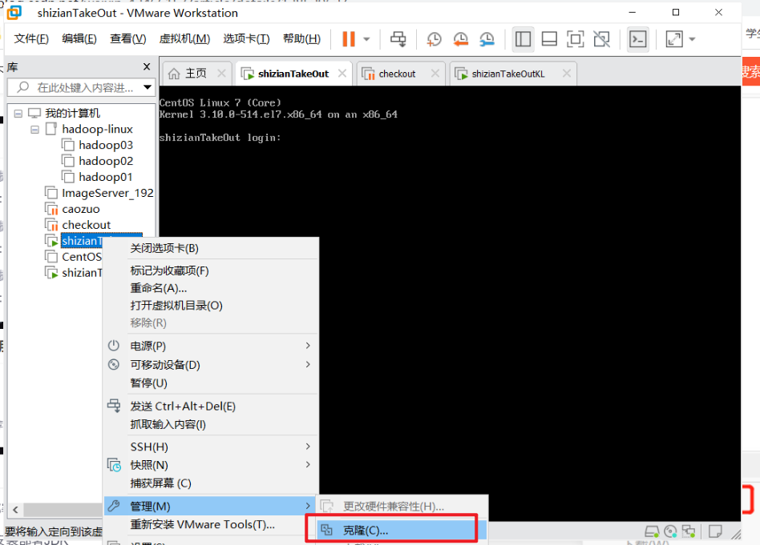

2、.点击克隆后直接点击下一步，直到入下图所示，选择创建完整克隆，点击下一步

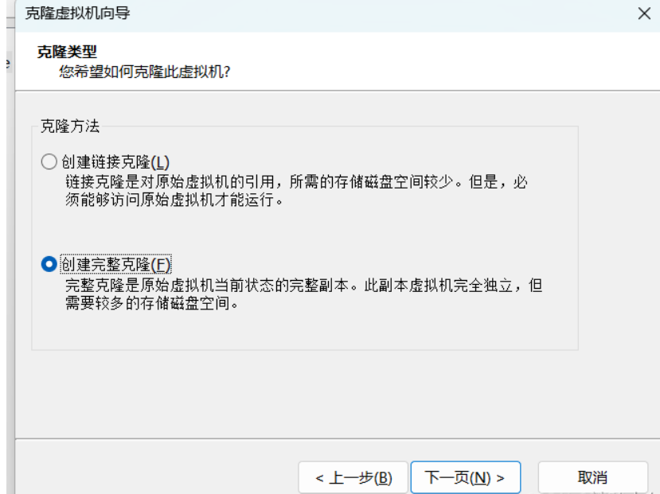

3.输入虚拟机的名字和虚拟机存储位置，点击完成，进行[虚拟机克隆](https://so.csdn.net/so/search?q=虚拟机克隆&spm=1001.2101.3001.7020)，等待克隆完毕，点击关闭

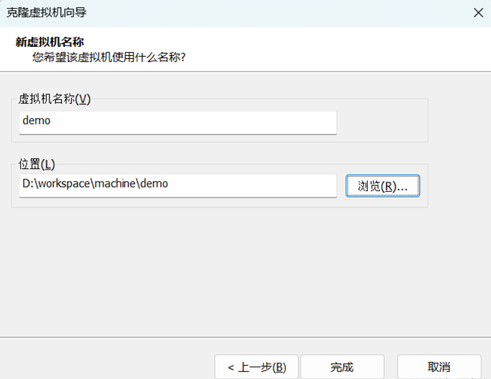

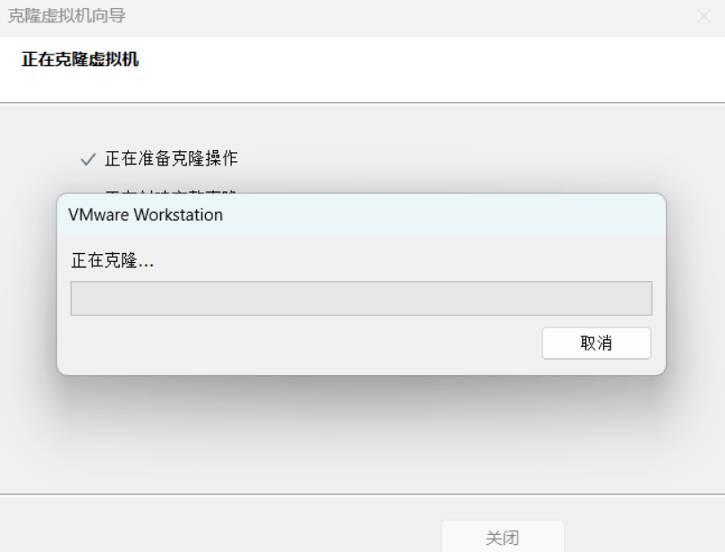

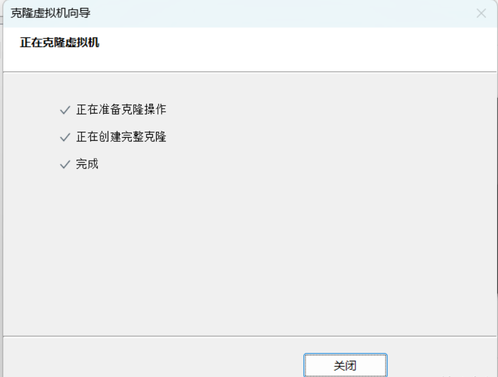

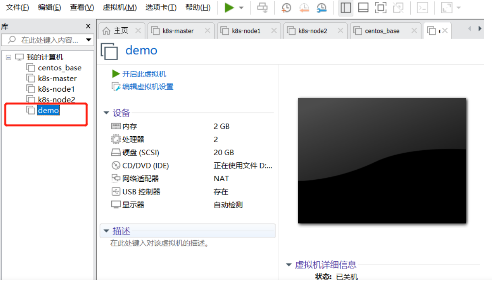

4、修改新虚拟机的配置
	a.点击编辑虚拟机设置，可以编辑新的虚拟机的配置

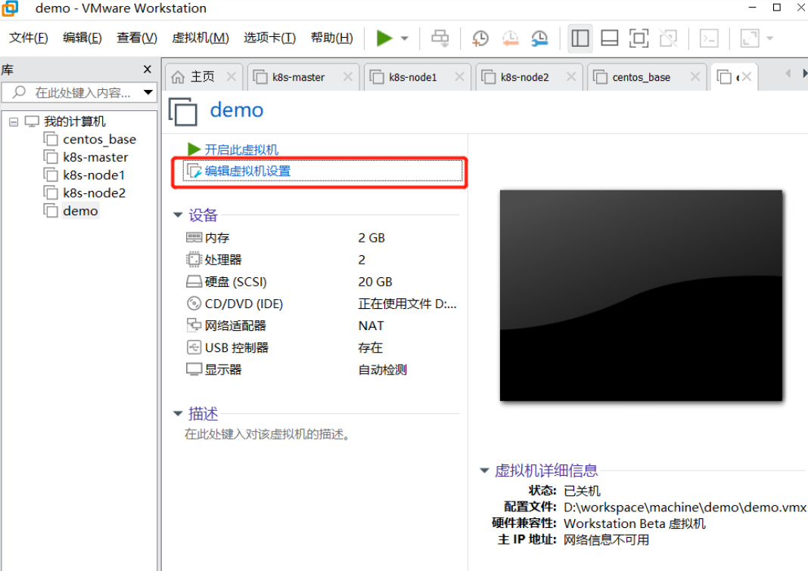

b.修改新虚拟机的网卡MAC地址
因为是克隆产产生的，所以我们需要生成新的虚拟机网卡MAC地址


点击生成，随机生成新的MAC地址，点击确认保存（这里需要复制新地址，下面会用到）


5、开启虚拟机

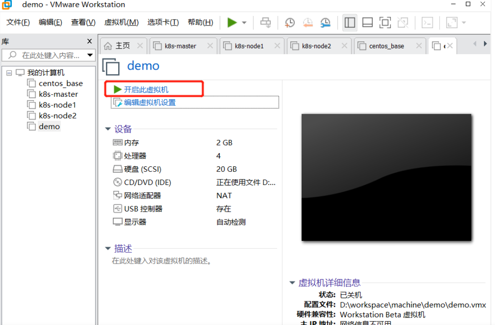

6、配置虚拟机网络
a.配置网络

```properties
vi /etc/sysconfig/network-scripts/ifcfg-ens33
```

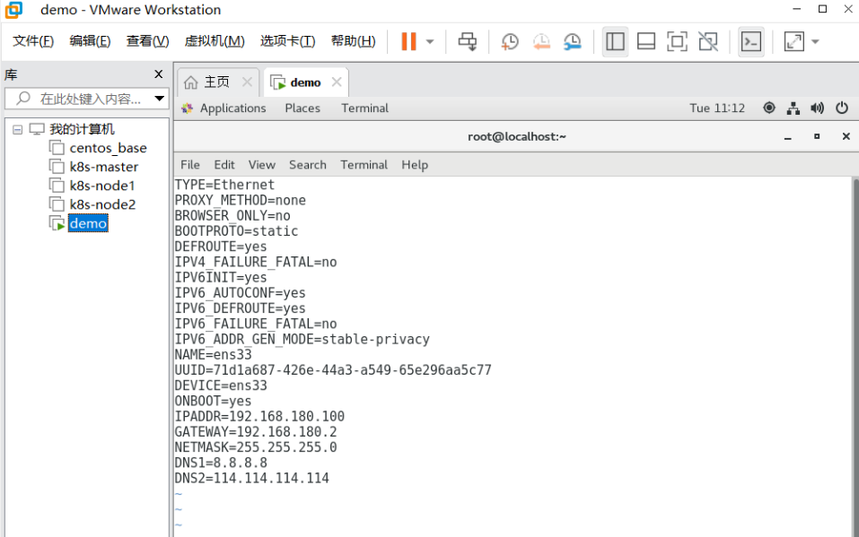

主要配置

BOOTPROTO: 网络策略 static 静态IP dhcp 动态IP none 不指定
ONBOOT: 开机自动连接网络 yes 自动连接 no 不自动连接网络
IPADDR: IP地址
GATEWAY:网关地址
NETMASK: 子网掩码
DNS1: DNS地址
DNS2: 备用DNS地址
c.根据自己的实际情况虚拟机配置IP网关等配置，因为是克隆得虚拟机，需要在配置文件中指定下MAC地址和修改下UUID
生成新的UUID,在终端中输入

```properties
uuidgen
```

最终配置文件

```properties
TYPE=Ethernet
PROXY_METHOD=none
BROWSER_ONLY=no
BOOTPROTO=static
DEFROUTE=yes
IPV4_FAILURE_FATAL=no
IPV6INIT=yes
IPV6_AUTOCONF=yes
IPV6_DEFROUTE=yes
IPV6_FAILURE_FATAL=no
IPV6_ADDR_GEN_MODE=stable-privacy
NAME=ens33
UUID=ec4e3c2f-2bd1-4e2c-9058-fa0c767861ea   ## 修改 替换成新生成的uuid值
DEVICE=ens33
ONBOOT=yes
IPADDR=192.168.180.100
GATEWAY=192.168.180.2
NETMASK=255.255.255.0
DNS1=8.8.8.8
DNS2=114.114.114.114
HWADDR=00:50:56:22:F4:18   ##新增 指定网卡MAC地址 （上文随机生成的MAC地址的值）
```

保存退出，重启网络生效

```properties
systemctl restart network
```

查看IP地址,在终端中输入命令

```properties
ifconfig
```

ping一下百度或者其他，检查是否可联网

```properties
ping www.baidu.com
```


## 1. MySQL（Mariadb）主从复制

MySQL数据库默认是支持主从复制的，不需要借助于其他的技术，我们只需要在数据库中简单的配置即可。接下来，我们就从以下的几个方面，来介绍一下主从复制：


### 1.1 介绍

MySQL主从复制是一个异步的复制过程，底层是基于Mysql数据库自带的 **二进制日志** 功能。就是一台或多台MySQL数据库（slave，即**从库**）从另一台MySQL数据库（master，即**主库**）进行日志的复制，然后再解析日志并应用到自身，最终实现 **从库** 的数据和 **主库** 的数据保持一致。MySQL主从复制是MySQL数据库自带功能，无需借助第三方工具。

> **二进制日志：** 
>
> ​	二进制日志（BINLOG）记录了所有的 DDL（数据定义语言）语句和 DML（数据操纵语言）语句，但是不包括数据查询语句。此日志对于灾难时的数据恢复起着极其重要的作用，MySQL的主从复制， 就是通过该binlog实现的。默认MySQL是未开启该日志的。

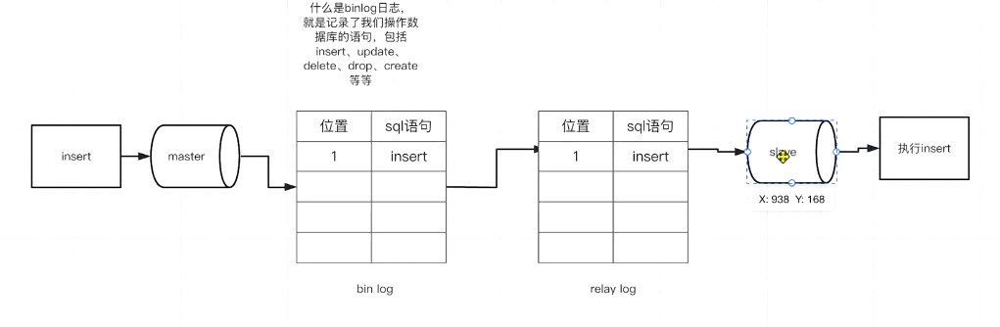

**MySQL的主从复制原理如下：** 

 


**MySQL复制过程分成三步：**

1). MySQL master 将数据变更写入二进制日志( binary log)

2). slave将master的binary log拷贝到它的中继日志（relay log）

3). slave重做中继日志中的事件，将数据变更反映它自己的数据


### 1.2 搭建

#### 1.2.1 准备工作

提前准备两台服务器，并且在服务器中安装MySQL，服务器的信息如下：

| 数据库 | IP             | 数据库版本 |
| ------ | -------------- | ---------- |
| Master | 192.168.80.122 | 5.7.25     |
| Slave  | 192.168.80.123 | 5.7.25     |


**并在两台服务器上做如下准备工作:** 

> 注意：如果已放开相应的端口号，就不需要再执行此操作了

1). 防火墙开放3306端口号

```properties
# 放开3306端口
firewall-cmd --zone=public --add-port=3306/tcp --permanent
# 重新加载配置
firewall-cmd --reload
# 显示当前放开的端口号
firewall-cmd --zone=public --list-ports
```

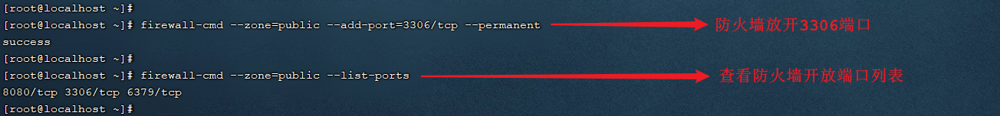 


2). 并将两台数据库服务器启动起来：

> 注意：此处根据自己安装的数据库启动
>
> 如果数据库已启动，就不需要再执行此操作了

启动Mariadb

```
systemctl start mariadb
```

启动MySQL

```
systemctl start mysqld
```

登录MySQL，验证是否正常启动

 


#### 1.2.2 主库配置

> 服务器： 192.168.120.122


**1). 修改Mysql数据库的配置文件/etc/my.cnf**

在[mysqld]下面增加配置: 

```
log-bin=mysql-bin   #[必须]启用二进制日志
server-id=200       #[必须]服务器唯一ID(唯一即可)
```

 


**2). 重启Mysql(Mariadb)服务**

执行指令： 

**此处根据自己安装的数据库启动**

重启Mariadb

```
systemctl restart mariadb
```

重启MySql

```
 systemctl restart mysqld
```

 


**3). 创建数据同步的用户并授权**

登录mysql

```my
mysql -u root -p
```

并执行如下指令，创建用户并授权：

```sql
GRANT REPLICATION SLAVE ON *.* to 'xiaoming'@'%' identified by 'Root@123456';
```

==注：上面SQL的作用是创建一个用户 xiaoming ，密码为 Root@123456 ，并且给xiaoming用户授予REPLICATION SLAVE权限。常用于建立复制时所需要用到的用户权限，也就是slave必须被master授权具有该权限的用户，才能通过该用户复制。==


> MySQL密码复杂程度说明: 
>
> ​	 
>
> ​	目前mysql5.7默认密码校验策略等级为 MEDIUM , 该等级要求密码组成为: 数字、小写字母、大写字母 、特殊字符、长度至少8位


**4). 登录Mysql数据库，查看master同步状态**

执行下面SQL，记录下结果中**File**和**Position**的值

```
show master status;
```

 


==注：上面SQL的作用是查看Master的状态，执行完此SQL后不要再执行任何操作==


#### 1.2.3 从库配置

> 服务器： 192.168.80.123


**1). 修改Mysql数据库的配置文件/etc/my.cnf**

```
server-id=201 	#[必须]服务器唯一ID
```

 


**2). 重启Mysql(Mariadb)服务**

执行指令： 

> 注意：此处根据自己安装的数据库启动

重启Mariadb

```
systemctl restart mariadb
```

重启MySql

```
 systemctl restart mysqld
```

登录Mysql数据库

```mysql
mysql -u root -p
```

**3). 设置主库地址及同步位置**

```
change master to master_host='192.168.80.122',master_user='xiaoming',master_password='Root@123456',master_log_file='mysql-bin.000001',master_log_pos=396;

start slave;
```

> 参数说明： 
>
> ​	A. master_host : 主库的IP地址
>
> ​	B. master_user : 访问主库进行主从复制的用户名(上面在主库创建的)
>
> ​	C. master_password : 访问主库进行主从复制的用户名对应的密码
>
> ​	D. master_log_file : 从哪个日志文件开始同步(上述查询master状态中展示的有)
>
> ​	E. master_log_pos : 从指定日志文件的哪个位置开始同步(上述查询master状态中展示的有)


**4). 查看从数据库的状态**

```
show slave status;
```

然后通过状态信息中的 Slave_IO_running 和 Slave_SQL_running 可以看出主从同步是否就绪，如果这两个参数全为Yes，表示主从同步已经配置完成。

 


> MySQL命令行技巧： 
>
> ​	\G : 在MySQL的sql语句后加上\G，表示将查询结果进行按列打印，可以使每个字段打印到单独的行。即将查到的结构旋转90度变成纵向；

# mysql 主从复制--启动操作start slave, stop slave

在MySQL配置主从关系时，会用到start slave, stop slave命令，本文简单介绍两个命令的使用方法和作用。
start slave

    mysql> start slave

不带任何参数，表示同时启动I/O 线程和SQL线程。

相当于：

    mysql > start slave sql_thread;
    mysql > start slave io_thread;

I/O线程从主库读取bin log，并存储到relay log中继日志文件中。

SQL线程读取中继日志，解析后，在从库重放。

until 选项的使用

以binlog 日志位点为例：

    mysql> start slave until MASTER_LOG_FILE='mysql-bin.000007',MASTER_LOG_POS=194;
    Query OK, 0 rows affected (0.00 sec)
    
    mysql> show slave status\G
    *************************** 1. row ***************************
                   Slave_IO_State: Waiting for master to send event
                      Master_Host: 127.0.0.1
                      Master_User: rep
                      Master_Port: 3306
                    Connect_Retry: 60
                  Master_Log_File: mysql-bin.000007
              Read_Master_Log_Pos: 194
                   Relay_Log_File: relay-bin.000005
                    Relay_Log_Pos: 407
            Relay_Master_Log_File: mysql-bin.000007
                 Slave_IO_Running: Yes
                Slave_SQL_Running: No
    ... ...

sql 线程 追到 MASTER_LOG_FILE、MASTER_LOG_POS指定的位置，sql 线程会自动停止。
从show slave status的输出中可以看到，sql 线程已停止，而io 线程正常执行。

until中也支持GTID，不要将log file与GTID方式混用。
stop slave

类似的，

    mysql> stop slave

相当于

    mysql > stop slave sql_thread;
    mysql > stop slave io_thread;

完成停止I/O 线程和SQL线程的操作。

### 1.3 测试

主从复制的环境,已经搭建好了,接下来,我们可以通过Navicat连接上两台MySQL服务器,进行测试。测试时，我们只需要在主库Master执行操作，查看从库Slave中是否将数据同步过去即可。

1). 在master中创建数据库itcast, 刷新slave查看是否可以同步过去

 


2). 在master的itcast数据下创建user表, 刷新slave查看是否可以同步过去

 


3). 在master的user表中插入一条数据, 刷新slave查看是否可以同步过去

 


# 2. 读写分离案例

### 2.1 背景介绍

面对日益增加的系统访问量，数据库的吞吐量面临着巨大瓶颈。 对于同一时刻有大量并发读操作和较少写操作类型的应用系统来说，将数据库拆分为**主库**和**从库**，主库负责处理事务性的增删改操作，从库负责处理查询操作，能够有效的避免由数据更新导致的行锁，使得整个系统的查询性能得到极大的改善。

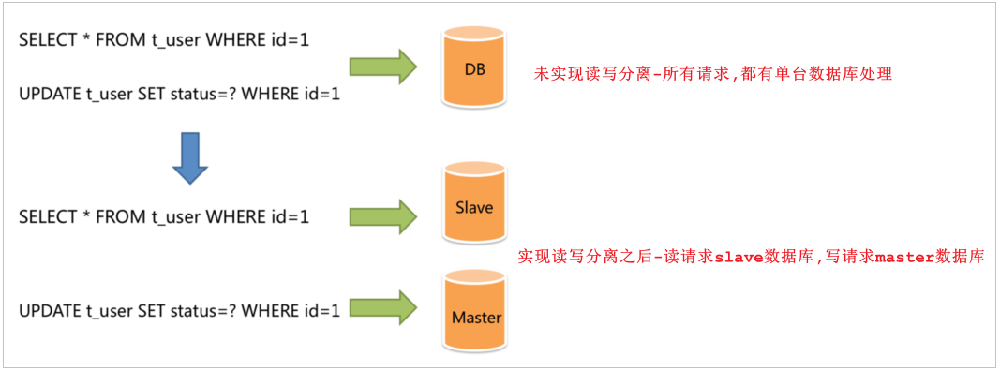 

通过读写分离,就可以降低单台数据库的访问压力, 提高访问效率，也可以避免单机故障。

主从复制的结构，我们在第一节已经完成了，那么我们在项目中，如何通过java代码来完成读写分离呢，如何在执行select的时候查询从库，而在执行insert、update、delete的时候，操作主库呢？这个时候，我们就需要介绍一个新的技术 ShardingJDBC。


### 2.2 ShardingJDBC介绍

Sharding-JDBC定位为轻量级Java框架，在Java的JDBC层提供的额外服务。 它使用客户端直连数据库，以jar包形式提供服务，无需额外部署和依赖，可理解为增强版的JDBC驱动，完全兼容JDBC和各种ORM框架。

使用Sharding-JDBC可以在程序中轻松的实现数据库读写分离。


Sharding-JDBC具有以下几个特点： 

1). 适用于任何基于JDBC的ORM框架，如：JPA, Hibernate, Mybatis, Spring JDBC Template或直接使用JDBC。

2). 支持任何第三方的数据库连接池，如：DBCP, C3P0, BoneCP, Druid, HikariCP等。

3). 支持任意实现JDBC规范的数据库。目前支持MySQL，Oracle，SQLServer，PostgreSQL以及任何遵循SQL92标准的数据库。

#### sharding-jdbc读写分离特性说明

[sharding-jdbc官方对其支持的读写分离技术进行了说明：]: https://blog.csdn.net/varyall/article/details/81709719

**支持项** 
提供了一主多从的读写分离配置，可独立使用，也可配合分库分表使用。 
同个调用线程，执行多条语句，其中一旦发现有非读操作，后续所有读操作均从主库读取。 
Spring命名空间。 
基于Hint的强制主库路由。

**不支持范围** 
主库和从库的数据同步。 
主库和从库的数据同步延迟导致的数据不一致。 
主库双写或多写。

**简单说明** 
sharding-jdbc实现读写分离技术的思路比较简洁，不支持类似主库双写或多写这样的特性，但目前来看，已经可以满足一般的业务需求了。

##### 读写分离实现原理

一般我们是这样来执行sql语句的:

```cobol
Connection conn = dataSource.getConnection();
PreparedStatement preparedStatement = conn.prepareStatement(sql);
preparedStatement.executeQuery();
```

这是利用原生jdbc操作数据库查询语句的一般流程，获取一个连接，然后生成Statement，最后再执行查询。那么sharding-jdbc是在哪一块进行扩展从而实现读写分离的呢？

想一下，想要实现读写分离，必然会涉及到多个底层的Connection，从而构造出不同连接下的Statement语句，而很多第三方软件，如Spring，为了实现事务，调用dataSource.getConnection()之后，在一次请求过程中，可能就不会再次调用getConnection方法了，所以在dataSource.getConnection中做读写扩展是不可取的。为了更好的说明问题，看下面的例子：

```cobol
Connection conn = getConnection();
PreparedStatement preparedStatement1 = conn.prepareStatement(sql1);
preparedStatement1.executeQuery();
 
Connection conn2 = getConnection();
PreparedStatement preparedStatement2 = conn2.prepareStatement(sql2);
preparedStatement2.executeUpdate();
```

一次请求过程中，为了实现事务，一般的做法是当线程第一次调用getConnection方法时，获取一个底层连接，然后存储到ThreadLocal变量中去，下次就直接在ThreadLocal中获取了。为了实现一个事务中，针对一个数据源，既可能获取到主库连接，也可能获取到从库连接，还能够切换，sharding-jdbc在PreparedStatement(实际上为ShardingPreparedStatement)的executeXX层进行了主从库的连接处理。

下图为sharding-jdbc执行的部分流程：

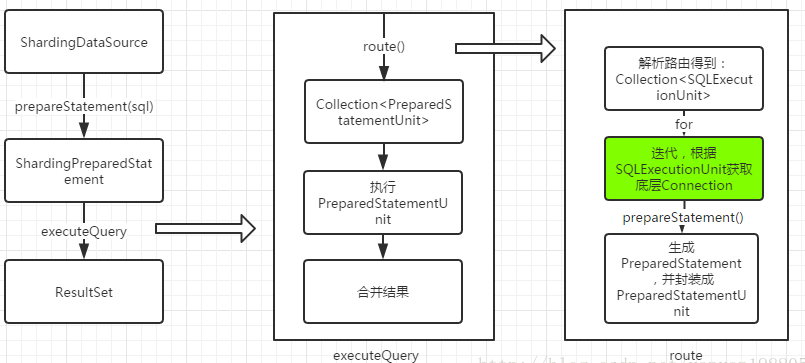

sharding-jdbc使用ShardingPreparedStatement来替代PreparedStatement，在执行ShardingPreparedStatement的executeXX方法时，通过路由计算，得到PreparedStatementUnit单元列表，然后执行后合并结果返回，而PreparedStatementUnit只不过封装了原生的PreparedStatement。读写分离最关键的地方在上图标绿色的地方，也就是生成PreparedStatement的地方。

有三种情况会认为一定要走主库： 

1. 不是查询类型的语句，比如更新字段 
2. DML_FLAG变量为true的时候 
3. 强制Hint方式走主库

当执行了更新语句的时候，isMasterRoute()==true，这时候，Connection为主库的连接，并且引擎会强制设置DML_FLAG的值为true，这样一个请求后续的所有读操作都会走主库。 
有些时候，我们想强制走主库，这时候在请求最开始执行Hint操作即可，如下所示：

```
HintManager hintManager = HintManager.getInstance();
hintManager.setMasterRouteOnly();
```

##### 总结

sharding-jdbc进行主从读写分离的特性实现比较简洁易懂，对spring这种上层框架而言是无感知的，而且由于它是在路由得到SQLExecutionUtil后再处理的，所以使用了读写分离特性，可以同时使用分库分表。

依赖: 

```xml
<dependency>
    <groupId>org.apache.shardingsphere</groupId>
    <artifactId>sharding-jdbc-spring-boot-starter</artifactId>
    <version>4.0.0-RC1</version>
</dependency>
```


### 2.3 数据库环境

在主库中创建一个数据库rw, 并且创建一张表， 该数据库及表结构创建完毕后会自动同步至从数据库，SQL语句如下： 

```SQL
create database rw default charset utf8mb4;

use rw;

CREATE TABLE `user` (
  `id` bigint(11) NOT NULL AUTO_INCREMENT,
  `name` varchar(255) DEFAULT NULL,
  `age` int(11) DEFAULT NULL,
  `address` varchar(255) DEFAULT NULL,
  PRIMARY KEY (`id`)
) ENGINE=InnoDB DEFAULT CHARSET=utf8mb4;

INSERT INTO user (name, age, address) VALUES ('张三', 100, '昌平');
INSERT INTO user (name, age, address) VALUES ('李四', 0, '顺义');
INSERT INTO user (name, age, address) VALUES ('星越L', 21, '北京');
```


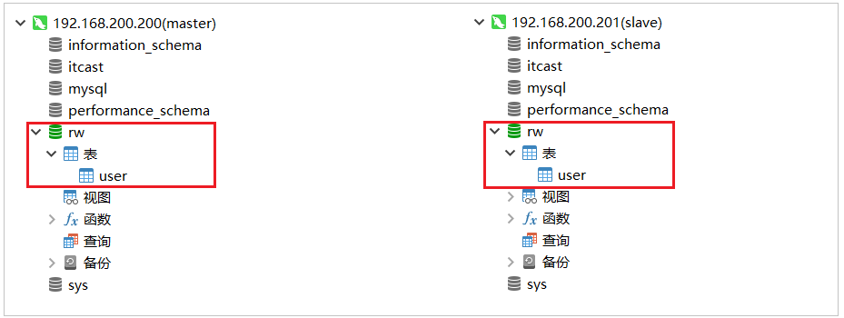 


### 2.4 初始工程导入

我们本案例主要是演示一下读写分离操作，对于基本的增删改查的业务操作，我们就不再去编写了，我们可以直接导入资料中提供的demo工程（rw_demo），在demo工程中，我们已经完成了user的增删改查操作，具体的工程结构如下： 

 


### 2.5 读写分离配置

1). 在pom.xml中增加shardingJdbc的maven坐标

```xml
<dependency>
    <groupId>org.apache.shardingsphere</groupId>
    <artifactId>sharding-jdbc-spring-boot-starter</artifactId>
    <version>4.0.0-RC1</version>
</dependency>
```


2). 在application.yml中增加配置

```yml
spring:
  main:
    # 如果当前项目中存在同名的bean,后定义的bean会覆盖先定义的
    allow-bean-definition-overriding: true
  shardingsphere:
    datasource:
      names:
        master,slave
      # 主数据源
      master:
        type: com.alibaba.druid.pool.DruidDataSource
        driver-class-name: com.mysql.cj.jdbc.Driver
        url: jdbc:mysql://192.168.120.200:3306/rw?characterEncoding=utf-8
        username: root
        password: root
      # 从数据源
      slave:
        type: com.alibaba.druid.pool.DruidDataSource
        driver-class-name: com.mysql.cj.jdbc.Driver
        url: jdbc:mysql://192.168.120.201:3306/rw?characterEncoding=utf-8
        username: root
        password: root
    masterslave:
      # 读写分离配置
      load-balance-algorithm-type: round_robin #轮询 多个从库
      # 最终的数据源名称
      name: dataSource
      # 主库数据源名称
      master-data-source-name: master
      # 从库数据源名称列表，多个逗号分隔
      slave-data-source-names: slave
    props:
      sql:
        show: true #开启SQL显示，默认false
```

https://blog.csdn.net/qq_59609098/article/details/127328007

采用docker配置主从同步

https://zhuanlan.zhihu.com/p/519923415?utm_id=0

配置解析: 

 


==如果不配置该项，项目启动之后将会报错：== 

 

报错信息表明，在声明 org.apache.shardingsphere.shardingjdbc.spring.boot 包下的SpringBootConfiguration中的dataSource这个bean时出错, 原因是有一个同名的 dataSource 的bean在com.alibaba.druid.spring.boot.autoconfigure包下的DruidDataSourceAutoConfigure类加载时已经声明了。

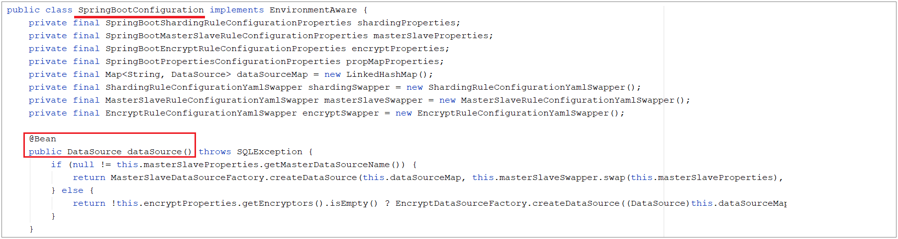 

 

而我们需要用到的是 shardingjdbc包下的dataSource，所以我们需要配置上述属性，让后加载的覆盖先加载的。


### 2.6 测试

我们使用shardingjdbc来实现读写分离，直接通过上述简单的配置就可以了。配置完毕之后，我们就可以重启服务，通过postman来访问controller的方法，来完成用户信息的增删改查，我们可以通过debug及日志的方式来查看每一次执行增删改查操作，使用的是哪个数据源，连接的是哪个数据库。

**1). 保存数据**

 

控制台输出日志，可以看到操作master主库：

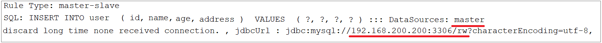  


**2). 修改数据**

 

控制台输出日志，可以看到操作master主库：

  


**3). 查询数据**

 

控制台输出日志，可以看到操作slave主库： 

 


**4). 删除数据**

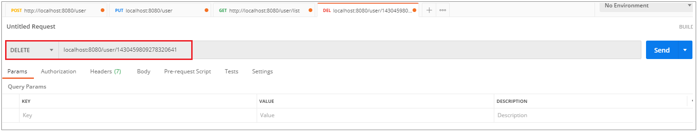 

控制台输出日志，可以看到操作master主库：

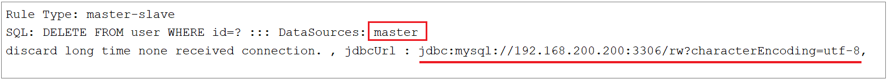 


# 3. 项目实现读写分离

### 3.1 数据库环境准备

直接使用我们前面在虚拟机中搭建的主从复制的数据库环境即可。在主库中创建施子安外卖项目的业务数据库reggie, 并导入相关表结构和数据(我们可以将自己之前在本地开发时使用的数据库数据导出, 然后导入到服务器中的主库即可)。

**1). 将自己本地的reggie数据库的数据导出SQL文件**

 

这样做的话，我们之前自己开发时，添加的测试数据都还在的，便于测试。


**2). 在主数据库master中，创建数据库reggie，并导入该SQL文件**

master中创建数据库，会自动同步至slave从库

 

在master的reggie中导入sql文件

 


### 3.2 创建Git分支

目前默认git中有两个分支master 和 v1.0 ，我们接下来进行读写分离的优化，就不在master和v1.0分支来操作了，我们需要在git上创建一个单独的分支v1.1，读写分离的优化，我们就在该分支上进行操作。具体创建分支的操作，和前面演示的一致。

当前创建的v1.1分支，是基于master分支创建出来的，所以目前master分支的代码， 和v1.1分支的代码是完全一样的，接下来把v1.1的代码也推送至远程仓库。


### 3.3 读写分离配置

**1). 在项目的pom.xml增加依赖**

```xml
<dependency>
    <groupId>org.apache.shardingsphere</groupId>
    <artifactId>sharding-jdbc-spring-boot-starter</artifactId>
    <version>4.0.0-RC1</version>
</dependency>
```


**2). 在项目的application.yml中配置数据源相关信息**

```yml
spring:
  main:
    allow-bean-definition-overriding: true
  shardingsphere:
    datasource:
      names:
        master,slave
      # 主数据源
      master:
        type: com.alibaba.druid.pool.DruidDataSource
        driver-class-name: com.mysql.cj.jdbc.Driver
        url: jdbc:mysql://192.168.120.200:3306/reggie?characterEncoding=utf-8
        username: root
        password: root
      # 从数据源
      slave:
        type: com.alibaba.druid.pool.DruidDataSource
        driver-class-name: com.mysql.cj.jdbc.Driver
        url: jdbc:mysql://192.168.120.201:3306/reggie?characterEncoding=utf-8
        username: root
        password: root
    masterslave:
      # 读写分离配置
      load-balance-algorithm-type: round_robin #轮询
      # 最终的数据源名称
      name: dataSource
      # 主库数据源名称
      master-data-source-name: master
      # 从库数据源名称列表，多个逗号分隔
      slave-data-source-names: slave
    props:
      sql:
        show: true #开启SQL显示，默认false
```


### 3.4 功能测试

配置完毕之后，我们启动项目进行测试，直接访问系统管理后台的页面，然后执行相关业务操作，看控制台输出的日志信息即可。

查询操作： 

 


更新操作：

 


插入操作：

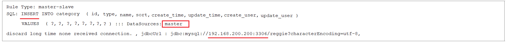 


删除操作：

 


### 3.5 Git合并代码

读写分离的功能我们已经实现完毕了，那么接下来，我们就可以将当前分支v1.1代码提交并推送到远程仓库。

 

 


然后，再将v1.1的代码，合并到master分支，然后推送至远程仓库。

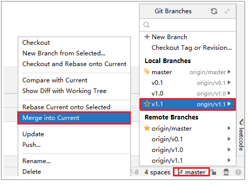 


# 4. Nginx-概述

### 4.1 介绍

 

Nginx是一款轻量级的Web服务器/反向代理服务器及电子邮件（IMAP/POP3）代理服务器。其特点是占有内存少，并发能力强，事实上nginx的并发能力在同类型的网页服务器中表现较好，中国大陆使用nginx的网站有：百度、京东、新浪、网易、腾讯、淘宝等。


Nginx是由**伊戈尔·赛索耶夫**为俄罗斯访问量第二的Rambler.ru站点（俄文：Рамблер）开发的，第一个公开版本0.1.0发布于2004年10月4日。


官网：https://nginx.org/


### 4.2 下载和安装

#### 4.2.1 下载

在Nginx的官网的下载页面中(http://nginx.org/en/download.html)，就展示了当前Nginx版本，并提供了下载的连接。 如下： 

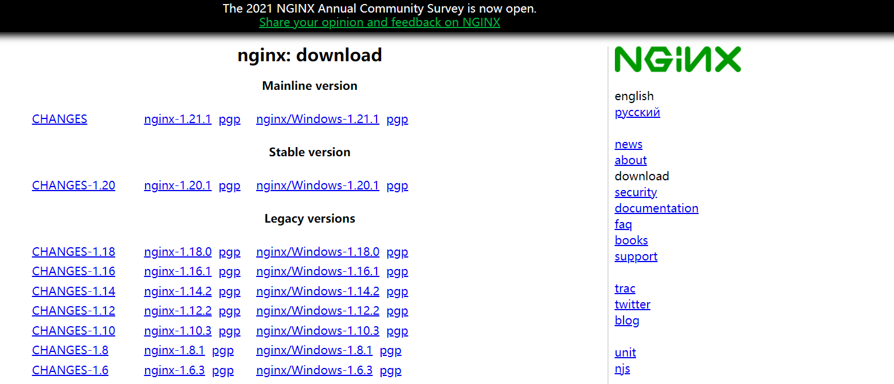 

在本项目中，我们所学习的Nginx选择的是稳定版本的1.16这个版本，我们可以直接从官网下载，当然在我们的课程资料中也已经提供了该版本的安装包。

 


#### 4.2.2 安装

**1). 安装依赖包**

由于nginx是基于c语言开发的，所以需要安装c语言的编译环境，及正则表达式库等第三方依赖库。

```
yum -y install gcc pcre-devel zlib-devel openssl openssl-devel
```


**2). 下载Nginx安装包**

```
yum install wget
wget https://nginx.org/download/nginx-1.16.1.tar.gz
```

> wget : 
>
> ​	wget命令用来从指定的URL下载文件。wget非常稳定，它在带宽很窄的情况下和不稳定网络中有很强的适应性，如果是由于网络的原因下载失败，wget会不断的尝试，直到整个文件下载完毕。如果是服务器打断下载过程，它会再次联到服务器上从停止的地方继续下载。

执行完wget指令后，就会在当前所在目录看到下载下来的文件。


**3). 解压nginx压缩包**

```
tar -zxvf nginx-1.16.1.tar.gz
```


**4). 配置Nginx编译环境**

```
cd nginx-1.16.1
./configure --prefix=/usr/local/nginx
```

说明: 

​	--prefix 指定的目录，就是我们安装Nginx的目录。


**5). 编译&安装**

```
make & make install
```


### 4.3 目录结构

安装完Nginx后，我们可以切换到Nginx的安装目录(/usr/local/nginx)，先来熟悉一下Nginx的目录结构，如下图：

 

> 备注： 
>
> ​	上述我们用到的一个指令 tree，该指令可以将我们指定的目录以树状结构展示出来。如果没有这个指令，可以通过以下指令进行安装。
>
> ​	yum install tree


重点目录和文件如下: 

| 目录/文件       | 说明                                | 备注                                                      |
| --------------- | ----------------------------------- | --------------------------------------------------------- |
| conf            | 配置文件的存放目录                  |                                                           |
| conf/nginx.conf | Nginx的核心配置文件                 | conf下有很多nginx的配置文件，我们主要操作这个核心配置文件 |
| html            | 存放静态资源(html, css, )           | 部署到Nginx的静态资源都可以放在html目录中                 |
| logs            | 存放nginx日志(访问日志、错误日志等) |                                                           |
| sbin/nginx      | 二进制文件，用于启动、停止Nginx服务 |                                                           |


# 5. Nginx-命令

### 5.1 常用命令

Nginx中，我们的二进制可执行文件(nginx)存放在sbin目录下，虽然只有一个可执行文件，但是我们可以通过该指令配合不同的参数达到更加强大的功能。接下来，我们就演示一下Nginx常见指令, 在执行下面的指令时,都需要在/usr/local/nginx/sbin/目录下执行。


**1). 查看版本**

```
./nginx -v
```

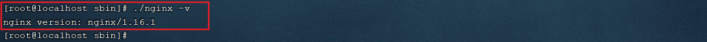 


**2). 检查配置文件**

修改了nginx.conf核心配置文件之后，在启动Nginx服务之前，可以先检查一下conf/nginx.conf文件配置的是否有错误，命令如下：

```
./nginx -t
```

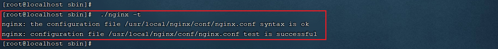 


**3). 启动**

```
./nginx
```

启动之后，我们可以通过ps -ef指令来查看nginx的进程是否存在。

 

注意： nginx服务启动后，默认就会有两个进程。


启动之后，我们可以直接访问Nginx的80端口， http://192.168.120.200

 


> 注意：
>
> ​	要想正常访问Nginx，需要关闭防火墙或开放指定端口号，执行的指令如下： 
>
> ​	A. 关闭防火墙
>
> ​		systemctl stop firewalld
>
> ​	B. 开放80端口
>
> ​		firewall-cmd --zone=public --add-port=80/tcp --permanent
>
> ​		firewall-cmd --reload


**4). 停止**

```
./nginx -s stop
```

停止之后，我们可以查看nginx的进程： 

```
ps -ef|grep nginx
```

 


**5). 重新加载**

当修改了Nginx配置文件后，需要重新加载才能生效，可以使用下面命令重新加载配置文件：

```
./nginx -s reload
```


# 6. Nginx-应用

介绍了并安装了Nginx之后，本章节将要讲解的是Nginx的使用，我们主要从以下四个方面进行讲解。

### 6.1 配置文件结构

nginx的配置文件(conf/nginx.conf)整体上分为三部分: 全局块、events块、http块。这三块的分别配置什么样的信息呢，看下表： 

| 区域     | 职责                                     |
| -------- | ---------------------------------------- |
| 全局块   | 配置和nginx运行相关的全局配置            |
| events块 | 配置和网络连接相关的配置                 |
| http块   | 配置代理、缓存、日志记录、虚拟主机等配置 |


具体结构图如下: 

 

> 在全局块、events块以及http块中，我们经常配置的是http块。
>
> 在http块中可以包含多个server块,每个server块可以配置多个location块。


### 6.2 部署静态资源

#### 6.2.1 介绍

Nginx可以作为静态web服务器来部署静态资源。这里所说的静态资源是指在服务端真实存在，并且能够直接展示的一些文件，比如常见的html页面、css文件、js文件、图片、视频等资源。

相对于Tomcat，Nginx处理静态资源的能力更加高效，所以在生产环境下，一般都会将静态资源部署到Nginx中。

将静态资源部署到Nginx非常简单，只需要将文件复制到Nginx安装目录下的html目录中即可。

```properties
server {
    listen 80;				#监听端口	
    server_name localhost;	#服务器名称
    location / {			#匹配客户端请求url
        root html;			#指定静态资源根目录
        index index.html;	#指定默认首页
    }
}
```


#### 6.2.2 测试

在资料中，我们提供了一个静态的html文件，我们需要将这个文件部署到nginx中，然后通过nginx访问html静态资源。


**1). 将静态资源上传到 /usr/local/nginx/html 目录**

 


**2). 启动nginx**

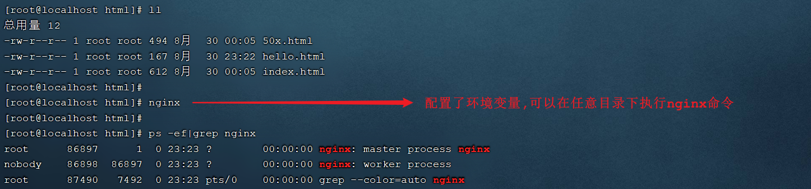 


**3). 访问**

http://192.168.120.200/hello.html

 


http://192.168.120.200 ， 访问该地址，访问的是nginx的默认首页

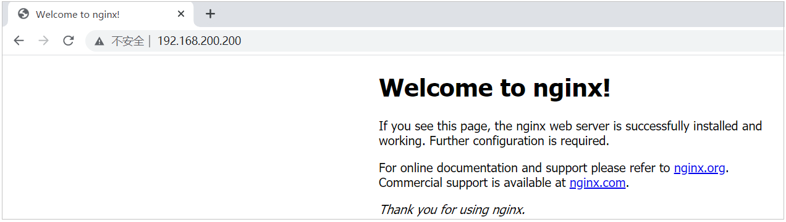 


**4). 配置首页**

 

如果我们需要将hello.html作为nginx的首页，可以修改location的index指令，配置为hello.html，如下：

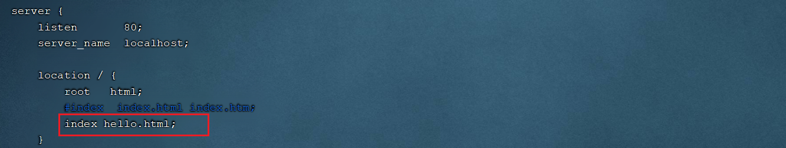 

配置完毕后，我们可以通过指令，来检查配置文件是否配置正确： nginx -t

 

配置文件修改了，我们需要重新加载一下，才可以生效： 

```
nginx -s reload
```


**5). 访问**

http://192.168.120.200

 


### 6.3 反向代理

#### 6.3.1 概念介绍

1). 正向代理

正向代理服务器是一个位于客户端和原始服务器(origin server)之间的服务器，为了从原始服务器取得内容，客户端向代理发送一个请求并指定目标(原始服务器)，然后代理向原始服务器转交请求并将获得的内容返回给客户端。

正向代理的典型用途是为在防火墙内的局域网客户端提供访问Internet的途径。

正向代理一般是**在客户端设置代理服务器**，通过代理服务器转发请求，最终访问到目标服务器。

 


2). 反向代理

反向代理服务器位于用户与目标服务器之间，但是对于用户而言，反向代理服务器就相当于目标服务器，即用户直接访问反向代理服务器就可以获得目标服务器的资源，反向代理服务器负责将请求转发给目标服务器。用户不需要知道目标服务器的地址，也无须在用户端作任何设定，对于用户来说，访问反向代理服务器是完全无感知的。

 

那么在本小节，我们就是要使用nginx来作为反向代理服务器使用。 在nginx中，我们可以在nginx.conf中配置反向代理: 

```properties
server {
    listen 82;
    server_name localhost;
    location / {
        proxy_pass http://192.168.80.122:8080; 	#反向代理配置，将请求转发到指定服务
    }
}
```

上述配置的含义为: 当我们访问nginx的82端口时，根据反向代理配置，会将请求转发到 http://192.168.120.201:8080 对应的服务上。


#### 6.3.2 测试

需求: 在192.168.120.201这台服务器中部署了java应用，运行端口为8080，并提供了一个可访问的链接 /hello。现在我们需要在访问nginx的82端口时，通过nginx将请求转发到192.168.120.201:8080的服务。

 


**1). 在192.168.120.201部署服务并启动**

将资料中提供的 helloworld-1.0-SNAPSHOT.jar 上传到服务器端，并通过指令 java -jar helloworld-1.0-SNAPSHOT.jar 运行服务。

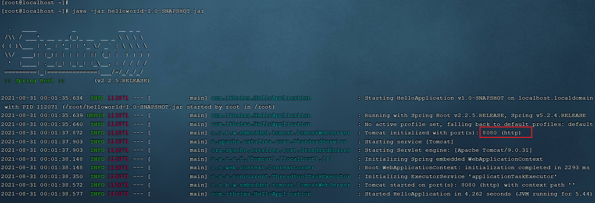 


**2). 在192.168.120.200中的nginx.conf中配置反向代理**

进入nginx的安装目录，并编辑配置文件nginx.conf:

```
cd /usr/local/nginx/conf/
vim nginx.conf
```


在http块中,再添加一个server块虚拟主机的配置,监听82端口,并配置反向代理proxy_pass: 

```
server {
    listen 82;
    server_name localhost;
    location / {
        proxy_pass http://192.168.120.201:8080; 	#反向代理配置，将请求转发到指定服务
    }
}
```

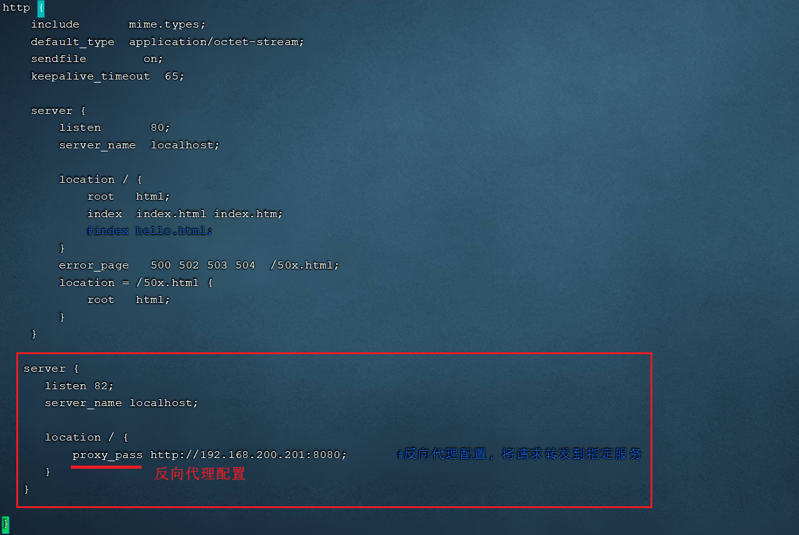 


**3). 检查配置文件，并重新加载**

```
nginx -t
```

 


```
nginx -s reload
```


**4). 访问**

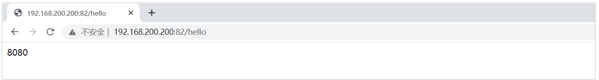 


==注意: 在访问82端口时，有可能访问不通，原因是以为防火墙中没有开放端口号。我们可以通过两种方式来解决该问题：== 

==A. 关闭防火墙== 

```
systemctl stop firewalld
```

==B. 开发指定端口==

```
firewall-cmd --zone=public --add-port=82/tcp --permanent

firewall-cmd --reload
```


### 6.4 负载均衡

#### 6.4.1 概念介绍

早期的网站流量和业务功能都比较简单，单台服务器就可以满足基本需求，但是随着互联网的发展，业务流量越来越大并且业务逻辑也越来越复杂，单台服务器的性能及单点故障问题就凸显出来了，因此需要多台服务器组成应用集群，进行性能的水平扩展以及避免单点故障出现。

**应用集群：**将同一应用部署到多台机器上，组成应用集群，接收负载均衡器分发的请求，进行业务处理并返回响应数据

**负载均衡器：**将用户请求根据对应的负载均衡算法分发到应用集群中的一台服务器进行处理

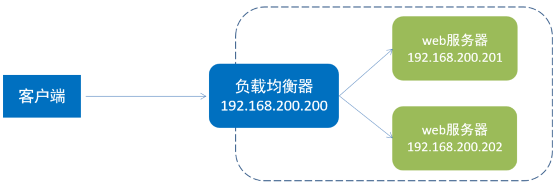  

此处的负载均衡器，我们将会使用Nginx来实现，而Nginx的负载均衡是基于反向代理的，只不过此时所代理的服务器不是一台，而是多台。

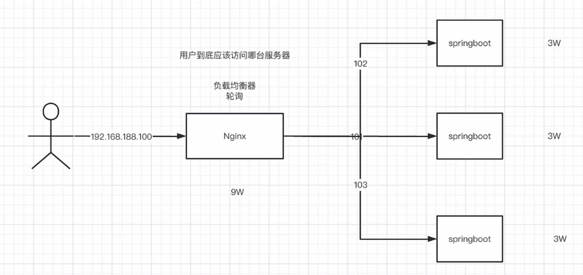

#### 6.4.2 测试

**1). 将资料中提供的两个jar包，上传到192.168.120.201服务器上**

| jar                                                          | 运行端口 | 请求链接 | 响应数据 |
| ------------------------------------------------------------ | -------- | -------- | -------- |
|  | 8080     | /hello   | 8080     |
|  | 8081     | /hello   | 8081     |

> 我们在测试时，并没有那么多服务器，我们可以在一台服务器中启动多个服务，运行在不同的端口号上进行测试。


**2). 运行上传上来的两个jar包，运行端口分别是 8080 ， 8081**

由于我们执行 java -jar 指令会占用前台窗口，所以我们可以开启两个窗口进行测试。

 

 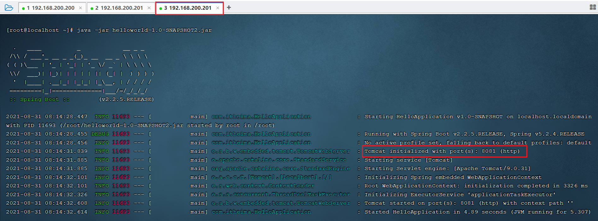


**3). 在nginx中配置负载均衡**

打开nginx的配置文件nginx.conf并增加如下配置: 

```properties
#upstream指令可以定义一组服务器
upstream targetserver{	
    server 192.168.80.122:8080;
    server 192.168.80.123:8081;
}

server {
    listen       8888;
    server_name  localhost;
    location / {
        proxy_pass http://targetserver;
    }
}
```


具体的配置位置如下: 

 


**4). 重新加载nginx配置文件,访问**

```shell
nginx -s reload
```

测试时,我们直接访问nginx的8080端口(http://192.168.120.200:8080), 此时nginx会根据负载均衡策略,将请求转发到后面的两台服务器。

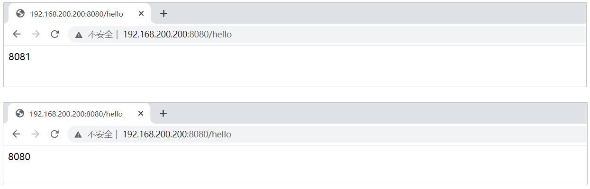 

在上述的测试过程中，我们看到请求均衡的转发到了8080和8081，因为模式的负载均衡策略是轮询。


<font color="red" size="5">注意: 上述所有涉及到的端口号，都需要在对应的服务器的防火墙中开放，或者彻底关闭防火墙</font>


#### 6.4.3 <font color=gree>负载均衡策略（面试题）</font>

处理上述默认的轮询策略以外，在Nginx中还提供了其他的负载均衡策略，如下： 

| **名称**   | **说明**         | 特点                                                         |
| ---------- | ---------------- | ------------------------------------------------------------ |
| 轮询       | 默认方式         |                                                              |
| weight     | 权重方式         | 根据权重分发请求,权重大的分配到请求的概率大                  |
| ip_hash    | 依据ip分配方式   | 根据客户端请求的IP地址计算hash值， 根据hash值来分发请求, 同一个IP发起的请求, 会发转发到同一个服务器上 |
| least_conn | 依据最少连接方式 | 哪个服务器当前处理的连接少, 请求优先转发到这台服务器         |
| url_hash   | 依据url分配方式  | 根据客户端请求url的hash值，来分发请求, 同一个url请求, 会发转发到同一个服务器上 |
| fair       | 依据响应时间方式 | 优先把请求分发给处理请求时间短的服务器                       |


权重的配置： 

```properties
#upstream指令可以定义一组服务器
upstream targetserver{	
    server 192.168.120.201:8080 weight=10;
    server 192.168.120.201:8081 weight=5;
}
```

上述配置的weight权重是相对的，在上述的配置中，效果就是，在大数据量的请求下，最终8080接收的请求数是8081的两倍。


# 【附录】

### 1.安装mysql（mariadb）【yum】

MariaDB数据库管理系统是MySQL的一个分支，主要由开源社区在维护，采用GPL授权许可 MariaDB的目的是完全兼容MySQL，包括API和命令行，使之能轻松成为MySQL的代替品。在存储引擎方面，使用XtraDB（英语：XtraDB）来代替MySQL的InnoDB

​	1）查看CentOS自带的mysql

​		输入 rpm -qa | grep mysql

​	2）将自带的mysql卸载

​		rpm -e --nodeps   

​	3）yum安装

```shell
yum -y install mariadb-server
```

​	4）启动mysql

```shell
systemctl start mariadb
```

   5）设置root密码

​	**注:这只是设置root用户在本机(linux)登录时的密码**  

  ~~~shell
mysqladmin -u root password 'root'	
  ~~~

​	6）进入mysql

```
mysql -u root -p
```

 备注：输入密码:root

进入到数据库的执行命令行里面了。

    7)	进入mysql，并执行下面sql

**保证密码和本地一致**  

下面的话在**mysql数据库里面**里面执行

```mysql
  -- 查看当前的数据库
show databases;
  -- 打开mysql
use mysql;
  -- 查看所有表
show tables;
  -- 我们不用ipv6的地址，直接把host改为%，表示所有客户端都可以连接；同时设置密码为root
update user set host='%' ,password=password("root") where user='root' and host = '::1' ;
  -- 刷新后才能生效
flush privileges;
```

**退出数据库命令操作**

~~~shell
exit;
~~~

8) 开放端口号 (Linux命令)

```shell
# 开放端口命令
firewall-cmd --zone=public --add-port=3306/tcp --permanent
#重新加载配置
firewall-cmd --reload
#关闭防火墙
systemctl stop firewalld
```


### 2.Nginx环境变量配置

在上述我们在使用nginx命令在进行服务的启动、停止、重新加载时，都需要用到一个指令nginx，而这个指令是在nginx/sbin目录下的，我们每一次使用这个指令都需要切换到sbin目录才可以，使用相对繁琐。那么我们能不能在任意目录下都可以执行该指令来操作nginx呢？答案是可以的，配置nginx的环境变量即可。


通过vim编辑器，打开/etc/profile文件, 在PATH环境变量中增加nginx的sbin目录，如下： 

 

修改完配置文件之后，需要执行 source /etc/profile 使文件生效。 接下来，我们就可以在任意目录下执行nginx的指令了，如： 

 

​	
