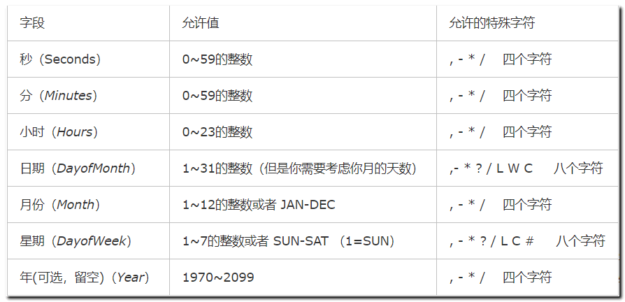
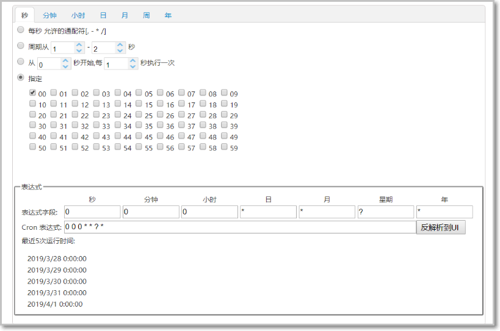
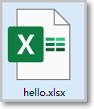
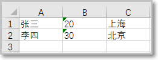
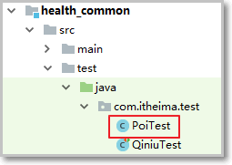

### 1 定时清理垃圾图片

**定时任务组件SpringTask,可以根据我们设定的周期，定时执行目标任务计划**

#### 1.1 SpringTask

```java
SpringBoot项目可以直接使用SpringTask作为定时任务工具，不需要添加任何其他依赖
```

##### 第二步：SpringBoot使用SpringTask

```markdown
- @Scheduled   任务调度执行  注解添加到目标对象的方法上即可  配置方法的执行周期

- @EnableScheduling  开启任务调度  在启动类上添加  
```

注意启动类的**位置**

注意：启动类要添加注解：**@EnableScheduling /**/  开启任务调度

```java
@Component //  定义任务实现类
public class AliyunOssScanClean {

    /**
     * 但是spring的@Scheduled只支持6位，年份是不支持的，带年份的7位格式会报错：
     * Cron expression must consist of 6 fields (found 7 in "1/5 * * * * ? 2018")
     *
     * 
     * @Scheduled 注解表示当前方法就是一个任务调度执行对象 
     * 通过cron表达式 来配置 该方法的执行周期
     * **/

    @Scheduled(cron = "*/5 * * * * ?") //  5秒 直接在方法上使用注解即可完成扫描
      public  void  run(){
          System.out.println("----执行扫描一次1---");
      }
      
      
      @Scheduled(cron = "*/3 * * * * ?") //  直接在方法上使用注解即可完成扫描
      public  void  run1(){
          System.out.println("----执行扫描一次2---");
      }
    
      
      @Scheduled(cron = "*/2 * * * * ?") //  直接在方法上使用注解即可完成扫描
    public  void  run2(){
        System.out.println("----执行扫描一次3---");
    }
    
}

```

```xml
 <!--quartz 定时任务框架-->
        <dependency>
            <groupId>org.springframework.boot</groupId>
            <artifactId>spring-boot-starter-quartz</artifactId>
        </dependency>
```


#### 1.3  cron表达式学习

上面的入门案例中我们指定了一个表达式：0/3 \* \* \* \* ?

这种表达式称为cron表达式，通过cron表达式可以灵活的定义出符合要求的程序执行的时间。

本小节我们就来学习一下cron表达式的使用方法。

Cron表达式是一个字符串，字符串以5或6个空格隔开，分为6或7个域，每一个域代表一个含义，Cron有如下两种语法格式：

```java
　　（1） Seconds Minutes Hours DayofMonth Month DayofWeek Year

　　（2）Seconds Minutes Hours DayofMonth Month DayofWeek

```

**cron从左到右（用空格隔开）：秒 分 小时 月份中的日期 月份 星期中的日期 年份**

 

每个域都有自己允许的值和一些特殊字符构成,使用这些特殊字符可以使我们定义的表达式更加灵活。

下面是对这些特殊字符的介绍：

```java
   （1）*：表示匹配该域的任意值。假如在Minutes域使用*, 即表示每分钟都会触发事件。

　　（2）?：只能用在DayofMonth和DayofWeek两个域。它也匹配域的任意值，但实际不会。因为DayofMonth和DayofWeek会相互影响。例如想在每月的20日触发调度，不管20日到底是星期几，则只能使用如下写法： 13 13 15 20 * ?, 其中最后一位只能用？，而不能使用*，如果使用*表示不管星期几都会触发，实际上并不是这样。

　　（3）-：表示范围。例如在Minutes域使用5-20，表示从5分到20分钟每分钟触发一次 

　　（4）/：表示起始时间开始触发，然后每隔固定时间触发一次。例如在Minutes域使用5/20,则意味着5分钟触发一次，而25，45等分别触发一次. 

　　（5）,：表示列出枚举值。例如：在Minutes域使用5,20，则意味着在5和20分每分钟触发一次。 

　　（6）L：表示最后，只能出现在DayofWeek和DayofMonth域。如果在DayofWeek域使用5L,意味着在最后的一个星期四触发。 

　　（7）W:表示有效工作日(周一到周五),只能出现在DayofMonth域，系统将在离指定日期的最近的有效工作日触发事件。例如：在 DayofMonth使用5W，如果5日是星期六，则将在最近的工作日：星期五，即4日触发。如果5日是星期天，则在6日(周一)触发；如果5日在星期一到星期五中的一天，则就在5日触发。另外一点，W的最近寻找不会跨过月份 。

　　（8）LW:这两个字符可以连用，表示在某个月最后一个工作日，即最后一个星期五。 

　　（9）#:用于确定每个月第几个星期几，只能出现在DayofMonth域。例如在4#2，表示某月的第二个星期三。

```

cron表达式案例：

```java
*/5 * * * * ? 每隔5秒执行一次
0 */1 * * * ? 每隔1分钟执行一次
0 0 5-15 * * ? 每天5-15点整点触发
0 0/3 * * * ? 每三分钟触发一次
0 0-5 14 * * ? 在每天下午2点到下午2:05期间的每1分钟触发 
0 0/5 14 * * ? 在每天下午2点到下午2:55期间的每5分钟触发
0 0/5 14,18 * * ? 在每天下午2点到2:55期间和下午6点到6:55期间的每5分钟触发


0 0 12 ? * WED 表示每个星期三中午12点
0 0 17 ? * TUES,THUR,SAT 每周二、四、六下午五点
0 10,44 14 ? 3 WED 每年三月的星期三的下午2:10和2:44触发 
0 15 10 ? * MON-FRI 周一至周五的上午10:15触发


"30 10 * * * ?" 每小时的10分30秒触发任务
"30 10 1 * * ?" 每天1点10分30秒触发任务
"30 10 1 20 * ?" 每月20号1点10分30秒触发任务
"30 10 1 20 10 ? *" 每年10月20号1点10分30秒触发任务
"30 10 1 20 10 ? 2011" 2011年10月20号1点10分30秒触发任务
"30 10 1 ? 10 * 2011" 2011年10月每天1点10分30秒触发任务
"30 10 1 ? 10 SUN 2011" 2011年10月每周日1点10分30秒触发任务
"15,30,45 * * * * ?" 每15秒，30秒，45秒时触发任务


0 * * * * ? 每1分钟触发一次

0 0 * * * ? 每天每1小时触发一次

0 0 10 * * ? 每天10点触发一次

0 * 14 * * ? 在每天下午2点到下午2:59期间的每1分钟触发

0 30 9 1 * ? 每月1号上午9点半

0 15 10 15 * ? 每月15日上午10:15触发

*/15 * * * * ? 每隔5秒执行一次

0 */1 * * * ? 每隔1分钟执行一次

0 0 5-15 * * ? 每天5-15点整点触发

0 0/3 * * * ? 每三分钟触发一次

0 0-5 14 * * ? 在每天下午2点到下午2:05期间的每1分钟触发

0 0/5 14 * * ? 在每天下午2点到下午2:55期间的每5分钟触发

0 0/5 14,18 * * ? 在每天下午2点到2:55期间和下午6点到6:55期间的每5分钟触发

0 0/30 9-17 * * ? 朝九晚五工作时间内每半小时

0 0 10,14,16 * * ? 每天上午10点，下午2点，4点

0 0 12 ? * WED 表示每个星期三中午12点

0 0 17 ? * TUES,THUR,SAT 每周二、四、六下午五点

0 10,44 14 ? 3 WED 每年三月的星期三的下午2:10和2:44触发

0 15 10 ? * MON-FRI 周一至周五的上午10:15触发

0 0 23 L * ? 每月最后一天23点执行一次

0 15 10 L * ? 每月最后一日的上午10:15触发

0 15 10 ? * 6L 每月的最后一个星期五上午10:15触发

0 15 10 * * ? 2005 2005年的每天上午10:15触发

0 15 10 ? * 6L 2002-2005 2002年至2005年的每月的最后一个星期五上午10:15触发

0 15 10 ? * 6#3 每月的第三个星期五上午10:15触发

```


#### 1.4 cron表达式在线生成器

前面介绍了cron表达式，但是自己编写表达式还是有一些困难的，我们可以借助一些cron表达式在线生成器来根据我们的需求生成表达式即可。

<http://cron.qqe2.com/>



#### 1.5 xxl-job 分布式任务调度

XXL-JOB是一个轻量级分布式任务调度平台，其核心设计目标是开发迅速、学习简单、轻量级、易扩展。现已开放源代码并接入多家公司线上产品线，开箱即用。

**Quartz的不足**

- 问题一：调用API的的方式操作任务，不人性化；
- 问题二：需要持久化业务QuartzJobBean到底层数据表中，系统侵入性相当严重。
- 问题三：调度逻辑和QuartzJobBean耦合在同一个项目中，这将导致一个问题，在调度任务数量逐渐增多， 同时调度任务逻辑逐渐加重的情况加，此时调度系统的性能将大大受限于业务；
- 问题四：quartz底层以“抢占式”获取DB锁并由抢占成功节点负责运行任务，会导致节点负载悬殊非常大；而XXL-JOB通过执行器实现“协同分配式”运行任务，充分发挥集群优势，负载各节点均衡。
  XXL-JOB弥补了quartz的上述不足之处。


### 2 Apache POI处理excel数据

POI介绍

```java
Apache POI是用Java编写的免费开源的跨平台的Java API，Apache
POI提供API给Java程序对Microsoft
Office格式档案读和写的功能，其中使用最多的就是使用POI操作Excel文件。
```

POI常用对象说明：

```java
HSSF － 提供读写Microsoft Excel XLS格式档案的功能  
XSSF － 提供读写Microsoft Excel OOXML XLSX格式档案的功能  
HWPF － 提供读写Microsoft Word DOC格式档案的功能  
HSLF － 提供读写Microsoft PowerPoint格式档案的功能  
HDGF － 提供读Microsoft Visio格式档案的功能  
HPBF － 提供读Microsoft Publisher格式档案的功能  
HSMF － 提供读Microsoft Outlook格式档案的功能
```

#### 2.1 快速入门案例

目标： 从Excel文件读取数据，hello.xlsx见资料：

 

内容如下：

 

##### 第一步：导入poi依赖

```xml
<!--POI读写excel框架-->
        <dependency>
            <groupId>org.apache.poi</groupId>
            <artifactId>poi</artifactId>
            <version>3.14</version>
        </dependency>
        <!--POI读写excel框架-->
        <dependency>
            <groupId>org.apache.poi</groupId>
            <artifactId>poi-ooxml</artifactId>
            <version>3.14</version>
        </dependency>
```


##### 第二步：创建测试用例

 

读取excel数据

方式一

使POI可以从一个已经存在的Excel文件中读取数据

注意 读取excel文件 api编写规则顺序：**工作簿-----工作区-----记录行 -----单元格**

POI操作Excel表格封装了几个核心对象：

**XSSFWorkbook：工作簿  
XSSFSheet：工作表  
Row：行  
Cell：单元格**

```java
public class PoiTest {  
    @Test  
    public void demo1() throws IOException {  
        //创建工作簿  
        XSSFWorkbook workbook = new XSSFWorkbook("D:\\hello.xlsx");  
        //获取工作表，既可以根据工作表的顺序获取，也可以根据工作表的名称获取  
        XSSFSheet sheet = workbook.getSheetAt(0);  
        //遍历工作表获得行对象  
        for (Row row : sheet) {  
        //遍历行对象获取单元格对象  
            for (Cell cell : row) {  
            //获得单元格中的值  
            String value = cell.getStringCellValue();  
            System.out.println(value);  
     	}  
    }  
      workbook.close();  
    }  
}
```

方式二

上面案例是通过遍历工作表获得行，遍历行获得单元格，最终获取单元格中的值。

```java
还有一种方式就是获取工作表最后一个行号，从而根据行号获得行对象，通过行获取最后一个单元格索引，从而根据单元格索引获取每行的一个单元格对象。
```

代码如下：

```java
@Test  
public void demo2() throws IOException {  
    //创建工作簿  
    XSSFWorkbook workbook = new XSSFWorkbook("D:\\hello.xlsx");  
    //获取工作表，既可以根据工作表的顺序获取，也可以根据工作表的名称获取  
    XSSFSheet sheet = workbook.getSheetAt(0);  
    //获取当前工作表最后一行的行号，行号从0开始  
    int lastRowNum = sheet.getLastRowNum();  
    for(int i=0;i<=lastRowNum;i++){  
    //根据行号获取行对象  
    XSSFRow row = sheet.getRow(i);  
    //获取当前行的最后一个单元格的索引号  
    short lastCellNum = row.getLastCellNum();  
    //遍历每一行上的每一个单元格  
        for(short j=0;j<lastCellNum;j++){  
            String value = row.getCell(j).getStringCellValue();  
            System.out.println(value);  
           }  
         }  
     workbook.close();  
}
```


##### 第三步：poi向excel写入数据

使用POI可以在内存中创建一个Excel文件并将数据写入到这个文件，最后通过输出流将内存中的Excel文件下载到磁盘

```java
@Test  
public void demo3() throws IOException {  
//在内存中创建一个Excel文件  
XSSFWorkbook workbook = new XSSFWorkbook();  
//创建工作表，指定工作表名称  
XSSFSheet sheet = workbook.createSheet("工作表");  

//创建行，0表示第一行  
XSSFRow row = sheet.createRow(0);  
//创建单元格，0表示第一个单元格  
row.createCell(0).setCellValue("编号");  
row.createCell(1).setCellValue("名称");  
row.createCell(2).setCellValue("年龄");  

XSSFRow row1 = sheet.createRow(1);  
row1.createCell(0).setCellValue("1");  
row1.createCell(1).setCellValue("小明");  
row1.createCell(2).setCellValue("10");  

XSSFRow row2 = sheet.createRow(2);  
row2.createCell(0).setCellValue("2");  
row2.createCell(1).setCellValue("小王");  
row2.createCell(2).setCellValue("20");  

//通过输出流将workbook对象输出到磁盘  
FileOutputStream out = new FileOutputStream("D:\\itcast.xlsx");  
workbook.write(out);  
out.flush();//清空缓冲区  
out.close();  
workbook.close();  

}

```

经常操作excel文件，我们可以将excel的crud封装一个通用工具类

```java
package com.itheima.health.vo;

import com.alibaba.excel.annotation.ExcelProperty;
import com.itheima.health.dto.SetmealDto;
import lombok.AllArgsConstructor;
import lombok.Data;
import lombok.NoArgsConstructor;

import java.time.LocalDate;
import java.time.LocalDateTime;
import java.util.List;

/**
 * 运营数据统计Dto
 *
 * @author Administrator
 * @date 2023/4/27
 */
@Data
@AllArgsConstructor
@NoArgsConstructor
public class ReportVo {

    /**
     * 今日到诊人数
     */
    @ExcelProperty("今日到诊数")
    private Integer todayVisitsNumber;

    /**
     * 今日日期
     */
    @ExcelProperty(value = "日期")
    private LocalDate reportDate;

   
    

}
```

# RBAC（`Role-Based Access Control`）  是基于角色的访问控制

###### 总共五张表，描述用户-角色-权限三表关系

- user 用户表
  用户表
- role角色表，
  每个用户都有自己的角色，通过角色进行权限的关联
- permission权限表
  将方法资源作为自己的权限
- role-permission
  角色-权限资源
- user-role
  用户-角色资源

###### 硬编码实现的思想

RBAC主要有user 用户表，role角色表，permission权限表，以及role-permission和user-role的中间关联表，但是实际上对于一般的需求，我们可以只使用user用户表， 里面存储字段标识 角色信息，然后在代码层面进行编码方式 使用enum枚举出所有角色表，使用 权限注解标识方法，将权限注解与方法进行一个绑定，其中权限里面包括（角色）信息,通过拦截器进行拦截权限进行筛选。
