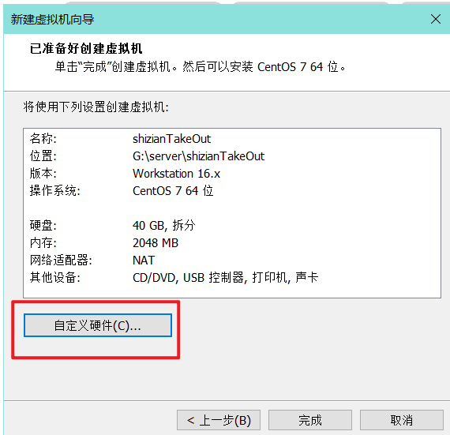

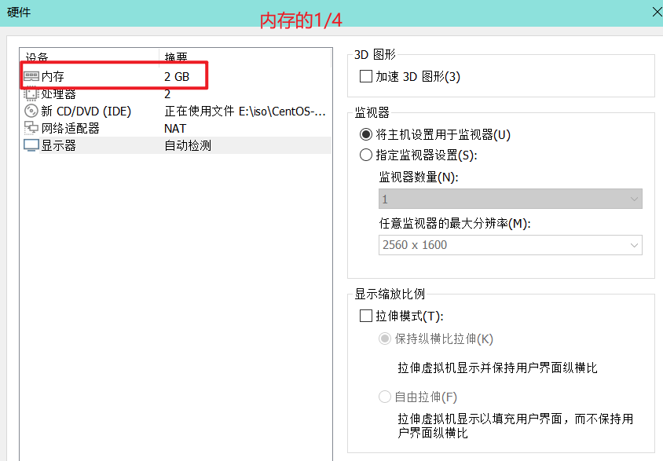

###### 桥接模式

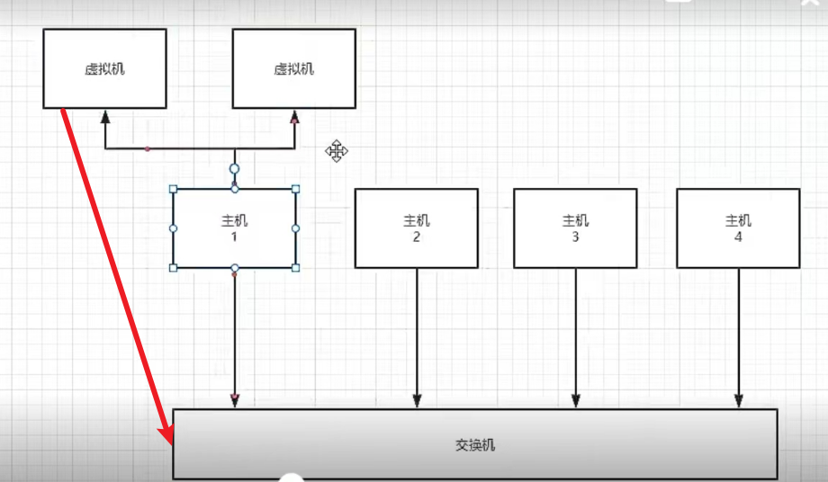

桥接模式：ip稀缺资源，虚拟机占用ip（在交换机列表给每个虚拟机分配ip地址）

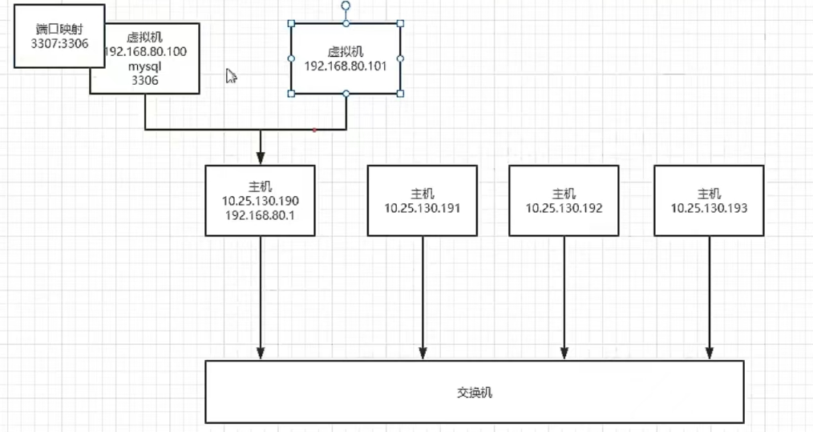

Nat模式：主机会使用自己的路由器，，新建虚拟机（ip），虚拟机使用主机网络，采用端口映射使得和其他主机相连（本机采用NAT模式）

仅主机模式：不存在路由，主机产生的虚拟机只能和主机访问，不能访问外网和其他主机交互

###### 编辑虚拟机虚拟网络

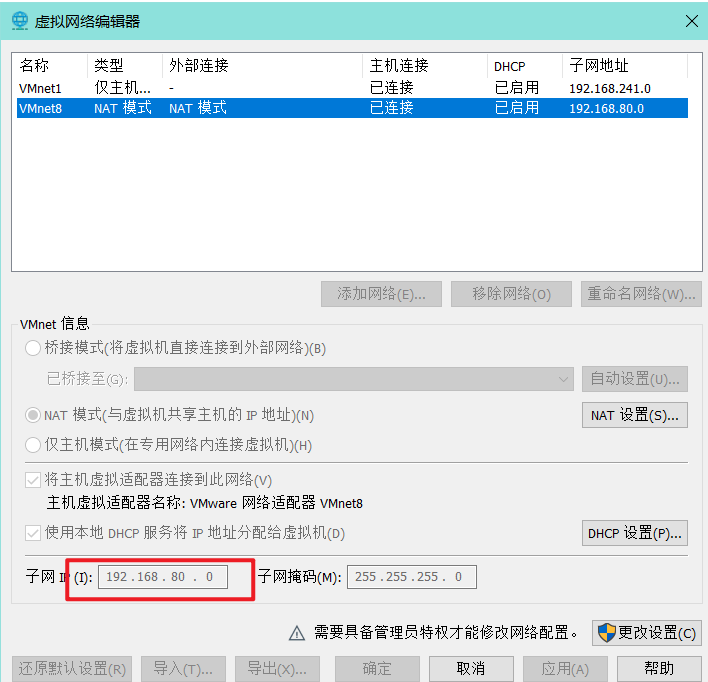

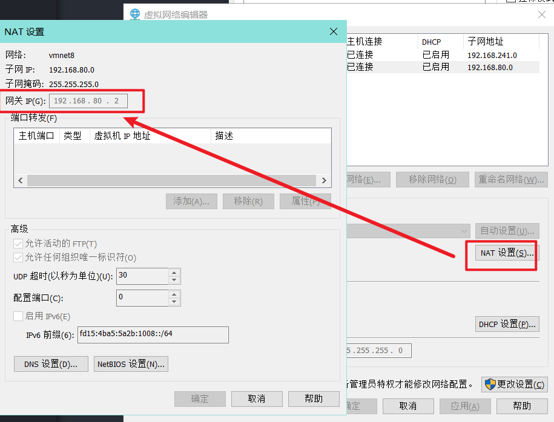

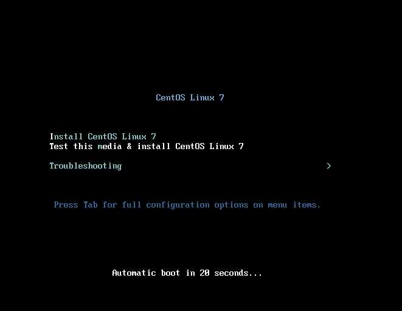

###### 选择语言

- 中文不是原版，使用英文

- 设置时间日期

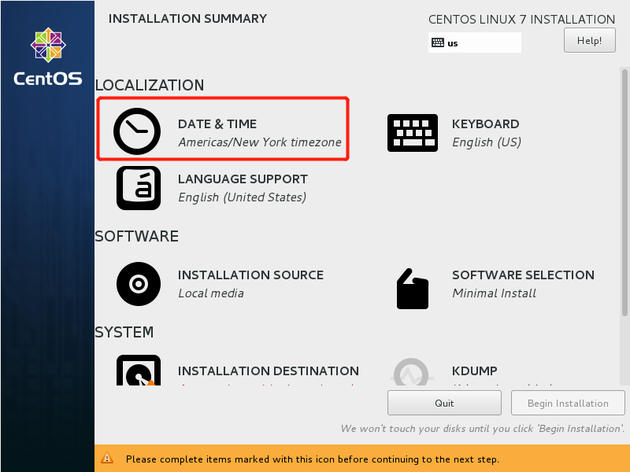

设置成当前时间

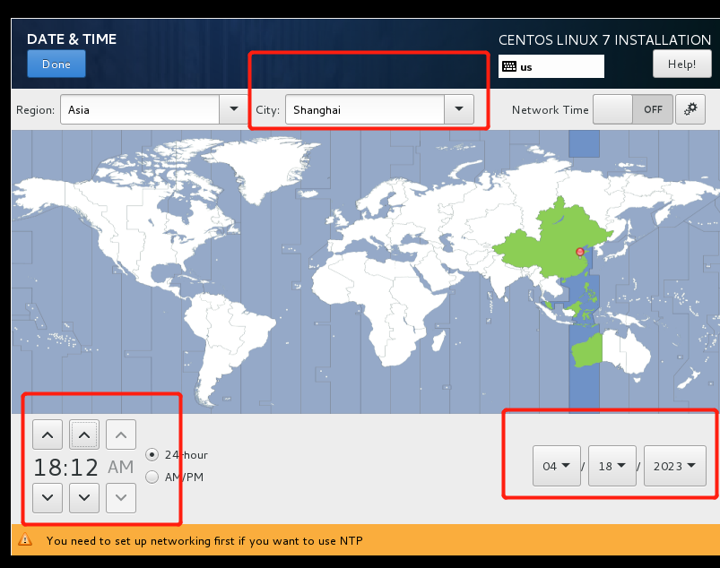

- 服务器环境

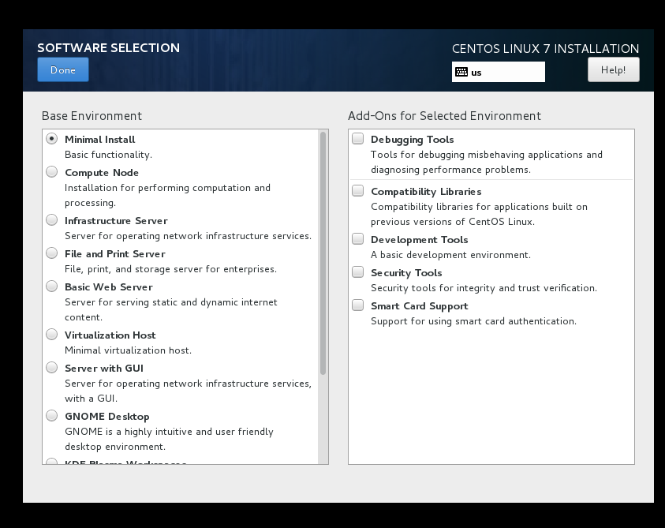

- 网络设置

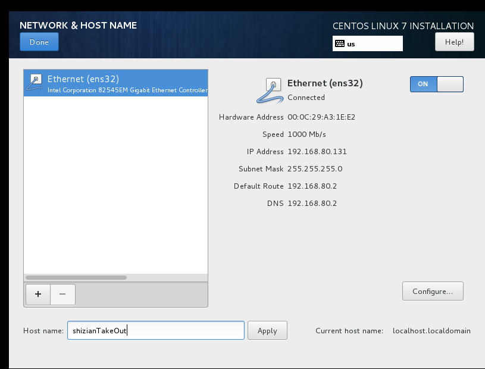

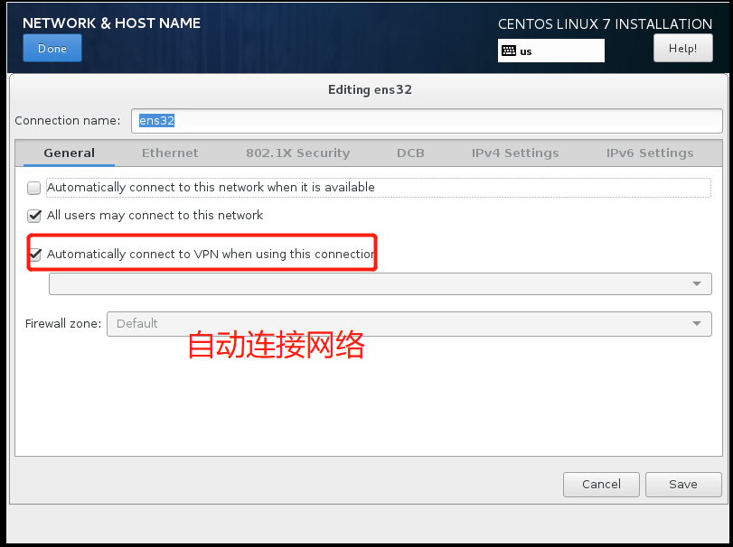

- 修改iPv4

  添加唯一ip、使用交换机dns代理

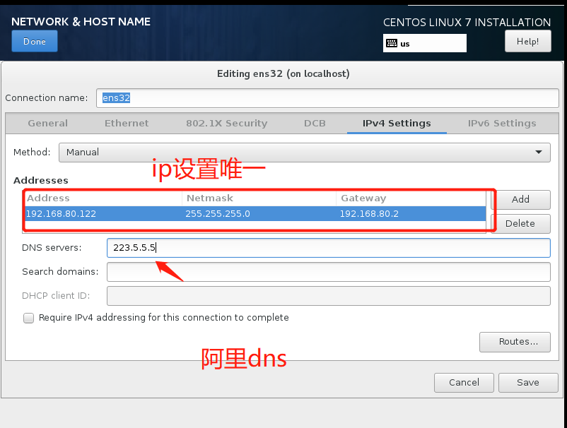

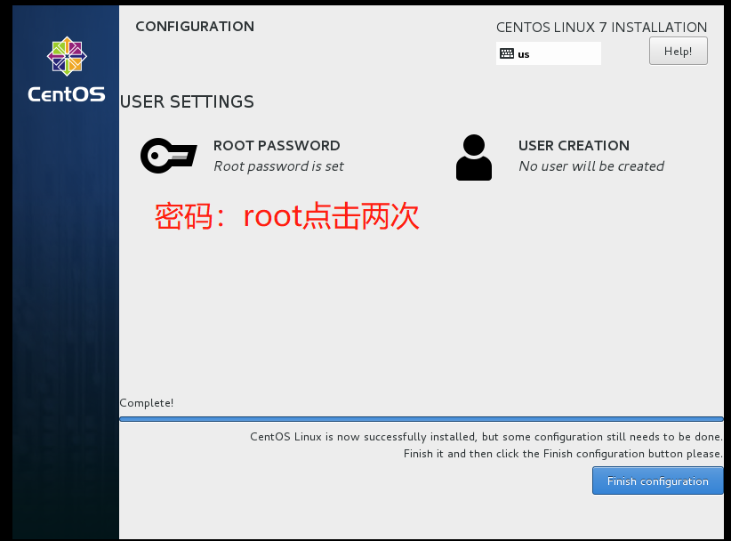