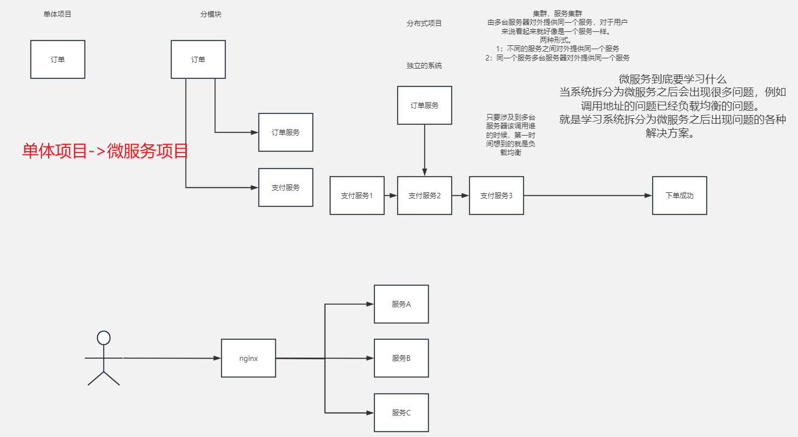
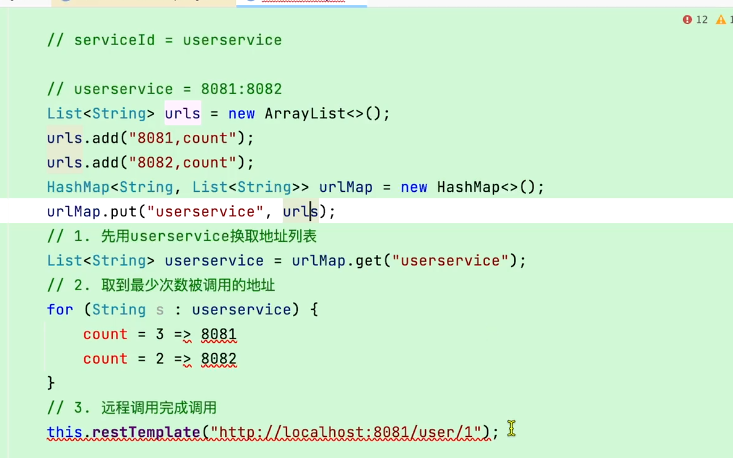
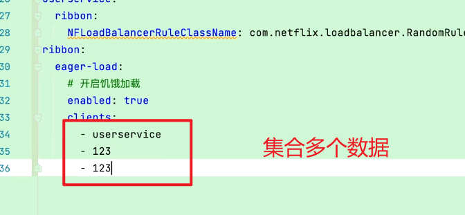
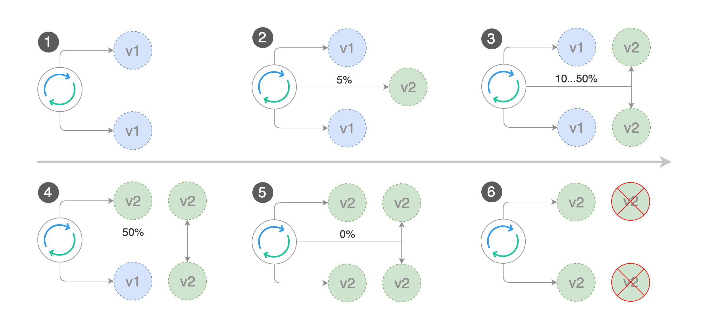
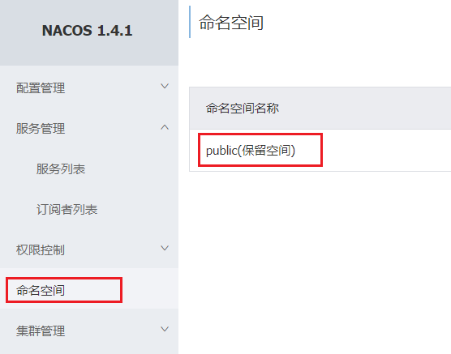

[TOC]


# SpringCloud01

集群：多台服务器对外提供同一个服务，对于用户来说看起来就像一个服务一样。

- 不同服务之间对外提供一个服务
- 同一个服务，多台服务器对外提供同一个服务。




# 1.认识微服务

随着互联网行业的发展，对服务的要求也越来越高，服务架构也从单体架构逐渐演变为现在流行的微服务架构。这些架构之间有怎样的差别呢？

## 1.0.学习目标

了解微服务架构的优缺点


## 1.1.单体架构

**单体架构**：将业务的所有功能集中在一个项目中开发，打成一个包部署。


单体架构的优缺点如下：

**优点：**

- 架构简单
- 部署成本低

**缺点：**

- 耦合度高（维护困难、升级困难）


## 1.2.分布式架构

**分布式架构**：根据业务功能对系统做拆分，每个业务功能模块作为独立项目开发，称为一个服务。


分布式架构的优缺点：

**优点：**

- 降低服务耦合
- 有利于服务升级和拓展

**缺点：**

- 服务调用关系错综复杂


分布式架构虽然降低了服务耦合，但是服务拆分时也有很多问题需要思考：

- 服务拆分的粒度如何界定？
- 服务之间如何调用？
- 服务的调用关系如何管理？

人们需要制定一套行之有效的标准来约束分布式架构。

### RBC/**/


## 1.3.微服务

微服务的架构特征：

- 单一职责：微服务拆分粒度更小，每一个服务都对应唯一的业务能力，做到单一职责
- 自治：团队独立、技术独立、数据独立，独立部署和交付
- 面向服务：服务提供统一标准的接口，与语言和技术无关
- 隔离性强：服务调用做好隔离、容错、降级，避免出现级联问题


微服务的上述特性其实是在给分布式架构制定一个标准，进一步降低服务之间的耦合度，提供服务的独立性和灵活性。做到高内聚，低耦合。

因此，可以认为**微服务**是一种经过良好架构设计的**分布式架构方案** 。

但方案该怎么落地？选用什么样的技术栈？全球的互联网公司都在积极尝试自己的微服务落地方案。

其中在Java领域最引人注目的就是SpringCloud提供的方案了。


## 1.4.SpringCloud

SpringCloud是目前国内使用最广泛的微服务框架。官网地址：https://spring.io/projects/spring-cloud。

SpringCloud集成了各种微服务功能组件，并基于SpringBoot实现了这些组件的自动装配，从而提供了良好的开箱即用体验。

其中常见的组件包括：


另外，SpringCloud底层是依赖于SpringBoot的，并且有版本的兼容关系，如下：


我们课堂学习的版本是 Hoxton.SR10，因此对应的SpringBoot版本是2.3.x版本。


## <font color=red>1.5.总结</font>

- 单体架构：简单方便，高度耦合，扩展性差，适合小型项目。例如：学生管理系统

- 分布式架构：松耦合，扩展性好，但架构复杂，难度大。适合大型互联网项目，例如：京东、淘宝

- 微服务：一种良好的分布式架构方案

  ①优点：拆分粒度更小、服务更独立、耦合度更低

  ②缺点：架构非常复杂，运维、监控、部署难度提高

- SpringCloud是微服务架构的一站式解决方案，集成了各种优秀微服务功能组件


# 2.服务拆分和远程调用

任何分布式架构都离不开服务的拆分，微服务也是一样。

## 2.1.服务拆分原则

这里我总结了微服务拆分时的几个原则：

- 不同微服务，不要重复开发相同业务
- 微服务数据独立，不要访问其它微服务的数据库
- 微服务可以将自己的业务暴露为接口，供其它微服务调用


## 2.2.服务拆分示例

以课前资料中的微服务cloud-demo为例，其结构如下：


cloud-demo：父工程，管理依赖

- order-service：订单微服务，负责订单相关业务
- user-service：用户微服务，负责用户相关业务

要求：

- 订单微服务和用户微服务都必须有各自的数据库，相互独立
- 订单服务和用户服务都对外暴露Restful的接口
- 订单服务如果需要查询用户信息，只能调用用户服务的Restful接口，不能查询用户数据库


### 2.2.1.导入Sql语句

首先，将课前资料提供的`cloud-order.sql`和`cloud-user.sql`导入到mysql中：


cloud-user表中初始数据如下：


cloud-order表中初始数据如下：


cloud-order表中持有cloud-user表中的id字段。


### 2.2.2.导入demo工程

用IDEA导入课前资料提供的Demo：


项目结构如下：


导入后，会在IDEA右下角出现弹窗：


点击弹窗，然后按下图选择：


会出现这样的菜单：


配置下项目使用的JDK：


## 2.3.实现远程调用案例


在order-service服务中，有一个根据id查询订单的接口：


根据id查询订单，返回值是Order对象，如图：


其中的user为null


在user-service中有一个根据id查询用户的接口：


查询的结果如图：


### 2.3.1.案例需求：

修改order-service中的根据id查询订单业务，要求在查询订单的同时，根据订单中包含的userId查询出用户信息，一起返回。


因此，我们需要在order-service中 向user-service发起一个http的请求，调用http://localhost:8081/user/{userId}这个接口。

大概的步骤是这样的：

- 注册一个RestTemplate的实例到Spring容器
- 修改order-service服务中的OrderService类中的queryOrderById方法，根据Order对象中的userId查询User
- 将查询的User填充到Order对象，一起返回


### 2.3.2.注册RestTemplate

首先，我们在order-service服务中的OrderApplication启动类中，注册RestTemplate实例：

```java
package cn.itcast.order;

import org.mybatis.spring.annotation.MapperScan;
import org.springframework.boot.SpringApplication;
import org.springframework.boot.autoconfigure.SpringBootApplication;
import org.springframework.context.annotation.Bean;
import org.springframework.web.client.RestTemplate;

@MapperScan("cn.itcast.order.mapper")
@SpringBootApplication
public class OrderApplication {

    public static void main(String[] args) {
        SpringApplication.run(OrderApplication.class, args);
    }

    @Bean
    public RestTemplate restTemplate() {
        return new RestTemplate();
    }
}
```


### 2.3.3.实现远程调用

修改order-service服务中的cn.itcast.order.service包下的OrderService类中的queryOrderById方法：


## 2.4.提供者与消费者

在服务调用关系中，会有两个不同的角色：

**服务提供者**：一次业务中，被其它微服务调用的服务。（提供接口给其它微服务）

**服务消费者**：一次业务中，调用其它微服务的服务。（调用其它微服务提供的接口）


但是，服务提供者与服务消费者的角色并不是绝对的，而是相对于业务而言。

如果服务A调用了服务B，而服务B又调用了服务C，服务B的角色是什么？

- 对于A调用B的业务而言：A是服务消费者，B是服务提供者
- 对于B调用C的业务而言：B是服务消费者，C是服务提供者


因此，服务B既可以是服务提供者，也可以是服务消费者。


# 3.Eureka注册中心


假如我们的服务提供者user-service部署了多个实例，如图：


大家思考几个问题：

- order-service在发起远程调用的时候，该如何得知user-service实例的ip地址和端口？
- 有多个user-service实例地址，order-service调用时该如何选择？
- order-service如何得知某个user-service实例是否依然健康，是不是已经宕机？


## 3.1.Eureka的结构和作用

这些问题都需要利用SpringCloud中的注册中心来解决，其中最广为人知的注册中心就是Eureka，其结构如下：


回答之前的各个问题。

问题1：order-service如何得知user-service实例地址？

获取地址信息的流程如下：

- user-service服务实例启动后，将自己的信息注册到eureka-server（Eureka服务端）。这个叫服务注册
- eureka-server保存服务名称到服务实例地址列表的映射关系
- order-service根据服务名称，拉取实例地址列表。这个叫服务发现或服务拉取


问题2：order-service如何从多个user-service实例中选择具体的实例？

- order-service从实例列表中利用负载均衡算法选中一个实例地址
- 向该实例地址发起远程调用


问题3：order-service如何得知某个user-service实例是否依然健康，是不是已经宕机？

- user-service会每隔一段时间（默认30秒）向eureka-server发起请求，报告自己状态，称为心跳
- 当超过一定时间没有发送心跳时，eureka-server会认为微服务实例故障，将该实例从服务列表中剔除
- order-service拉取服务时，就能将故障实例排除了


> 注意：一个微服务，既可以是服务提供者，又可以是服务消费者，因此eureka将服务注册、服务发现等功能统一封装到了eureka-client端


因此，接下来我们动手实践的步骤包括：


## 3.2.搭建eureka-server

首先大家注册中心服务端：eureka-server，这必须是一个独立的微服务

### 3.2.1.创建eureka-server服务

在cloud-demo父工程下，创建一个子模块：


填写模块信息：


然后填写服务信息：


### 3.2.2.引入eureka依赖

引入SpringCloud为eureka提供的starter依赖：

```xml
<dependency>
    <groupId>org.springframework.cloud</groupId>
    <artifactId>spring-cloud-starter-netflix-eureka-server</artifactId>
</dependency>
```


### 3.2.3.编写启动类

给eureka-server服务编写一个启动类，一定要添加一个@EnableEurekaServer注解，开启eureka的注册中心功能：

```java
package cn.itcast.eureka;

import org.springframework.boot.SpringApplication;
import org.springframework.boot.autoconfigure.SpringBootApplication;
import org.springframework.cloud.netflix.eureka.server.EnableEurekaServer;

@SpringBootApplication
@EnableEurekaServer
public class EurekaApplication {
    public static void main(String[] args) {
        SpringApplication.run(EurekaApplication.class, args);
    }
}
```


### 3.2.4.编写配置文件

编写一个application.yml文件，内容如下：

```yaml
server:
  port: 10086
spring:
  application:
    name: eureka-server
eureka:
  client:
    service-url: 
      defaultZone: http://127.0.0.1:10086/eureka
```


### 3.2.5.启动服务

启动微服务，然后在浏览器访问：http://127.0.0.1:10086

看到下面结果应该是成功了：


## 3.3.服务注册

下面，我们将user-service注册到eureka-server中去。

### 1）引入依赖

在user-service的pom文件中，引入下面的eureka-client依赖：

```xml
<dependency>
    <groupId>org.springframework.cloud</groupId>
    <artifactId>spring-cloud-starter-netflix-eureka-client</artifactId>
</dependency>
```


### 2）配置文件

在user-service中，修改application.yml文件，添加服务名称、eureka地址：

```yaml
spring:
  application:
    name: userservice
eureka:
  client:
    service-url:
      defaultZone: http://127.0.0.1:10086/eureka
```


### 3）启动多个user-service实例

为了演示一个服务有多个实例的场景，我们添加一个SpringBoot的启动配置，再启动一个user-service。


首先，复制原来的user-service启动配置：


然后，在弹出的窗口中，填写信息：


现在，SpringBoot窗口会出现两个user-service启动配置：


不过，第一个是8081端口，第二个是8082端口。

启动两个user-service实例：


查看eureka-server管理页面：


## 3.4.服务发现

下面，我们将order-service的逻辑修改：向eureka-server拉取user-service的信息，实现服务发现。

### 1）引入依赖

之前说过，服务发现、服务注册统一都封装在eureka-client依赖，因此这一步与服务注册时一致。

在order-service的pom文件中，引入下面的eureka-client依赖：

```xml
<dependency>
    <groupId>org.springframework.cloud</groupId>
    <artifactId>spring-cloud-starter-netflix-eureka-client</artifactId>
</dependency>
```


### 2）配置文件

服务发现也需要知道eureka地址，因此第二步与服务注册一致，都是配置eureka信息：

在order-service中，修改application.yml文件，添加服务名称、eureka地址：

```yaml
spring:
  application:
    name: orderservice
eureka:
  client:
    service-url:
      defaultZone: http://127.0.0.1:10086/eureka
```


### 3）服务拉取和负载均衡

最后，我们要去eureka-server中拉取user-service服务的实例列表，并且实现负载均衡。

不过这些动作不用我们去做，只需要添加一些注解即可。


在order-service的OrderApplication中，给RestTemplate这个Bean添加一个@LoadBalanced注解：


修改order-service服务中的cn.itcast.order.service包下的OrderService类中的queryOrderById方法。修改访问的url路径，用服务名代替ip、端口：


spring会自动帮助我们从eureka-server端，根据userservice这个服务名称，获取实例列表，而后完成负载均衡。


# 4.Ribbon负载均衡

上一节中，我们添加了@LoadBalanced注解，即可实现负载均衡功能，这是什么原理呢？


## 4.1.负载均衡原理

SpringCloud底层其实是利用了一个名为Ribbon的组件，来实现负载均衡功能的。


那么我们发出的请求明明是http://userservice/user/1，怎么变成了http://localhost:8081的呢？


## 4.2.源码跟踪

为什么我们只输入了service名称就可以访问了呢？之前还要获取ip和端口。

显然有人帮我们根据service名称，获取到了服务实例的ip和端口。它就是`LoadBalancerInterceptor`，这个类会在对RestTemplate的请求进行拦截，然后从Eureka根据服务id获取服务列表，随后利用负载均衡算法得到真实的服务地址信息，替换服务id。

我们进行源码跟踪：

### 1）LoadBalancerIntercepor


可以看到这里的intercept方法，拦截了用户的HttpRequest请求，然后做了几件事：

- `request.getURI()`：获取请求uri，本例中就是 http://user-service/user/8
- `originalUri.getHost()`：获取uri路径的主机名，其实就是服务id，`user-service`
- `this.loadBalancer.execute()`：处理服务id，和用户请求。

这里的`this.loadBalancer`是`LoadBalancerClient`类型，我们继续跟入。


### 2）LoadBalancerClient

继续跟入execute方法：


代码是这样的：

- getLoadBalancer(serviceId)：根据服务id获取ILoadBalancer，而ILoadBalancer会拿着服务id去eureka中获取服务列表并保存起来。
- getServer(loadBalancer)：利用内置的负载均衡算法，从服务列表中选择一个。本例中，可以看到获取了8082端口的服务


放行后，再次访问并跟踪，发现获取的是8081：

 

果然实现了负载均衡。


### 3）负载均衡策略IRule

在刚才的代码中，可以看到获取服务使通过一个`getServer`方法来做负载均衡:

 

我们继续跟入：


继续跟踪源码chooseServer方法，发现这么一段代码：

 

我们看看这个rule是谁：

 

这里的rule默认值是一个`RoundRobinRule`，看类的介绍：

 

这不就是轮询的意思嘛。

到这里，整个负载均衡的流程我们就清楚了。


### 4）总结

SpringCloudRibbon的底层采用了一个拦截器，拦截了RestTemplate发出的请求，对地址做了修改。用一幅图来总结一下：


基本流程如下：

- 拦截我们的RestTemplate请求http://userservice/user/1，经过一个负载均衡拦截器LoadBalancerInterceptor拦截器
- RibbonLoadBalancerClient会从请求url中获取服务名称，也就是user-service
- DynamicServerListLoadBalancer根据user-service到eureka拉取服务列表
- eureka返回列表，localhost:8081、localhost:8082
- IRule利用内置负载均衡规则，从列表中选择一个，例如localhost:8081
- RibbonLoadBalancerClient修改请求地址，用localhost:8081替代userservice，得到http://localhost:8081/user/1，发起真实请求



## 4.3.负载均衡策略


### 4.3.1.负载均衡策略

负载均衡的规则都定义在IRule接口中，而IRule有很多不同的实现类：


不同规则的含义如下：

| **内置负载均衡规则类**    | **规则描述**                                                 |
| ------------------------- | ------------------------------------------------------------ |
| RoundRobinRule            | 简单轮询服务列表来选择服务器。它是Ribbon默认的负载均衡规则。 |
| AvailabilityFilteringRule | 对以下两种服务器进行忽略：   （1）在默认情况下，这台服务器如果3次连接失败，这台服务器就会被设置为“短路”状态。短路状态将持续30秒，如果再次连接失败，短路的持续时间就会几何级地增加。  （2）并发数过高的服务器。如果一个服务器的并发连接数过高，配置了AvailabilityFilteringRule规则的客户端也会将其忽略。并发连接数的上限，可以由客户端的<clientName>.<clientConfigNameSpace>.ActiveConnectionsLimit属性进行配置。 |
| WeightedResponseTimeRule  | 为每一个服务器赋予一个权重值。服务器响应时间越长，这个服务器的权重就越小。这个规则会随机选择服务器，这个权重值会影响服务器的选择。 |
| **ZoneAvoidanceRule**     | 以区域可用的服务器为基础进行服务器的选择。使用Zone对服务器进行分类，这个Zone可以理解为一个机房、一个机架等。而后再对Zone内的多个服务做轮询。 |
| BestAvailableRule         | 忽略那些短路的服务器，并选择并发数较低的服务器。             |
| RandomRule                | 随机选择一个可用的服务器。                                   |
| RetryRule                 | 重试机制的选择逻辑                                           |


默认的实现就是ZoneAvoidanceRule，是一种轮询方案


### 4.3.2.自定义负载均衡策略

通过定义IRule实现可以修改负载均衡规则，有两种方式：

1. 代码方式：在order-service中的OrderApplication类中，定义一个新的IRule：

```java
@Bean
public IRule randomRule(){
    return new RandomRule();
}
```


2. 配置文件方式：在order-service的application.yml文件中，添加新的配置也可以修改规则：

```yaml
userservice: # 给某个微服务配置负载均衡规则，这里是userservice服务
  ribbon:
    NFLoadBalancerRuleClassName: com.netflix.loadbalancer.RandomRule # 负载均衡规则 
```


> **注意**，一般用默认的负载均衡规则，不做修改。


## 4.4.饥饿加载

Ribbon默认是采用懒加载，即第一次访问时才会去创建LoadBalanceClient，请求时间会很长。

而饥饿加载则会在项目启动时创建，降低第一次访问的耗时，通过下面配置开启饥饿加载：

```yaml
ribbon:
  eager-load:
    enabled: true
    clients: userservice
```



# 5.Nacos注册中心

国内公司一般都推崇阿里巴巴的技术，比如注册中心，SpringCloudAlibaba也推出了一个名为Nacos的注册中心。

## 5.1.认识和安装Nacos

[Nacos](https://nacos.io/)是阿里巴巴的产品，现在是[SpringCloud](https://spring.io/projects/spring-cloud)中的一个组件。相比[Eureka](https://github.com/Netflix/eureka)功能更加丰富，在国内受欢迎程度较高。


安装方式可以参考课前资料《Nacos安装指南.md》


## 5.2.服务注册到nacos

Nacos是SpringCloudAlibaba的组件，而SpringCloudAlibaba也遵循SpringCloud中定义的服务注册、服务发现规范。因此使用Nacos和使用Eureka对于微服务来说，并没有太大区别。

主要差异在于：

- 依赖不同
- 服务地址不同


### 1）引入依赖

在cloud-demo父工程的pom文件中的`<dependencyManagement>`中引入SpringCloudAlibaba的依赖：

```xml
<dependency>
    <groupId>com.alibaba.cloud</groupId>
    <artifactId>spring-cloud-alibaba-dependencies</artifactId>
    <version>2.2.6.RELEASE</version>
    <type>pom</type>
    <scope>import</scope>
</dependency>
```

然后在user-service和order-service中的pom文件中引入nacos-discovery依赖：

```xml
<dependency>
    <groupId>com.alibaba.cloud</groupId>
    <artifactId>spring-cloud-starter-alibaba-nacos-discovery</artifactId>
</dependency>
```


> **注意**：不要忘了注释掉eureka的依赖。


### 2）配置nacos地址

在user-service和order-service的application.yml中添加nacos地址：

```yaml
spring:
  cloud:
    nacos:
      server-addr: localhost:8848
```


> **注意**：不要忘了注释掉eureka的地址


### 3）重启

重启微服务后，登录nacos管理页面，可以看到微服务信息：


## 5.3.服务分级存储模型

一个**服务**可以有多个**实例**，例如我们的user-service，可以有:

- 127.0.0.1:8081
- 127.0.0.1:8082
- 127.0.0.1:8083

假如这些实例分布于全国各地的不同机房，例如：

- 127.0.0.1:8081，在上海机房
- 127.0.0.1:8082，在上海机房
- 127.0.0.1:8083，在杭州机房

Nacos就将同一机房内的实例 划分为一个**集群**。

也就是说，user-service是服务，一个服务可以包含多个集群，如杭州、上海，每个集群下可以有多个实例，形成分级模型，如图：


微服务互相访问时，应该尽可能访问同集群实例，因为本地访问速度更快。当本集群内不可用时，才访问其它集群。例如：


杭州机房内的order-service应该优先访问同机房的user-service。


### 5.3.1.给user-service配置集群


修改user-service的application.yml文件，添加集群配置：

```yaml
spring:
  cloud:
    nacos:
      server-addr: localhost:8848
      discovery:
        cluster-name: HZ # 集群名称
```

重启两个user-service实例后，我们可以在nacos控制台看到下面结果：


我们再次复制一个user-service启动配置，添加属性：

```sh
-Dserver.port=8083 -Dspring.cloud.nacos.discovery.cluster-name=SH
```

配置如图所示：


启动UserApplication3后再次查看nacos控制台：


### 5.3.2.同集群优先的负载均衡

默认的`ZoneAvoidanceRule`并不能实现根据同集群优先来实现负载均衡。

因此Nacos中提供了一个`NacosRule`的实现，可以优先从同集群中挑选实例。

1）给order-service配置集群信息

修改order-service的application.yml文件，添加集群配置：

```sh
spring:
  cloud:
    nacos:
      server-addr: localhost:8848
      discovery:
        cluster-name: HZ # 集群名称
```


2）修改负载均衡规则

修改order-service的application.yml文件，修改负载均衡规则：

```yaml
userservice:
  ribbon:
    NFLoadBalancerRuleClassName: com.alibaba.cloud.nacos.ribbon.NacosRule # 负载均衡规则 
```


## 5.4.权重配置

实际部署中会出现这样的场景：

服务器设备性能有差异，部分实例所在机器性能较好，另一些较差，我们希望性能好的机器承担更多的用户请求。

但默认情况下NacosRule是同集群内随机挑选，不会考虑机器的性能问题。


因此，Nacos提供了权重配置来控制访问频率，权重越大则访问频率越高。


在nacos控制台，找到user-service的实例列表，点击编辑，即可修改权重：


在弹出的编辑窗口，修改权重：


> **注意**：如果权重修改为0，则该实例永远不会被访问，权重0-1之间

## ==面试题：灰度发布==

灰度发布，又称金丝雀发布，是将应用的旧版本A与新版本B同时部署在环境中，业务请求可能会被路由到版本A的后端上，也可能会被路由到版本B的后端上。您可以自定义灰度发布策略，快速调整版本A和B的流量占比。

- 灰度发布可以在发布新版本应用时，自定义控制新版本应用流量比重，渐进式完成新版本应用的全量上线，最大限度地控制新版本发布带来的业务风险，降低故障带来的影响面，同时支持快速回滚。

- 版本问题时应用

  ***灰度发布流程图***

  

## 5.5.环境隔离

Nacos提供了namespace来实现环境隔离功能。

- nacos中可以有多个namespace
- namespace下可以有group、service等
- 不同namespace之间相互隔离，例如不同namespace的服务互相不可见（主要解决dev、test、pro生产环境，三个环境共用一个注册中心隔离问题）


### 5.5.1.创建namespace

默认情况下，所有service、data、group都在同一个namespace，名为public：




我们可以点击页面新增按钮，添加一个namespace：


然后，填写表单：


就能在页面看到一个新的namespace：


### 5.5.2.给微服务配置namespace

给微服务配置namespace只能通过修改配置来实现。

例如，修改order-service的application.yml文件：

```yaml
spring:
  cloud:
    nacos:
      server-addr: localhost:8848
      discovery:
        cluster-name: HZ
        namespace: 492a7d5d-237b-46a1-a99a-fa8e98e4b0f9 # 命名空间，填ID
```


重启order-service后，访问控制台，可以看到下面的结果：


此时访问order-service，因为namespace不同，会导致找不到userservice，控制台会报错：


## 5.6.Nacos与Eureka的区别

Nacos的服务实例分为两种l类型：

- **临时实例**：如果实例宕机超过一定时间，会从服务列表剔除，默认的类型。

- **非临时实例**：如果实例宕机，不会从服务列表剔除，也可以叫永久实例。

<font color=green>***nacos非临时实例解决eureka实时性问题***</font>：nacos注册中心会主动推送变更信息給消费者,(存在***服务器性能问题***，即nacos一次发1000个请求还需要做处理，浪费性能和时间，***导致可用性降低***就是访问访问就宕机了)。

<font color=green>**nacos非临时实例主动询问服务提供者状态**</font>

配置一个服务实例为永久实例：

```yaml
spring:
  cloud:
    nacos:
      discovery:
        ephemeral: false # 设置为非临时实例
```


Nacos和Eureka整体结构类似，服务注册、服务拉取、心跳等待，但是也存在一些差异：


### ==面试题：nacos和eureka对比？==

- Nacos与eureka的共同点
  - 都支持服务注册和服务拉取
  - 都支持服务提供者心跳方式做健康检测
- Nacos与Eureka的区别
  - Nacos支持服务端主动检测提供者状态：临时实例采用心跳模式，非临时实例采用主动检测模式
  - 临时实例心跳不正常会被剔除，非临时实例则不会被剔除
  - Nacos支持服务列表变更的消息推送模式，服务列表更新更及时
  - Nacos集群默认采用AP方式，当集群中存在非临时实例时，采用CP模式；Eureka采用AP方式

### ==面试题：CAP理论/**/==


## ==什么是SAAS？==


SaaS，翻译过来是“**软件即服务**”。在大家的认知中，软件属于“产品”，SaaS也确实是一种产品，那为什么几乎所有的SaaS厂商却都在强调“服务”这个概念呢？

产品VS服务，就相当于自行车VS共享单车
自行车和共享单车最大的区别，就在于“共享”二字。

“自”行车，是你自己的，你如果想骑，需要自己花钱买，车子的所有权，控制权都属于你自己，同样的，车子如果损坏了也需要你自己来承担维修费用（当然，保质期内的情况除外）。

“共享”单车，是大家共享的，你如果想骑车，直接扫码解锁骑走就行了，到达目的地后在手机上还车，完成付款即可。你不需要再去操心车子是否丢失或损毁，会有单车所属公司来进行管理。

也就是说，自行车它是一种“产品”，你拥有了它，才可以使用它；共享单车则是一种“服务”，你没有拥有它，但依然可以付费使用它，并且只管用就好了，不用操心别的。

**二者之间最本质的区别就在于“所有权”和“使用权”上。**

SaaS的本质在于“续费”
“SaaS模式与传统软件的最大区别不是软件部署到了云端或者客户企业办公室里，而是收费模式，按年收费（次年收到续费）是SaaS模式的关键。” 这是《SaaS创业路线图里》出现频次最高的一句话。

这句话怎么理解，我们还是用自行车和共享单车来举例。

你购买了一辆自行车，这辆自行车有1年的保修期，1年过后你要再想维修和更换易损件就要自己花钱了。如果你还想用上最新一代更轻便的自行车，只能再买个新的自行车。

但如果你使用的是共享单车，只需要在每次骑车的时候支付相关费用即可，共享单车的厂商会定期充电，定期维修，定期更新更轻便的单车。而这些更新，都不需要你去支付额外的费用。

**一次性和持续性的区别**
拿两个软件产品来举例：office中的Excel和SaaS产品简道云

对于office中的Excel来说，在软件发布的那一刻，软件的功能、适用范围、价格和支持周期都是确定的。

发布时说有5年的保修（技术支持）周期，那就只有5年。当Excel的生命周期截止的时候，用户就无法再得到厂商的技术支持，如果用户想使用更多的新功能，那么只能向厂商购买下一代的新产品。


 而对于像简道云这样的SaaS产品来说，软件由产品变为了厂商提供服务的工具和载体。

此时厂商不是卖简道云给客户，而是给客户提供如表单创建、仪表盘搭建、知识库共享等各个业务场景的功能服务，简道云这个工具则承载着这些服务让用户来使用。


 由于是续费模式而不是买断模式，该软件的技术升级一直都是厂商必须要做的，而且用户是无需付费的。

用户在购买了简道云产品后，产品厂商在此后平均每周都会进行一次产品更新，产品更新迭代速度非常高，而具体要更新什么，则是取决于用户在实际使用过程中的需求，这个就是SaaS产品的特点。

更具体的来说，可以举个实际应用的例子：可视化仪表盘

简道云的仪表盘最初的时候只有五、六个简单的图表，与Excel相比是没有什么优势的。

但随着产品的不断迭代更新，现在已经有十几个图表了，还增加了数据工厂的运算功能，数据分析和可视化功能越来越强。

而这些新增加的图表和功能，是不需要用户再付费购买的。


 “续费”没有“一次性买断”划算？

有人可能会觉得“续费”模式下没有“买断”模式下划算，但在现实中，1+1是不会>2的。

软件产品的一次性买断是指：一次性付费+运维费用两部分的，首次建设费用偏高；而SaaS产品则是按照周期收费，比如按年收费，而且费用较低。

这就跟你买房一样，那“不差钱”的有钱人买房直接全款，完全没有问题啊，人家就是有这个实力；但你一个勤勤恳恳的打工人要全款买房，一次性拿得出来那么多钱嘛？

在这种情况下，分期付款是你最好的选择，而且SaaS产品的续费还能给你带来持续性的迭代和售后服务。你自己算算这笔账，到底哪个更划算？

以上。


