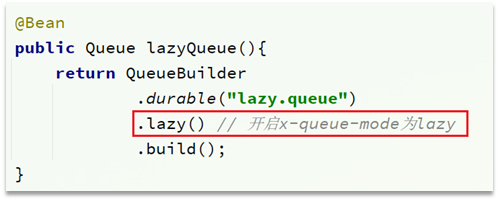
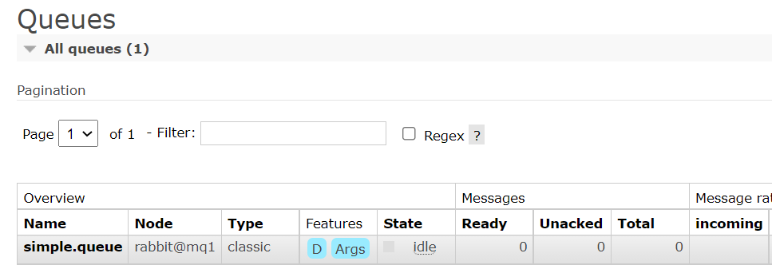
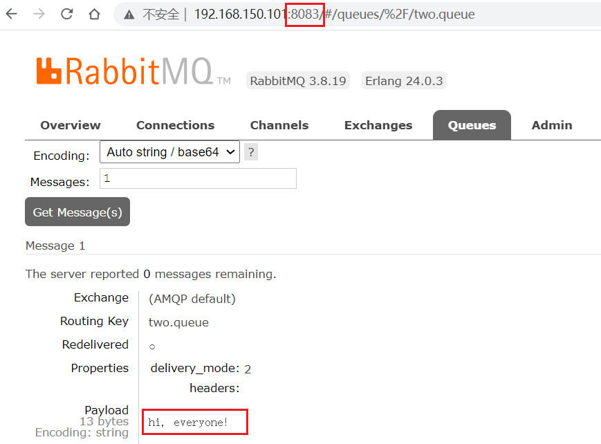
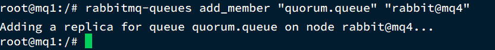

# 服务异步通信-高级篇


消息队列在使用过程中，面临着很多实际问题需要思考：


# 1.消息可靠性

消息从发送，到消费者接收，会经理多个过程：


其中的每一步都可能导致消息丢失，常见的丢失原因包括：

- 发送时丢失：
  - 生产者发送的消息未送达exchange
  - 消息到达exchange后未到达queue
- MQ宕机，queue将消息丢失
- consumer接收到消息后未消费就宕机


针对这些问题，RabbitMQ分别给出了解决方案：

- 生产者确认机制
- mq持久化
- 消费者确认机制
- 失败重试机制


## 1.1.生产者消息确认

RabbitMQ提供了publisher confirm机制来避免消息发送到MQ过程中丢失。这种机制必须给每个消息指定一个唯一ID。消息发送到MQ以后，会返回一个结果给发送者，表示消息是否处理成功。

返回结果有两种方式：

- publisher-confirm，发送者确认
  - 消息成功投递到交换机，返回ack
  - 消息未投递到交换机，返回nack
- publisher-return，发送者回执
  - 消息投递到交换机了，但是没有路由到队列。返回ACK，及路由失败原因。


注意：


### 1.1.1.修改配置

首先，修改publisher服务中的application.yml文件，添加下面的内容：

```yaml
spring:
  rabbitmq:
    publisher-confirm-type: correlated
    publisher-returns: true
```

说明：

- `publish-confirm-type`：开启publisher-confirm，这里支持两种类型：
  - `none`：关闭confirm（默认）
  - `simple`：同步等待confirm结果，直到超时
  - `correlated`：异步回调，定义ConfirmCallback，MQ返回结果时会回调这个ConfirmCallback
- `publish-returns`：开启publish-return功能，同样是基于callback机制，不过是定义ReturnCallback
     - `false` 或 `off`：关闭return（默认）
     - `true` 或 `on`：开启return


### 1.1.2.定义ConfirmCallback回调

修改publisher服务的单元测试类：

```java
package com.shizian.mq.spring;

import com.shizian.mq.config.CommonConfig;
import lombok.extern.slf4j.Slf4j;
import org.junit.Test;
import org.junit.runner.RunWith;
import org.springframework.amqp.core.Message;
import org.springframework.amqp.rabbit.connection.CorrelationData;
import org.springframework.amqp.rabbit.core.RabbitTemplate;
import org.springframework.beans.factory.annotation.Autowired;
import org.springframework.boot.test.context.SpringBootTest;
import org.springframework.test.context.junit4.SpringRunner;

import java.util.UUID;
import java.util.concurrent.TimeUnit;

@Slf4j
@RunWith(SpringRunner.class)
@SpringBootTest
public class SpringAmqpTest {
    @Autowired
    private RabbitTemplate rabbitTemplate;

    @Test
    public void sendMessage() throws InterruptedException {

        CorrelationData correlationData = new CorrelationData(UUID.randomUUID().toString());


        //设置生产者消息确认机制publish-confirm的回调方法
        rabbitTemplate.setConfirmCallback(new RabbitTemplate.ConfirmCallback() {
            @Override
            public void confirm(CorrelationData correlationData, boolean ack, String cause) {
                if(ack){
                    log.info("消息发送到交换机成功，消息ID：{}", correlationData.getId());
                } else {
                    log.error("消息发送到交换机失败，消息ID：{}，原因：{}", correlationData.getId(), cause);
                }
            }
        });


        String message = "hello rabbitmq ~";
        rabbitTemplate.convertAndSend(CommonConfig.DIRECT_EXCHANGE , CommonConfig.DIRECT_ROUTE_KEY+"123", message, correlationData);


        TimeUnit.SECONDS.sleep(1);
    }
}

```


### 1.1.3.定义ReturnCallback回调

修改publisher服务的单元测试类：

```java
package com.shizian.mq.spring;

import com.shizian.mq.config.CommonConfig;
import lombok.extern.slf4j.Slf4j;
import org.junit.Test;
import org.junit.runner.RunWith;
import org.springframework.amqp.core.Message;
import org.springframework.amqp.rabbit.connection.CorrelationData;
import org.springframework.amqp.rabbit.core.RabbitTemplate;
import org.springframework.beans.factory.annotation.Autowired;
import org.springframework.boot.test.context.SpringBootTest;
import org.springframework.test.context.junit4.SpringRunner;

import java.util.UUID;
import java.util.concurrent.TimeUnit;

@Slf4j
@RunWith(SpringRunner.class)
@SpringBootTest
public class SpringAmqpTest {
    @Autowired
    private RabbitTemplate rabbitTemplate;

    @Test
    public void sendMessage() throws InterruptedException {

        CorrelationData correlationData = new CorrelationData(UUID.randomUUID().toString());


        //设置生产者消息确认机制publish-confirm的回调方法
        rabbitTemplate.setConfirmCallback(new RabbitTemplate.ConfirmCallback() {
            @Override
            public void confirm(CorrelationData correlationData, boolean ack, String cause) {
                if(ack){
                    log.info("消息发送到交换机成功，消息ID：{}", correlationData.getId());
                } else {
                    log.error("消息发送到交换机失败，消息ID：{}，原因：{}", correlationData.getId(), cause);
                }
            }
        });

        //设置生产者消息确认机制publish-return的回调方法
        rabbitTemplate.setReturnCallback(new RabbitTemplate.ReturnCallback() {
            @Override
            public void returnedMessage(Message message, int replyCode, String replyText, String exchange, String routingKey) {
                log.error("消息发送到队列失败，消息：{}，应答码：{}，原因：{}，交换机：{}，路由KEY：{}"
                        ,message, replyCode, replyText, exchange, routingKey);
            }
        });


        String message = "hello rabbitmq ~";
        rabbitTemplate.convertAndSend(CommonConfig.DIRECT_EXCHANGE , CommonConfig.DIRECT_ROUTE_KEY+"123", message, correlationData);


        TimeUnit.SECONDS.sleep(1);
    }
}

```


## 1.2.消息持久化

生产者确认可以确保消息投递到RabbitMQ的队列中，但是消息发送到RabbitMQ以后，如果突然宕机，也可能导致消息丢失。

要想确保消息在RabbitMQ中安全保存，必须开启消息持久化机制。

- 交换机持久化
- 队列持久化
- 消息持久化


### 1.2.1.交换机持久化

RabbitMQ中交换机默认是非持久化的，mq重启后就丢失。

SpringAMQP中可以通过代码指定交换机持久化：

```java
    /**
     * 交换机持久化的三种代码编写方式
     */
    @Bean
    public DirectExchange directExchange(){
        //return new DirectExchange(DIRECT_EXCHANGE);    //持久化写法1（默认）
        //return new DirectExchange(DIRECT_EXCHANGE, true, false); //持久化写法2
        return ExchangeBuilder.directExchange(DIRECT_EXCHANGE).durable(true).build(); //持久化写法3
    }
```

事实上，默认情况下，由SpringAMQP声明的交换机都是持久化的。


可以在RabbitMQ控制台看到持久化的交换机都会带上`D`的标示：


### 1.2.2.队列持久化

RabbitMQ中队列默认是非持久化的，mq重启后就丢失。

SpringAMQP中可以通过代码指定交换机持久化：

```java
    /**
     * 队列持久化的三种代码编写方式
     */
    @Bean
    public Queue directQueue(){
        //return new Queue(DIRECT_QUEUE);//持久化写法1（默认）
        //return new Queue(DIRECT_QUEUE,true);//持久化写法2
        return QueueBuilder.durable(DIRECT_QUEUE).build();//持久化写法3
    }
```

事实上，默认情况下，由SpringAMQP声明的队列都是持久化的。

可以在RabbitMQ控制台看到持久化的队列都会带上`D`的标示：


### 1.2.3.消息持久化

利用SpringAMQP发送消息时，可以设置消息的属性（MessageProperties），指定delivery-mode：

- 1：非持久化
- 2：持久化

用java代码指定：

``````java
        String message = "hello rabbitmq ~";
        Message messageObject = MessageBuilder.withBody(message.getBytes(StandardCharsets.UTF_8)).setDeliveryMode(MessageDeliveryMode.PERSISTENT).build();
        rabbitTemplate.convertAndSend(CommonConfig.DIRECT_EXCHANGE , CommonConfig.DIRECT_ROUTE_KEY+"123", messageObject, correlationData);
``````


默认情况下，SpringAMQP发出的任何消息都是持久化的，不用特意指定。


## 1.3.消费者消息确认

RabbitMQ是**阅后即焚**机制，RabbitMQ确认消息被消费者消费后会立刻删除。

而RabbitMQ是通过消费者回执来确认消费者是否成功处理消息的：消费者获取消息后，应该向RabbitMQ发送ACK回执，表明自己已经处理消息。


设想这样的场景：

- 1）RabbitMQ投递消息给消费者
- 2）消费者获取消息后，返回ACK给RabbitMQ
- 3）RabbitMQ删除消息
- 4）消费者宕机，消息尚未处理

这样，消息就丢失了。因此消费者返回ACK的时机非常重要。


而SpringAMQP则允许配置三种确认模式：

•manual：手动ack，需要在业务代码结束后，调用api发送ack。

•auto：自动ack，由spring监测listener代码是否出现异常，没有异常则返回ack；抛出异常则返回nack

•none：关闭ack，MQ假定消费者获取消息后会成功处理，因此消息投递后立即被删除


由此可知：

- none模式下，消息投递是不可靠的，可能丢失
- auto模式类似事务机制，出现异常时返回nack，消息回滚到mq；没有异常，返回ack
- manual：自己根据业务情况，判断什么时候该ack

一般，我们都是使用默认的auto即可。


### 1.3.1.演示none模式

修改consumer服务的application.yml文件，添加下面内容：

```yaml
spring:
  rabbitmq:
    listener:
      simple:
        acknowledge-mode: none # 关闭ack
```

修改consumer服务的SpringRabbitListener类中的方法，模拟一个消息处理异常：

```java
@RabbitListener(queues = "simple.queue")
public void listenSimpleQueue(String msg) {
    log.info("消费者接收到simple.queue的消息：【{}】", msg);
    // 模拟异常
    System.out.println(1 / 0);
    log.debug("消息处理完成！");
}
```

测试可以发现，当消息处理抛异常时，消息依然被RabbitMQ删除了。


### 1.3.2.演示auto模式

再次把确认机制修改为auto:

```yaml
spring:
  rabbitmq:
    listener:
      simple:
        acknowledge-mode: auto # 关闭ack
```

在异常位置打断点，再次发送消息，程序卡在断点时，可以发现此时消息状态为unack（未确定状态）：


抛出异常后，因为Spring会自动返回nack，所以消息恢复至Ready状态，并且没有被RabbitMQ删除：


## 1.4.消费失败重试机制

当消费者出现异常后，消息会不断requeue（重入队）到队列，再重新发送给消费者，然后再次异常，再次requeue，无限循环，导致mq的消息处理飙升，带来不必要的压力：


怎么办呢？


### 1.4.1.本地重试

我们可以利用Spring的retry机制，在消费者出现异常时利用本地重试，而不是无限制的requeue到mq队列。

修改consumer服务的application.yml文件，添加内容：

```yaml
spring:
  rabbitmq:
    listener:
      simple:
        retry:
          enabled: true # 开启消费者失败重试(默认是false关闭的)
          max-attempts: 3 # 最大重试次数（开启失败重试后，默认最大重试次数是3次）
```


重启consumer服务，重复之前的测试。可以发现：

- 在重试3次后，SpringAMQP会抛出异常AmqpRejectAndDontRequeueException，说明本地重试触发了
- 查看RabbitMQ控制台，发现消息被删除了，说明最后SpringAMQP返回的是ack，mq删除消息了


结论：

- 开启本地重试时，消息处理过程中抛出异常，不会requeue到队列，而是在消费者本地重试
- 重试达到最大次数后，Spring会返回ack，消息会被丢弃


### 1.4.2.失败策略

在之前的测试中，达到最大重试次数后，消息会被丢弃，这是由Spring内部机制决定的。

在开启重试模式后，重试次数耗尽，如果消息依然失败，则需要有MessageRecovery接口来处理，它包含三种不同的实现：

- RejectAndDontRequeueRecoverer：重试耗尽后，直接reject，丢弃消息。默认就是这种方式

- ImmediateRequeueMessageRecoverer：重试耗尽后，返回nack，消息重新入队

- RepublishMessageRecoverer：重试耗尽后，将失败消息投递到指定的交换机


比较优雅的一种处理方案是RepublishMessageRecoverer，失败后将消息投递到一个指定的，专门存放异常消息的队列，后续由人工集中处理。


1）在consumer服务CommonConfig中定义处理失败消息的交换机和队列

```java
 	public static final String ERROR_EXCHANGE = "error.exchange";
    public static final String ERROR_ROUTE_KEY = "error.key";
    public static final String ERROR_QUEUE = "error.queue";
    @Bean
    public DirectExchange errorExchange(){
        return new DirectExchange(ERROR_EXCHANGE);
    }
    @Bean
    public Queue errorQueue(){
        return new Queue(ERROR_QUEUE);
    }
    @Bean
    public Binding bindErrorQueue(){
        return BindingBuilder.bind(errorQueue()).to(errorExchange()).with(ERROR_ROUTE_KEY);
    }
```


2）定义一个RepublishMessageRecoverer，关联队列和交换机

```java
package com.shizian.mq;

import com.shizian.mq.config.CommonConfig;
import org.springframework.amqp.rabbit.core.RabbitTemplate;
import org.springframework.amqp.rabbit.retry.MessageRecoverer;
import org.springframework.amqp.rabbit.retry.RepublishMessageRecoverer;
import org.springframework.boot.SpringApplication;
import org.springframework.boot.autoconfigure.SpringBootApplication;
import org.springframework.context.annotation.Bean;

@SpringBootApplication
public class ConsumerApplication {
    public static void main(String[] args) {
        SpringApplication.run(ConsumerApplication.class, args);
    }

    /**
     * 自定义失败消息处理策略，将消息投递到新的交换机和路由KEY
     */
    @Bean
    public MessageRecoverer republishMessageRecover(RabbitTemplate rabbitTemplate){
        return new RepublishMessageRecoverer(rabbitTemplate, CommonConfig.ERROR_EXCHANGE, CommonConfig.ERROR_ROUTE_KEY);
    }
}

```


消费者：

```java

    @RabbitListener(queues = CommonConfig.ERROR_QUEUE)
    public void listenErrorMessage(String msg) {
        System.out.println("接收到失败的消息：【" + msg + "】");
    }
```


## 1.5.总结

如何确保RabbitMQ消息的可靠性？

- 开启生产者确认机制，确保生产者的消息能到达队列
- 开启持久化功能，确保消息未消费前在队列中不会丢失
- 开启消费者确认机制为auto，由spring确认消息处理成功后完成ack
- 开启消费者失败重试机制，并设置MessageRecoverer，多次重试失败后将消息投递到异常交换机，交由人工处理


# 2.死信交换机


## 2.1.初识死信交换机


### 2.1.1.什么是死信交换机

什么是死信？

当一个队列中的消息满足下列情况之一时，可以成为死信（dead letter）：

- 消费者使用basic.reject或 basic.nack声明消费失败，并且消息的requeue参数设置为false
- 消息是一个过期消息，超时无人消费
- 要投递的队列消息满了，无法投递


如果这个包含死信的队列配置了`dead-letter-exchange`属性，指定了一个交换机，那么队列中的死信就会投递到这个交换机中，而这个交换机称为**死信交换机**（Dead Letter Exchange，检查DLX）。


如图，一个消息被消费者拒绝了，变成了死信：


因为simple.queue绑定了死信交换机 dl.direct，因此死信会投递给这个交换机：


如果这个死信交换机也绑定了一个队列，则消息最终会进入这个存放死信的队列：


另外，队列将死信投递给死信交换机时，必须知道两个信息：

- 死信交换机名称
- 死信交换机与死信队列绑定的RoutingKey

这样才能确保投递的消息能到达死信交换机，并且正确的路由到死信队列。


### 2.1.2.利用死信交换机接收死信（拓展）

在失败重试策略中，默认的RejectAndDontRequeueRecoverer会在本地重试次数耗尽后，发送reject给RabbitMQ，消息变成死信，被丢弃。


我们可以给simple.queue添加一个死信交换机，给死信交换机绑定一个队列。这样消息变成死信后也不会丢弃，而是最终投递到死信交换机，路由到与死信交换机绑定的队列。


我们在consumer服务中，定义一组死信交换机、死信队列：

```java
// 声明普通的 simple.queue队列，并且为其指定死信交换机：dl.direct
@Bean
public Queue simpleQueue2(){
    return QueueBuilder.durable("simple.queue") // 指定队列名称，并持久化
        .deadLetterExchange("dl.direct") // 指定死信交换机
        .build();
}
// 声明死信交换机 dl.direct
@Bean
public DirectExchange dlExchange(){
    return new DirectExchange("dl.direct", true, false);
}
// 声明存储死信的队列 dl.queue
@Bean
public Queue dlQueue(){
    return new Queue("dl.queue", true);
}
// 将死信队列 与 死信交换机绑定
@Bean
public Binding dlBinding(){
    return BindingBuilder.bind(dlQueue()).to(dlExchange()).with("simple");
}
```


### 2.1.3.总结

什么样的消息会成为死信？

- 消息被消费者reject或者返回nack
- 消息超时未消费
- 队列满了

死信交换机的使用场景是什么？

- 如果队列绑定了死信交换机，死信会投递到死信交换机；
- 可以利用死信交换机收集所有消费者处理失败的消息（死信），交由人工处理，进一步提高消息队列的可靠性。


## 2.2.TTL

一个队列中的消息如果超时未消费，则会变为死信，超时分为两种情况：

- 消息所在的队列设置了超时时间
- 消息本身设置了超时时间


### 2.2.1.声明一个队列，并且指定TTL

consumer服务CommonConfig类中，声明死信队列指定死信交换机和死信路由KEY，注意可以指定消息超时时间，单位毫秒。

```java
	public static final String TTL_EXCHANGE = "ttl.exchange";
    public static final String TTL_ROUTE_KEY = "ttl.key";
    public static final String TTL_QUEUE = "ttl.queue";
    @Bean
    public DirectExchange ttlExchange(){
        return new DirectExchange(TTL_EXCHANGE);
    }
    @Bean
    public Queue ttlQueue(){
        return QueueBuilder.durable(TTL_QUEUE).ttl(10000).deadLetterExchange(DL_EXCHANGE).deadLetterRoutingKey(DL_ROUTE_KEY).build();
    }
    @Bean
    public Binding bindTtlQueue(){
        return BindingBuilder.bind(ttlQueue()).to(ttlExchange()).with(TTL_ROUTE_KEY);
    }


    public static final String DL_EXCHANGE = "dl.exchange";
    public static final String DL_ROUTE_KEY = "dl.key";
    public static final String DL_QUEUE = "dl.queue";
```


### 2.2.2.接收超时死信的死信交换机

在consumer服务的SpringRabbitListener中，定义一个新的消费者，并且声明 死信交换机、死信队列：

```java
    @RabbitListener(bindings = @QueueBinding(value = @Queue(value = CommonConfig.DL_QUEUE),
            exchange = @Exchange(name = CommonConfig.DL_EXCHANGE,
                    type = ExchangeTypes.DIRECT),
                    key = CommonConfig.DL_ROUTE_KEY))
    public void listenDlMessage(String msg){
        System.out.println("收到死信消息：" + msg);
    }

```


### 2.2.3.发送消息

在发送消息时，也可以指定TTL：

```java
        String message = "hello rabbitmq ~";
        Message messageObject = MessageBuilder.withBody(message.getBytes(StandardCharsets.UTF_8))
                .setDeliveryMode(MessageDeliveryMode.PERSISTENT)
                .setExpiration("5000")
                .build();
        rabbitTemplate.convertAndSend(CommonConfig.TTL_EXCHANGE , CommonConfig.TTL_ROUTE_KEY, messageObject, correlationData);
```


> 注意：当队列和消息都设置TTL消息存活时间时，已短的为主


### 2.2.4.总结

消息超时的两种方式是？

- 给队列设置ttl属性
- 给消息设置ttl属性

如何实现发送一个消息20秒后消费者才收到消息？

- 给消息的目标队列指定死信交换机
- 将消费者监听的队列绑定到死信交换机
- 发送消息时给消息设置超时时间为20秒


## 2.3.延迟队列

利用TTL结合死信交换机，我们实现了消息发出后，消费者延迟收到消息的效果。这种消息模式就称为延迟队列（Delay Queue）模式。

延迟队列的使用场景包括：

- 延迟发送短信
- 用户下单，如果用户在15 分钟内未支付，则自动取消
- 预约工作会议，20分钟后自动通知所有参会人员


因为延迟队列的需求非常多，所以RabbitMQ的官方也推出了一个插件，原生支持延迟队列效果。

这个插件就是DelayExchange插件。参考RabbitMQ的插件列表页面：https://www.rabbitmq.com/community-plugins.html


使用方式可以参考官网地址：https://blog.rabbitmq.com/posts/2015/04/scheduling-messages-with-rabbitmq


### 2.3.1.安装DelayExchange插件

官方的安装指南地址为：https://blog.rabbitmq.com/posts/2015/04/scheduling-messages-with-rabbitmq

上述文档是基于linux原生安装RabbitMQ，然后安装插件。


因为我们之前是基于Docker安装RabbitMQ，所以下面我们会讲解基于Docker来安装RabbitMQ插件。

## 2.1.下载插件

RabbitMQ有一个官方的插件社区，地址为：https://www.rabbitmq.com/community-plugins.html

其中包含各种各样的插件，包括我们要使用的DelayExchange插件：


大家可以去对应的GitHub页面下载3.8.9版本的插件，地址为https://github.com/rabbitmq/rabbitmq-delayed-message-exchange/releases/tag/3.8.9这个对应RabbitMQ的3.8.5以上版本。


课前资料也提供了下载好的插件：


## 2.2.上传插件

因为我们是基于Docker安装，所以需要先查看RabbitMQ的插件目录对应的数据卷。如果不是基于Docker的同学，请参考第一章部分，重新创建Docker容器。

我们之前设定的RabbitMQ的数据卷名称为`mq-plugins`，所以我们使用下面命令查看数据卷：

```sh
docker volume inspect mq-plugins
```

可以得到下面结果：


接下来，将插件上传到这个目录即可：


## 2.3.安装插件

最后就是安装了，需要进入MQ容器内部来执行安装。我的容器名为`mq`，所以执行下面命令：

```sh
docker exec -it mq bash
```

执行时，请将其中的 `-it` 后面的`mq`替换为你自己的容器名.

进入容器内部后，执行下面命令开启插件：

```sh
rabbitmq-plugins enable rabbitmq_delayed_message_exchange
```

结果如下：


### 2.3.2.DelayExchange原理

DelayExchange需要将一个交换机声明为delayed类型。当我们发送消息到delayExchange时，流程如下：

- 接收消息
- 判断消息是否具备x-delay属性
- 如果有x-delay属性，说明是延迟消息，持久化到硬盘，读取x-delay值，作为延迟时间
- 返回routing not found结果给消息发送者
- x-delay时间到期后，重新投递消息到指定队列


### 2.3.3.使用DelayExchange

插件的使用也非常简单：声明一个交换机，交换机的类型可以是任意类型，只需要设定delayed属性为true即可，然后声明队列与其绑定即可。

#### 1）声明DelayExchange交换机

基于注解方式（推荐）：

``````java
    @RabbitListener(bindings = @QueueBinding(value = @Queue(value = CommonConfig.DELAY_QUEUE),
            exchange = @Exchange(name = CommonConfig.DELAY_EXCHANGE,
                    type = ExchangeTypes.DIRECT, delayed = "true"),
            key = CommonConfig.DELAY_ROUTE_KEY))
    public void listenDelayMessage(String msg){
        System.out.println("收到延迟消息：" + msg);
    }
``````


#### 2）发送消息

发送消息时，一定要携带x-delay属性，指定延迟的时间：

`````java
 String message = "hello rabbitmq ~";
        Message messageObject = MessageBuilder.withBody(message.getBytes(StandardCharsets.UTF_8))
                .setDeliveryMode(MessageDeliveryMode.PERSISTENT)
                .setExpiration("5000")
                .setHeader("x-delay","10000")
                .build();
        rabbitTemplate.convertAndSend(CommonConfig.DELAY_EXCHANGE , CommonConfig.DELAY_ROUTE_KEY, messageObject, correlationData);
`````


### 2.3.4.总结

延迟队列插件的使用步骤包括哪些？

•声明一个交换机，添加delayed属性为true

•发送消息时，添加x-delay头，值为超时时间


# 3.惰性队列

## 3.1.消息堆积问题

当生产者发送消息的速度超过了消费者处理消息的速度，就会导致队列中的消息堆积，直到队列存储消息达到上限。之后发送的消息就会成为死信，可能会被丢弃，这就是消息堆积问题。


解决消息堆积有两种思路：

- 增加更多消费者，提高消费速度。也就是我们之前说的work queue模式
- 扩大队列容积，提高堆积上限


要提升队列容积，把消息保存在内存中显然是不行的。


## 3.2.惰性队列

从RabbitMQ的3.6.0版本开始，就增加了Lazy Queues的概念，也就是惰性队列。惰性队列的特征如下：

- 接收到消息后直接存入磁盘而非内存
- 消费者要消费消息时才会从磁盘中读取并加载到内存
- 支持数百万条的消息存储


### 3.2.1.基于命令行设置lazy-queue

而要设置一个队列为惰性队列，只需要在声明队列时，指定x-queue-mode属性为lazy即可。可以通过命令行将一个运行中的队列修改为惰性队列：

```sh
rabbitmqctl set_policy Lazy "^lazy-queue$" '{"queue-mode":"lazy"}' --apply-to queues  
```

命令解读：

- `rabbitmqctl` ：RabbitMQ的命令行工具
- `set_policy` ：添加一个策略
- `Lazy` ：策略名称，可以自定义
- `"^lazy-queue$"` ：用正则表达式匹配队列的名字
- `'{"queue-mode":"lazy"}'` ：设置队列模式为lazy模式
- `--apply-to queues  `：策略的作用对象，是所有的队列


### 3.2.2.基于@Bean声明lazy-queue



### 3.2.3.基于@RabbitListener声明LazyQueue


### 3.3.总结

消息堆积问题的解决方案？

- 队列上绑定多个消费者，提高消费速度
- 使用惰性队列，可以再mq中保存更多消息

惰性队列的优点有哪些？

- 基于磁盘存储，消息上限高
- 没有间歇性的page-out，性能比较稳定

惰性队列的缺点有哪些？

- 基于磁盘存储，消息时效性会降低
- 性能受限于磁盘的IO


# 4.MQ集群


## 4.1.集群分类

RabbitMQ的是基于Erlang语言编写，而Erlang又是一个面向并发的语言，天然支持集群模式。RabbitMQ的集群有两种模式：

•**普通集群**：是一种分布式集群，将队列分散到集群的各个节点，从而提高整个集群的并发能力。

•**镜像集群**：是一种主从集群，普通集群的基础上，添加了主从备份功能，提高集群的数据可用性。


镜像集群虽然支持主从，但主从同步并不是强一致的，某些情况下可能有数据丢失的风险。因此在RabbitMQ的3.8版本以后，推出了新的功能：**仲裁队列**来代替镜像集群，底层采用Raft协议确保主从的数据一致性。


## 4.2.普通集群


### 4.2.1.集群结构和特征

普通集群，或者叫标准集群（classic cluster），具备下列特征：

- 会在集群的各个节点间共享部分数据，包括：交换机、队列元信息。不包含队列中的消息。
- 当访问集群某节点时，如果队列不在该节点，会从数据所在节点传递到当前节点并返回
- 队列所在节点宕机，队列中的消息就会丢失

结构如图：


### 4.2.2.部署

# 3.集群部署

接下来，我们看看如何安装RabbitMQ的集群。

## 2.1.集群分类

在RabbitMQ的官方文档中，讲述了两种集群的配置方式：

- 普通模式：普通模式集群不进行数据同步，每个MQ都有自己的队列、数据信息（其它元数据信息如交换机等会同步）。例如我们有2个MQ：mq1，和mq2，如果你的消息在mq1，而你连接到了mq2，那么mq2会去mq1拉取消息，然后返回给你。如果mq1宕机，消息就会丢失。
- 镜像模式：与普通模式不同，队列会在各个mq的镜像节点之间同步，因此你连接到任何一个镜像节点，均可获取到消息。而且如果一个节点宕机，并不会导致数据丢失。不过，这种方式增加了数据同步的带宽消耗。


我们先来看普通模式集群，我们的计划部署3节点的mq集群：

| 主机名 | 控制台端口      | amqp通信端口    |
| ------ | --------------- | --------------- |
| mq1    | 8081 ---> 15672 | 8071 ---> 5672  |
| mq2    | 8082 ---> 15672 | 8072 ---> 5672  |
| mq3    | 8083 ---> 15672 | 8073  ---> 5672 |


集群中的节点标示默认都是：`rabbit@[hostname]`，因此以上三个节点的名称分别为：

- rabbit@mq1
- rabbit@mq2
- rabbit@mq3


## 2.2.获取cookie

RabbitMQ底层依赖于Erlang，而Erlang虚拟机就是一个面向分布式的语言，默认就支持集群模式。集群模式中的每个RabbitMQ 节点使用 cookie 来确定它们是否被允许相互通信。

要使两个节点能够通信，它们必须具有相同的共享秘密，称为**Erlang cookie**。cookie 只是一串最多 255 个字符的字母数字字符。

每个集群节点必须具有**相同的 cookie**。实例之间也需要它来相互通信。


我们先在之前启动的mq容器中获取一个cookie值，作为集群的cookie。执行下面的命令：

```sh
docker exec -it mq cat /var/lib/rabbitmq/.erlang.cookie
```

可以看到cookie值如下：

```sh
FXZMCVGLBIXZCDEMMVZQ
```


接下来，停止并删除当前的mq容器，我们重新搭建集群。

```sh
docker rm -f mq
```


## 2.3.准备集群配置

在/tmp目录新建一个配置文件 rabbitmq.conf：

```sh
cd /tmp
# 创建文件
touch rabbitmq.conf
```

文件内容如下：

```nginx
loopback_users.guest = false
listeners.tcp.default = 5672
cluster_formation.peer_discovery_backend = rabbit_peer_discovery_classic_config
cluster_formation.classic_config.nodes.1 = rabbit@mq1
cluster_formation.classic_config.nodes.2 = rabbit@mq2
cluster_formation.classic_config.nodes.3 = rabbit@mq3
```


再创建一个文件，记录cookie

```sh
cd /tmp
# 创建cookie文件
touch .erlang.cookie
# 写入cookie
echo "FXZMCVGLBIXZCDEMMVZQ" > .erlang.cookie
# 修改cookie文件的权限
chmod 600 .erlang.cookie
```


准备三个目录,mq1、mq2、mq3：

```sh
cd /tmp
# 创建目录
mkdir mq1 mq2 mq3
```


然后拷贝rabbitmq.conf、cookie文件到mq1、mq2、mq3：

```sh
# 进入/tmp
cd /tmp
# 拷贝
cp rabbitmq.conf mq1
cp rabbitmq.conf mq2
cp rabbitmq.conf mq3
cp .erlang.cookie mq1
cp .erlang.cookie mq2
cp .erlang.cookie mq3
```


## 2.4.启动集群

创建一个网络：

```sh
docker network create mq-net
```


docker volume create 


运行命令

```sh
docker run -d --net mq-net \
-v ${PWD}/mq1/rabbitmq.conf:/etc/rabbitmq/rabbitmq.conf \
-v ${PWD}/.erlang.cookie:/var/lib/rabbitmq/.erlang.cookie \
-e RABBITMQ_DEFAULT_USER=admin \
-e RABBITMQ_DEFAULT_PASS=123321 \
--name mq1 \
--hostname mq1 \
-p 8071:5672 \
-p 8081:15672 \
rabbitmq:3.8-management
```


```sh
docker run -d --net mq-net \
-v ${PWD}/mq2/rabbitmq.conf:/etc/rabbitmq/rabbitmq.conf \
-v ${PWD}/.erlang.cookie:/var/lib/rabbitmq/.erlang.cookie \
-e RABBITMQ_DEFAULT_USER=admin \
-e RABBITMQ_DEFAULT_PASS=123321 \
--name mq2 \
--hostname mq2 \
-p 8072:5672 \
-p 8082:15672 \
rabbitmq:3.8-management
```


```sh
docker run -d --net mq-net \
-v ${PWD}/mq3/rabbitmq.conf:/etc/rabbitmq/rabbitmq.conf \
-v ${PWD}/.erlang.cookie:/var/lib/rabbitmq/.erlang.cookie \
-e RABBITMQ_DEFAULT_USER=admin \
-e RABBITMQ_DEFAULT_PASS=123321 \
--name mq3 \
--hostname mq3 \
-p 8073:5672 \
-p 8083:15672 \
rabbitmq:3.8-management
```


## 2.5.测试

在mq1这个节点上添加一个队列：


如图，在mq2和mq3两个控制台也都能看到：




### 2.5.1.数据共享测试

点击这个队列，进入管理页面：


然后利用控制台发送一条消息到这个队列：


结果在mq2、mq3上都能看到这条消息：


### 2.5.2.可用性测试

我们让其中一台节点mq1宕机：

```sh
docker stop mq1
```

然后登录mq2或mq3的控制台，发现simple.queue也不可用了：


说明数据并没有拷贝到mq2和mq3。


## 4.3.镜像集群


### 4.3.1.集群结构和特征

镜像集群：本质是主从模式，具备下面的特征：

- 交换机、队列、队列中的消息会在各个mq的镜像节点之间同步备份。
- 创建队列的节点被称为该队列的**主节点，**备份到的其它节点叫做该队列的**镜像**节点。
- 一个队列的主节点可能是另一个队列的镜像节点
- 所有操作都是主节点完成，然后同步给镜像节点
- 主宕机后，镜像节点会替代成新的主

结构如图：


### 4.3.2.部署

# 4.镜像模式

在刚刚的案例中，一旦创建队列的主机宕机，队列就会不可用。不具备高可用能力。如果要解决这个问题，必须使用官方提供的镜像集群方案。

官方文档地址：https://www.rabbitmq.com/ha.html


## 4.1.镜像模式的特征

默认情况下，队列只保存在创建该队列的节点上。而镜像模式下，创建队列的节点被称为该队列的**主节点**，队列还会拷贝到集群中的其它节点，也叫做该队列的**镜像**节点。

但是，不同队列可以在集群中的任意节点上创建，因此不同队列的主节点可以不同。甚至，**一个队列的主节点可能是另一个队列的镜像节点**。

用户发送给队列的一切请求，例如发送消息、消息回执默认都会在主节点完成，如果是从节点接收到请求，也会路由到主节点去完成。**镜像节点仅仅起到备份数据作用**。

当主节点接收到消费者的ACK时，所有镜像都会删除节点中的数据。


总结如下：

- 镜像队列结构是一主多从（从就是镜像）
- 所有操作都是主节点完成，然后同步给镜像节点
- 主宕机后，镜像节点会替代成新的主（如果在主从同步完成前，主就已经宕机，可能出现数据丢失）
- 不具备负载均衡功能，因为所有操作都会有主节点完成（但是不同队列，其主节点可以不同，可以利用这个提高吞吐量）


## 4.2.镜像模式的配置

镜像模式的配置有3种模式：

| ha-mode         | ha-params         | 效果                                                         |
| :-------------- | :---------------- | :----------------------------------------------------------- |
| 准确模式exactly | 队列的副本量count | 集群中队列副本（主服务器和镜像服务器之和）的数量。count如果为1意味着单个副本：即队列主节点。count值为2表示2个副本：1个队列主和1个队列镜像。换句话说：count = 镜像数量 + 1。如果群集中的节点数少于count，则该队列将镜像到所有节点。如果有集群总数大于count+1，并且包含镜像的节点出现故障，则将在另一个节点上创建一个新的镜像。 |
| all             | (none)            | 队列在群集中的所有节点之间进行镜像。队列将镜像到任何新加入的节点。镜像到所有节点将对所有群集节点施加额外的压力，包括网络I / O，磁盘I / O和磁盘空间使用情况。推荐使用exactly，设置副本数为（N / 2 +1）。 |
| nodes           | *node names*      | 指定队列创建到哪些节点，如果指定的节点全部不存在，则会出现异常。如果指定的节点在集群中存在，但是暂时不可用，会创建节点到当前客户端连接到的节点。 |

这里我们以rabbitmqctl命令作为案例来讲解配置语法。

语法示例：

### 4.2.1.exactly模式

```
rabbitmqctl set_policy ha-two "^two\." '{"ha-mode":"exactly","ha-params":2,"ha-sync-mode":"automatic"}'
```

- `rabbitmqctl set_policy`：固定写法
- `ha-two`：策略名称，自定义
- `"^two\."`：匹配队列的正则表达式，符合命名规则的队列才生效，这里是任何以`two.`开头的队列名称
- `'{"ha-mode":"exactly","ha-params":2,"ha-sync-mode":"automatic"}'`: 策略内容
  - `"ha-mode":"exactly"`：策略模式，此处是exactly模式，指定副本数量
  - `"ha-params":2`：策略参数，这里是2，就是副本数量为2，1主1镜像
  - `"ha-sync-mode":"automatic"`：同步策略，默认是manual，即新加入的镜像节点不会同步旧的消息。如果设置为automatic，则新加入的镜像节点会把主节点中所有消息都同步，会带来额外的网络开销

### 4.2.2.all模式

```
rabbitmqctl set_policy ha-all "^all\." '{"ha-mode":"all"}'
```

- `ha-all`：策略名称，自定义
- `"^all\."`：匹配所有以`all.`开头的队列名
- `'{"ha-mode":"all"}'`：策略内容
  - `"ha-mode":"all"`：策略模式，此处是all模式，即所有节点都会称为镜像节点

### 4.2.3.nodes模式

```
rabbitmqctl set_policy ha-nodes "^nodes\." '{"ha-mode":"nodes","ha-params":["rabbit@nodeA", "rabbit@nodeB"]}'
```

- `rabbitmqctl set_policy`：固定写法
- `ha-nodes`：策略名称，自定义
- `"^nodes\."`：匹配队列的正则表达式，符合命名规则的队列才生效，这里是任何以`nodes.`开头的队列名称
- `'{"ha-mode":"nodes","ha-params":["rabbit@nodeA", "rabbit@nodeB"]}'`: 策略内容
  - `"ha-mode":"nodes"`：策略模式，此处是nodes模式
  - `"ha-params":["rabbit@mq1", "rabbit@mq2"]`：策略参数，这里指定副本所在节点名称


## 4.3.测试

我们使用exactly模式的镜像，因为集群节点数量为3，因此镜像数量就设置为2.


运行下面的命令：

```sh
docker exec -it mq1 rabbitmqctl set_policy ha-two "^two\." '{"ha-mode":"exactly","ha-params":2,"ha-sync-mode":"automatic"}'
```


下面，我们创建一个新的队列：


在任意一个mq控制台查看队列：


### 4.3.1.测试数据共享

给two.queue发送一条消息：


然后在mq1、mq2、mq3的任意控制台查看消息：




### 4.3.2.测试高可用

现在，我们让two.queue的主节点mq1宕机：

```sh
docker stop mq1
```


查看集群状态：


查看队列状态：


发现依然是健康的！并且其主节点切换到了rabbit@mq2上


## 4.4.仲裁队列


### 4.4.1.集群特征

仲裁队列：仲裁队列是3.8版本以后才有的新功能，用来替代镜像队列，具备下列特征：

- 与镜像队列一样，都是主从模式，支持主从数据同步
- 使用非常简单，没有复杂的配置
- 主从同步基于Raft协议，强一致


### 4.4.2.部署

# 5.仲裁队列

从RabbitMQ 3.8版本开始，引入了新的仲裁队列，他具备与镜像队里类似的功能，但使用更加方便。


## 5.1.添加仲裁队列

在任意控制台添加一个队列，一定要选择队列类型为Quorum类型。


在任意控制台查看队列：


可以看到，仲裁队列的 + 2字样。代表这个队列有2个镜像节点。

因为仲裁队列默认的镜像数为5。如果你的集群有7个节点，那么镜像数肯定是5；而我们集群只有3个节点，因此镜像数量就是3.


## 5.2.测试

可以参考对镜像集群的测试，效果是一样的。


## 5.3.集群扩容

### 5.3.1.加入集群

1）启动一个新的MQ容器：

```sh
docker run -d --net mq-net \
-v ${PWD}/.erlang.cookie:/var/lib/rabbitmq/.erlang.cookie \
-e RABBITMQ_DEFAULT_USER=admin \
-e RABBITMQ_DEFAULT_PASS=123321 \
--name mq4 \
--hostname mq5 \
-p 8074:15672 \
-p 8084:15672 \
rabbitmq:3.8-management
```

2）进入容器控制台：

```sh
docker exec -it mq4 bash
```

3）停止mq进程

```sh
rabbitmqctl stop_app
```


4）重置RabbitMQ中的数据：

```sh
rabbitmqctl reset
```


5）加入mq1：

```sh
rabbitmqctl join_cluster rabbit@mq1
```


6）再次启动mq进程

```sh
rabbitmqctl start_app
```


### 5.3.2.增加仲裁队列副本

我们先查看下quorum.queue这个队列目前的副本情况，进入mq1容器：

```sh
docker exec -it mq1 bash
```

执行命令：

```sh
rabbitmq-queues quorum_status "quorum.queue01"
```

结果：


现在，我们让mq4也加入进来：

```sh
rabbitmq-queues add_member "quorum.queue" "rabbit@mq4"
```

结果：




再次查看：

```sh
rabbitmq-queues quorum_status "quorum.queue"
```


查看控制台，发现quorum.queue的镜像数量也从原来的 +2 变成了 +3：


### 4.4.3.Java代码创建仲裁队列

```java
@Bean
public Queue quorumQueue() {
    return QueueBuilder
        .durable("quorum.queue") // 持久化
        .quorum() // 仲裁队列
        .build();
}
```


### 4.4.4.SpringAMQP连接MQ集群

注意，这里用address来代替host、port方式

```java
spring:
  rabbitmq:
    addresses: 192.168.150.101:8071, 192.168.150.101:8072, 192.168.150.101:8073
    username: itcast
    password: 123321
    virtual-host: /
```


