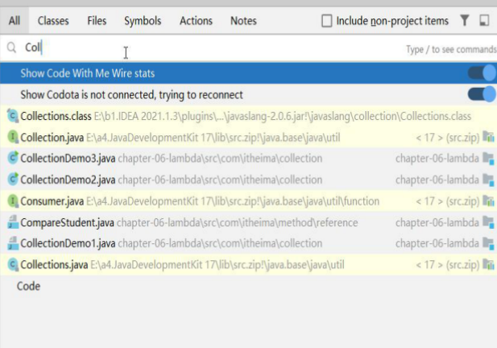

==所设置字体==
-
微软雅黑字体
黑体

==字体大小==

3号字
4号字

==设置字体颜色==

红色
绿色
蓝色

**颜色**
**颜色**
**颜色**
**颜色**
**颜色**
**颜色**
**颜色**
**颜色**
**颜色**

==同时设置==

**微软雅黑字体**

==加粗、倾斜==

**粗体文字**,或__粗体文字__

==背景颜色==

<table><tr><td bgcolor=#FF4500> 背景色是 1 orange</td></tr></table>
<table><tr><td bgcolor= BlueViolet > 背景色2 BlueViolet </td></tr></table>

修改全部变量名 shift + f6

while快捷键 Ctrl + alt + t

双击 shift 搜索

ctrl + alt + m抽取方法
