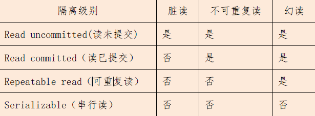
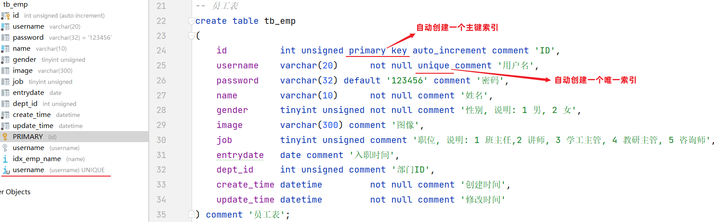
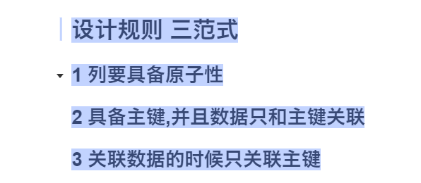
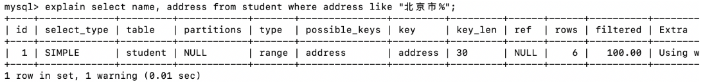
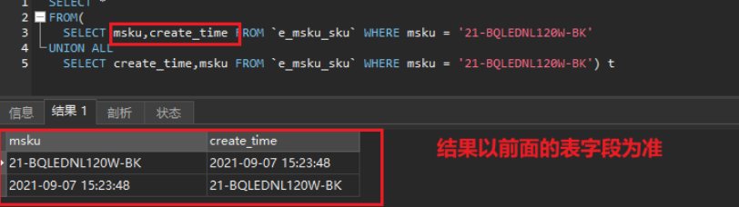
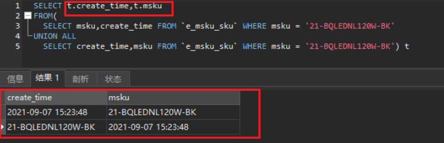

[JavaSE增强-第一章 static、单例与继承-java静态代码块，构造方法，构造代码块的执行先后顺序](https://gitee.com/shi-zian/JavaNote/blob/main/JavaSE%E5%A2%9E%E5%BC%BA/%E7%AC%AC%E4%B8%80%E7%AB%A0%20static%E3%80%81%E5%8D%95%E4%BE%8B%E4%B8%8E%E7%BB%A7%E6%89%BF.md#java%E9%9D%99%E6%80%81%E4%BB%A3%E7%A0%81%E5%9D%97%E6%9E%84%E9%80%A0%E6%96%B9%E6%B3%95%E6%9E%84%E9%80%A0%E4%BB%A3%E7%A0%81%E5%9D%97%E7%9A%84%E6%89%A7%E8%A1%8C%E5%85%88%E5%90%8E%E9%A1%BA%E5%BA%8F)

[JavaSE增强-第一章 static、单例与继承-单例模式](https://gitee.com/shi-zian/JavaNote/blob/main/JavaSE%E5%A2%9E%E5%BC%BA/%E7%AC%AC%E4%B8%80%E7%AB%A0%20static%E3%80%81%E5%8D%95%E4%BE%8B%E4%B8%8E%E7%BB%A7%E6%89%BF.md#%E5%8D%95%E4%BE%8B%E6%A8%A1%E5%BC%8F)

[JavaSE增强-第二章 多态，抽象类-final、abstart、interface](https://gitee.com/shi-zian/JavaNote/blob/main/JavaSE%E5%A2%9E%E5%BC%BA/%E7%AC%AC%E4%BA%8C%E7%AB%A0%20%E5%A4%9A%E6%80%81%EF%BC%8C%E6%8A%BD%E8%B1%A1%E7%B1%BB.md)

[JavaSE增强-第八章可变参、Map、Stream-HashMap底层原理](https://gitee.com/shi-zian/JavaNote/blob/main/JavaSE%E5%A2%9E%E5%BC%BA/%E7%AC%AC%E5%85%AB%E7%AB%A0%20%E5%8F%AF%E5%8F%98%E5%8F%82%E3%80%81Map%E3%80%81Stream.md#1%E5%BA%95%E5%B1%82%E5%8E%9F%E7%90%86)

# 线程

###### 1、synchronized 和 volatile 的区别？

- 用途不同

  synchronized 用于代码块和方法，volatile 用来多线程之间变量显示

- 阻塞

  volatile 线程非阻塞的，使用synchronized 造成线程阻塞

- 可见性和原子性

  volatile 多线程下保证变量的可见性，不能保证原子性；synchronized 两者都可以保证

# 网络

###### 1、如何解决分布式 Session 问题?

- nginx下采用ip_hash策略，每个请求按访问ip的hash分配，来自同一个ip的请求就会访问到同一台服务器
- session赋值，当一个请求访问到一个服务器中，此服务器将产生的session发送给其他节点
- 共享信息，采用中间件，将此session信息存入共享信息部分

# 集合

###### **1、HashSet如何检查重复？**

​		hashset其实就是hashmap中的key，当调用add方法的时候，底层调用的是hashmap的put方法，首先会计算该数据hashcode值判断对象加入的位置，同时也会和其他对象的hashcode进行比较，如果不同直接插入数据，相同则调用Object的equals比较内容，内容不同jdk8之前插入数组上方，jdk8以后采用尾插法

###### **2、HashSet和TreeSet的区别？**

- 底层不同：

​		hashset底层采用的是哈希表实现的，TreeSet采用的是二叉树实现的

- 存放元素要求不同

  hashset实际上是hashmap的key，其中可以存放一个null元素，元素的无序、不重复

  treeset实际是treemap中的key，其中不能存放null，默认是有序的不重复，按着元素默认循序（自定义排序）

###### **3、HashMap和HashSet区别？**

底层hashset调用的hashmap，二者都采用了hash算法实现了唯一性，他们都不能持有基本类型

|                        | HashSet                | HashMap               |
| ---------------------- | ---------------------- | --------------------- |
| 实现接口               | Set                    | Map                   |
| 结构                   | 线性结构               | key-value键值对       |
| 添加方法               | add（）                | put（）               |
| 唯一性（计算hashcode） | 采用对象来计算hashcode | 采用key来计算hashcode |

###### **4、HashMap和HashTable区别？**

- 底层不一样

  hashtable:数组+链表；hashmap在jdk8以后是数组+链表+红黑树；解决hash冲突，当链表长度大于8，数组容量大于64转为红黑树，当链表长度大于8，数组小于64进行扩容，提升搜索效率

- 线程安全问题

  hashmap是线程不安全的，hashtable是线程安全的，每个方法都加了synchronized方法；

- 效率

  因为hashtable是线程安全的所以速度比hashmap慢一点

- 扩容

  - 不设置初始容量

    hashmap默认数组长度16，不加初始化参数每次扩容2的幂次方，负载因子0.75；hashtabel数组默认长度11，每次扩容2n+1，负载因子0.75

  - 设置初始化容量

    hashtabel直接按照初始化大小创建，hashmap是先扩容容量的2的幂次方

- 空值要求不一样

  - hashmap中key、value可以为null，但是key必须只有一个；而hashtabel不允许存在空值

- 方法

  hashMap 去掉了HashTable 的contains 方法，但是	Value ()和containsKey()方法。

###### **5、HashMap底层原理？**

put过程总结：

1、put时，会调用putVal(hash(key),key,value)方法，

2、其中hash(key)方法用来计算数组下标位置，key=null 返回0，否则用key的hashcode与key的hashcode右移16位做异或运算。

- 2.1 数组长度为int ，hashcode也是int32位；hashcode往往高位二进制为0，用不到无意义，所以采用右移16位使高位参与运算，采用异或运算出现结果平均散列分布。（相同为0不同为1）

3、如果没有发生碰撞，直接添加元素到散列表中去

4、如果发生了碰撞(hashCode 值相同)，进行三种判断

- 4.1:若key 地址相同或者equals 后内容相同，则替换旧值
- 4.2:如果是红黑树结构，就调用树的插入方法
- 4.3：链表结构，循环遍历直到链表中某个节点为空，尾插法进行插入，（jdk8之前是头插法，会产生死锁）插入之后判断链表个数是否到达变成红黑树的阙值8；也可以遍历到有节点与插入元素的哈希值和内容相同，进行覆盖。

5、如果桶满了大于阀值，则resize ()进行扩容，需要重新计算下标，扩容每次增加2倍（长度-1进行运算），下标可以有两种结果原始长度，原下标+原长度运算规则（**判断新长度和原长度按位与数字最高位是否为0，如果是0添加的数组就放在原下标位置，不是则原下标+原长度中**）

扩容机制

有三种情况

1、数组为空首次扩容

2、链表长度大于8，数组容量小于64进行扩容，每次扩容原来的2的幂次方

3、超过阈值（临界值），当数组长度>容量*负载因子扩容，扩容原来的两倍

（扩容时需要重新计算hash值，浪费时间，建议初始化容量，减少时间浪费）

其中负载因子为什么是0.75，其表示为hash表中元素填充程度（负载因子越大也就意味着出发扩容元素的个数就越多，空间利用率高，hash冲突也高）反之；hashmap采用链式寻址的方式解决hash冲突，避免过长会转为红黑树，负载因子为0.75，链表长度达到8的可能性很低，比较好做到时间和空间成本平衡。


###### **6、HashMap 和HashSet 区别？**

如果你看过HashSet 源码的话就应该知道：HashSet 底层就是基于HashMap实现的。（HashSet 的源码非常非常少，因为除了clone()、writeObject()、readObject()是HashSet 自己不得不实现之外，其他方法都是直接调用HashMap 中的方法。

| HashMap                           | HashSet                                                      |
| --------------------------------- | ------------------------------------------------------------ |
| 实现了Map接口                     | 实现Set 接口                                                 |
| 存储键值对                        | 仅存储对象                                                   |
| 调用put()向map中添加元素          | 调用add()方法向Set 中添加元素                                |
| HashMap 使用键（Key）计算hashcode | HashSet 使用成员对象来计算hashcode 值，对于两个对象来说hashcode 可能相同，所以equals()方法用来判断对象的相等性 |

 


# 线程

###### 1、线程创建的几种方式？

###### 2、线程状态转换？

new 创建 （未调用start）
runnable 就绪可运行（调用start 具体执行根据cpu情况）
blocked 阻塞锁
waiting 无限等待
timed waiting 计时等待
teminated 被终止

两种情况

- 不顺畅路线

  - 一个线程没有拿到锁，就进入了blocked锁阻塞状态，拿到锁了就进入可运行状态；

  - 一个线程被wait无限等待，被notify唤醒拿到锁可运行， 没拿到锁阻塞

  - 计时等待
    - a.如果是sleep拿着锁休眠，休眠后回到可运行，
    - b.如果是wait（带时间），到时间有锁可运行，无锁变成锁阻塞；未到时间被notify唤醒，有锁可运行，无锁变为锁阻塞

- 有锁顺畅路线
  - 创建new一个线程，调用start方法进入runnable就绪状态，cpu刚好调用这个线程持有锁，（或者异常结束）变成被终止teminated状态
  
  

###### 3、start和run区别？

start调用的是start0（）方法，该线程并一定会立马执行，只是将线程变成了可运行状态，具体什么时候执行取决于cpu，由cpu调度。

java中实现真正的多线程是start中的start0（）方法，run方法只是一个普通方法。

###### 4、sleep和wait区别？

- sleep方法被Thread类调用（静态），wait（）是object类的方法，锁对象调用
- thread.sleep可以在任意地方使用，wait只能在同步代码块/同步方法中使用
- Thread.sleep如果该线程持有锁（不会释放），wait（）如果线程持有锁会释放锁

###### 5、TimeUnit.MILLISECONDS.sleep(0)是什么意思？

一瞬间让一下资源；放弃现在申请的资源

/**/未完待续


# 数据库mysql

###### 1、什么是DDL、DML、DCL区别？

- SQL语句根据其功能被分为四大类：DDL、DML、DQL、DCL 

  | **分类** | **全称**                    | **说明**                                               |
  | -------- | --------------------------- | ------------------------------------------------------ |
  | DDL      | Data Definition  Language   | 数据定义语言，用来定义数据库对象(数据库，表，字段)     |
  | DML      | Data Manipulation  Language | 数据操作语言，用来对数据库表中的数据进行增删改         |
  | DQL      | Data Query Language         | 数据查询语言，用来查询数据库中表的记录                 |
  | DCL      | Data Control  Language      | 数据控制语言，用来创建数据库用户、控制数据库的访问权限 |

###### 2、mysql中unsigned、signed、零填充(zerofill)区别？

unsigned 是mysql自定义的类型，表示无符号数值即非负数。signed为整型默认属性。

区别1：起到约束数值的作用。

区别2：可以增加数值范围。

以tinyint为例，它的取值范围-128-127，加不加signed都默认此范围。加上unsigned表示范围0-255，其实相当于把负数那部分加到正数上。例如身高、体重或者年龄等字段一般不会为负数，此时就可以设置一个 UNSIGNED ，不允许负数插入。

      zerofill零填充会自动使用无符号位。零填充指的是位数固定，如果数值长度不足字段类型的长度，则使用0来填充。比如zerofill 的int数值，设为123，数据库中会显示0000000123；
###### 3、mysql引擎有哪些？

（1）InnoDB 存储引擎 InnoDB 是事务型数据库的首选引擎，支持事务安全表（ACID），支持行锁定和外键，InnoDB 是默认的 MySQL 引擎。 

（2）MyISAM 存储引擎 MyISAM 基于 ISAM 存储引擎，并对其进行扩展。它是在 Web、数据仓储和其他应用环境下最常使用的存储引擎之一。MyISAM 拥有较高的插入、查询速度，但不支持事物。 

（3）MEMORY(Heap) 存储引擎 MEMORY 存储引擎将表中的数据存储到内存中，未查询和引用其他表数据提供快速访问。如果数据库重启或崩溃，数 据丢失，因此它非常适合存储临时数据。  

（4）NDB 存储引擎 NDB 存储引擎是一个集群存储引擎，类似于 Oracle 的 RAC，但它是 Share Nothing 的架构，因此能提供更高级别的高可用性和可扩展性。NDB 的特点是数据全部放在内存中，因此通过主键查找非常快。 关于 NDB，有一个问题需要注意，它的连接(join)操作是在 MySQL 数据库层完成，不是在存储引擎层完成，这意味着，复杂的 join 操作需要巨大的网络开销，查询速度会很慢。 

（5）、Archive 存储引擎 正如其名称所示，Archive 非常适合存储归档数据，如日志信息。它只支持 INSERT 和 SELECT 操作，其设计的主要目的是提供高速的插入和压缩功能。 

（6）、Federated 存储引擎 Federated 存储引擎不存放数据，它至少指向一台远程 MySQL 数据库服务器上的表，非常 类似于 Oracle 的透明网关。 

（7）、Maria 存储引擎 Maria 存储引擎是新开发的引擎，其设计目标是用来取代原有的 MyISAM 存储引擎，从而成为 MySQL 默认的存储引擎。 

上述引擎中，InnoDB 是事务安全的存储引擎，设计上借鉴了很多 Oracle 的架构思想， 一般而言，在 OLTP 应用中，InnoDB 应该作为核心应用表的首先存储引擎。

###### 4、数据库事务ACID四大特性？

- **原子性（Atomicity）** ：原子性是指事务包装的一组sql是一个不可分割的工作单元，事务中的操作要么全部成功，要么全部失败。事务在执行过程中发生错误，会被回滚（Rollback）到事务开始前的状态，就像这个事务从来没有执行过一样。

- **一致性（Consistency）**：一个事务完成之后数据都必须处于一致性状态。

​		如果事务成功的完成，那么数据库的所有变化将生效。

​		如果事务执行出现错误，那么数据库的所有变化将会被回滚(撤销)，返回到原始状态。

- **隔离性（Isolation）**：多个用户并发的访问数据库时，一个用户的事务不能被其他用户的事务干扰，多个并发的事务之间要相互隔离。

​		一个事务的成功或者失败对于其他的事务是没有影响。

- **持久性（Durability）**：一个事务一旦被提交或回滚，它对数据库的改变将是永久性的，哪怕数据库发生异常，重启之后数据亦然存在。

###### 5、mysql有哪几种索引？

- 从数据结构角度 
  1. 树索引 (O(log(n))) 2. Hash 索引

- 从物理存储角度 
  1. 聚集索引（clustered index） 2. 非聚集索引（non-clustered index）

- 从逻辑角度 
  1. 普通索引 2. 唯一索引 3. 主键索引 4. 联合索引

###### 6、事务隔离？

主要⽤于解决脏读、不可重复读、幻读。
**脏读**：⼀个事务读取到另⼀个事务还未提交的数据。
**不可重复读**：在⼀个事务中多次读取同⼀个数据时，结果出现不⼀致。
**幻读**：在⼀个事务中使⽤相同的 SQL 两次读取，第⼆次读取到了其他事务新插⼊的⾏。
不可重复读注重于数据的修改，⽽幻读注重于数据的插⼊。



**读未提交（READ UNCOMMITTED）**：未提交读隔离级别也叫读脏，就是事务可以读取其它事务未提交的数据。
**读已提交（READ COMMITTED）**：在其它数据库系统比如SQL Server 默认的隔离级别就是提交读，已提交读隔离级别就是在事务未提交之前所做的修改其它事务是不可见的。
**可重复读（REPEATABLE READ）**：保证同一个事务中的多次相同的查询的结果是一致的，比如一个事务一开始查询了一条记录然后过了几秒钟又执行了相同的查询，保证两次查询的结果是相同的，可重复读也是mysql 的默认隔离级别。
**可串行化（SERIALIZABLE）**：可串行化就是保证读取的范围内没有新的数据插入，比如事务第一次查询得到某个范围的数据，第二次查询也同样得到了相同范围的数据，中间没有新的数据插入到该范围中。

###### 7、mysql创建索引的语句？

**创建索引**

~~~mysql
create  [ unique ]  index 索引名 on  表名 (字段名,... ) ;
~~~

案例：为tb_emp表的name字段建立一个索引

~~~mysql
create index idx_emp_name on tb_emp(name);
~~~

案例：为tb_emp表的name、username字段建立一个联合索引

~~~mysql
create index idx_emp_name_username on tb_emp(name,username);
~~~

**查看索引**

~~~mysql
show  index  from  表名;
~~~

**删除索引**

~~~mysql
drop  index  索引名  on  表名;
~~~

*在创建表时，如果添加了主键和唯一约束，就会默认创建：主键索引、唯一约束*



###### 8、数据库设计三范式？



###### 9、索引失效？

- 查询条件中有or,即使有部分条件带索引也会失效（除非or全部都有索引）

- 模糊查询索引失效、列上做计算索引失效
- 如果列类型是字符串，那在查询条件中需要将数据用引号引用起来，否则不走索引
- 违背联合索引最左匹配原则(和建立再(name,age)组合索引的基础上，当查询条件中没有第一个组合索引的字段(name)会导致索引失效)

###### 10、聚集索引和非聚集索引区别？

| 分类                                        | 含义                                                       | 特点                |
| ------------------------------------------- | ---------------------------------------------------------- | ------------------- |
| 聚集（聚簇）索引(Clustered  Index)          | 将数据存储与索引放到了一块，索引结构的叶子节点保存了行数据 | 必须有,而且只有一个 |
| 二级索引/非聚集（非聚簇）(Secondary  Index) | 将数据与索引分开存储，索引结构的叶子节点关联的是对应的主键 | 可以存在多个        |

聚集索引选取规则:

- 如果存在主键，主键索引就是聚集索引。

- 如果不存在主键，将使用第一个唯一（UNIQUE）索引作为聚集索引。

- 如果表没有主键，或没有合适的唯一索引，则InnoDB会自动生成一个rowid作为隐藏的聚集索引。

###### 11、什么是聚簇索引（聚集索引）？

- **聚簇索引**并不是⼀种单独的索引类型，⽽是⼀种数据存储⽅式。

- 聚簇索引将索引和数据⾏放到了⼀块，找到索引也就找到了数据。因为⽆需进⾏回表操作，所以效率很⾼。

- InnoDB 中必然会有，且只会有⼀个聚簇索引。
  - 通常是主键，
  - 如果没有主键，则优先选择⾮空的唯⼀索引，
  - 如果唯⼀索引也没有，则会创建⼀个隐藏的row_id 作为聚簇索引。⾄于为啥会只有⼀个聚簇索引，其实很简单，因为我们的数据只会存储⼀份。

⽽**⾮聚簇索**引则将数据存储和索引分开，找到索引后，需要通过对应的地址找到对应的数据⾏。MyISAM 的索引⽅式就是⾮聚簇索引。

###### 12：什么是回表查询和覆盖索引？

InnoDB 中，对于主键索引，只需要⾛⼀遍主键索引的查询就能在叶⼦节点拿到数据。
⽽对于普通索引，叶⼦节点存储的是 key + 主键值，因此需要再⾛⼀次主键索引，通过主键索引找到⾏记录，这就是所谓的**回表**查询，先定位主键值，再定位⾏记录。

**覆盖索引**：只需要在一棵索引树上就能获取 SQL 所需的所有列数据，无需回表，速度更快。

###### 13、如何知道sql语句是否有索引？

执行计划explain：作用检测sql效率，是否有索引。



type ：all全表扫描

###### 解释Explain得到的结果

- **type 反应查询语句的性能**

  我们主需要注意一个最重要的的 type 的信息很明显地体现出是否用到了索引：

  type 结果值从好到坏依次是：

  ***system > const > eq_ref > ref > fulltext > ref_or_null > index_merge > unique_subquery > index_subquery > range > index > ALL***

  一般来说，得保证查询至少达到 range 级别，最好能达到 ref 级别，否则就可能出现性能问题。

- **possible_keys: SQL查询时用到的索引。**

  可以看到，没加索引时，possible_keys 的值为 NULL，加了索引后的值为 address，即用到了索引address(索引默认为(column_list)中的第一个列的名字).

- **key 显示SQL实际决定查询结果使用的键(索引)。如果没有使用索引，值为NULL**

  可以看到，没加索引时，key 的值为 NULL，加了索引后的值为 address，即决定查询结果用到了索引address

- **rows 显示MySQL认为它执行查询时必须检查的行数**

  可以看到，没加索引时，rows 的值为17，即数据表student中所有数据，说明没加索引时的SQL查询是全表扫描；加了索引后，rows 的值为6，数据库表中address以“北京市”开头的一共也就6条，SQL在执行查询操作时，一共也检查了6行，不必进行全表扫描查询，可以很容易得出结论：加索引的SQL查询性能远高于不加索引的情况。

- **select_type**

  分别用来表示查询的类型，主要是用于区别普通查询、联合查询、子查询等的复杂查询。

  SIMPLE 简单的select查询，查询中不包含子查询或者UNION

  PRIMARY 查询中若包含任何复杂的子部分，最外层查询则被标记为PRIMARY

  SUBQUERY 在SELECT或WHERE列表中包含了子查询

  DERIVED 在FROM列表中包含的子查询被标记为DERIVED（衍生），MySQL会递归执行这些子查询，把结果放在临时表中

  UNION 若第二个SELECT出现在UNION之后，则被标记为UNION：若UNION包含在FROM子句的子查询中，外层SELECT将被标记为：DERIVED

  UNION RESULT 从UNION表获取结果的SELECT

- **table**

  这个数据是基于哪张表的。

###### 14、mysql三大日志？

MySQL 三大日志详解 https://blog.csdn.net/Mango_Bin/article/details/125297648 

- **bin log 归档日志（二进制日志**） 

  **作用**：用于复制，在主从复制中，从库利用主库上的 binlog 进行重播，实现主从同步。 用于数据库的基于时间点的还原。 

  **内容**：逻辑格式的日志，可以简单认为就是执行过的事务中的 sql 语句。但又不完全是 sql 语句这么简单，而是包括了执行的 sql 语句（增删改）反向的信息，也就意味着 delete 对应着 delete 本身和其反向的 insert；update 对应着 update 执行前后的版本的信息；insert 对应着 delete 和 insert 本身的信息。 

  **binlog 有三种模式**：Statement（基于 SQL 语句的复制）、Row（基于行的复制） 以及 Mixed（混合模式）

-   redo log 重做日志

  **作用**：确保事务的持久性。防止在发生故障的时间点，尚有脏页未写入磁盘， 在重启 mysql 服务的时候，根据 redo log 进行重做，从而达到事务的持久性这一特性。 

  **内容**：物理格式的日志，记录的是物理数据页面的修改的信息，其 redo log 是顺序写入 redo log file 的物理文件中去的。

-  undo log 回滚日志 

  **作用**：保存了事务发生之前的数据的一个版本，可以用于回滚，同时可以提供 多版本并发控制下的读（MVCC），也即非锁定读 
  
  **内容**：逻辑格式的日志，在执行 undo 的时候，仅仅是将数据从逻辑上恢复 至事务之前的状态，而不是从物理页面上操作实现的，这一点是不同于 redo log 的

###### 15、mysql如何查询千万级数据？

- mysql自身优化，不使用*等数据
- 减少不必要的网络io，像一些不需要的字段不查询
- 自身建立合适的索引
- 偏移量合理使用where加条件

###### 16、面试题补充 union 和 union all 的区别

union all：对两个结果集直接进⾏并集操作，记录可能有重复，不会进⾏排序。
union：对两个结果集进⾏并集操作，会进⾏去重，记录不会重复，按字段的默认规则排序。
因此，从效率上说，UNION ALL 要⽐ UNION 更快。

**扩展：UNION 和 UNION ALL 内部的 SELECT 语句必须拥有相同数量的列**

每条 SELECT 语句中列的顺序必须相同
先来说下，如果顺序不同，会是什么结果？
答：结果字段的顺序以union all 前面的表字段顺序为准。
union all 后面的表的数据会按照顺序依次附在后面。注意：按照==字段顺序匹配==，而不是按照字段名称匹配。

sql如下：顺序对结果的影响



综上：
union all 结果字段的顺序以 union all 前面的表字段顺序为准。union all 后面的表的数据会按照字段顺序依次附在后面，而不是按照字段名称匹配。

我们上面以*来表示顺序的不同，其实你写成不同顺序的字段结果一致。




3. union all 使用场景
   sql 中的组合in，可用 union all 来代替，提高查询效率
   原文链接：https://blog.csdn.net/m0_51176516/article/details/122364709

###### 17、查询语句执行顺序

```mysql
（8）Select
（9）distinct 字段名1,字段名2，
（6）[fun(字段名)]  
（1）from 表1
（3）<join类型>join 表2 
（2）on <join条件> 
（4）where <where条件> 
（5）group by <字段> 
（7）having <having条件> 
（10）order by <排序字段> 
（11）limit <起始偏移量,行数>
https://blog.csdn.net/mysnsds/article/details/125313346
第一步 执行 from 知道先从<left_table>这个表开始的
第二步 执行 on 过滤 根据 <join_condition> 这里的条件过滤掉不符合内容的数据
第三步 执行 join 添加外部行
-------- inner join 找两张表共同的部分
--------- left join 以左表为准，找出左表所有的信息，包括右表没有的
--------- right join 以右表为准，找出左表所有的信息，包括左表没有的
--------- #注意：mysql不支持全外连接 full JOIN 可以用union
第四步 执行 where 条件 where后加需要满足的条件，然后就会得到满足条件的数据
第五步 执行 group by 分组 当我们得到满足where条件后的数据时候，group by 可以对其进行分组操作
第六步 执行 [fun(字段名)]  聚合函数结合 group by使用
第七步 执行 having 过滤 having 和 group by 通常配合使用，可以对 满足where条件内容进行过滤
第八步 执行 select 打印操作 当以上内容都满足之后，才会执行得到select列表
第九步 执行 distinct 去重 得到select列表之后，如果指定有 distinct ，执行select后会执行 distinct去重操作
第十步 执行 order by 排序 以上得到select列表 也经过去重 基本上就已经得到想要的所有内容了 然后就会执行 order by 排序asc desc
第十一步 执行 limit 限制打印行数，我们可以用limit 来打印出我们想要显示多少行。

原文链接：https://blog.csdn.net/m0_47090638/article/details/108663727
```

###### 17、==B+Tree结构：==

- 每一个节点，可以存储多个key（有n个key，就有n个指针）
- 节点分为：叶子节点、非叶子节点
  - 叶子节点，就是最后一层子节点，所有的数据都存储在叶子节点上
  - 非叶子节点，不是树结构最下面的节点，用于索引数据，存储的的是：key+指针
- 为了提高范围查询效率，叶子节点形成了一个双向链表，便于数据的排序及区间范围查询

最大区别，B树的每个节点都存储数据。

-一个三阶（三层高）的B+树，可以存储多少条数据**

> 非叶子节点都是由key+指针域组成的，一个key占8字节，一个指针占6字节，而一个节点总共容量是16KB，那么可以计算出一个节点可以存储的元素个数：16*1024字节 / (8+6)=1170个元素。
>
> - 查看mysql索引节点大小：show global status like 'innodb_page_size';    -- 节点大小：16384
>
> 当根节点中可以存储1170个元素，那么根据每个元素的地址值又会找到下面的子节点，每个子节点也会存储1170个元素，那么第二层即第二次IO的时候就会找到数据大概是：1170*1170=135W。也就是说B+Tree数据结构中只需要经历两次磁盘IO就可以找到135W条数据。
>
> 对于第二层每个元素有指针，那么会找到第三层，第三层由key+数据组成，假设key+数据总大小是1KB，而每个节点一共能存储16KB，所以一个第三层一个节点大概可以存储16个元素(即16条记录)。那么结合第二层每个元素通过指针域找到第三层的节点，第二层一共是135W个元素，那么第三层总元素大小就是：135W*16结果就是2000W+的元素个数。
>
> 结合上述分析B+Tree有如下优点：
>
> - 千万条数据，B+Tree可以控制在小于等于3的高度
> - 所有的数据都存储在叶子节点上，并且底层已经实现了按照索引进行排序，还可以支持范围查询，叶子节点是一个双向链表，支持从小到大或者从大到小查找
